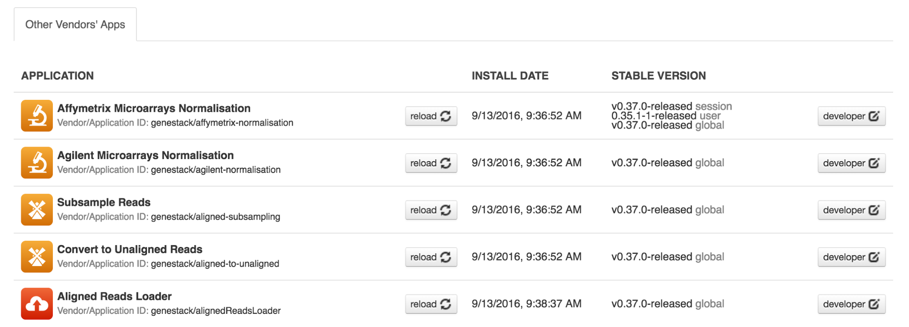
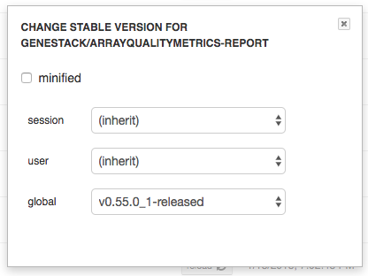
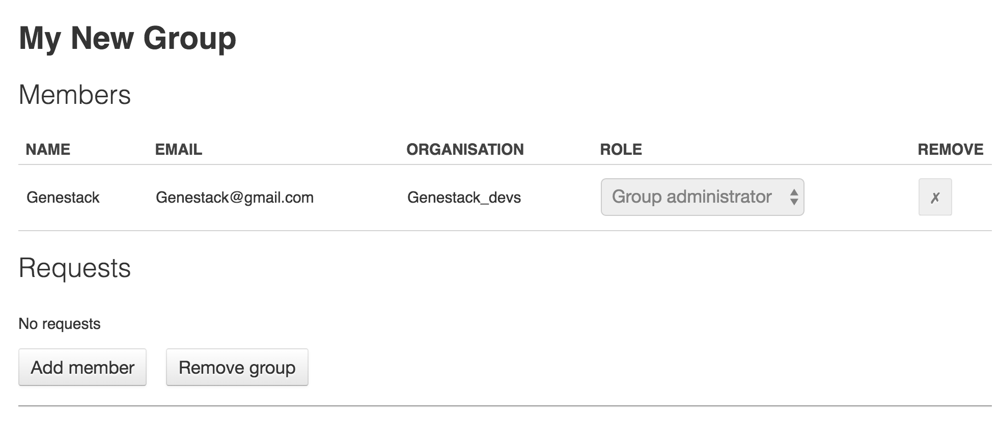

Your Profile
------------

Clicking on your username (your email) in the top right corner provides
access to various applications used to manage your account and your
groups.

Profile
~~~~~~~
In this section you can change your name, password, the name of your
organisation and your vendor ID. 

|profile|

Organizations are a way of enforcing group permissions. There are two
types of user in an organization - administrators and non-administrators. If you are in
the same organization as another user, you can add them to groups you
control and share files with them freely. If you are in different
organizations, administrators from both organizations first need to
approve adding them to the group. You can learn more about data sharing,
permissions and groups in "Data and Metainfo Management" section.
Vendor IDs are used for app development. Apps you have created will be
marked with your vendor ID. Moreover, here you can specify which page you
would like to see after login: Welcome Page or File Manager.

Manage Applications
~~~~~~~~~~~~~~~~~~~

|ManageApp|

Here you can view the list of all applications available on the platform
– both ones you have written as well as public ones (note that you won’t
be able to use all of these applications).

The **Developer** button will give you the option to choose which version of
an app you want to use.

|DeveloperButton|

The **‘bundled’** and **‘minified’** options optimize
loading of CSS and JS used in the app. You can find more details on
bundling and minifying here_.

The **Session** and **User** drop-down menus allow you to chose the version of
the app you want to use for your current log-in session and for your
current user account respectively. **Inherit** is the default option and the
order of version choice inheritance is Global -> User -> Session. If you
change the version of an application, use you also need to **reload** it to run
the version of choice.

Manage Groups
~~~~~~~~~~~~~

|ManageGroups|

In order to share data, we use **groups**. In the Manage Groups section you
can change the settings of your current collaboration groups or create
new ones and invite other users to join. You can also view and accept
all the invitations you have received from other users.
Read more about collaboration on Genestack here_.

Manage Users
~~~~~~~~~~~~

In this section, you can create new users or change password of your
users.
You can watch a video on managing users on Genestack here_.

|ManageUsers|

.. |YourProfile| image:: images/your-profile.png
.. |profile| image:: images/profile.png

.. |ManageUsers| image:: images/manage_users.png

__ https://msdn.microsoft.com/en-us/magazine/dn451436.aspx
__ https://genestack.com/tutorial/managing-and-sharing-data
__ https://genestack.com/tutorial/getting-started-with-genestack-platform/#createaccount
