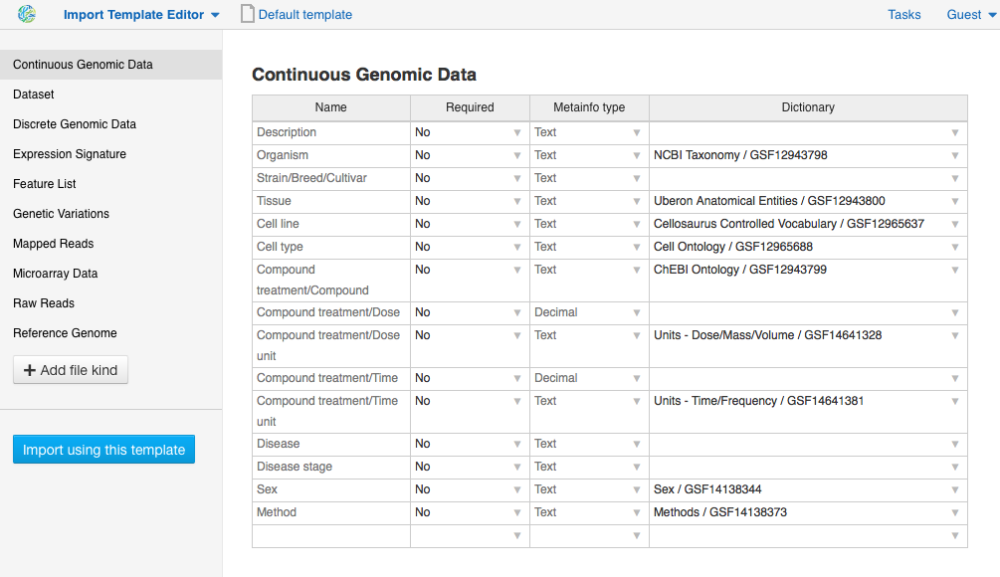
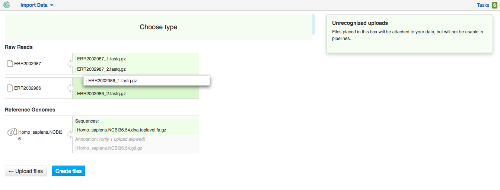

Importing Data
--------------

Supported file types
~~~~~~~~~~~~~~~~~~~~

Genestack allows its users to upload various files to the cloud and keep them
organized transforming them into the following data types:

- **Microarray Assay** - Raw microarray data obtained from a microarray
  experiment (you can import Affymetrix, Agilent or GenePix microarrays);
- **Sequencing Assay** - Raw sequencing data associated with a specific NGS
  experiment;
- **Microarray Annotation** - Annotation file containing information about
  association of microarray probes to biological entities like genes,
  transcripts and proteins;
- **Continuous Genomic Data** - Contains information on continuous genome
  statistics, e.g. GC% content;
- **Discrete Genomic Data** - Information on discrete regions of the genome
  with an exact start and end position;
- **Mapped Reads** - Reads aligned to a specific reference genome;
- **Ontology Files** - OWL, OBO or CSV files used to annotate metainfo;
- **Reference Genome** - Reference genome sequence for a specific organism
  with annotation;
- **Variation Files** - Genetic Variations files, storing gene sequence
  variations.

When you upload microarrays or sequencing assays onto the platform, they will
be automatically imported as an experiment.

- **Experiment** - An experiment is a special type of folder that can only
  contain assays. When you import files that are detected as raw sequencing or
  microarray assays, Genestack creates an experiment and adds the assays to it.
  Additional information on the experiment can be added as attachments in any
  file format.

**NOTE: What's the difference between experiments and folders?**
Forum3_

Moreover, when you perform any analysis on Genestack, you can create other data
types, which are not yet supported in import. Here is the list of them:

- **Auxiliary File** - Contains index for the Reference Genome;
- **Affymetrix/Agilent/GenePix Microarrays Normalisation** - File with
  normalized Affymetrix/Agilent/GenePix microarrays inside;
- **Chimerism analysis file** - contains interpretive report with determined
  percentage of donor and recipient cells within the patient's blood;
- **Differential Expression Statistics** - RNA expression statistics for
  individual genes contained in a sequence such as Fold Changes, p values,
  FDR, etc;
- **Dose Response Analyser File** - Interactive report describing the change
  in effect on an organism caused by differing dose levels;
- **FastQC Report** - Report file containing calculated quality control
  metrics for sequencing data;
- **FPKM Counts** - A file containing isoform expression levels calculated for
  each gene in sample;
- **Genome Annotations** - A technical file used for matching GO terms and
  gene symbols to gene coordinates;
- **Mapped Read Counts** - The number of mappings to each bit of reference
  sequence. Produced from Mapped Reads files;
- **Mapped Reads QC Report** - The output report file with calculated quality
  metrics for mapped reads;
- **Microarray QC File** - The file reporting quality metrics for microarrays
  and detected apparent outlier arrays;
- **Microbiome Analysis File** - Reports the abundance of microbial species
  presented in a sample;
- **Raw Reads** - Raw sequencing data that does not need to be associated with
  an experiment (as opposed to a sequencing assay);
- **Single-cell RNA-seq Analysis File** - Contains identified
  heterogeneously-expressed genes across cells;
- **Targeted Sequencing QC Report** - Displays enrichment statistics
  calculated based on the exome of the specified reference genome, on the
  specific target annotation file from the capture strategy, or on both - on
  exome and target files.

Biodata Import
~~~~~~~~~~~~~~

There are several ways you can access the **Import** application:

- clicking the **Import** button in the File Manager;

|FM_import|

- using **Import data** link on the Welcome Page;

|WP_import|

- clicking **Upload** button when you choose sources in the dataflow you'd like
  to run;

|DF_import|

- using an **import template**. We’ll describe what import template is and how to
  use it later in the guide.

|IT_import|

Import data includes three steps:

**Step 1: Uploading files**

There are two ways to upload data into the platform:

1. Use data from your computer - select or drag-and-drop files.

|import_start|

2. Upload from URLs (FTP or HTTP/HTTPS) - specify URLs for separate files or
  directories.

|URL_import|

"Use previous uploads" option allows you to avoid uploading the data a
second time.

Files are uploaded in multiple streams to increase upload speed. Uploading
from URLs is done in the background. This means that even while these files
are being uploaded, you can describe their metadata and use them in
pipelines.

|uploading_step|

Click the “Import files” button to proceed.

**Step 2: Format recognition**

After your data is uploaded, Genestack automatically recognizes file formats
and transforms them into biological data types: raw reads, mapped reads,
reference genomes, etc. Format conversions will be handled internally by
Genestack. You won’t have to worry about formats at all.

|file_recognition|

If files are unrecognized or recognized incorrectly, you can manually allocate
them to a specific data type: drag the raw file and move it to the green
“Choose type” box appeared at the top of the page.

|unrecognized_uploads|

Choose the data type you find suitable:

|file_types_box|

Click "Edit metainfo" button to procead.

**Step 3: Editing metainfo**

On this step, you can describe uploaded data using an Excel-like spreadsheet.
Importantly, during this step the import has already completed - you will
notice a message at the top of the page listing the name of the folder where
the imported files are located (names “Imported on <date> <time>) and
suggesting to share the data:

|import_edit_metainfo|

By default, you see all metainfo fields available for files, you can fill them
or create new custom columns. Click the "Add column" button, name new metainfo
field and choose its type (Text, Integer, etc.):

|add_metainfo_field|

Also, you can choose to apply a naming scheme. This will allow you to order
attributes in a drag-and-drop interface  to create a naming format of your
choice. The file name will be updated dynamically if any of the metainfo
fields used in the scheme are modified.

|naming_scheme|

Metainfo fields can be associated with specific dictionaries and
ontologies. We pre-uploaded some public dictionaries such as `NCBI Taxonomy`_
(for Organism field), `Cellosaurus vocabulary`_ (for Cell Line), `ChEBI
ontology`_, `Cell ontology`_, etc and created our own controlled vocabularies
(to cover e.g. Sex, Method, Platform fields). We'll back to the dictionaries
later in the Data and Metainfo Management section of the guide.

Also, you can create your own private dictionary importing it into the
platform as OWL, OBO or CSV file and attach it to the import template.

**What is an import template?**

Import templates allow you to select what metainfo attributes of your imported
files will be tightly controlled (so you don’t lose any information in the
process). Import templates allow you to set default fields for file metadata
based on file type (e.g. Experiments, Discrete Genomic Data, Genetic
Variations, etc.). Of course, if you’re only importing mapped reads, you don’t
need to specify metainfo attributes for other data types.

You can select which import template to use in two ways: from the Welcome
Page, or during the 3rd step of the import process by right-clicking on the
import template name ("Default template" is for the public one). You can add
new import templates using the **Import Template Editor** app, which can be
found by clicking “Add import template” from the Welcome Page or from the
"Manage" submenu when you right click on an import template.

|import_templates|

Genestack will attempt to fill these fields automatically, but you can always
edit the contents manually during the import process. By using metainfo
templates you can make sure that all of your files will be adequately and
consistently described so you will not lose any valuable information. For
example, here is the list of metainfo attributes used by default to describe
Reference Genome data:

|default_import_template|

Now let’s say you wish to create an import template where you want to control
the metainfo attributes of sequencing assays (e.g. you always need to know the
tissue and sex of your samples). In order to do this, click on “Add import
template”, then look for the table related to Sequencing Assays and for the
fields “tissue” and “sex”, change the required fields to ‘Yes’. As you can
see, the system controls what type of information can you put into your
metainfo fields. In this case, for tissue the system will map your entries to
the `Uberon ontology`_ and the metainfo type must be text. You can edit
existing templates by right-clicking on a template and selecting the **Import
Template Editor** app from the "Manage" submenu.

If you wanted to add other metainfo fields that are not included in the table
already, you can do this at the bottom of the table where there are blank
spaces. For each entry, you must specify whether or not this field is
required and what is it’s metainfo type (e.g. text, yes/no, integer).

|metainfo_type_editor|

If you are using a file kind that is not yet listed, you can add a new one by
clicking on the “Add File Kind” button at the bottom of the page and
specifying the required metainfo attributes. Keep in mind that file kinds are
defined in Genestack - you won’t be able to create a template entry for a
file kind that is not used on the platform.

When you’re done, click on the blue “Import data using this template” button.
This will take you to the import page, where you can go through three import
stages described above.

Once you have completed the metainfo editing step, you may see a “Use files in
data flow” button at the bottom of the page by “Import files”. This depends on
the file type you have imported. Later you can find your files in the “Imported
files” folder which can be accessed from the Welcome Page and from the File
Manager.

Metainfo Import
~~~~~~~~~~~~~~~

Apart from importing biodata, you’re able to easily import and validate the
metainfo attached to the assays and to the experiment. The **Import data from
spreadsheet** button allows you to retrieve the metainfo from a local CSV or
Excel file and map it to the Genestack assays:

|import_from_spreadsheet|

Click “Import data from spreadsheet” and drag the file with metainfo:

|import_metainfo|

You should see something like this:

|import_metainfo_table|

Each row of the Excel file was matched to one of the assays, based on the
"Name" column. We can see that the last row did not match to any of the
imported files. Columns that are mapped to a key present in the experiment's
template will be highlighted in green.

We can specify for each column whether the column should be imported, and if it
should be mapped to a different metainfo key, by clicking on the column header.
Click “Import” when you finish editing the table:

|import_metadata|

For instance, in this case we added new column “Age” and fill “Organism”,
“Sex”, “Tissue” and “Disease” co,umns that came from default template.

Attachments
~~~~~~~~~~~

While importing an experiment into Genestack (just to remind you, an
experiment is a special folder that is created when you import sequencing or
microarray assays) and you can choose to attach various files to it. For
example, you could include a PDF file with the experiment plan, an R script
that you used to process your data, etc. When you open your newly-imported
experiment, all of the attachments will accompany it. They will be safely
stored on Genestack, so later you can download them from the platform, in case
they get lost on your computer.

**How to upload an attachment?**

The attachment are uploaded together with the experiment data. In the “Upload”
section of the Import app, choose the attachments from your computer along
with your experiment data. On the “Import” step, the platform will
recognize the raw data and the fact that you have uploaded unrecognisable
files.

|attachments|

All the unrecognised uploads will be stored as attachments to your
experiment. You can also upload more or remove attachments later on the "Edit
metainfo" step:

|exp_attachments|

Or, add and remove attachments from inside the File manager, when you open an
experiment. There is an "attachments" link by the experiment name and
description:

|fm_attachments|

.. _Forum3: http://forum.genestack.org/t/the-difference-between-experiments-and-folders/37
.. _NCBI Taxonomy: https://www.ncbi.nlm.nih.gov/pmc/articles/PMC3245000/
.. _ChEBI ontology: https://www.ebi.ac.uk/chebi/
.. _Cell ontology: https://bioportal.bioontology.org/ontologies/CL
.. _Cellosaurus vocabulary: http://web.expasy.org/cellosaurus/description.html
.. _Uberon ontology: http://uberon.github.io/about.html
.. |default_import_template| image:: images/default_import_template.png
.. |import_templates| image:: images/import_templates.png
   :scale: 45 %
.. |import_start| image:: images/import_start.png
.. |FM_import| image:: images/FM_import.png
.. |WP_import| image:: images/WP_import.png

.. |URL_import| image:: images/URL_import.png
.. |uploading_step| image:: images/uploading_step.png
.. |file_recognition| image:: images/file_recognition.png

.. |file_types_box| image:: images/file_types_box.png
.. |import_edit_metainfo| image:: images/import_edit_metainfo.png
.. |add_metainfo_field| image:: images/add_metainfo_field.png
.. |naming_scheme| image:: images/naming_scheme.png
.. |attachments| image:: images/attachments.png
.. |exp_attachments| image:: images/exp_attachments.png

.. |metainfo_type_editor| image:: images/metainfo_type_editor.png
.. |import_from_spreadsheet| image:: images/import_from_spreadsheet.png
.. |import_metainfo| image:: images/import_metainfo.png
.. |import_metainfo_table| image:: images/import_metainfo_table.png
.. |import_metadata| image:: images/import_metadata.png
