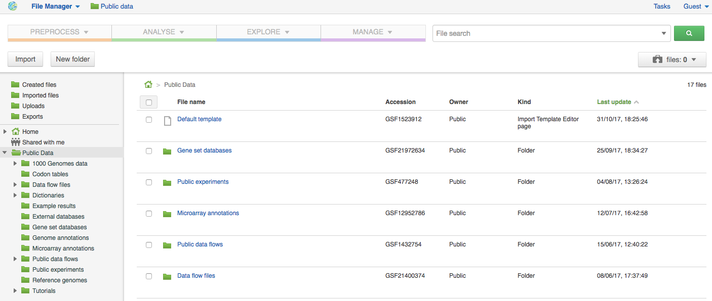

Browsing Data
-------------

Efficient data search and browsing are at the core of Genestack. The
platform provides  rapid access to private, shared, and public data
analyses; facilitates search for  studies and samples across your
private, public, and shared data; and accepts queries using synonyms,
ontology expansions, and chemical similarity.

**File Manager** is where you can easily access all of your private, public
and shared data. Read more about FM in the Platform Map section.

Here are other apps that help users better analyse their data and find
links between various results.

To be useful, data needs to be set in a context, i.e. to be associated
with metainfo (data describing other data).

For your experiments to make sense, especially later on in time when you
might not remember exactly what you did in a particular experiment, it
is crucial to represent both data and metadata in a consistent manner.

You can impose consistency by importing your data using import
templates. Learn more about import templates in **Biodata Import** section.  When you wish
to view the existing metainfo, or add more metainfo, you should use the
Metainfo Editor app. The Metainfo Editor allows you to view and edit
multiple files simultaneously in a spreadsheet-like environment. Keep in
mind you won’t be able to edit metainfo for experiments you don’t own.

Similarly to import templates, the app uses specific standards and
structured vocabularies to annotate your data, for example:

-  First of all, the non-hierarchical controlled vocabularies (e.g. Sex,
   Method, Platform fields), which are simply lists of terms;.
-  The `NCBI Taxonomy`_ is
   a standard hierarchical nomenclature and classification scheme for
   Organisms;.
-  The `Cellosaurus vocabulary`_  we
   used for Cell Line field - is an example of controlled vocabulary
   which describes all cell lines used in biomedical research;.
-  We also applied a bunch of ontologies - `ChEBI Ontology`_,
   `Cell Ontology`_  - to annotate e.g. Compound and Cell type fields.

File Manager
~~~~~~~~~~~~

Clicking on the home icon will take you to the File Manager – a central
place on the platform, as it contains all of your files (you probably
got that already).

|FileManager|

The panel (tree view) on the left side is our file system navigator.
Here you can see many different folders. Let’s look at them in greater
detail:

**Created files** contains everything you have created on Genestack
Platform. Created a new import template? You’ll find it there. Processed
some of your files? You’ll find the results there. Created a new data
flow and want to share it? It will be in the Created files folder.

The files are organized by date, with oldest ones on top (however, you
can change this order to show the most recent ones - just click on the
header of the “Last Update” column). If you created a couple of files at
once using a data flow they will be located in one folder (called “Files
for XYZ data flow run <date>). In these folders you will find the very
result of your analysis (e.g. Genetic Variations file containing found
mutations), results of all intermediate analysis steps (e. g.
preprocessed reads, mapped reads etc. created by the apps participating
in your pipeline as you remember each contributing app creates a file),
as well as all original files (“Original Files for XYZ, a sub-folder in the “Dependencies” folder).

**Imported files** contains everything you have ever imported, organized by
date: all files imported at the same time (during one import action)
will be located in the same folder (until you move them around etc). 

Raw uploads contains all the files you’ve uploaded into Genestack -
fastq and bam files, pdf documents, excel tables etc.

**NOTE: What’s the difference between raw uploads and imported files?**

When you have just started importing your files (in various formats like
FASTQ, BAM etc), they all go to the specific storage area (“Raw uploads”
folder). During import Genestack will recognize these uploaded files and
allocate them to appropriate biological types (you can also do it
manually), e.g. sequencing assays, mapped reads etc. These meaningful
biological objects is what you work with on our platform and these are
located in the “Imported files” folder.

**Exports** folder contains export files with download links. For example,
sets of exported microarrays. (+[link to the export section)

Below these four grouped folders, you will see two more: Shared with me
and Public Data.

**Shared with me** contains all files that other users have shared with
you or that you shared with other users. Our platform has collaboration
at its heart, but in order to keep things simple at this point, we’ll
talk about sharing at the very end of this guide (+ link to the guide
part about it).

**Public Data** contains all of the goodies we have preloaded the platform
with to make life a bit simpler for our users. This folder contains:

|PublicData|

#. Codon tables: currently 18 different tables such as yeast
   mitochondrial, vertebrate mitochondrial, blepharisma macronuclear
   etc.
#. Dictionaries: used for metainfo editing and curation, e.g. sex,
   sequencing platform, NCBI taxonomy. Read more about dictionaries here
   (link)
#. Example results: so you can play around with our platform and see
   what types of visualizations are available
#. External databases: sets of sequences with associated annotation;
   e.g. greengenes for 16S rRNA
#. Genome annotations: for a range of different organisms and platforms
    (for WES Analysis)
#. Microarray annotations: annotation lists to be used as the
   translation table to link probes and common public domain sequences
#. Public analyses: all files created during re-analysis of previously
   published data sets
#. Reference genomes: various reference genomes for the most commonly
   analysed organisms
#. Public data flows: all data flows available to our users, including
   tutorial data flows and the ones found on the Welcome page
#. Public experiments: this is a feature we’re particularly proud of. We
   have preloaded the platform with thousands and thousands of publicly
   available experiments, from public repositories such as GEO,
   ArrayExpress, SRA, and ENA. Currently we have about 100,000
   experiments in our database (and if that’s not impressive, then what
   is?). If you want to know more about a specific experiment use the
   Experiment Viewer app.
#. Tutorials: the folder contains files we use as examples during
   various tutorials. To read more on particular analysis types, go to https://genestack.com/tutorials/

Here are links to all the tutorials we have prepared so far:

-  `Getting Started With Genestack Platform`_
-  `Testing Differential Gene Expression`_
-  `Whole Genome Bisulfite Sequencing Analysis`_
-  `Whole Exome Sequencing Analysis`_
-  `Whole Genome Sequencing Analysis`_

To access the **context menu** for a given file, you can either right or left click
on the respective entry in the file browser. The topmost entry is the
app that was used to generate this file, or the app that should be used
to view it. The next 4 entries are submenus for each of the 4 different
types of apps that can be used on the file. Further down are options for
viewing and re-using the pipeline used to generate the file. The final
section allows you to manage file locations and names. For folders,
left-clicking opens the folder, while right-clicking opens the menu. You
can open file menus whenever you see a file name in link colors when
using the platform. The **Add to** option allows you to copy files while the
**Move to** option removes the original.

**Show all parent containers** gives you the option to quickly find all
copies of a file that are available to you. The **file accession** is a
unique identifier which allows you to find a file even when the file
name has changed.

|ParentContainers|

Above the file system navigator you can find the **Import button**. Clicking
it takes you to the Import app page, where you can upload your files,
import them into the platform and edit their metainfo. 

|import|

Next to the Import button, you can see a **New Folder button**. Using it
you’ll be able to create a new folder wherever you want. Another option
- New folder with selection - appears when you have selected files and
want to put all of them in a separate folder.

|NewFolder|

The **Preprocess, Analyse, Explore and Manage** menus at the top of the page
correspond to the four main actions you can undertake with your data.
These menus will become available when you select a file. 

|MatchingApps|

These apps are “clever” –  when you choose a file, the system will
suggest  apps which can work with the specific file type (e.g.
sequencing assay). However, you still need to think about the nature of
the data. For instance, if you want to align a raw WGBS sequencing assay
Genestack will suggest several mappers, but only the Bisulfite
Sequencing Mapping app will be suitable in this case. To figure out what
apps are recommended to process WGBS, WES, RNA-seq or other sequencing
data, go to the “Bioinformatics apps” section of this guide. [link on
the section in the guide]

**File search** in the top right corner allows you to search for files using
their metadata (names, organism, method). To limit the search by file
type or whether or not the file is shared with you, click on the little
triangle inside the search box.

|FileSearch|

Below the search box is a button to access your briefcase. Your
Briefcase is a place where you can temporarily store files from various
folders. How do you add files to your briefcase? Hover over each
individual file and use the special “briefcase” button that appears or
select several files, right click on them and choose “Add to
briefcase...”. To delete an item from your briefcase hover over it and
click on the “x” button. To clear all items from the briefcase, select
“Clear all”.

|BriefCase|

If you select a file, **three additional buttons** will show up, allowing
you to **share**, **delete** the file or **view metainfo** (an “eye”-icon) for the
file.

|3buttons1|

|3buttons2|

Use the **Share button** to share your
results with colleagues (the share button will not be available if you
are using a guest account) [link on the section in the guide]. Read more
about sharing on Genestack here (link)

|share|

The **Delete button** allows you to remove your files from the
system.

|delete|

**View metainfo** gives you more information about the file: technical (file
type, its accession and owner, when the file was created and modified,
etc), biological (e.g. cell line, cell type, organism, etc.), and file
permissions.

|eye|

Experiment Browser
~~~~~~~~~~~~~~~~~~

Experiment Browser is an app that can be used to find connections
between various results and various experiments. Let’s say you’re
performing a methylation profiling analysis of a particular zebrafish
mutant. Using Experiment Browser you can find all public experiments
analysing this zebrafish mutant, find methylation profiling experiments
done on this particular mutant type and start looking for connections
between the two to get the whole picture of your results. If your
colleagues have shared their research with you, you can also view their
results. You can access the Experiment Browser either from the Welcome Page or
the Shortcuts Menu.

|ExperimentBrowser|

Use the search box at the top of the page to look for specific terms.
Use the menu on the left hand side to specify the characteristics of an
experiment you are looking for. These characteristics are generated
based on the metadata available for experiments. For instance: a public
experiment, using whole genome sequencing method, performed using
Illumina HiSeq 2500 on humans. Clicking on the name of any of the found
assays will take you to the Metainfo Editor app, where you can view all
the information on that experiment.

.. _NCBI Taxonomy: https://www.google.com/url?q=http://www.ncbi.nlm.nih.gov/pmc/articles/PMC3245000
.. _ChEBI Ontology: https://www.ebi.ac.uk/chebi/
.. _Cell Ontology: https://bioportal.bioontology.org/ontologies/CL
.. _Cellosaurus vocabulary: http://web.expasy.org/cellosaurus/description.html
.. _Getting Started With Genestack Platform: https://genestack.com/tutorial/getting-started-with-genestack-platform/
.. _Testing Differential Gene Expression: https://genestack.com/tutorial/testing-differential-gene-expression-on-genestack-platform/
.. _Whole Genome Bisulfite Sequencing Analysis: https://genestack.com/tutorial/whole-genome-bisulfite-sequencing-analysis/
.. _Whole Exome Sequencing Analysis: https://genestack.com/tutorial/whole-exome-sequencing-data-analysis-on-genestack-platform/
.. _Whole Genome Sequencing Analysis: https://genestack.com/tutorial/wgs-analysis-on-genestack/

.. |PublicData| image:: images/public-data.png
.. |ParentContainers| image:: images/parent-containers.png
.. |import| image:: images/import_start.png
.. |MatchingApps| image:: images/matching-apps.png
.. |FileSearch| image:: images/file-search.png
.. |BriefCase| image:: images/brief-case.png
.. |3buttons1| image:: images/3buttons-1.png
.. |3buttons2| image:: images/3buttons-2.png
.. |share| image:: images/share.png
.. |delete| image:: images/delete.png
.. |eye| image:: images/eye.png
.. |ExperimentBrowser| image:: images/experiment-browser.png
.. |NewFolder| image:: images/new-folder

