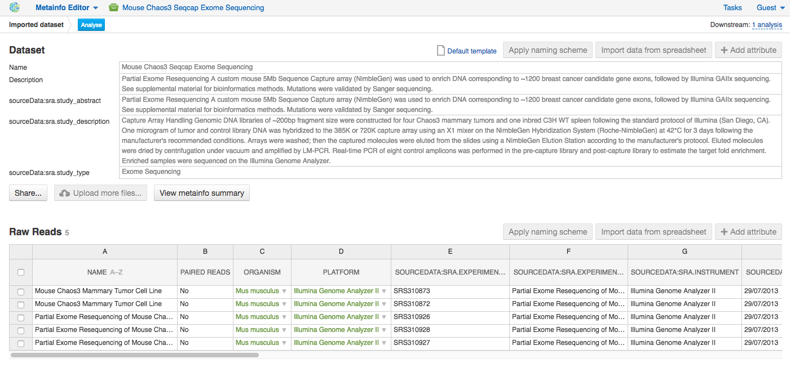
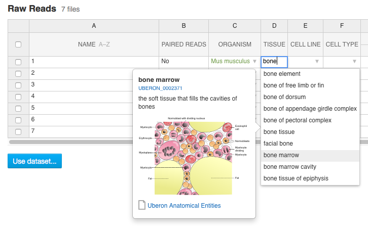
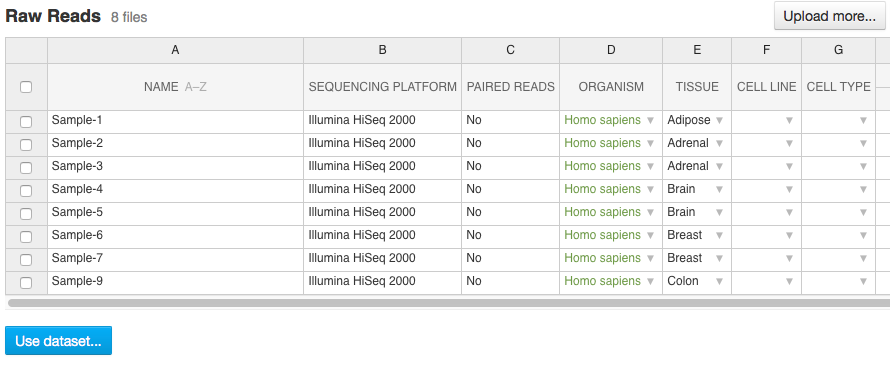

Curating Data and managing metadata
-----------------------------------

**Automate curation**
To handle the increasing volume of biological data we standardize raw data imported from
public archives by **automated curation**. In the curation process
raw metadata associated with the **Public Experiments** is
mapped to standardized terms. For this goal we use special files - **Dictionaries** -
including unified biological terms adopted from external ontologies, such as
Cell Ontology and Uberon Ontology, or created by our team.
Our terminological resources are used not only for curation of public experiments but also
for editing metadata of created or imported files.

We categorized our terminological resources in the following sets:

- The non-hierarchical controlled vocabularies (to cover e.g. Sex, Method,
  Platform fields), which are simply lists of terms;
- The `NCBI Taxonomy`_ is a standard hierarchical nomenclature and
  classification scheme for organisms;
- The `Cellosaurus vocabulary`_ used for Cell Line field annotation - is an
  example of controlled vocabulary which describes all cell lines used in
  biomedical research;
- A bunch of ontologies - `ChEBI Ontology`_, `Cell Ontology`_ (to annotate
  Compound and Cell type fields, respectively), `Uberon Ontology`_ (covering
  anatomical structures in animals) and other ontologies.

Besides, the importance of dictionaries in automated curation of public experiments,
the controlled terms can be used to fill in and edit metadata for imported
files or those created with the platform. The use of standardized terms will help to
reduce confusion and facilitates data browsing and improves the clarity of metadata.

Use **Edit Metainfo** app to work on metadata manually. To access the app select the assays
of interest, right click on them and in “Manage” section choose Edit Metainfo.

|metainfoEditor|

On the app page you will see that files are categorised according to their biological
file type and their metadata is represented in **Excel-like table**.

If you imported data without changing template, you will see the metainfo
attributes from **default template** (learn more about templates in the section Importing data).
However, on the metainfo editing page you can always change metadata template if it is needed.
To do so click on the name of the template in the top right corner of
the page and select **Change template**.

|changeTemplate|

To edit or enter metainfo go to the corresponding cell and start typing.
As we mentioned before, we  standartized terminological dictinaries
It helps to avoid typos and the use of one instead of multiple terms with the same mining.
You will be suggested use
However, of course you can use free metadata entries if you wish.

|tissueDict|

For example, "human" should be replaced by "Homo sapiens"; The typo in "cancer"
should be fixed; The key names (column names) do not correspond to the standard
values defined in the template (respectively Organism and Disease)

Like in Excel, you can write the value in a single cell and drag it down,
or copy it (Ctrl+C), select the whole column by clicking on the header, and paste it (Ctrl+V).

Use **Add attribute** button to add new metainfo field from our internal list or create custom one.

|addAttribute1|

For custom metainfo keys fields be sure that you specifies key type correctly.

|customKey|

Click column name to **sort** metadata values or **delete** the column

|sort|

You can write more than one value in metadata field for each individual assay:
type in the first value in the cell, then select the cell and click
the popover button **Add another <item>**

|addAttribute|

Using Metainfo Editor app, you can also retrieve the metadata from a local CSV
or Excel file and add it to the Genestack assays. Click **import metainfo from spreadsheet**
button and select a file containing metainfo for you data.

|fromSpreadsheet1|

Each row of the imported Excel file should match to one of the assays, based on the "Name"
column. If some row is not match to any of the imported files, it will be marked in red.

|fromSpreadsheet2|

We can specify for each column whether the column should be imported, and if it
should be mapped to a different metainfo key, by clicking on the column header.
Columns that are mapped to a key present in the experiment's template will be
highlighted in green. For instance, we can specify that we want
the "sequencing platform" column to be mapped to the Genestack key "Platform",
which is part of our default experiment metadata template.

|fromSpreadsheet3|

Finally, you can use metadata to create names for your files. Click **Apply naming scheme**
button and select those metainfo fields values from that you want to see in file names.
For example, as it shown on the picture below we crete names using values from
'Organism' and 'Tissue' columns.

|namingScheme|

All the changes that are done in the metainfo editor are automatically recorded in the system.
There is no need to "save changes".

Once you are done with the metadata of your experiment, you can analyse the data by clicking
the button Use files in data flow at the bottom of the page. From there, you can either use
an existing data flow or build a new one using the available applications on the platform.

|runDFfromME|

.. _NCBI Taxonomy: https://www.google.com/url?q=http://www.ncbi.nlm.nih.gov/pmc/articles/PMC3245000
.. _ChEBI Ontology: https://www.ebi.ac.uk/chebi/
.. _Cell Ontology: https://bioportal.bioontology.org/ontologies/CL
.. _Cellosaurus vocabulary: http://web.expasy.org/cellosaurus/description.html
.. _Uberon Ontology: http://uberon.github.io/about.html

.. |changeTemplate| image:: images/change-template.png

.. |addAttribute1| image:: images/add-attribute-1.png

.. |customKey| image:: images/custom-key.png

.. |importMetainfo| image:: images/import-metainfo.png
.. |sort| image:: images/sort.png
.. |namingScheme| image:: images/naming-scheme.png

.. |addAttribute| image:: images/add-attribute.png

