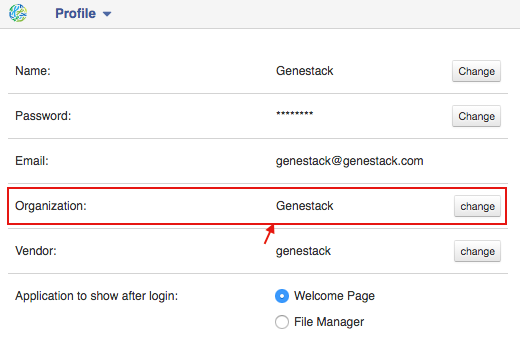

Sharing Data and Collaboration
------------------------------

Access control model
~~~~~~~~~~~~~~~~~~~~

There are three concepts around access control in Genestack: users, user groups
and organisations. Each user belongs to a single organisation (typically
corresponding to the user's company or institution, or a specific team within
the institution). Organisations have two types of users: regular users and
administrators, who have the right to add new users, and deactivate existing
ones.

To check which organisation you belong to, you can go to the "Profile" page,
accessible via the menu which opens when you click on your email address at the
top-right corner of any page.

|profile_menu|

|profile_organisation|

Managing users
~~~~~~~~~~~~~~

If you are an administrator of your organisation, the menu under your email
address will also have an additional item, "Manage Users", which takes you to
the organisation's user management page.

|profile_manage_users|

From there, administrators can add or disable users, and reset passwords.

|pr_manage_users|

Sharing in Genestack is done through user groups: every user can create any
number of user groups, and add other users to them. Each file in the system can
be shared with any number of user groups, who are granted different permissions
(read-only, read and write, etc.).

Managing groups
~~~~~~~~~~~~~~~

Now, back to sharing our files. To share them, we first need to setup a user
group. To manage your user groups, click again on your email address at the
top-right corner of any screen and select "Manage Groups".

|profile_manage_groups|

From there, you can create groups using “Create group” button, add or remove
people from groups, and change users' privileges within groups. By default, you
will be a group administrator of any group that is created by your user. Let's
create a new group “Alpha Corporation release”.

|manage_create_groups|

Click “Add member” button to add people to this group. From there you will be
prompted for the e-mail of the user you want to add. If they are in your
organisation, you will be provided with autocomplete:

|group_add_member|

.. note:: **Can I add users from other organisations?**

          You can also add users from other organisations to a user group
          ("cross-organisation group"). However, in that case, every user invitation will
          need to be approved by an organisation administrator of both your organisation
          and the other user's organisation.

Once you have added a user from your organisation to the newly created group,
you will also be able to set up their permissions within the group. Within a
group, a user can be:

- **Non-sharing user** (can only view data shared with the group);
- **Sharing user** (can view data shared with the group, and share data);
- **Group administrator** (all of the above, and can add/remove users to the
  group and change users' privileges).

By default, newly added users will be granted the lowest permission level
(Non-sharing user). You can change that using the dropdown next to their name.

|users_permissions|

Learn more on how to Create and Manage Groups `here`_.

.. _here: https://genestack.com/tutorial/managing-and-sharing-data/

Sharing files with a group
~~~~~~~~~~~~~~~~~~~~~~~~~~

Now that the group is setup, you can share your files. In fact, you can share
everything you do on the platform: data, scripts, results, data flows, and
import templates. Let's share the imported experiment.

Go to the “Imported files” folder in File Manager. Alternatively, you can
search for it in the File Search text box, which you can find on the home page,
in the File Browser and in the right-hand side dock in every window.

Once you find the file you want to share, select it in the File Manager by
ticking the checkbox next to it, then click the "Share" button in the top bar.

|sharing_experiment|

From there, you will be taken to the file sharing dialog, which asks you to
select a group to share the file with. By default, files are shared with
read-only permissions (both for data and metadata). But you have the option of
giving members the ability to edit the files in addition to just viewing them.
This does not stop them from using the shared files in data flows, but it does
prevent them from editing parameters in files that are not yet initialized as
well as metadata for both initialized and uninitialized files.

|sharing_dialog|

Once you click the blue "Share" button, you will be prompted for your password,
and then asked whether you would like to link the file into the group's shared
folder.

|sharing_with_link|

If you link the file into that folder, it will be visible to the group's users
when they open that folder (which can make it easier for them to find it). If
you click "No", the file will not be linked into the group folder but the
group's users will still be able to find the file through the File Search box
(for instance, if you tell them the accession of the file), in File Provenance
and through the Experiment Browser.

.. note:: **What is the differance between linking and copying?**

          We use the word "linking" and not "copying", because in Genestack,
          adding a file to a folder does not physically create a duplicate of
          that file (unlike copy-pasting in your OS). It just adds a link to
          that file from the folder (similar to symbolic links on UNIX).

Each group has an associated group folder which you can access from the File
Manager under "Shared with me" in the left-hand side panel.

|shared_with_me|

All files you share with other people, along with all files shared with you,
will be located in that folder.

.. |profile_menu| image:: images/profile_menu.png

.. |profile_manage_users| image:: images/profile_manage_users.png
.. |pr_manage_users| image:: images/pr_manage_users.png
.. |profile_manage_groups| image:: images/profile_manage_groups.png
.. |manage_create_groups| image:: images/manage_create_groups.png
.. |group_add_member| image:: images/group_add_member.png
.. |users_permissions| image:: images/users_permissions.png
.. |sharing_experiment| image:: images/sharing_experiment.png
.. |sharing_dialog| image:: images/sharing_dialog.png
.. |sharing_with_link| image:: images/sharing_with_link.png
.. |shared_with_me| image:: images/shared_with_me.png
