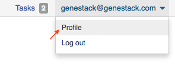

Sharing Data and Collaboration
------------------------------

Access control model
~~~~~~~~~~~~~~~~~~~~

There are three concepts around access control in Genestack: users, user groups
and organisations. Each user belongs to a single organisation (typically
corresponding to the user's company or institution, or a specific team within
the institution). Organisations have two types of users: regular users and
administrators, who have the right to add new users, and deactivate existing
ones.

To check which organisation you belong to, you can go to the "Profile" page,
accessible via the menu which opens when you click on your email address at the
top-right corner of any page.

|profile_menu|

|profile_organisation|

Managing users
~~~~~~~~~~~~~~

If you are an administrator of your organisation, the menu under your email
address will also have an additional item, "Manage Users", which takes you to
the organisation's user management page.

|profile_manage_users|

From there, administrators can add or disable users, and reset passwords.

|pr_manage_users|

Sharing in Genestack is done through user groups: every user can create any
number of user groups, and add other users to them. Each file in the system can
be shared with any number of user groups, who are granted different permissions
(read-only, read and write, etc.).

Managing groups
~~~~~~~~~~~~~~~

Now, back to sharing our files. To share them, we first need to setup a user
group. To manage your user groups, click again on your email address at the
top-right corner of any screen and select "Manage Groups".

|profile_manage_groups|

From there, you can create groups using “Create group” button, add or remove
people from groups, and change users' privileges within groups. By default, you
will be a group administrator of any group that is created by your user. Let's
create a new group “Alpha Corporation release”.

|manage_create_groups|

Click “Add member” button to add people to this group. From there you will be
prompted for the e-mail of the user you want to add. If they are in your
organisation, you will be provided with autocomplete:

|group_add_member|

Note that you can also add users from other organisations to a user group
("cross-organisation group"). However, in that case, every user invitation will
need to be approved by an organisation administrator of both your organisation
and the other user's organisation.

Once you have added a user from your organisation to the newly created group,
you will also be able to set up their permissions within the group. Within a
group, a user can be:

- **Non-sharing user** (can only view data shared with the group);
- **Sharing user** (can view data shared with the group, and share data);
- **Group administrator** (all of the above, and can add/remove users to the
  group and change users' privileges).

By default, newly added users will be granted the lowest permission level
(Non-sharing user). You can change that using the dropdown next to their name.

|users_permissions.png|

Learn more on how to Create and Manage Groups `here`_.

.. _here: https://genestack.com/tutorial/managing-and-sharing-data/

Sharing files with a group
~~~~~~~~~~~~~~~~~~~~~~~~~~

You can share everything you do on the platform: files, scripts,
results, data flows, and import templates.

To share a file with your group, select it, and click on the “Share”
button that appears in the top left corner of the page and follow the
instructions. You have the option of giving members the ability to edit
the files in addition to viewing them. This does not stop them from
using the shared files in data flows, but it does prevent them from
editing parameters in files that are not yet initialized as well as
metadata for both initialized and uninitialized files.

|managing-and-sharing-tutorial-tick-box-for-write-permissions-in-sharing-popup|

If a file is shared with a group, members
can find that file in searches and file provenance, however it will not
be present in the main group folder. This helps reduce clutter while
maintaining functionality for dependencies and intermediate files. If
you want the shared file to be present in the group folder you need to
use the “Link” button from the sharing popup. All files you share with
other people, along with all files shared with you, will be located in
the “Shared with me” folder.

.. |profile_manage_users| image:: images/profile_manage_users.png
.. |pr_manage_users| image:: images/pr_manage_users.png
.. |profile_manage_groups| image:: images/profile_manage_groups.png
.. |manage_create_groups| image:: images/manage_create_groups.png
.. |group_add_member| image:: images/group_add_member.png
.. |users_permissions| image:: images/users_permissions.png
.. 
