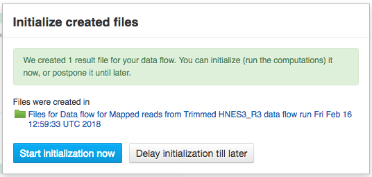

Running and reproducing data flows
----------------------------------

Your data has been imported on the platform, you have checked its
quality and chosen the apps you wish to use to analyse your data. Here
is how you can create your pipeline.

|pipeline_building|

Select all the samples you wish to analyse and from the menu on top of
the page or from the dropdown menu, select the first app you wish to see
in your pipeline.

|cla_page|

This will take you to the app page where you can:

– learn more about the application;

– view and edit app parameters;

– explore your results (after the computation has been initialized and
completed);

– add steps to the file data flow (the pipeline).

Clicking on blue “Add step” button will show you the list of all the
possible apps that can be used to analyse your data – Genestack OS chooses
this list after checking your data (which, as you remember, is hosted on our
platform as a meaningful biological object or a “smart file”).

Continue adding steps until you have completed building your pipeline. When
you add each of the steps, you create new files which end up in the created
files folder. However, these files are not yet ready to use - they need to be
initialized first.

Initialising files
~~~~~~~~~~~~~~~~~~

You can initialize files in different ways:

1. Using **Start initialization** option in the context menu.

Click on the name of your last created file at the top of the application page
and select “start initialization”.

|start_initialization|

2. Clicking **Start initialization now** in Data Flow Runner application.

If you want to save the pipeline and specific parameters you used here
to re-use again on other files you can create a new data flow. You need
to do this, before you start initialization. Click on the name of the
last created file, go to Manage and “Create new Data Flow”.

|create_new_data_flow|

This will take you to the Data Flow Editor where you can introduce any last
changes to your pipeline. Click on “Run dataflow” button once you are done.

|data_flow_editor|

This will take you to Data Flow Runner page where you can initialize the
computations (by clicking “Run Data Flow” in the last cell).

|run_data_flow|

Choose "Start initialization now" option if you'd like to run the
computations immediately or "Delay initialization tll later".

|start_initialization_now|

This data flow, along with all your results (after computations are finished)
will be stored in the “Created files” folder.

3. Using **File Initializer** application.

Select the created uninitialized files (from data flow or File Manager), right
click on them, go to “Manage” and choose the “File Initializer” app.

|file_initializer_df|

File Initializer reports the status of the files and allows you to initialize
those that need to be by clicking on their respective “Go!” buttons, or
“Initialize all” to do them all at once. Files do not need to be produced by
the same apps to be initialized together.

|file_initializer|

4. Using **Start initialization** button in File Provenance.

Alternatively, you can click on the name of the last created file, go to Manage
and choose File Provenance application. The app displays the pipeline and also
allows you to run the computation using “Start initialization” button. You’ll
learn more about this application later in this section.

|file_provenance_init|

You can track the progress of this task in Task Manager. Doing this will begin
initialization of all the files (including intermediate files) you have
created whilst building this pipeline.

Running the Data flows
~~~~~~~~~~~~~~~~~~~~~~

There are two apps that can be used to edit and run a data flow. The first one
you’ll usually see is the Data Flow Editor. This app presents a visual
representation of the pipeline and allows you to choose your sources (usually
sequencing assays) and reference genome. At this stage, no files have been
created nor initialized. When you click on “Run Data Flow” button, this will
take you to the Data Flow Runner app and create all the relevant files in an
uninitialized state. On the Data Flow Runner page you can choose whether you
wish to start initialization of the data flow now, or delay it until later.
You can also edit the app parameters – by clicking on an app name and on the
app page going to “Edit parameters”.

Remember, to begin computation, you must initialize all files!  

Also, you can create

Public data flows
~~~~~~~~~~~~~~~~~

On our platform, you can find a range of public data flows we have
prepared for our users. We cover most of the common analysis types:

- `Single-cell Transcriptomic Analysis`_
- `Genetic Variation Analysis`_
- `Whole Exome Sequencing Analysis`_
- `Differential Isoform Expression Analysis`_
- `Whole Genome Methylation Analysis`_
- `Differential Gene Expression Analysis`_
- `Affymetrix Microarray Quality Control`_
- `Targeted Sequencing Quality Control`_
- `Mapped Reads Quality Control`_
- `Raw Reads Quality Control`_
- `Agilent Microarray Quality Control`_
- `Unspliced Mapping`_
- `Spliced Mapping`_

Clicking on the data flow will take you to the data flow editor where you can
add source files and reference genomes (we have a wide range of reference
genomes readily available on the platform). When you have chosen your files,
click on “Run dataflow” to go to the Data Flow Runner. If you don’t want to
change any settings, you can click “Start initialization now”. To tweak the
parameters and settings of the apps, select “Delay initialization until later”.
To change the settings, click on the name of the app in the data flow. This
will take you to the app page, where you can select “Edit parameters” and
introduce your changes. When you are done introducing your changes, go back to
the data flow and initialize your computations.

File Provenance
~~~~~~~~~~~~~~~
**Reproducibility of pipelines**

Complete reproducibility is one of the core strengths of Genestack. For any
file in the system you can view the file provenance and then replay the same
exact analysis type on other data.

|file_provenance|

The File Provenance app also allows you to view the text description of the
pipeline used to create a given file. Clicking the “View as text” button
allows you to see what parameters and what tool versions were used at each
analytical step. You can copy this text and e.g. use it in your publication.

|view_as_text|

Clicking “New folder with files” button will create you a folder with all the
files used in this pipeline.

Later, if you’ll want to reuse the same pipeline on different data, you can
create the dataflow identical to the pipeline used to create the original file,
by selecting the file of interest and choosing “Create new Data Flow” from the
available “Manage” apps.

.. _Single-cell Transcriptomic Analysis: https://platform.genestack.org/endpoint/application/run/genestack/dataflowrunner?a%3DGSF968143%26action%3DcreateFromSources%26new_page%3Dtrue&sa=D&ust=1480960532140000&usg=AFQjCNEhL4uWcHXHOr1FGZ5tIBY5kYgTXg
.. _Genetic Variation Analysis: https://platform.genestack.org/endpoint/application/run/genestack/dataflowrunner?a%3DGSF1021590%26action%3DcreateFromSources%26new_page%3Dtrue&sa=D&ust=1480960532140000&usg=AFQjCNH4ZvdWkHff66-8rHQA5k2oKvuT_g
.. _Whole Exome Sequencing Analysis: https://platform.genestack.org/endpoint/application/run/genestack/dataflowrunner?a%3DGSF999236%26action%3DcreateFromSources%26new_page%3Dtrue&sa=D&ust=1480960532141000&usg=AFQjCNG0Aiv5aOhWP7aOzsAnlMG2VPAuFw
.. _Differential Isoform Expression Analysis: https://platform.genestack.org/endpoint/application/run/genestack/dataflowrunner?a%3DGSF968203%26action%3DcreateFromSources%26new_page%3Dtrue&sa=D&ust=1480960532141000&usg=AFQjCNG7i1NzFiknvU7YSW33u94PD47dug
.. _Whole Genome Methylation Analysis: https://platform.genestack.org/endpoint/application/run/genestack/dataflowrunner?a%3DGSF968148%26action%3DcreateFromSources%26new_page%3Dtrue&sa=D&ust=1480960532141000&usg=AFQjCNGxFpqgjVxexfPISr8fP26oEFsaCw
.. _Differential Gene Expression Analysis: https://platform.genestack.org/endpoint/application/run/genestack/dataflowrunner?a%3DGSF972243%26action%3DcreateFromSources%26new_page%3Dtrue&sa=D&ust=1480960532142000&usg=AFQjCNGK6v2wfFbccO03CPii9bo74JFedw
.. _Affymetrix Microarray Quality Control: https://platform.genestack.org/endpoint/application/run/genestack/dataflowrunner?a%3DGSF1015655%26action%3DcreateFromSources%26new_page%3Dtrue&sa=D&ust=1480960532142000&usg=AFQjCNHg44yDnCHJ9wImdxm88Okr4kSPeQ
.. _Targeted Sequencing Quality Control: https://platform.genestack.org/endpoint/application/run/genestack/dataflowrunner?a%3DGSF1014486%26action%3DcreateFromSources%26new_page%3Dtrue&sa=D&ust=1480960532143000&usg=AFQjCNFrje64ZaANbD8gFdytIUg57WOxqA
.. _Mapped Reads Quality Control: https://platform.genestack.org/endpoint/application/run/genestack/dataflowrunner?a%3DGSF968216%26action%3DcreateFromSources%26new_page%3Dtrue&sa=D&ust=1480960532143000&usg=AFQjCNF-20mX9xHnQ9X3hQhAfKce_FcRBg
.. _Raw Reads Quality Control: https://platform.genestack.org/endpoint/application/run/genestack/dataflowrunner?a%3DGSF969011%26action%3DcreateFromSources%26new_page%3Dtrue&sa=D&ust=1480960532143000&usg=AFQjCNH5lJSaESPs3pUeBrEIFNlkMs-e4g
.. _Agilent Microarray Quality Control: https://platform.genestack.org/endpoint/application/run/genestack/dataflowrunner?a%3DGSF1015659%26action%3DcreateFromSources%26new_page%3Dtrue&sa=D&ust=1480960532144000&usg=AFQjCNHwRN4S4g8o97lI1jPk0Nl4fFiW5A
.. _Unspliced Mapping: https://platform.genestack.org/endpoint/application/run/genestack/dataflowrunner?a%3DGSF1014279%26action%3DcreateFromSources%26new_page%3Dtrue&sa=D&ust=1480960532144000&usg=AFQjCNGI7qIqJF-YRl8ucCZ-083HWgXJmw
.. _Spliced Mapping: https://platform.genestack.org/endpoint/application/run/genestack/dataflowrunner?a%3DGSF968220%26action%3DcreateFromSources%26new_page%3Dtrue&sa=D&ust=1480960532145000&usg=AFQjCNFB8P_K2h7NeJkIbyI8ySfN7EhaEA

.. |pipeline_building| images:: images/pipeline_building.png
.. |cla_page| image:: images/cla_page.png

.. |create_new_data_flow| image:: images/create_new_data_flow.png
.. |data_flow_editor| image:: images/data_flow_editor.png
.. |run_data_flow| image:: images/run_data_flow.png

.. scale: 45%
.. |file_initializer_df| image:: images/file_initializer_df.png

.. |file_provenance_init| image:: images/file_provenance_init.png
.. |file_provenance| image:: images/file_provenance.png
.. |view_as_text| image:: images/view_as_text.png
.. scale: 45%
.. 
