Getting Help
============

Tutorials 
----------

In our tutorials we take you through examples based on public
experiments, re-analysing the data to demonstrate the features of
particular apps. All files used (from raw sequencing reads and reference
genomes to results and data visualisations) are stored on the platform
in the “Tutorials” folder.

We have prepared tutorials on Differential Gene Expression, Methylation
Profiling, Whole Exome Sequencing, and Whole Genome Sequencing and me
plan to add more in the future.

You can find all of our tutorials here: https://genestack.com/tutorial/

Getting in touch with Genestack 
--------------------------------

There are various ways to get in touch with our team:

1)Chatra: a chat window can be found at the bottom of our homepage.
During our operating hours at least one of us is always available to
help. Outside of our operating hours, you can leave us a message using
the chat window and we will get back to you as soon as we can.

2)Forum: when you have a question about the platform, try posting it on
our forum: forum.genestack.org. Our community will definitely be keen to
help you, and if not, our team regularly checks the forum and will
answer any unanswered questions.

3)Email: you can email us at support@genestack.com 

.. |image0| image:: images/image39.png
.. |image1| image:: images/image10.png
.. |image2| image:: images/image27.png
.. |image3| image:: images/image05.png
.. |image4| image:: images/image33.png
.. |image5| image:: images/image01.png
.. |image6| image:: images/image57.png
.. |image7| image:: images/image28.png
.. |image8| image:: images/image34.png
.. |image9| image:: images/image20.png
.. |image10| image:: images/image14.png
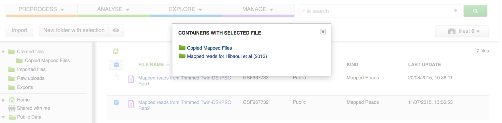
.. |image12| image:: images/image01.png
.. |image13| image:: images/image22.png
.. |image14| image:: images/image16.png
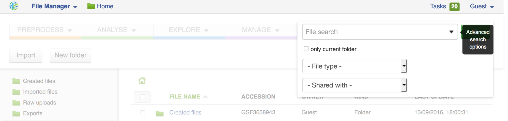
.. |image16| image:: images/image45.png
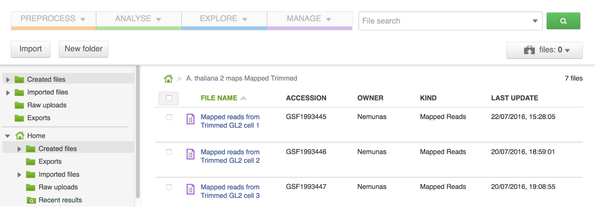
.. |image18| image:: images/image00.png
.. |image19| image:: images/image07.png
.. |image20| image:: images/image44.png
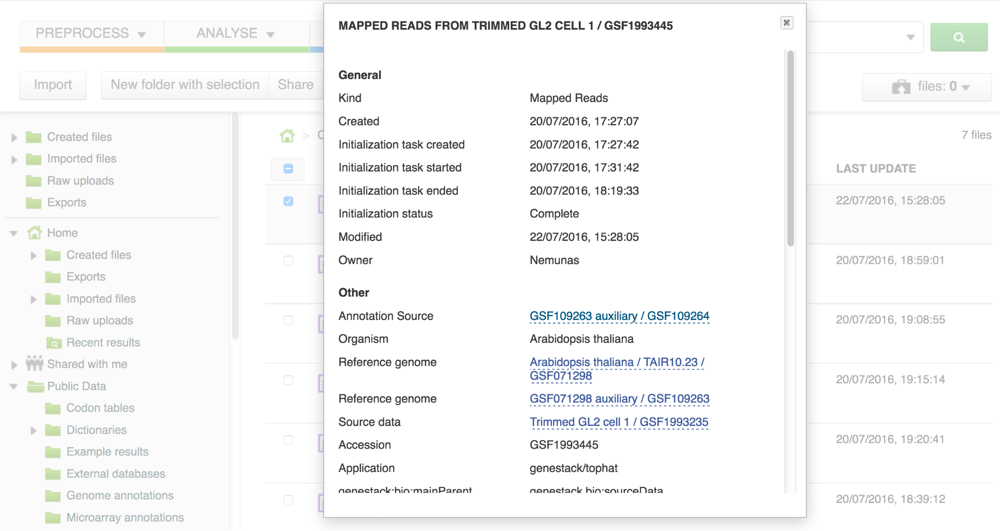
.. |image22| image:: images/image41.png
.. |Metainfo editor.png| image:: images/image60.png
.. |managing-and-sharing-tutorial-tick-box-for-write-permissions-in-sharing-popup| image:: images/image08.png
.. |image25| image:: images/image15.png
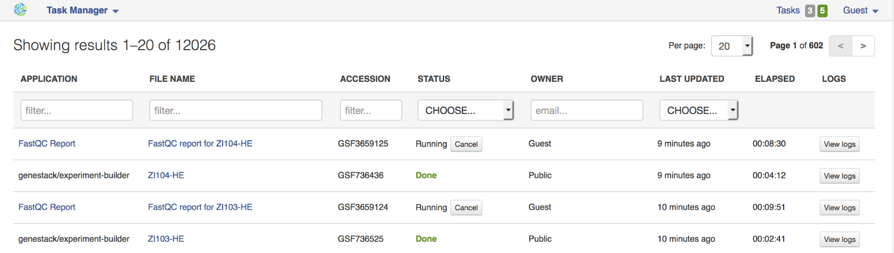
.. |image27| image:: images/image25.png
.. |image28| image:: images/image46.png
.. |image29| image:: images/image49.png
.. |image30| image:: images/image17.png
.. |image31| image:: images/image61.png
.. |image32| image:: images/image51.png
.. |image33| image:: images/image32.png
.. |image34| image:: images/image06.png
.. |image35| image:: images/image48.png
.. |image36| image:: images/image13.png
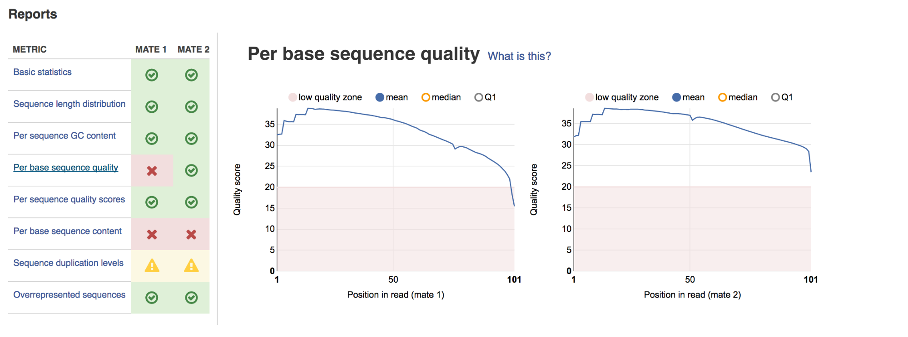
.. |image38| image:: images/image40.png
.. |image39| image:: images/image29.png
.. |image40| image:: images/image47.png
.. |image41| image:: images/image04.png
.. |image42| image:: images/image23.png
.. |image43| image:: images/image18.png
.. |image44| image:: images/image43.png
.. |image45| image:: images/image55.png
.. |spliced mapping| image:: images/image35.png
.. |image47| image:: images/image09.png
.. |image48| image:: images/image03.png
.. |unspliced mapping with BWA| image:: images/image26.png
.. |unspliced mapping with bowtie2| image:: images/image54.png
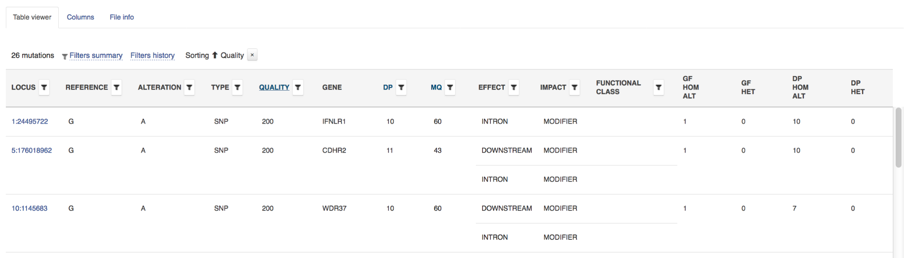
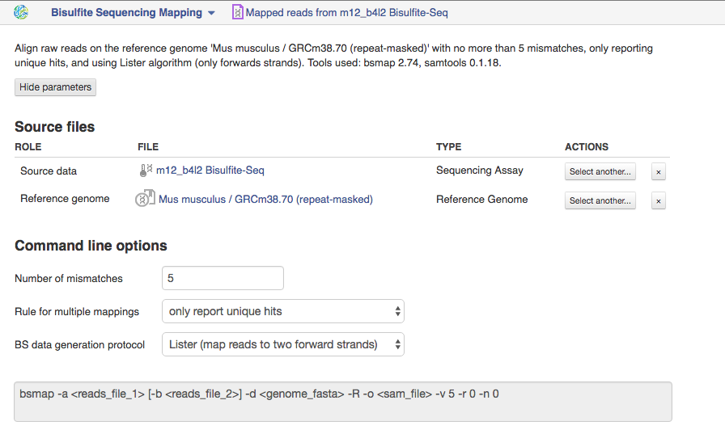
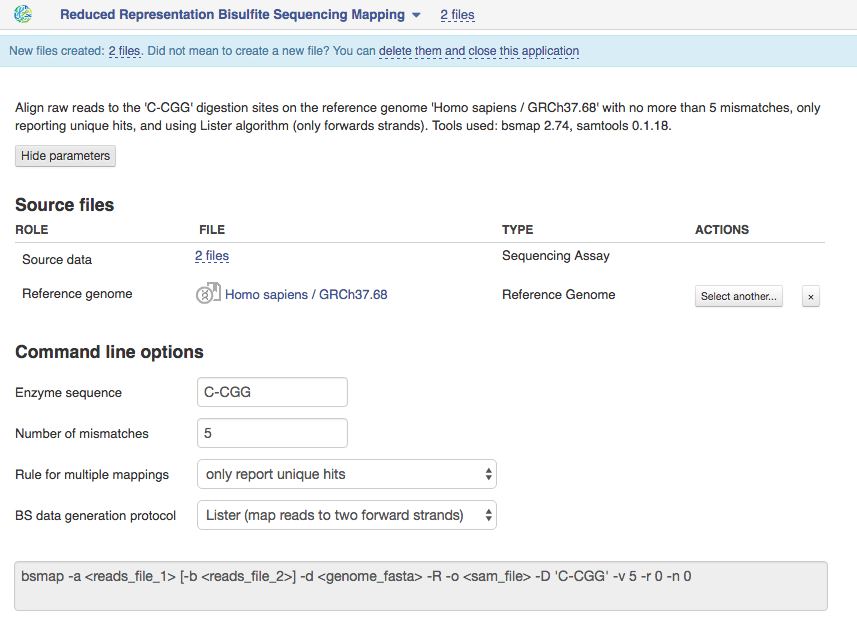
.. |image54| image:: images/image19.png
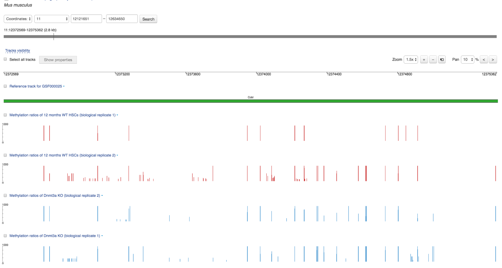
.. |image56| image:: images/image30.png
.. |image57| image:: images/image58.png
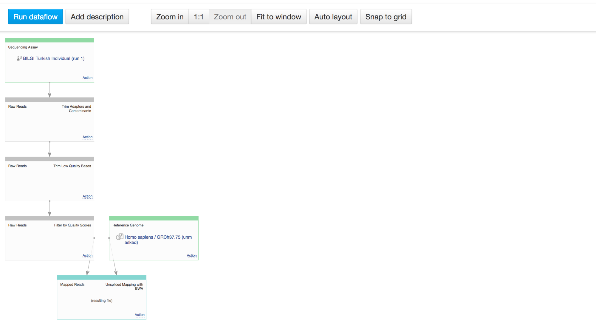
.. |image59| image:: images/image42.png
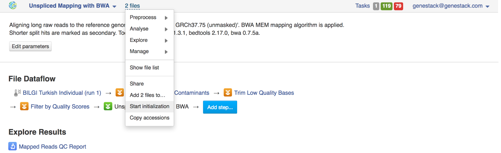
.. |image61| image:: images/image37.png
.. |image62| image:: images/image36.png

