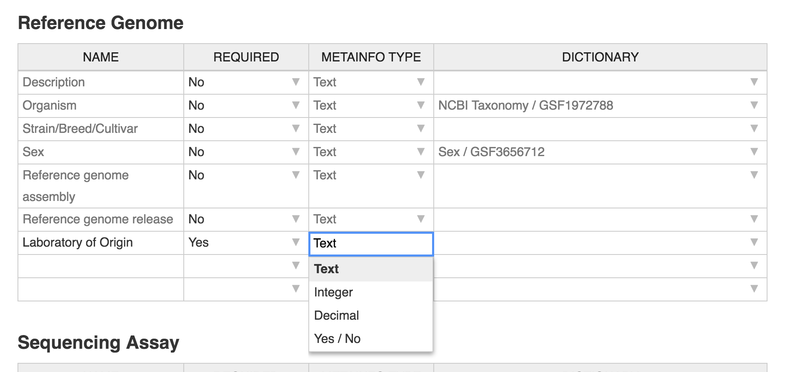
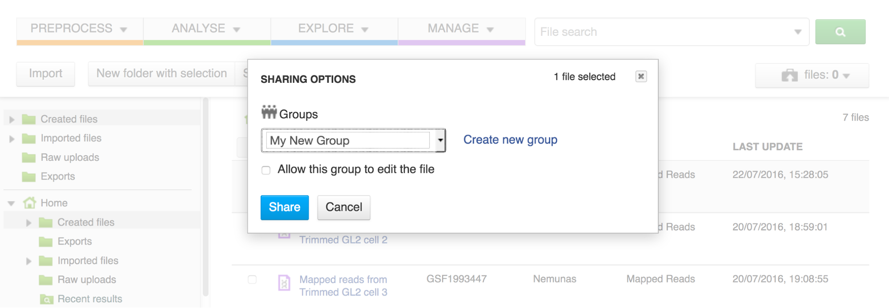
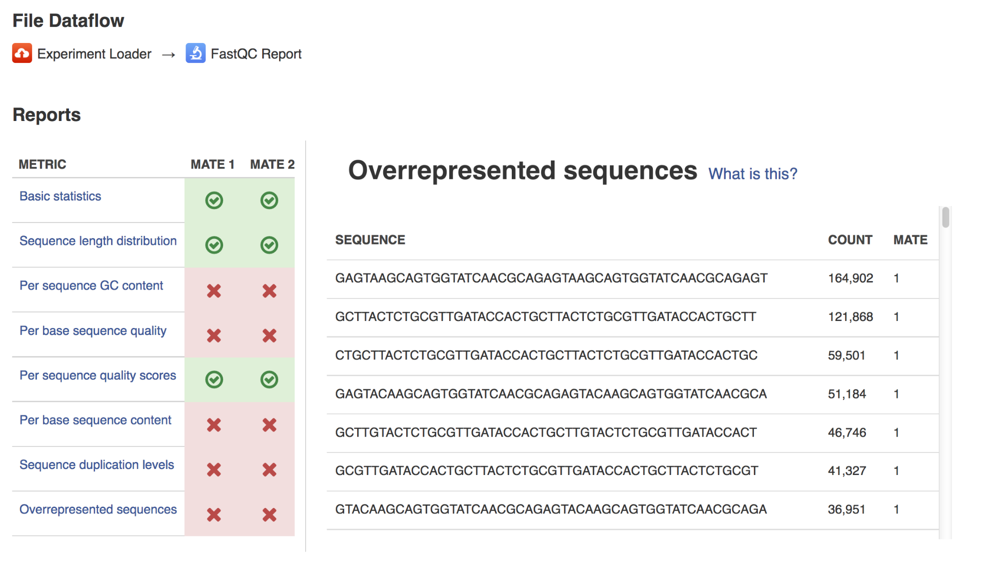
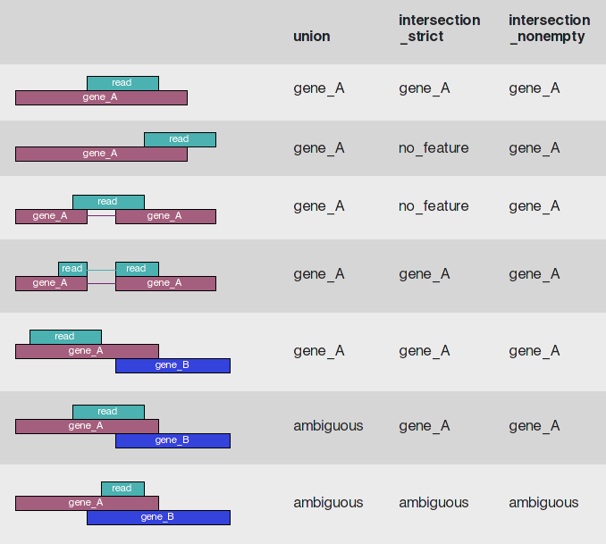
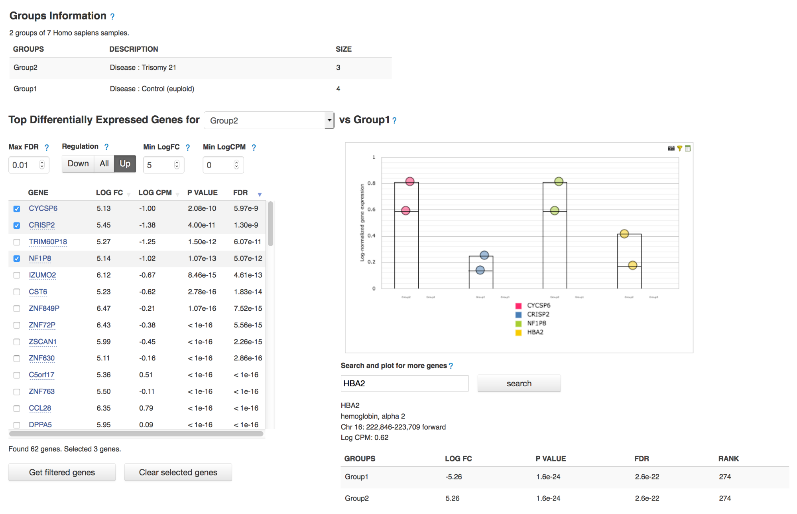

Running and reproducing data flows 
==================================

Your data has been imported on the platform, you have checked its
quality and chosen the apps you wish to use to analyse your data. Here
is how you can create your pipeline.

[pipeline building one]

|image56|

Select all the samples you wish to analyse and from the menu on top of
the page or from the dropdown menu, select the first app you wish to see
in your pipeline.

<Pipeline Building two>|image57|

This will take you to the app page where you can:

–learn more about the application

–view and edit app parameters

–explore your results (after the computation has been initialized and
completed)

–add steps to the file data flow (the pipeline).

Clicking on blue “Add step” button will show you the list of all the
possible apps that can be used to analyse your data – Genestack OS
chooses this list after checking your data (which, as you remember, is
hosted on our platform as a meaningful biological object or a “smart
file”).

Continue adding steps until you have completed building your pipeline.
When you add each of the steps, you create new files which end up in the
created files folder. However, these files

are not yet ready to use -   they need to be initialized first.

Initialising files in the data flow

You can initialize files in three different ways:

[data flow]  |image58|

If you want to save the pipeline and specific parameters you used here
to re-use again on other files you can create a new data flow. You need
to do this, before you start initialization. Click on the name of the
last created file (or e.g. “8 files”), go to Manage and “Create New Data
Flow”. This will take you to the Data Flow Editor where you can
introduce any last changes to your pipeline. Click on “Run dataflow”
once you are done.

[Data Flow 2]|image59|

This will take you to Data Flow Runner page where you can initialize the
computations (by clicking on “Run Dataflow” in the last cell). This data
flow, along with all your results (after computations are finished) will
be stored in the “Created files” folder.

[start initialization] |image60|

If you just want to initialize files right away without saving a
pipeline, click on the name of your last created file at the top of the
File Dataflow page and select Start initialization. You can track the
progress of this task in Task Manager. Doing this will begin
initialization of all the files (including intermediate files) you have
created whilst building this pipeline.

[file initializer app]|image61|

The last way to initialize your files is using the File Initializer
app.Select the  created but uninitialized files, right click on them, go
to “Manage” and choose the “File Initializer” app.

File Initializer reports the status of the files and allows you to
initialize  those that need to be by clicking on their respective “Go!”
buttons, or “Initialize all” to do them all at once. Files do not need
to be produced by the same apps to be initialized together.

Running the Data flows
----------------------

There are two apps that can be used to edit and run a data flow. The
first one you’ll usually see is the Data Flow Editor. This app presents
a visual representation of the pipeline and allows you to choose your
sources (usually sequencing assays) and reference genome. At this stage,
no files have been created nor initialized. When you click on “Run Data
Flow” button, this will take you to the Data Flow Runner app and create
all the relevant files in an uninitialized state. On the DFR page you
can choose whether you wish to start initialization of the data flow
now, or delay it until later. You can also edit the app parameters – by
clicking on an app name and on the app page going to “Edit parameters”.

Remember, to begin computation, you must initialize all files.  

Merge parents and other things you can do with data flows

Public data flows on Genestack 
------------------------------

[main bioinformatics analysis + Wp data flows + tutorial data flows]

On our platform, you can find a range of public data flows we have
prepared for our users. We cover most of the common analysis types:

-  `Single-cell Transcriptomic Analysis`_
-  `Genetic Variation Analysis`_
-  `Whole Exome Sequencing Analysis`_
-  `Differential Isoform Expression Analysis`_
-  `Whole Genome Methylation Analysis`_
-  `Differential Gene Expression Analysis`_
-  `Affymetrix Microarray Quality Control`_
-  `Targeted Sequencing Quality Control`_
-  `Mapped Reads Quality Control`_
-  `Raw Reads Quality Control`_
-  `Agilent Microarray Quality Control`_
-  `Unspliced Mapping`_
-  `Spliced Mapping`_
Clicking on the data flow will take you to the data flow editor where
you can add source files and reference genomes (we have a wide range of
reference genomes readily available on the platform). When you have
chosen your files, click on “Run dataflow” to go to the Data Flow
Runner. If you don’t want to change any settings, you can click “Start
initialization now”. To tweak the parameters and settings of the apps,
select “Delay initialization until later”. To change the settings, click
on the name of the app in the data flow. This will take you to the app
page, where you can select “Edit parameters” and introduce your changes.
When you are done introducing your changes, go back to the data flow and
initialize your computations.

File Provenance
---------------

Reproducibility of pipelines

Complete reproducibility is one of the core strengths of Genestack. For
any file in the system you can view the file provenance and then replay
the same exact analysis type on other data.

[File Provenance]

|image62|

The File Provenance app also allows you to view the text description of
the pipeline used to create a given file. Clicking the “View as text”
button allows you to see what parameters and what tool versions were
used at each analytical step. You can copy this text and e.g. use it in
your publication. Later, if you’ll want to reuse the same pipeline on
different data, you can create the dataflow identical to the pipeline
used to create the original file.

You can find file provenance by select the file of interest and choosing
“Create New Data Flow” from the available “Manage” apps.

Data Export
===========

As you know, once you upload files on Genestack they “lose” their format
and become meaningful biological objects. This means that you don’t need
to worry about formats during data analysis.

Export Data For Microarray Assays 

This application allows users to export microarrays from public or
shared experiments. The app generates a special download link which can
be sent to your colleagues, even if they aren’t registered on Genestack.

How to access the app?

You can find it in the Manage section after right-clicking on the files
you wish to export. \ :sup:``[bb] <#cmnt54>`__`[bc] <#cmnt55>`__`

Export Data for other data types
--------------------------------

Complete data export features are currently under development. However,
you can contact our team to export files on demand.

Getting Help 
============

Tutorials 
----------

In our tutorials we take you through examples based on public
experiments, re-analysing the data to demonstrate the features of
particular apps. All files used (from raw sequencing reads and reference
genomes to results and data visualisations) are stored on the platform
in the “Tutorials” folder.

We have prepared tutorials on Differential Gene Expression, Methylation
Profiling, Whole Exome Sequencing, and Whole Genome Sequencing and me
plan to add more in the future.

You can find all of our tutorials here: https://genestack.com/tutorial/

Getting in touch with Genestack 
--------------------------------

There are various ways to get in touch with our team:

1)Chatra: a chat window can be found at the bottom of our homepage.
During our operating hours at least one of us is always available to
help. Outside of our operating hours, you can leave us a message using
the chat window and we will get back to you as soon as we can.

2)Forum: when you have a question about the platform, try posting it on
our forum: forum.genestack.org. Our community will definitely be keen to
help you, and if not, our team regularly checks the forum and will
answer any unanswered questions.

3)Email: you can email us at support@genestack.com 

Genestack License 
==================

…...

FAQ 
====

Where do I find data shared with me?

If they have been linked, you can find them in the corresponding
group subfolder folder within the “Shared with me” folder. Otherwise,
they can be found using search.

Where do I find the data flows I have created?

How do I reuse a data flow?

Why are my tasks failing?

What’s the difference between Data Flow Runner and Data Flow Editor?

Data Flow Editor is used to create data flow templates: e.g. selecting
source files.

When you want to use the data flow to run your analysis, on the Data
Flow Editor page you can click on “Run Data Flow” button, which will
take you to Data Flow Runner. Here you can not only edit source files
and parameters, but also start initialization of your files.

How do I initialize the files?

How do I create a data flow? To create a data flow, select the data you
wish to analyse and choose the first app you wish to use in your
analysis. On the app page, using the “add step” button, add the rest of
the desired steps. Once you are done, click on the name of the file (or
files) at the top of the page, go to Manage, and click on Create New
Data Flow. Your new data flow can be found in the Created Files folder

If you don’t want to create a data flow from scratch, but rather re-use
the same analysis pipeline used to create a file, click on the name of
that file, go to Manage, and select Create New Data Flow.

Selecting File Provenance instead of Create New Data Flow will show you
the pipeline (in the form of a data flow) that was used to create this
file.

Read more about data flows in this tutorial_:

What’s the difference between BWA and Bowtie2?

The biggest differences between the two aligners are:

1)The way of accepting or rejecting an alignment.

BWA: counts the number of mismatches between the read and the
corresponding genomic position.

Bowtie2: uses a quality threshold bases on the probability of the
occurrence of the read sequence given an alignment location.

2)Accepting colorspace data:

BWA: No.

Bowtie2: Yes.

How does Genestack process paired-end reads?

There are three types of raw reads that our platform supports:

-  single-end (1 file locally, 1 file in Genestack)
-  paired-end (2 files locally, 1 file in Genestack)
-  paired-with-unpaired (3 or 4 files locally, 2 files in Genestack)

During import, Genestack recognises these types and imports them in
their respective format-free form.as 1 or 2 files. If the platform
cannot recognise the files automatically, you can allocate the files
manually.

What’s the difference between an experiment and a folder?

The main difference between a folder and an experiment is in the content
specificity.

Folders work just like folders on your computer and can contain various
biological objects\ :sup:``[bd] <#cmnt56>`__`\ : your assays, processed
files, output reports, etc.

Experiments contain only sequencing assays, but provide additional
features for storing experimental details, e.g. attached pdfs with
experiment notes. When you upload raw reads onto Genestack, they will
automatically be imported as one experiment. On the experiment page, you
can click on “View details” to read the summary of the experiment, get
more information about overall design and experiment type, contributors,
and find links to public databases.

All public experiments available on our platform are provided as
experiments, not folders. Remember you can share both experiments and
folders with other Genestack users using Groups. You can read more about
this in our `“Getting Started”`_ tutorial.

What’s the difference between masked and unmasked reference genomes?

In general, when a genomes is “masked” it means that all repeats and low
complexity regions of your reference genome (detected
by `RepeatMasker`_ tool)
are hidden away and replaced with “N”s, so that they will not be aligned
to.

We do not recommend using a masked genome, as it always  results in a
 loss of information. Masking can never be 100% accurate, and can lead
to an increase in the number of falsely mapped reads. If you’d like to
perform filtering, it’s better to do it after the mapping step.

In “soft-masked” genomes, repeated and low complexity regions are still
present, but they have been replaced with lowercased versions of their
nucleic base.

“Unmasked” genomes contain all repeats and low complexity regions
without any changes.

How do I change the name of the file?

How do I add files to the briefcase?

Where can I find the import templates I created?

References:
===========

Introduction to bioinformatics:

Luscombe NM et al. “What is bioinformatics? An introduction and overview.” Yearbook of Medical Informatics. 2001.
https://www.ebi.ac.uk/luscombe/docs/imia\_review.pdf)

Application management:

https://msdn.microsoft.com/en-us/magazine/dn451436.aspx

Introduction to NGS:

Riyue Bao, Lei Huang, Jorge Andrade, Wei Tan, Warren A Kibbe, Hongmei
Jiang, Gang Feng. “Review of Current Methods, Applications, and Data
Management for the Bioinformatics Analysis of Whole Exome Sequencing.”
Cancer Inform. 2014; 13(Suppl 2): 67–82. (https://www.ncbi.nlm.nih.gov/pmc/articles/PMC4179624)

Metadata:

- http://www.ncbi.nlm.nih.gov/pmc/articles/PMC3245000/ 
- http://web.expasy.org/cellosaurus/description.html
- https://www.ebi.ac.uk/chebi/
- https://bioportal.bioontology.org/ontologies/CL

Quality Control

- http://www.bioinformatics.babraham.ac.uk/projects/fastqc/
- https://code.google.com/archive/p/ea-utils/
- http://hannonlab.cshl.edu/fastx\_toolkit/ 
- https://github.com/lh3/seqtk
- http://www.ebi.ac.uk/~stijn/reaper/tally.html
- http://seqanswers.com/forums/showthread.php?t=6854

Choosing a mapper

- http://ccb.jhu.edu/software/tophat/index.shtml
- http://bio-bwa.sourceforge.net/
- http://bowtie-bio.sourceforge.net/bowtie2/manual.shtml
- https://code.google.com/archive/p/bsmap/

- Lister R, Pelizzola M, Dowen RH, Hawkins RD, Hon G, Tonti-Filippini J,
Nery JR, Lee L, Ye Z, Ngo Q-M, Edsall L, Antosiewicz-Bourget J, Stewart
R, Ruotti V, Millar AH, Thomson JA, Ren B, Ecker JR. “Human DNA
methylomes at base resolution show widespread epigenomic
differences.” Nature. 2009 462(7271):315-22. (http://europepmc.org/abstract/MED/19829295)

- Cokus SJ, Feng S, Zhang X, Chen Z, Merriman B, Haudenschild CD, Pradhan
S, Nelson SF, Pellegrini M, Jacobsen SE. “Shotgun bisulphite sequencing of the Arabidopsis
genome reveals DNA methylation patterning.” Nature. 2008 452(7184):215–219.
(http://europepmc.org/abstract/MED/18278030)

Reference genomes

- McCarthy DJ, Humburg P, Kanapin A, Rivas MA, Gaulton K, Cazier JB,
Donnelly P. Choice of transcripts and software has a large effect on
variant annotation. Genome Med. 2014;6(3):26 (https://genomemedicine.biomedcentral.com/articles/10.1186/gm543)
- Frankish A, Uszczynska B, Ritchie GR, Gonzalez JM, Pervouchine D,
Petryszak R, et al. Comparison of GENCODE and RefSeq gene annotation and
the impact of reference geneset on variant effect prediction. BMC Genomics. 2015;16 (Suppl 8):S2
(http://bmcgenomics.biomedcentral.com/articles/10.1186/1471-2164-16-S8-S2)

Microarray Normalization

- Madan Babu M.M. "An Introduction to Microarray Data Analysis" Computational Genomics (Ed: R. Grant), Horizon press, UK 2004
(http://www.mrc-lmb.cam.ac.uk/genomes/madanm/microarray/chapter-final.pdf)
- https://www.bioconductor.org/packages/3.3/bioc/html/affy.html
- https://www.bioconductor.org/packages/3.3/bioc/html/limma.html
- Gautier L. et al. “affy—analysis of Affymetrix GeneChip data at the probe level.” 2004
Bioinformatics, 20(3), pp. 307–315 (http://www.ncbi.nlm.nih.gov/pubmed/14960456)
- Ritchie ME, Phipson B, Wu D, Hu Y, Law CW, Shi W and Smyth GK “limma powers
differential expression analyses for RNA-sequencing and microarray studies.” 2015 Nucleic Acids
Research, 43 (7), pp. e47 (http://europepmc.org/abstract/MED/25605792)

Preformating tools:
- http://samtools.github.io/bcftools/bcftools.html
- http://samtools.sourceforge.net/
- http://broadinstitute.github.io/picard/

Analysis tools:
- http://www-huber.embl.de/users/anders/HTSeq/doc/count.html

Visualization tools:
- http://www.cbil.upenn.edu/PaGE/fdr.html

.. _Single-cell Transcriptomic Analysis: https://www.google.com/url?q=https://platform.genestack.org/endpoint/application/run/genestack/dataflowrunner?a%3DGSF968143%26action%3DcreateFromSources%26new_page%3Dtrue&sa=D&ust=1480960532140000&usg=AFQjCNEhL4uWcHXHOr1FGZ5tIBY5kYgTXg
.. _Genetic Variation Analysis: https://www.google.com/url?q=https://platform.genestack.org/endpoint/application/run/genestack/dataflowrunner?a%3DGSF1021590%26action%3DcreateFromSources%26new_page%3Dtrue&sa=D&ust=1480960532140000&usg=AFQjCNH4ZvdWkHff66-8rHQA5k2oKvuT_g
.. _Whole Exome Sequencing Analysis: https://www.google.com/url?q=https://platform.genestack.org/endpoint/application/run/genestack/dataflowrunner?a%3DGSF999236%26action%3DcreateFromSources%26new_page%3Dtrue&sa=D&ust=1480960532141000&usg=AFQjCNG0Aiv5aOhWP7aOzsAnlMG2VPAuFw
.. _Differential Isoform Expression Analysis: https://www.google.com/url?q=https://platform.genestack.org/endpoint/application/run/genestack/dataflowrunner?a%3DGSF968203%26action%3DcreateFromSources%26new_page%3Dtrue&sa=D&ust=1480960532141000&usg=AFQjCNG7i1NzFiknvU7YSW33u94PD47dug
.. _Whole Genome Methylation Analysis: https://www.google.com/url?q=https://platform.genestack.org/endpoint/application/run/genestack/dataflowrunner?a%3DGSF968148%26action%3DcreateFromSources%26new_page%3Dtrue&sa=D&ust=1480960532141000&usg=AFQjCNGxFpqgjVxexfPISr8fP26oEFsaCw
.. _Differential Gene Expression Analysis: https://www.google.com/url?q=https://platform.genestack.org/endpoint/application/run/genestack/dataflowrunner?a%3DGSF972243%26action%3DcreateFromSources%26new_page%3Dtrue&sa=D&ust=1480960532142000&usg=AFQjCNGK6v2wfFbccO03CPii9bo74JFedw
.. _Affymetrix Microarray Quality Control: https://www.google.com/url?q=https://platform.genestack.org/endpoint/application/run/genestack/dataflowrunner?a%3DGSF1015655%26action%3DcreateFromSources%26new_page%3Dtrue&sa=D&ust=1480960532142000&usg=AFQjCNHg44yDnCHJ9wImdxm88Okr4kSPeQ
.. _Targeted Sequencing Quality Control: https://www.google.com/url?q=https://platform.genestack.org/endpoint/application/run/genestack/dataflowrunner?a%3DGSF1014486%26action%3DcreateFromSources%26new_page%3Dtrue&sa=D&ust=1480960532143000&usg=AFQjCNFrje64ZaANbD8gFdytIUg57WOxqA
.. _Mapped Reads Quality Control: https://platform.genestack.org/endpoint/application/run/genestack/dataflowrunner?a%3DGSF968216%26action%3DcreateFromSources%26new_page%3Dtrue&sa=D&ust=1480960532143000&usg=AFQjCNF-20mX9xHnQ9X3hQhAfKce_FcRBg
.. _Raw Reads Quality Control: https://platform.genestack.org/endpoint/application/run/genestack/dataflowrunner?a%3DGSF969011%26action%3DcreateFromSources%26new_page%3Dtrue&sa=D&ust=1480960532143000&usg=AFQjCNH5lJSaESPs3pUeBrEIFNlkMs-e4g
.. _Agilent Microarray Quality Control: https://platform.genestack.org/endpoint/application/run/genestack/dataflowrunner?a%3DGSF1015659%26action%3DcreateFromSources%26new_page%3Dtrue&sa=D&ust=1480960532144000&usg=AFQjCNHwRN4S4g8o97lI1jPk0Nl4fFiW5A
.. _Unspliced Mapping: https://platform.genestack.org/endpoint/application/run/genestack/dataflowrunner?a%3DGSF1014279%26action%3DcreateFromSources%26new_page%3Dtrue&sa=D&ust=1480960532144000&usg=AFQjCNGI7qIqJF-YRl8ucCZ-083HWgXJmw
.. _Spliced Mapping: https://www.google.com/url?q=https://platform.genestack.org/endpoint/application/run/genestack/dataflowrunner?a%3DGSF968220%26action%3DcreateFromSources%26new_page%3Dtrue&sa=D&ust=1480960532145000&usg=AFQjCNFB8P_K2h7NeJkIbyI8ySfN7EhaEA
.. _tutorial: https://genestack.com/tutorial/reproducing-your-work-with-data-flows/
.. _“Getting Started”: https://genestack.com/blog/2016/01/06/getting-started/
.. _RepeatMasker: http://www.repeatmasker.org/&sa=D&ust=1480960532173000&usg=AFQjCNE4ktR5xI4yZEvRi94d-Tc1QkJnvA

.. |image1| image:: images/image10.png
.. |image2| image:: images/image27.png

.. |image7| image:: images/image28.png
.. |image8| image:: images/image34.png

.. |image11| image:: images/image56.png

.. |image14| image:: images/image16.png
.. |image15| image:: images/image38.png
.. |image16| image:: images/image45.png
.. |image17| image:: images/image50.png

.. |image20| image:: images/image44.png
.. |image21| image:: images/image53.png

.. |managing-and-sharing-tutorial-tick-box-for-write-permissions-in-sharing-popup| image:: images/image08.png
.. |image25| image:: images/image15.png
.. |image26| image:: images/image59.png
.. |image27| image:: images/image25.png
.. |image28| image:: images/image46.png
.. |image29| image:: images/image49.png
.. |image30| image:: images/image17.png
.. |image31| image:: images/image61.png
.. |image32| image:: images/image51.png
.. |image33| image:: images/image32.png
.. |image34| image:: images/image06.png
.. |image35| image:: images/image48.png
.. |image36| image:: images/image13.png
.. |image37| image:: images/image52.png
.. |image38| image:: images/image40.png

.. |image43| image:: images/image18.png
.. |image44| image:: images/image43.png

.. |image51| image:: images/image21.png
.. |bisulfite sequencing mapping| image:: images/image31.png
.. |reduced representation bisulfite sequencing mapping| image:: images/image02.png

.. |image55| image:: images/image11.png
.. |image56| image:: images/image30.png
.. |image57| image:: images/image58.png
.. |image58| image:: images/image12.png

.. |image60| image:: images/image24.png

.. |image62| image:: images/image36.png

