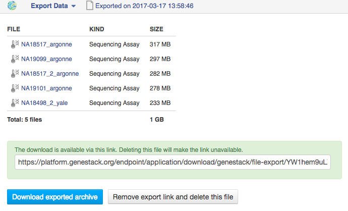

.. _data-export-label:

Data export
-----------

Genestack provides secure data storage and **Export Data** application
allows to safely download both assays and analysis results together with
attached metadata to a local machine.

Select those files you are going to export, right-click on them and choose
**Export Data** application. On the application page you will see the status of
your files, and if some of them are not initialized, you will be suggested to
initialize them prior to export.

.. image:: images/export1.png
   :align: center

If you change your mind, you can stop exporting process by click on **Cancel**
button.

The application creates a temporary Export file that contains a special link to download
the selected files. All the Export files are stored in the
“Exports” folder.

.. update image

**Sharing the link** enables your collaborators to download data even if they
do not have a Genestack account. The created export file can be removed after some time by the platform.
It means that the corresponding download link will not be accessible any longer, however the
data itself will not be affected.