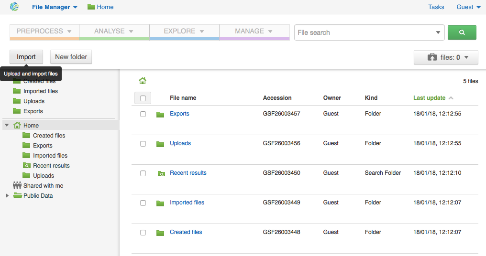
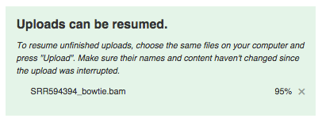
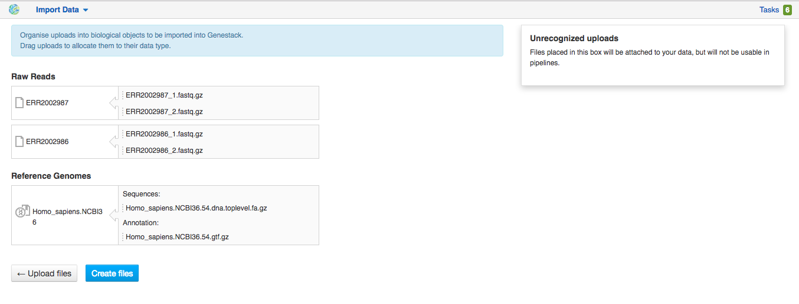
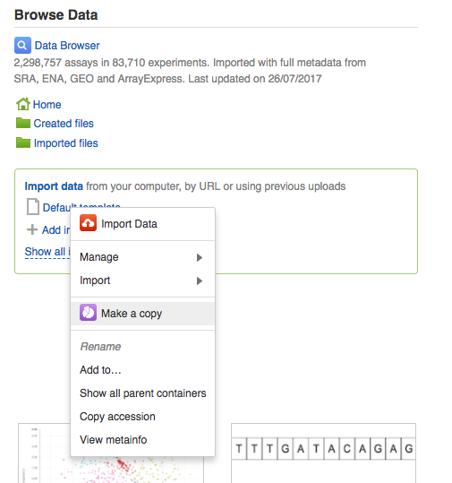
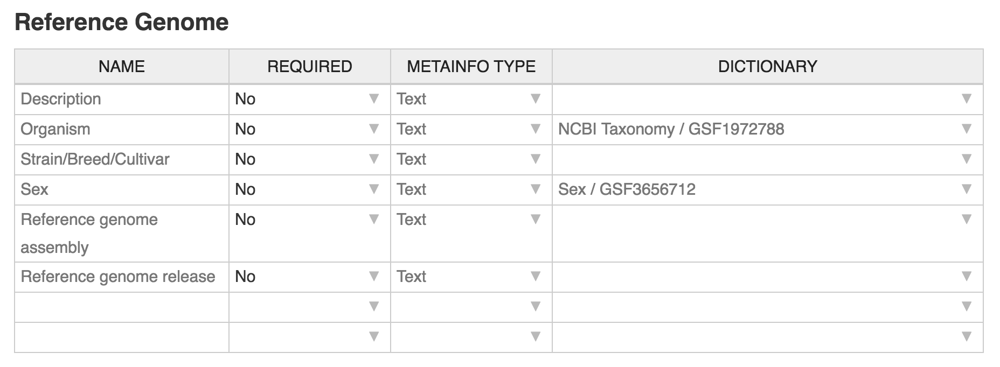
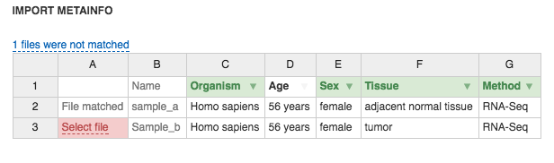
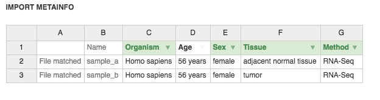
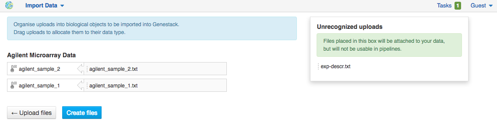
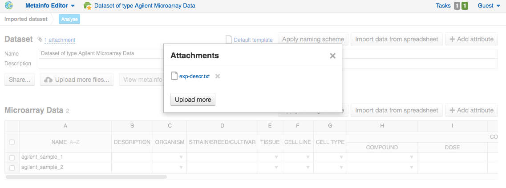

Importing data
--------------

Supported file types
~~~~~~~~~~~~~~~~~~~~

Here is a list of file types that can be imported into Genestack.
Note that gzippped (.gz) and zipped (.zip) files are also supported.

.. image:: images/supported-formats.png

.. note:: **Import of Gene Expression Signature and Gene List files**

         If the file contains both gene names and log fold changes, it is imported as
         *Gene Expression Signature*. If the file only contains gene names, it is imported as *Gene List*.
         The importer will look at the headers of the .tsv file to try to detect which columns may
         correspond to gene names or log fold changes (common variations are supported such as
         ‘gene’/‘symbol’ for gene names, and ‘logFC’/’log fold change’ for log fold changes).
         If it fails to detect them, the user will be asked to manually choose the file type and
         specify the file headers corresponding to gene names or log fold changes. Gene symbols and
         Ensembl/Entrez gene IDs are currently supported for gene names.

When you import files that are detected as raw sequencing or microarray data,
Genestack automatically creates a **dataset**, a special type of folder, and adds the assays to it.
Additional documents in any format (e.g. PDF, Word, text, etc.)
can be imported as **attachments** to a dataset. We will discuss the use of attachments below.
Some types of files, namely Reference Genome, Gene List, Gene Expression Signature,
Gene Signature Database, Genetic Variations, Ontology Files, Dictionary, Microarray Annotation,
Methylation Array Annotation, Infinium Beta Values, are not wrapped in
datasets on import because they are rarely uploaded and processed as batches.

When you perform any analysis on Genestack, other data types, which cannot be imported, can be created such as:

- **Affymetrix/Agilent/GenePix Microarrays Normalisation** — file with
  normalized Affymetrix/Agilent/GenePix microarrays data;
- **Differential Expression Statistics** — expression statistics for
  change in expression of individual genes or other genomic features between groups of samples,
  such as fold-changes, p-values, FDR, etc.;
- **Genome Annotations** — a technical file used for matching GO terms and
  gene symbols to gene coordinates;
- **Mapped Read Counts** — file is produced from Mapped Reads and contains the number of reads mapped to each feature of a reference
  sequence.

.. verify

Data import
~~~~~~~~~~~

There are several ways you can access the **Import** application:

- using the **Import data** link on the Dashboard;

.. image:: images/WP_import.png
   :scale: 90 %
   :align: center

- clicking the **Import** button in the File Manager;

- using an **import template**. We will describe what import template is and how to
  use it later in the guide.

.. image:: images/IT_import.png
   :scale: 90 %
   :align: center

Import data consists of three steps: firstly, temporary Upload files with your
data are created in the platform; then, the biological data type is assigned to your
imported data; finally, you can fill in all required metadata or import it from a text file.

Step 1: Getting data into the platform
++++++++++++++++++++++++++++++++++++++

There are two ways to have your data imported into the platform:

1. **Upload data from your computer** — select or drag-and-drop files.

.. image:: images/import_start.png
   :scale: 80 %
   :align: center

2. **Import from URLs (FTP or HTTP/HTTPS)** — specify URLs for separate files or
   directories.

.. image:: images/URL_import.png
   :scale: 80 %
   :align: center

Furthermore, you can reuse your previous Upload files instead of uploading
the same data again: just select existing files with the **Use previous uploads** option and,
then, add more data if necessary. This feature can be useful, for example, when you import
a dataset with several samples, one of the files is chosen incorrectly or corrupted,
so you would like to replace it. In this case, you need to upload again just one sample and
reuse all other previously uploaded files.

.. image::images/import-add-more.png
   :scale: 80 %
   :align: center

.. note:: **What is an Upload file?**

          The Upload file is a temporary file that is automatically created
          during the data importing process.
          The only purpose of the Upload files is to temporarily store the data
          until the corresponding Genestack files are created and initialized correctly.
          It is Genestack files that will be further used
          in bioinformatic data analysis; that is why the platform periodically
          can remove the Upload files, but no data is lost.

Data uploading from your computer is carried out in multiple streams to increase upload speed.
Import from URLs is performed in the background, which means that even while these files
are being uploaded, you can edit their metadata and use them in pipelines.

.. image:: images/uploading_step.png
   :scale: 80 %
   :align: center

If during uploading you lose your Internet connection, you will be able to
resume unfinished uploads later.

Click the **Import files** button to proceed.

Step 2: Format recognition
++++++++++++++++++++++++++

After your data is uploaded, Genestack automatically recognizes file formats
and transforms them into biological data types: raw reads, mapped reads,
reference genomes, etc. All format conversions will be handled internally by
Genestack. You will not have to worry about formats at all.

If files are unrecognized or recognized incorrectly, you can manually allocate
them to a specific data type: drag the Upload file and move it to the green
"Choose type" box at the top of the page.

.. image:: images/unrecognized_uploads.png
   :scale: 80 %
   :align: center

Choose the data type you find suitable:

.. image:: images/file_types_box.png
   :scale: 80 %
   :align: center

Click the **Create files** button to proceed.

Step 3: Editing metainfo
++++++++++++++++++++++++

During this step, the import has already completed, and you can describe uploaded data
using an Excel-like spreadsheet.

.. image:: images/import_edit_metainfo.png

By default, you see all metainfo fields available for files, you can fill them
or create new custom columns. Click the **Add column** button, name new metainfo
field and choose its type (Text, Integer, etc.):

.. image:: images/add_metainfo_field.png

You can also choose to apply a naming scheme. This allows you to generate
file names automatically based on other metainfo attributes.

.. image:: images/naming_scheme.png

Metainfo fields can be associated with specific dictionaries and
ontologies. We pre-uploaded some public dictionaries such as
the `NCBI Taxonomy`_ database for the "Organism" field, the Cellosaurus_ (a resource on cell lines),
the ChEBI_ for chemical compounds, and the `Cell Ontology`_ (cell types in animals).

.. _NCBI Taxonomy: https://www.ncbi.nlm.nih.gov/taxonomy
.. _Cellosaurus: http://web.expasy.org/cellosaurus/description.html
.. _ChEBI: https://www.ebi.ac.uk/chebi
.. _Cell Ontology: http://www.obofoundry.org/ontology/cl.html

We also created our own controlled vocabularies to cover Sex, Method and Platform fields.
You can find out more about ontologies in the :ref:`public-experiment-label` section.

Import with templates
~~~~~~~~~~~~~~~~~~~~~

You can create your own custom dictionary by importing it into the
platform as OWL, OBO or CSV file and attach it to the import template.

.. note:: **What is an import template?**

          Import templates allow you to select what metainfo attributes of your imported
          files will be tightly controlled (so you don’t lose any information in the
          process). Import templates allow you to set default fields for file metadata
          based on file type (e.g. Datasets, Discrete Genomic Data, Genetic
          Variations, etc.). Of course, if you’re only importing mapped reads, you don’t
          need to specify metainfo attributes for other data types.

You can select which import template to use in two ways: from the Dashboard,
or during the 3rd step of the import process by right-clicking on the
import template name ("Default template" is for the public one). You can create a copy of existing
import templates with **Make a copy** option in the context menu.

Genestack will attempt to fill metainfo fields automatically, but you can always
edit the contents manually during the import process. By using metainfo
templates you can make sure that all of your files will be adequately and
consistently described so you will not lose any valuable information. For
example, here is the list of metainfo attributes used by default to describe
Reference Genome data:

**Import template editor** application allows to modify existing import templates and create
new ones with proper metainfo fields, requirements and controlled vocabularies. To access
the application right-click on a template's name and select the **Import template editor** from
the "Manage" submenu. To create new template on the basis of the default one you can also click
**Add import template** one the Dashboard.

.. image:: images/import_templates.png
   :scale: 45 %
   :align: center

Now let’s say you wish to create an import template to control
the metainfo attributes of raw reads (e.g. you always need to know the
tissue and sex of your samples). In order to do this, click on **Add import template**,
then look for the table related to Raw Reads and for the
fields "tissue" and "sex", change the required fields to *Yes*. As you can
see, the system controls what type of information can you put into your
metainfo fields. In this case, for tissue the system will map your entries to
the Uberon_ ontology (an integrative multi-species anatomy ontology) and
the metainfo type must be text.

.. _Uberon: http://uberon.github.io

.. image:: images/edit-template.png

If you want to **add other metainfo fields** that are not included in the table
already, you can do this at the bottom of the table where there are blank
spaces. For each entry, you must specify whether or not this field is
required and what is its metainfo type (e.g. text, yes/no, integer).

.. image:: images/metainfo_type_editor.png

If you are using a file kind that is not yet listed, you can add a new one by
clicking on the **Add file kind** button. Keep in mind that file kinds are
defined in Genestack — you will not be able to create a template entry for a
file kind that is not used on the platform.

When you are done, click on the blue **Import using this template** button.
This will take you to the **Import Data** app, where you can go through the three import
steps described above. You can find all the imported files in the "Imported" folder which can be accessed from the Dashboard and from the File
Manager.

Metadata import
~~~~~~~~~~~~~~~

Apart from editing metainformation manually, you can also import and validate the metainfo attached to the assays and
to the dataset on the platform.

.. image:: images/import_from_spreadsheet.png

Click **Import data from spreadsheet** button and select a local CSV or
Excel file containing metadata you would like to associate with the imported files.

.. image:: images/import_metainfo.png

Note that names in the first column in the file with metadata should exactly match names of the data
samples on the platform, based on the first "Name" column. For example, in our case metainfo
for the second sample does not match to any assays and is highlighted in red.

Use the **Select file** option to manually allocate the imported metadata to an appropriate
file.

.. image:: images/import_metainfo-select-file.png

Columns that are mapped to a metainfo field from the dataset's
template (by default data are imported with "Default" template) are highlighted in green.

On this step for each column you can specify whether it should be imported or not, and if it
should be mapped to some metainfo key from the import template, by clicking on the column header.

.. image:: images/metainfo-import-matching.png

Click **Import** when you finish editing the table. As a result, the table on the Metainfo Editor
page is filled in with metadata from the Excel-file.

.. image:: images/import_metainfo_complete.png

Attachments
~~~~~~~~~~~

While importing a dataset into Genestack, you can also attach various files to it such as, for
example, a PDF file with the experiment plan or an R script, etc. When you open your newly-imported
datasets, all of the attachments will accompany it. They will be safely
stored on Genestack, so later you can download them from the platform, in case
they get lost on your computer.

**How to upload an attachment?**

Attachments should be uploaded together with the dataset. In the Data Import application, choose
the attachments from your computer along with your dataset. The platform will
recognize the raw data, and all additional files that were unrecognised will
be added to the dataset as attachments.

Besides, you can upload more attachments, or remove attachments in the Metainfo Editor.

