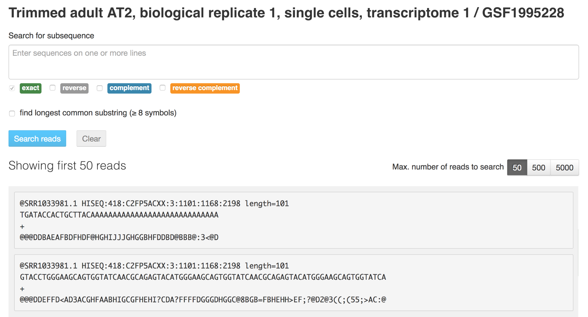
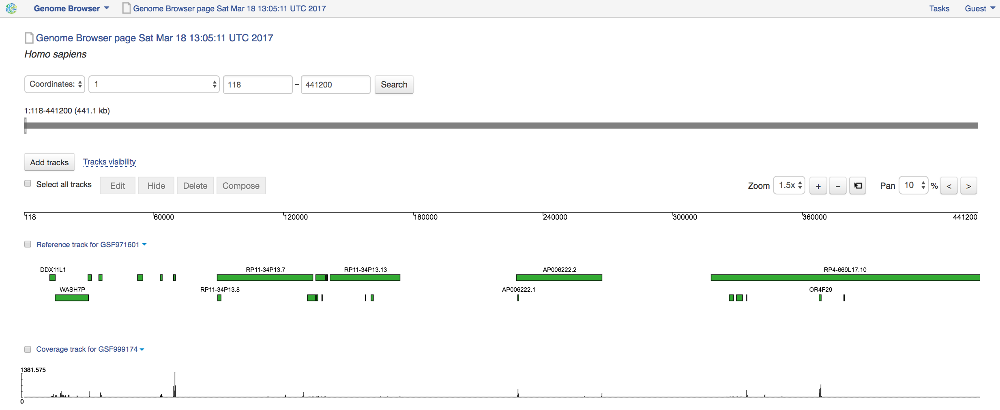
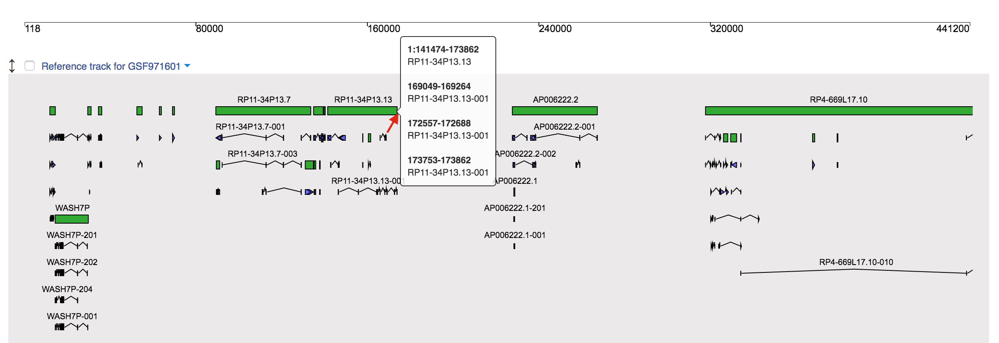
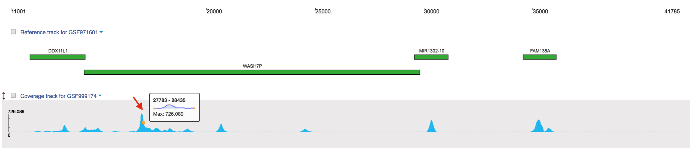
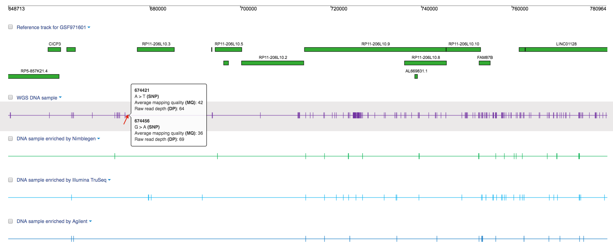
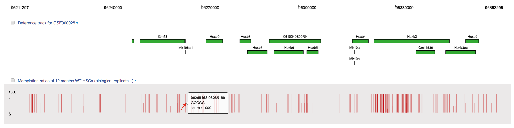
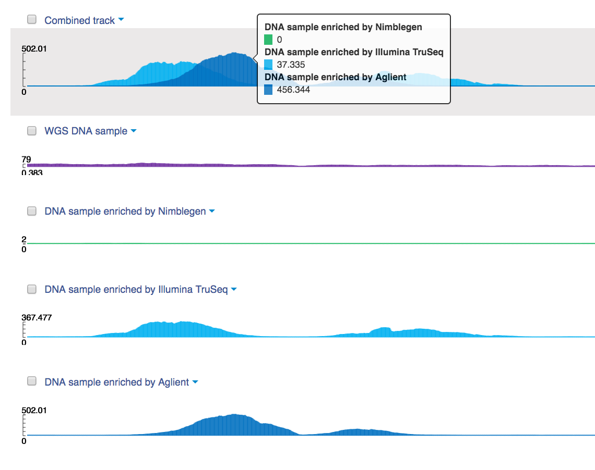

Additional visualisation applications
~~~~~~~~~~~~~~~~~~~~~~~~~~~~~~~~~~~~~

.. TODO think about the proper name for this section

This section includes the applications that can be used in various pipelines
to view the content of the data (e.g. Sequencing Assay Viewer) or to display
multiple data types on different steps of analyses (e.g. Genome Browser).

Sequencing assay viewer
+++++++++++++++++++++++

**Action**: to show the content of Raw Reads file and look
for specific nucleotide sequences which can be exact, reverse, complement or
reverse complement to the sequence of interest.

To access this application, select the assay you are interested in, right click
on it and from the "Explore" section select the application.

Genome browser
++++++++++++++

**Action**: to visualize different types of genomic data: mapped reads,
genetic variants, methylation ratios and others.

There are several tracks that can be visualized in Genome Browser:

-  *Reference track* displays reference genome, its genes (green boxes),
   transcripts, and their coordinates;

-  *Coverage track* represents the sequencing reads coverage for mapped reads

-  *Variation track* shows genetic variants (SNPs, insertions etc.), their
   exact position on the genome, average mapping quality and raw read
   depth;

-  *Methylation ratios track* reflects the proportion of methylated and
   unmethylated cytosine residues.

Also you can manage tracks: add new ones, hide or delete them. When
manipulating with multiple tracks you can use the tracks mentioned above
to create *Combined track* or *Formula track*. On the combined track several
tracks are imposed and shown together, thereby comparing coverage for
different samples.

Or you can apply some basic mathematical operations and create formulas based
on your genomic data, for example, quantify average value between values
corresponding to different samples. The results of the computations will be
shown on the formula track.

Moreover, each track can be customised by changing its properties (track color,
normalized values, show only SNPs, maximum and minimum values to be shown on a
track, etc.). Use "Edit" button to change properties for multiple tracks at once.

Genome Browser allows you to browse either a specific genomic position (search
by coordinates) or a specific feature (search by feature name). You can navigate
through the data to find a feature of interest or explore regions surrounding
the feature, and zoom in to nucleotide resolution. The found feature can be
marked with sticky notes (Shift + click on the position on the track). When you
share the Genome Browser page with your collaborators, sticky notes will  help
to focus their attention on your findings.

You can see the Genome browser in action in this blog post_.

.. _post: https://genestack.com/blog/2015/05/28/navigation-in-genestack-genome-browser/
