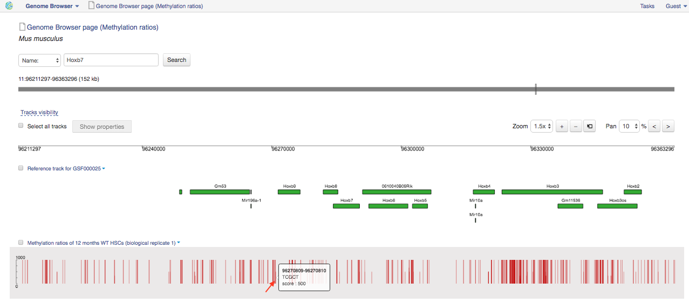

Bisulfite sequencing data analysis
~~~~~~~~~~~~~~~~~~~~~~~~~~~~~~~~~~

.. TODO Add a few words about bisulfite sequencing technology

Bisulfite sequencing mapping with BSMAP
+++++++++++++++++++++++++++++++++++++++

**Action**: to map high-throughput bisulfite sequencing (BS) reads at the
level of the whole genome.

.. image:: images/bisulfite_seq_mapping_app_page.png

Let’s talk a bit about various settings:

1. The **Number of mismatches** option lets you set the maximum number of allowed
   mismatches per read. Changing this number you can affect application
   runtime and percentage of mapped reads. There is an increase in the
   percentage of mapped reads and in the application runtime when increasing
   this value. For example, by default the read could be mapped to the genome
   with no more than 5 mismatches. (default: 5)
2. **Rule for multiple mappings** option. The application can "only reports
   unique hits" for one mappable read or if your reads are mapped to multiple
   positions in the genome, "report 1 random "best" mapping". In the last case,
   it stops duplicated genome regions from being omitted altogether. (default:
   Report 1 random "best" mapping)
3. The **BS data generation protocol** option enables you to specify what library
   preparation method was used to construct the bisulfite converted library.
   (default: Lister)

If  the "Lister" protocol was used, your reads will be mapped to two
forward strands. You can read more about this protocol in `Lister et al`_.
If you choose the "Cokus" protocol the application will align your reads to
all four strands. You can find more details about this protocol in the
original study by `Cokus et al`_.

.. _Lister et al: https://www.ncbi.nlm.nih.gov/pmc/articles/PMC2857523/
.. _Cokus et al: https://www.ncbi.nlm.nih.gov/pmc/articles/PMC2377394/

The application is based on the BSMAP_ aligner and it is used in the `Whole-Genome
Bisulfite Sequencing Analysis`_ tutorial.

.. _BSMAP: https://sites.google.com/a/brown.edu/bioinformatics-in-biomed/bsmap-for-methylation
.. _Whole-Genome Bisulfite Sequencing Analysis: http://genestack-user-tutorials.readthedocs.io/tutorials/Methylation_profiling/index.html

Reduced representation bisulfite sequencing mapping with BSMAP
++++++++++++++++++++++++++++++++++++++++++++++++++++++++++++++

**Action**: to map reduced representation bisulfite sequencing (RRBS) reads to
the specific digestion sites on the genome.

.. image:: images/RRBS_mapping_app_page.png

Let’s talk a bit about various settings:

1. **Enzyme sequence** option is important. It specify what sequence is
   recognized by by the restriction enzyme and used to digest genomic DNA in
   the process of library preparation. By default, the application uses the
   *C-CGG* sequence which is recognised in MspI restriction. (default: "C-CGG")
2. The **Number of mismatches** option lets you set the maximum number of allowed
   mismatches per read. Decreasing this number you can reduce application
   runtime and percentage of mapped reads. (default: 5)
3. **Rule for multiple mappings** option. The application can "only reports
   unique hits" for one mappable read or if your reads are mapped to multiple
   positions in the genome, "report 1 random "best" mapping". In the last case,
   it stops duplicated genome regions from being omitted altogether. (default:
   Report 1 random "best" mapping)
4. The **BS data generation protocol** option enables you to specify what library
   preparation method was used to construct the bisulfite converted library.
   (default: Lister)

If  the "Lister" protocol was used, your reads will be mapped to two
forward strands. You can read more about this protocol in `Lister et al`_.
If you choose the "Cokus" protocol the application will align your reads to
all four strands. You can find more details about this protocol in the
original study by `Cokus et al`_.

.. _Lister et al: https://www.ncbi.nlm.nih.gov/pmc/articles/PMC2857523/
.. _Cokus et al: https://www.ncbi.nlm.nih.gov/pmc/articles/PMC2377394/

The application is based on the BSMAP_ aligner.

.. _BSMAP: https://sites.google.com/a/brown.edu/bioinformatics-in-biomed/bsmap-for-methylation

Methylation ratio analysis
++++++++++++++++++++++++++

**Action**: to determine the percent methylation at each ‘C’ base in mapped
reads. Next, you can view methylation ratios in Genome Browser.

.. image:: images/methratio_app_page.png

Command line options are the following:

1. The **Minimum coverage** option allows you to get results filtered by depth
   of coverage. But raising it to a higher value (e.g. 5) requires that at
   least five reads will cover the position. (default: not set)
2. **Trim N end-repairing fill-in bases** option. For paired-end mappings, you
   can trim from 1 to 240 fill-in nucleotides in the DNA fragment end-repairing.
   For RRBS mappings, the number of fill-in bases could be determined by the
   distance between cuttings sites on forward and reverse strands. If you
   analyse WGBS mappings, it is recommended to set this number between 0~3.
   (default: not set)
3. The **Report loci with zero methylation ratios** option is used to report
   positions with zero methylation. (default: unchecked)
4. The **Combine ratios on both strands** option allows you to combine CpG
   methylation ratio from both strands. (default: unchecked)
5. **Only unique mappings** parameter is checked in case you would like to
   process only unique mappings. (default: checked)
6. The **Discard duplicated reads** option is used to remove duplicates from mapped
   reads. (default: checked)
7. **C/T SNPs filtering** option. To ignore positions where there is a possible
   C/T SNPs detected, choose "skip" value. If you want to correct the
   methylation ratio according to the C/T SNP information estimated by the G/A
   counts on reverse strand, set "correct" value. Or, let the application do
   not consider C/T SNPs ("no-action" value). (default: no-action)

If you analyse paired reads one more option appears:

8. The **Discard discordant mappings** parameter is used to discard all mappings where the
   two mates map uniquely but with unexpected orientation, or where the
   distance between two mapped mates differs from and internally estimated
   fragment length, including mates mapping to different chromosomes.

The outputs from Methylation Analysis application can be represented in the
**Genome Browser** as *Methylation ratios* track.

.. note:: **What does the 0-1000 side bar represent?**

   These bars represent the final methylation frequency. To understand this,
   take a simple example.
   Let's imagine, we investigate position 30 in the Chr X. This position has 10
   reads contributing to the methylation frequency. 7 of these 10 reads reported
   Cs in this position (i.e. methylated Cs, no bisulfite conversion and Cs do not
   transform into Ts) and 3 reads showed Ts (unmethylated Cs, bisulfite conversion
   takes place). Then the final methylation frequency will be calculated as 7/10 =
   0.7. This value is multiplied by 1000 to get 700 (this is the bar sides you see
   in Genome Browser).
   So, it means, that side bars with 0 value represent unmetylated position, and
   vice versa side bars with 1000 - show max methylation (all reads have
   methylated Cs in this case).

The Methylation Analysis application is based on the `methratio.py
<https://sites.google.com/a/brown.edu/bioinformatics-in-biomed/bsmap-for-methylation>`_
script and it is used in the `Whole-Genome Bisulfite Sequencing Analysis`_ tutorial.

.. _Whole-Genome Bisulfite Sequencing Analysis: http://genestack-user-tutorials.readthedocs.io/tutorials/Methylation_profiling/index.html
