Microarray data
---------------

Scientists are using DNA microarrays to quantify gene
expression levels on a large scale or to genotype multiple regions of a genome.

.. note:: **What is a DNA Microarray?**

          It is a collection of microscopic DNA spots attached to a solid
          surface. Each spot contains multiple identical DNA sequences (known
          as probes or oligos) and represents a gene or other DNA element that
          are used to hybridize a cDNA or cRNA sample (called target) under
          high-stringency conditions. Probe-target hybridization is measured by
          detection of targets labeled with a molecular marker of either
          radioactive or fluorescent molecules.

Expression arrays
~~~~~~~~~~~~~~~~~

Microarrays are useful in a wide variety of studies with a wide variety of
objectives. In this section we will look at expression microarrays.

Microarrays normalisation
+++++++++++++++++++++++++

When investigating differential gene expression using microarrays, it is often
the case that the expression levels of genes that should not change given
different conditions (e.g. housekeeping genes) report an expression ratio
other than 1. This can be caused by a variety of reasons, for instance:
variation caused by differential labelling efficiency of the two fluorescent
dyes used or different amounts of starting mRNA. You can read more about this
`in this document`_.

.. _in this document: http://www.mrc-lmb.cam.ac.uk/genomes/madanm/microarray/chapter-final.pdf

Normalisation is a process that eliminates such variations in order to allow
users to observe the actual biological differences in gene expression levels.
On Genestack, we have four different Microarray Normalisation applications -
one for each of the four commonly used chips: Affymetrix_, Agilent_, L1000_
and GenePix_.

.. _Affymetrix: http://www.affymetrix.com/estore/
.. _Agilent: http://www.agilent.com/home/more-countries?currPageURL=http://www.agilent.com/home
.. _L1000: http://genometry.com/
.. _GenePix: https://www.moleculardevices.com/systems/microarray-scanners

Affymetrix microarrays normalisation
************************************

**Action**: to perform normalisation of Affymetrix microarray assays.

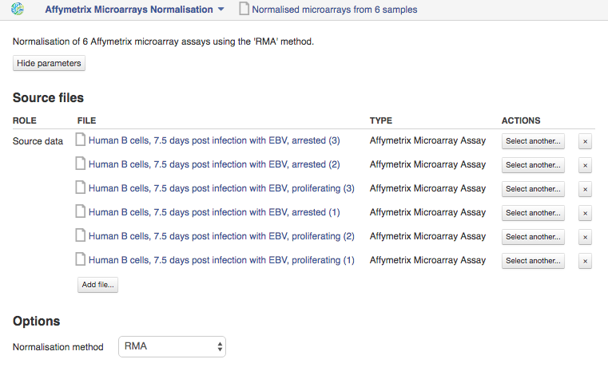

To normalize Affymetrix microarrays the application uses RMA (Robust
Multi-array Average) method. First, the raw intensity values are background
corrected, log2 transformed and then quantile normalized. Next a linear model
is fit to the normalized data to obtain an expression measure for each probe
set on each array. For more on RMA, see `this paper`_.

.. _this paper: https://jhu.pure.elsevier.com/en/publications/exploration-normalization-and-summaries-of-high-density-oligonucl-5

As a next step, the normalised microarray samples can be assessed using the
**Microarray Quality Control** application to detect and remove potential outliers. Normalised
microarrays that are of good quality can then be processed for downstream
processing such as Dose Response Analysis or Test Differential Expression.

The application is based on the affy_ R package.

.. _affy: http://bioconductor.org/packages/release/bioc/html/affy.html

Agilent microarrays normalisation
*********************************

**Action**: to perform normalisation of Agilent microarray assays.

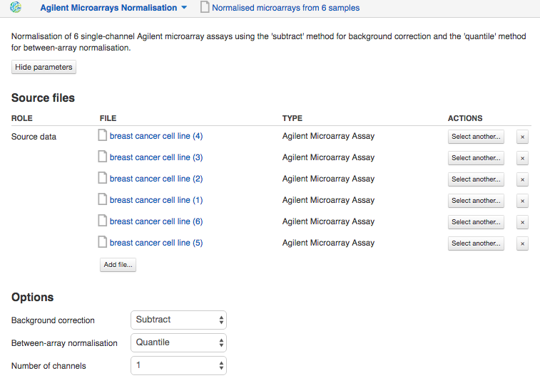

For 1-channel Agilent microarrays, various procedures for background
correction (e.g. "subtract", "half", "minimum", "normexp"), and between-array
normalisation (e.g. "quantile", "scale"), can be applied.

For 2-channel Agilent microarrays, procedures for within-array normalisation
(e.g. "loess", "median") can also be applied.

.. note:: **What is the difference between 1-channel and 2-channel microarrays?**

          Two-channel (or two-color) microarrays are typically hybridized with
          cDNA prepared from two samples (or two experimental conditions)
          that the scientists want to compare, e.g. disseased tissue vs.
          healthy tissue. These arrays samples are labeled with two different
          fluorophores, say Cy5 and Cy3 dyes, and will emit signal with
          different intensuty. Relative intensities of each fluorophore may then
          be used in ratio-based analysis to identify up-regulated and
          down-regulated genes

          In single-channel arrays, also called one-color microarrays, each
          experimental condition must be applied to a separate chip. They give
          estimation of the absolute levels of gene expression and only a sigle
          dye is used.

As a next step, the normalised microarray samples can be assessed using the
**Microarray Quality Control** application to detect and remove potential outliers. Normalised
microarrays that are of good quality can then be processed for downstream
processing such as Dose Response Analysis or Test Differential Expression.

The application is based on the `limma`_ R package.

.. _limma: https://www.bioconductor.org/packages/3.3/bioc/html/limma.html

GenePix microarrays normalisation
*********************************

**Action**: to perform normalisation of GenePix microarray assays.

.. image:: images/genepix_normalisation.png

For GenePix microarrays, quantile between-array normalisation is performed and
various procedures for background correction (e.g. "subtract", "half",
"minimum", "normexp") can be applied.

As a next step, the normalised microarray samples can be assessed using the
**Microarray Quality Control** application to detect and remove potential outliers. Normalised
microarrays that are of good quality can then be processed for downstream
processing such as Dose Response Analysis or Test Differential Expression.

L1000 microarrays normalisation
*******************************

**Action**: to perform normalisation of L1000 microarray assays.

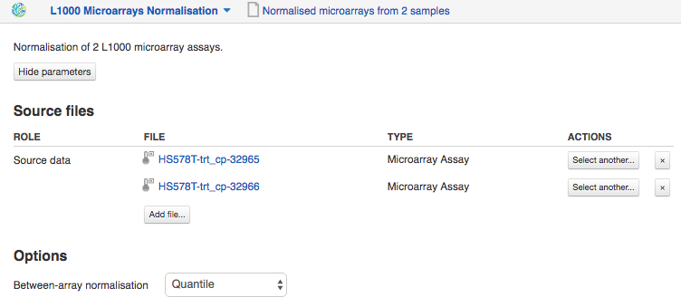

To normalize L1000 microarrays, the application applys the "quantile" method
for between-array normalisation.

As a next step, the normalised microarray samples can be assessed using the **Microarray
Quality Control** application to detect and remove potential outliers. Normalised
microarrays that are of good quality can then be processed for downstream
processing such as Dose Response Analysis or Test Differential Expression.

Microarray quality control
++++++++++++++++++++++++++

As in any statistical analysis, the quality of the data must be checked. The
goal of this step is to determine if the whole process has worked well enough
so that the data can be considered reliable.

**Action**: to perform quality assessment of normalised microarrays and detect
potential outliers.

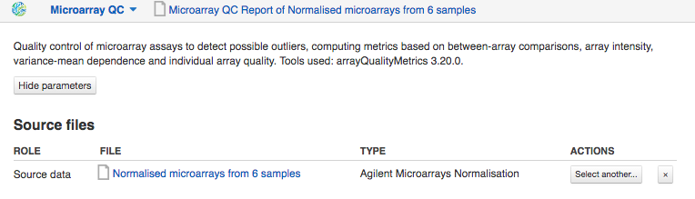

The application generates report containing quality metrics based on
between-array comparisons, array intensity, variance-mean dependence and
individual array quality. Some metrics have their own labels. It helps to
understand according to which metric(s) the particular microarray is
considered to be outlier.

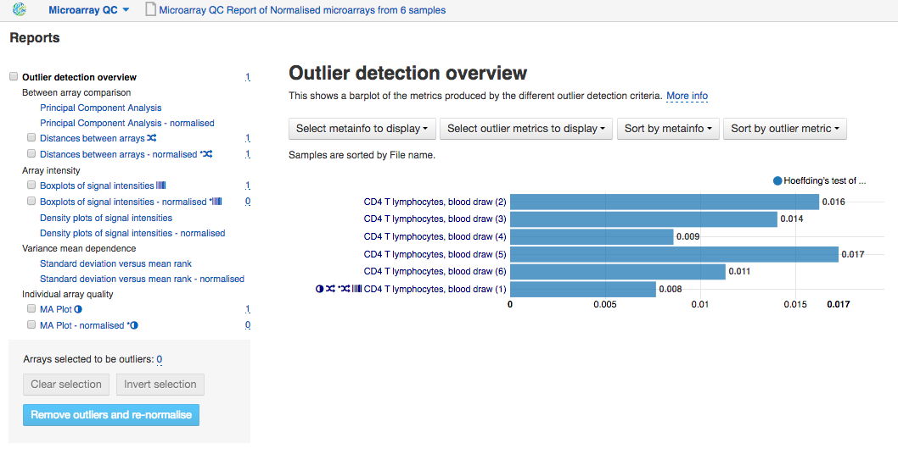

QC metrics are computed for both the unnormalised and normalised microarrays
and include:

1. **Between array comparison** metrics.

- Principal Component Analysis (PCA) is a dimension reduction and visualisation
  technique that is used to project the multivariate data vector of each
  array into a two-dimensional plot, such that the spatial arrangement of the
  points in the plot reflects the overall data (dis)similarity between the
  arrays.

  For example, in the picture below, PCA identifies variance in datasets,
  which can come from real differences between samples, or, as in our case,
  from the failed "CD4 T lymphocytes, blood draw (1)" array.

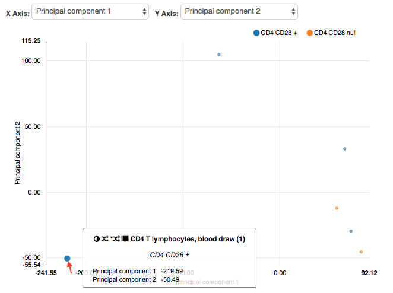

- Distances between arrays. The application computes the distances between
  arrays. The distance between two arrays is computed as the mean absolute
  difference (L1-distance) between the data of the arrays (using the data from
  all probes without filtering).

  The array will be detected as an outlier if for this array the sum of the
  distances to all other arrays is extremely large.

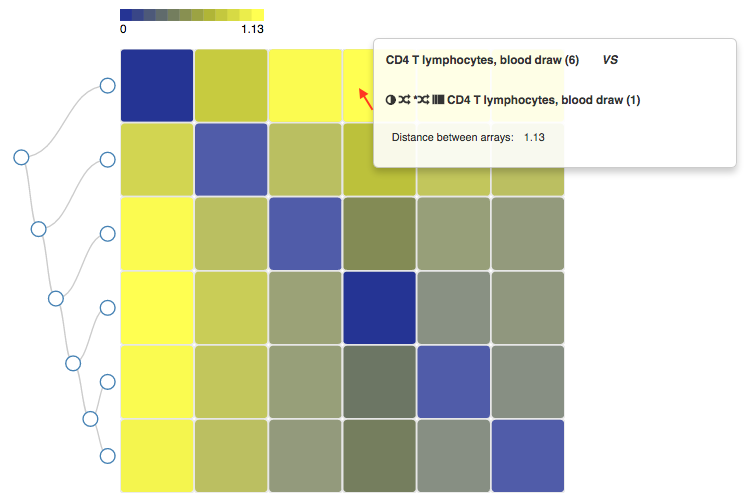

2. **Array intensity** statistics.

- Boxplots of signal intensities represents signal intensity distributions of
  the microarrays. Typically, we expect to see the boxes similar in position
  and width. If they are different, it may indicate an experimental problem.

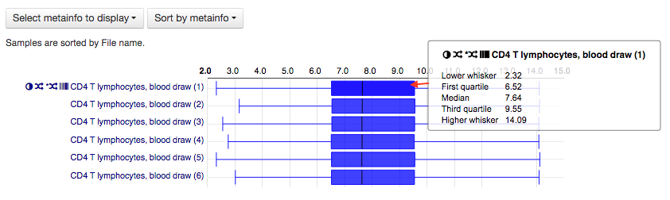

- Density plots of signal intensities show density distributions for
  microarrays. In a typical experiment, we expect these distributions to have
  similar shapes and ranges. The differences in density distributions can
  indicate the quality related problems.

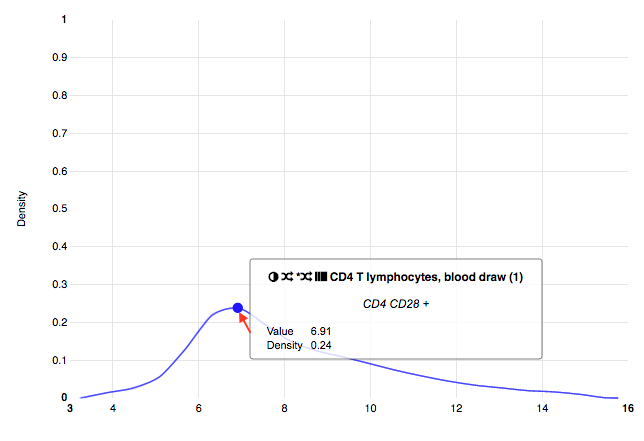

3. **Variance mean dependence** metric.

- "Standard deviation versus mean rank" plot is a density plot of the standard
  deviation of the intensities across arrays on the y-axis versus the rank of
  their mean on the x-axis. The red dots, connected by lines, show the running
  median of the standard deviation.

  After normalisation procedure we typically expect the red line to be almost
  horizontal. A hump on the right-hand side of the line may indicate a
  saturation of the intensities.

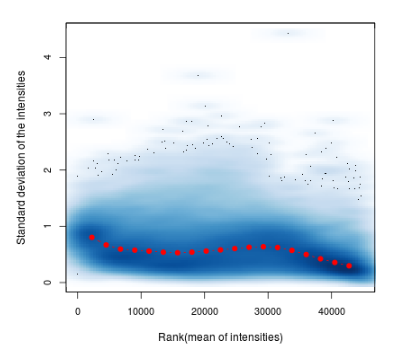

4. **Individual array quality**.

- MA Plots allow pairewise comparison of log-intensity of each array to a
  "pseudo"-array (which consists of the median across arrays) and
  identification of intensity-dependent biases. The Y axis of the plot
  contains the log-ratio intensity of one array to the median array, which is
  called "M" while the X axis contains the average log-intensity of both
  arrays - called "A". Typically, probe levels are not likely to differ a lot
  so we expect a MA plot centered on the Y=0 axis from low to high intensities.

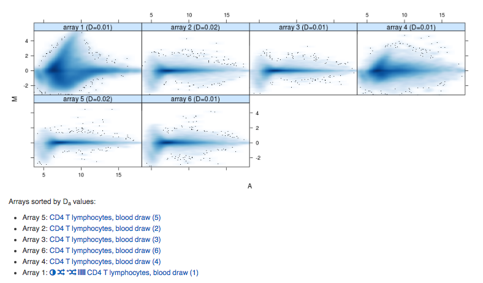

Additional Affymetrix-specific metrics are also computed for Affymetrix
microarrays.

Overall, if you click on "Outlier detection overview" the application will
detect apparent outlier arrays, suggest you remove them and re-normalise
your data or continue differential expression or dose response analyses.

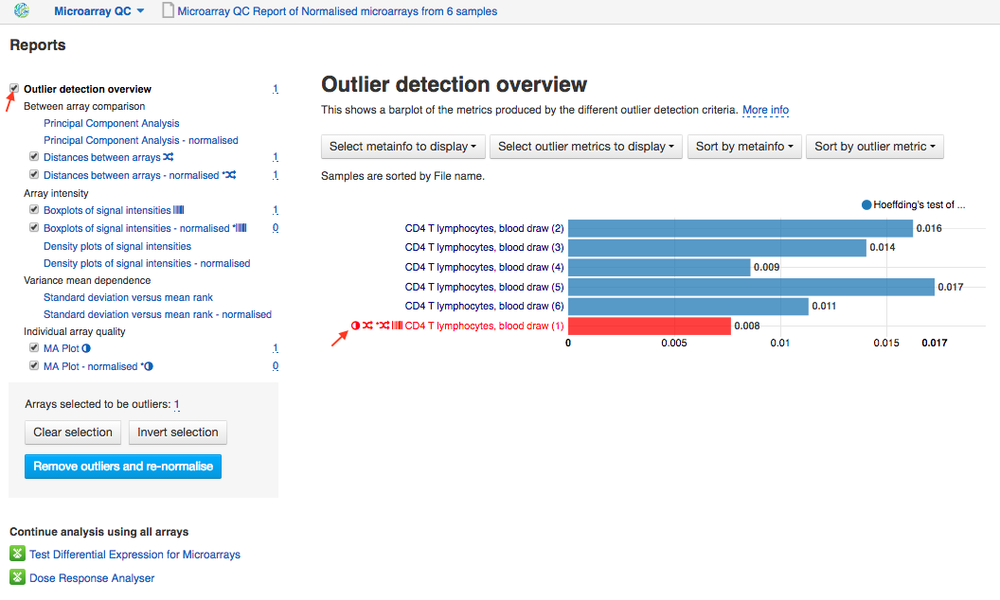

The application is based on the ArrayQualityMetrics_ R package.

.. _ArrayQualityMetrics: https://www.bioconductor.org/packages/release/bioc/html/arrayQualityMetrics.html

Differential gene expression for microarrays
++++++++++++++++++++++++++++++++++++++++++++

Expression microarrays can simultaneously measure the expression level of
thousands of genes between sample groups. For example, to understand the effect
of a drug we may ask which genes are up-regulated or down-regulated between
treatment and control groups, i.e. to perform differential expression analysis.

Once your microarray samples have been normalised, you can use them as inputs
for differential expression analysis.

Test differential expression for microarrays
********************************************

**Action**: to perform differential expression analysis between groups of
microarray samples.

The application requires normalized microarrays to calculate differential
expression statistics (such as log-expr, log-fold change, p-value and
FDR) and microarray annotation to map probe identifiers to the gene symbols.

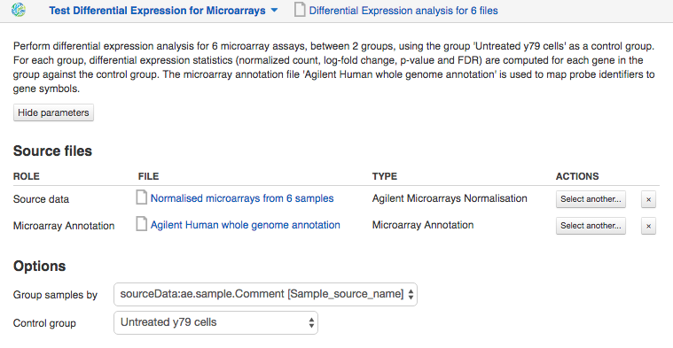

Let's look at the options:

1. **Group samples by** an experimental factor or condition that was specified
   in the metainfo of the samples. For example, if you have 6 samples -
   three of them are treated by compound X, and the rest three are untreated - the
   grouping factor will be the treatment procedure. If no grouping factor is
   available here, you should open your microarray assays in Metainfo Editor
   and specify a grouping factor in a new column.
2. **Control group** option. If you specify a control group, each group will be
   compared separately to that control group. If you do not specify a control
   group, each group will be compared against the average of all the other groups.

Currently, only single-factor comparisons are supported. More complex
experimental designs (confounding factors, batch effects, multi-factor analysis,
etc.) will be supported in later versions of the application.

When the analysis in finished, you can explore the results in **Expression
Navigator**.

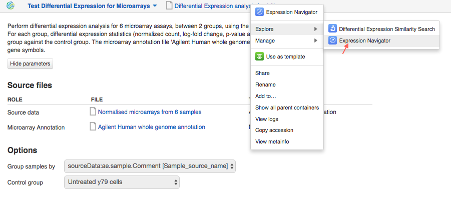

Expression navigator
********************

**Action**: to view and filter the results of differential gene expression
analysis.

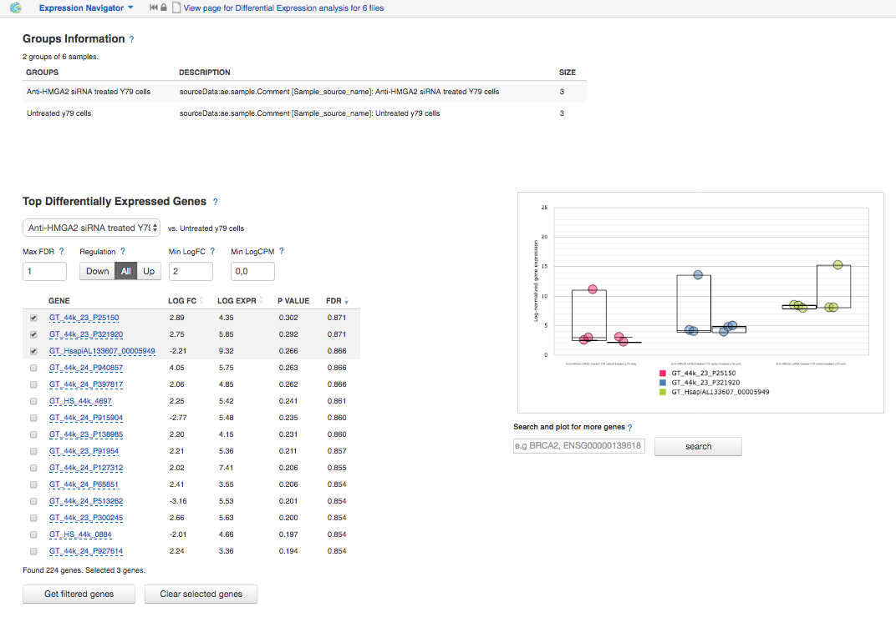

The Expression Navigator page contains 4 sections:

1. **Groups Information** section. It is a summary of the groups available for
   comparison. Size refers to the number of samples used to generate each
   group.

2. The **Top Differentially Expressed Genes** section allows you to choose which
   groups to compare and how to filter and sort identified differentially
   expressed (DE) genes.

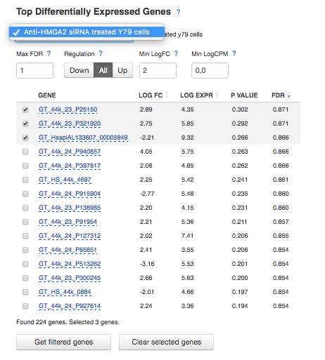

You can filter DE genes by maximum acceptable false discovery rate (FDR), up
or down regulation, minimum log fold change (LogFC), and minimum log counts
per million (LogCPM).

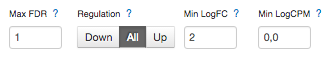

Let's look through these statistics:

- **log-fold change**: the fold-change in expression of a gene between two
  groups A and B is the average expression of the gene in group A divided by
  the average expression of the gene in group B. The log-fold change is
  obtained by taking the logarithm of the fold-change in base 2.

- **log-expression**: log-transformed and normalised measure of gene expression.

- **p-value**. The application also computes a p-value for each gene. A low
  p-value (typically, ≤ 0.05) is viewed as evidence that the null hypothesis
  can be rejected (i.e. the gene is differentially expressed). However, due to
  the fact that we perform multiple testing, the value that should be looked at
  to safely assess significance is the false discovery rate.

- **False discovery rate**. The FDR is a corrected version of the p-value,
  which accounts for `multiple testing correction`_. Typically, an FDR <
  0.05 is good evidence that the gene is differentially expressed.

.. _multiple testing correction: https://en.wikipedia.org/wiki/Multiple_comparisons_problem#Correction

Moreover, you can sort the DE genes by these statistics, clicking the small
arrows near the name of the metric in the table.

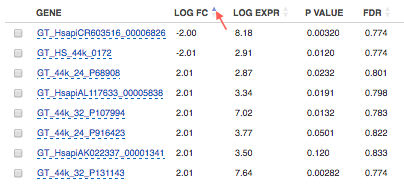

The buttons at the bottom of the section allow you to refresh the list based on
your filtering criteria or clear your selection.

3. The top right section contains a **boxplot of expression levels**. Each
   colour corresponds to a gene. Each boxplot corresponds to the distribution
   of a gene's expression levels in a group, and coloured circles represent the
   expression value of a specific gene in a specific sample.

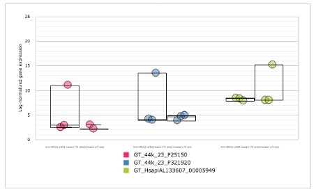

4. The bottom-right section contains a **search box** that allows you to look
   for specific genes of interest. You can look up genes by gene symbol, with
   autocomplete. You can search for any gene (not only those that are visible
   with the current filters).

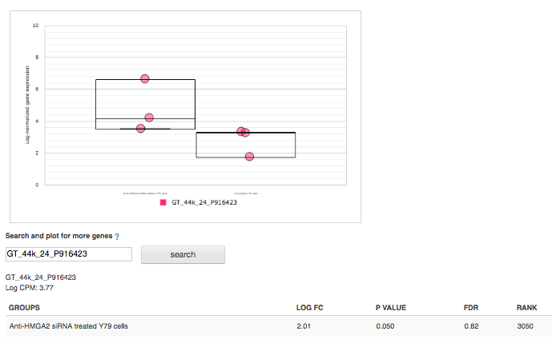

Compound dose response analysis
+++++++++++++++++++++++++++++++

.. TODO Add more info about dose response analysis

Dose response analyser
**********************

**Action**: to identify differentially expressed (DE) genes, fit various dose
response models (linear, quadratic and Emax), find the optimal model and
compute benchmark dose and dose response for each gene for this model.

This application takes as input normalised microarray data and performs dose
response analysis. It requires a microarray annotation file to map probe
identifiers to gene symbols (you can upload your own or use a publicly
available one). It also requires a pathway annotation file to perform pathway
enrichment analysis. Pathway files from Wikipathways are pre-loaded in the
system.

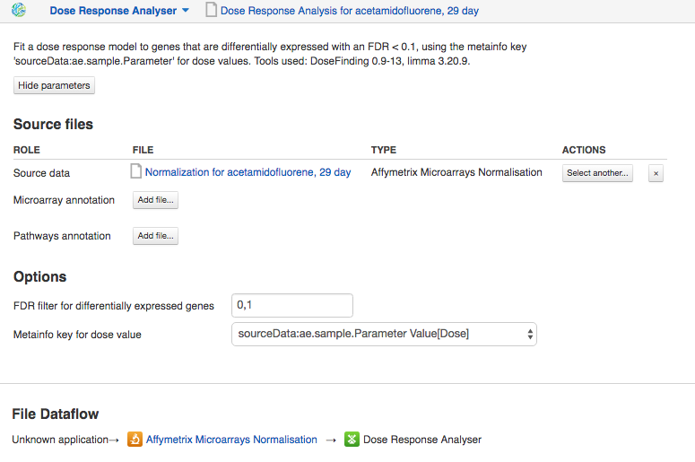

The first step of the analysis is to identify genes that are significantly
differentially expressed across doses. Once these are detected, multiple dose
response models are fitted to each significant genes and statistics are
recorded about the fits.

The following options can be configured in the application:

1. The **FDR filter for differentially expressed genes** specifies the false
   discovery rate above which genes should be discarded from the analysis
   (default: FDR < 0.1)
2. **Metainfo key for dose value**. This specifies the metainfo key storing the
   dose corresponding to each sample, as a numeric value. If no such attribute
   is present in your data, you need to open your microarray assays in the
   Metainfo Editor and add it there.

The application is based on the `limma`_ R package. The benchmark dose is estimated
based on the method described in the `Benchmark Dose Software (BMDS) user manual`_.

.. _limma: https://www.bioconductor.org/packages/3.3/bioc/html/limma.html
.. _Benchmark Dose Software (BMDS) user manual: https://www.epa.gov/bmds/benchmark-dose-software-bmds-user-manual

Dose response analysis viewer
*****************************

**Action**: to display dose response curves and benchmark doses for
differentially expressed (DE) genes and enriched pathways. Note that if no
gene passed the FDR threshold specified in the dose response analysis
application, the application will report the 1,000 genes with the smallest
unadjusted p-values.

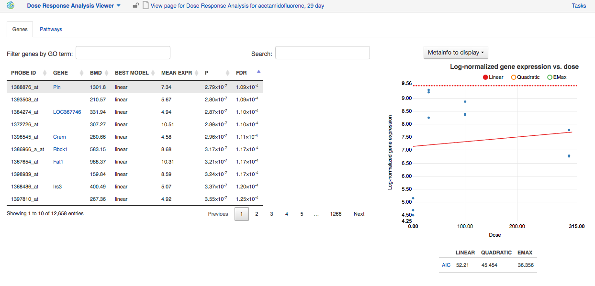

Various regression models (linear, quadratic and Emax) are fitted for each
identified DE gene to describe its expression profile as a function of the
dose. These results are presented in an interactive table.

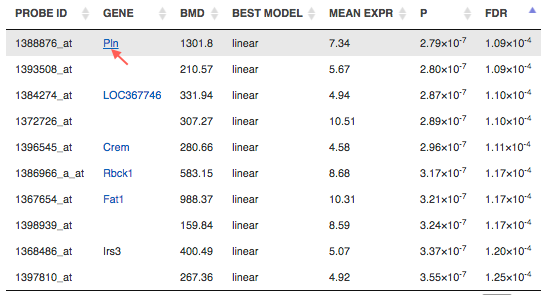

The table includes information about:

- *PROBE ID* - chip-specific identifier of the microarray probe;
- *GENE* - the gene symbol corresponding to that probe (according to the
  microarray annotation file). Clicking on the gene name will show you a list
  of associated gene ontology (GO) terms;

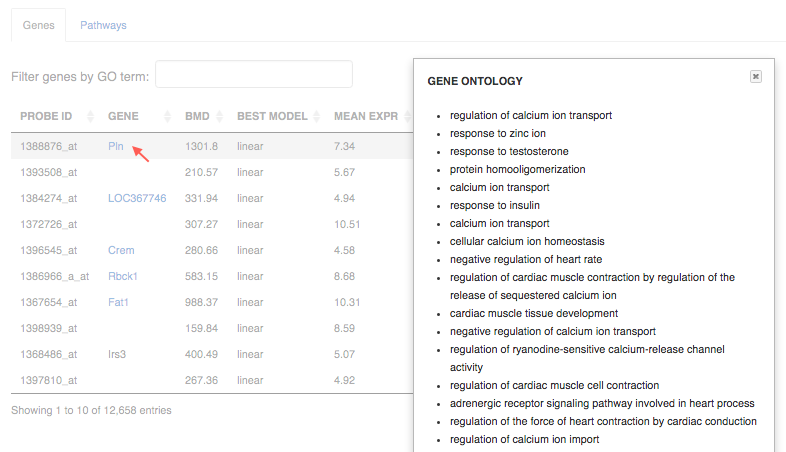

- *BMD* - the benchmark dose, corresponding to the dose above which the
  corresponding gene shows a significant change in expression, according to the
  best-fitting of the 3 models used. It is calculated using the following
  formula:

  Let m(d) be the expected gene expression at dose d. The BMD then satisfies
  the following equation: | m(BMD)-m(0) | = 1.349*σ. In this formula, σ is the
  standard deviation of the response at dose 0, which we approximate by the
  sample standard deviation of the model residuals.

- *BEST MODEL* - the model with the optimal Akaike Information Criterion (AIC)
  among the 3 models that were fitted for the gene ; the AIC rewards models
  with small residuals and penalizes models with many coefficients, to avoid
  overfitting;
- *MEAN EXPR* - average expression of the gene across all doses;
- *T* - the moderated t-statistic computed by limma to test for differential
  expression of the gene;
- *P* - unadjusted p-value testing for differential expression of the gene
  across doses;
- *FDR* - false discovery rate (p-value, adjusted for multiple testing);
- *B* - B statistic computed by limma to test for differential expression of
  the gene. Mathematically, this can be interpreted as the log-odds that the
  gene is differentially expressed.

Here are examples of dose response curves as they are displayed in the
application:

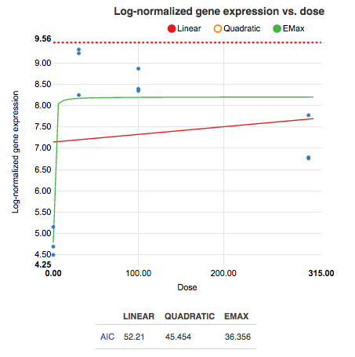

In the "Pathways" tab, you can see a list of significantly enriched pathways,
based on the detected differentially expressed genes and the pathway annotation
file supplied to the analysis application.

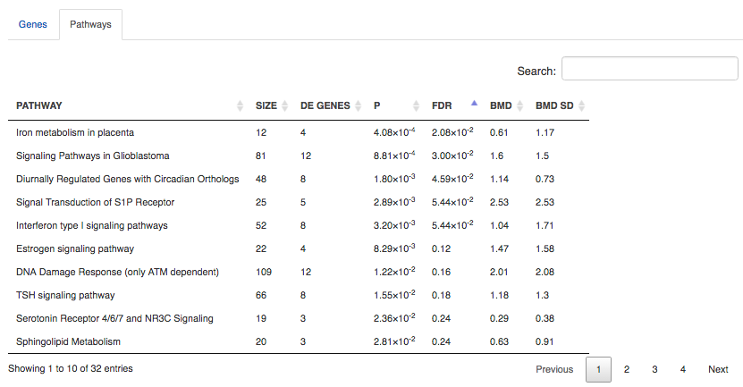

The table includes:

- *PATHWAY* - pathway name, e.g. "Iron metabolism in placenta";
- *SIZE* - pathway size, i.e. how many genes are involved in the given pathway;
- *DE GENES* - how many pathway genes are found to be differentially expressed
  in our data. Clicking on the specific pathway takes you to the "Genes" tab
  where you can get expression profiles and regression curves for the DE genes.
- *P* - p-value;
- *FDR* - false discovey rate value;
- *BMD* - the pathway BMD is computed as the average of the BMDs of the
  significant genes involved in this pathway, computed with the model yielding
  the best AIC;
- *BMD SD* - BMD standard deviation.