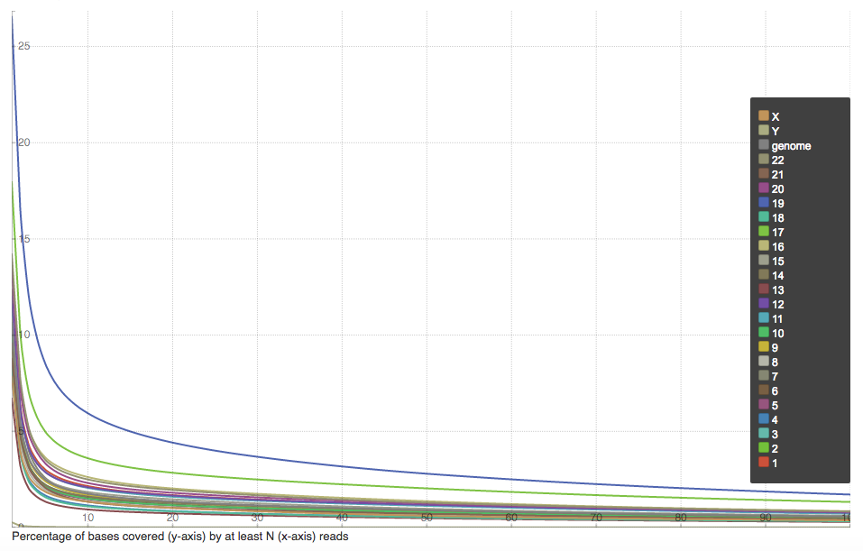
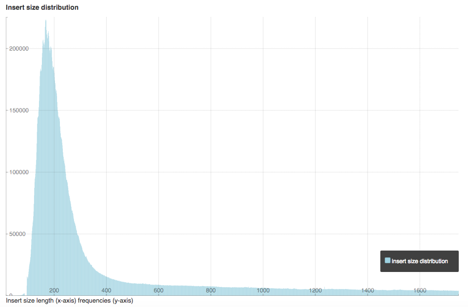
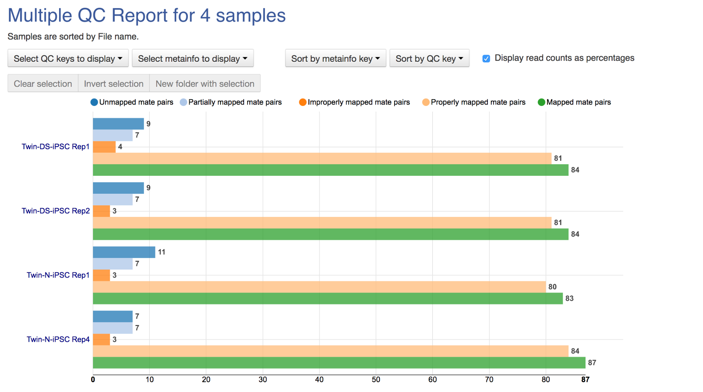
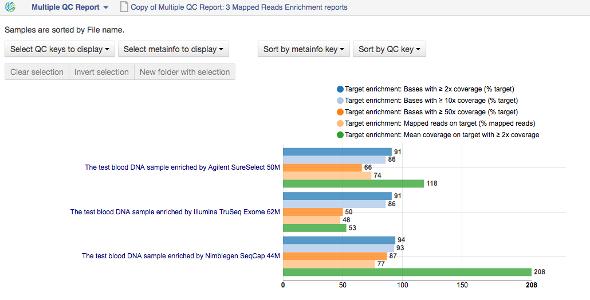

Mapped reads quality control and preprocessing
~~~~~~~~~~~~~~~~~~~~~~~~~~~~~~~~~~~~~~~~~~~~~~

If you analysing mapped reads, we recommend you check if there are any
biases taken place during the mapping process (e.g. low coverage, experimental
artifacts, etc.) and do preprocessing of mapped reads.

Mapped reads QC report
++++++++++++++++++++++

**Action**: to perform quality control (QC) of mapped reads.

We follow a similar procedure to the one used to generate FastQC reports.
After selecting the mapped reads we wish to check the quality of, we can
run the `Mapped Reads QC`_ public data flow.

.. _Mapped Reads QC: https://platform.genestack.org/endpoint/application/run/genestack/dataflowrunner?a=GSF3778257&action=viewFile

An individual Mapped Reads QC report contains some technical information about
source data, tools used and data flow.

Also, it includes a range of **Mapping statistics**. For **single reads**,
you will calculate these QC metrics:

#. *Total number of reads*: how many reads used to map to the reference genome;
#. *Unmapped reads*: total number of reads which failed to map to the reference
   genome;
#. *Mapped reads*: total number of reads aligned to the reference genome;
#. *Uniquely mapped reads*: total number of reads aligned exactly 1 time to the
   reference genome;
#. *Multi-hit mapped reads*: total number of reads aligned >1 times to the
   reference genome.

In case you analyse **paired-end reads** data, you will see the following
statistics:

#. *Total number of mate pairs*: how many paired-end reads used to map to the reference genome;
#. *Mapped mate pairs*: total number of paired reads where both mates were
   mapped;
#. *Partially mapped mate pairs*: total number of paired reads where only one
   mate in the pair was mapped;
#. *Unmapped mate pairs*: total number of paired reads which failed to map to the
   reference genome;
#. *Improperly mapped mate pairs*: total number of paired reads where one of the
   mates was mapped with an unexpected orientation;
#. *Properly mapped mate pairs*: total number of paired reads where both mates
   were mapped with the expected orientation.

**Coverage by chromosome** plot is reported for both read types.

This plot shows the percentage of reads covered by at least x reads. To clear
it up, let's just imagine that we have a plot which shows coverage only for one
chromosome and therefore it shows 1 line. If on the x-axis we have e.g. 100
reads, on y-axis — 10% (percentage of chromosome bases covered by 100 reads).
So, it looks like we have 100-reads coverage for 10% of chromosome.

The amount of coverage you are expecting varies with the experimental
techniques you are using. Normally you want similar coverage patterns across
all chromosomes, but this may not be the case if e.g. you are dealing with
advanced stage cancer.

.. TODO: What does it look like when data is of poor quality ( + what can we do about it)

**Insert Size statistics** will be calculated for paired-end reads only.

.. note:: **What is the difference between fragment size, insert size and mate
          inner distance?**

          Mate inner distance is the length between the two sequence reads.
          Insert size is normally the distance between paired-end adaptors
          (paired-end reads + mate inner distance). Fragment size is the
          insert plus both adaptors.

.. image:: images/insert.jpg
   :scale: 50 %
   :align: center

Insert size statistics are useful to validate library construction and include:

#. *Median insert size* - a middle of a sorted list of insert sizes;
#. *Median absolute deviation* is calculated by taking the median of the absolute
   deviations from the median insert size;
#. *Mean insert size (trimmed)* - an average of the insert sizes;
#. *Standard deviation of insert size* measures the variation in insert sizes
   from the mean insert size.

**Insert size distribution** graph is displayed for paired-end reads:

This graph shows the  distribution of insert sizes.

Of course, the expected proportions of these metrics vary depending on the type
of library preparation used, resulting from technical differences between
pair-end libraries and mate-pair libraries.

Mapped Reads QC Report application is based on the `BEDtools`_ and the Picard_
tools.

.. _BEDtools: http://bedtools.readthedocs.io/en/latest/
.. _Picard: http://broadinstitute.github.io/picard/

.. TODO What should "Insert size distribution" plot look like normally?
.. TODO What does it look like when data is of poor quality (+ what can we do about it)

You can analyse the output for several Mapped Reads QC reports at once using
our Multiple QC Report application.

This is helpful, because it allows you to see in comparison, how many reads in
your dataset are unmapped, partially or improperly mapped.

Targeted sequencing QC report
+++++++++++++++++++++++++++++

This application is good to use when analysing Targeted Sequencing data, e.g.
Whole Exome Sequencing assays.

**Action**: to assess whether the target capture has been successful, i.e. if
most of the reads actually fell on the target, if the targeted bases reached
sufficient coverage, etc.

**Options**:

1. **Compute enrichment statistics based on** option. The application allows
   you to compute enrichment statistics for reads mapped only on exome, only
   on target file, or both exome and target file. (default: Exome)

The following enrichment statistics are computed:

- Number and proportion of mapped reads on target;
- Mean coverage on target with at least 2X coverage;
- Target bases with at least 2X, 10X, 20X, 30X, 40X, and 50X coverage.

You can generate these reports directly by choosing Mapped Reads datasets, right
clicking on them and selecting the appropriate application (in "Explore" section) or
using the **Targeted Sequencing Quality Control** public data flow.

You can analyse the output for multiple reports at once using the **Multiple QC Report** application.

This application is based on the `BEDtools`_, Picard_ and `SAMtools`_.

.. _BEDtools: http://bedtools.readthedocs.io/en/latest/
.. _Picard: http://broadinstitute.github.io/picard/
.. _SAMtools: http://samtools.sourceforge.net/

Apart from quality control applications, Genestack suggests you a bunch of
applications to preprocess mapped reads.

Mark duplicated mapped reads
++++++++++++++++++++++++++++

Duplicated reads are reads of identical sequence composition and length,
mapped to the same genomic position. Marking duplicated reads can help speed
up processing for specific applications, e.g. variant calling step, where
processing additional identical reads would lead to early PCR amplification
effects (jackpotting) contributing noise to the signal. You can read more about
duplicated mapped reads in this excellent `SeqAnswers thread`_.

.. _SeqAnswers thread: http://seqanswers.com/forums/showthread.php?t=6854

**Action**: to go through all reads in a mapped reads file, marking as
"duplicates" for paired or single reads where the orientation and the 5’
mapping coordinate are the same.

3’ coordinates are not considered due to two reasons:

#. The quality of bases generated by sequencers tends to drop down toward the
   3’ end of a read. Thus its alignment is less reliable compared to the 5’
   bases.
#. If reads are trimmed at 3’ low-quality bases before alignment, they will
   have different read lengths resulting in different 3’ mapping coordinates.

In such cases, when the distance between two mapped mates differs from the
internally estimated fragment length, including mates mapping to different
chromosomes, the application will not identify or use them but will not fail
due to inability to find the mate pair for the reads.

Marking duplicated reads can help speed up processing for specific applications,
e.g. **Variant Calling** application.

This tool is based on the **MarkDuplicates**, part of the `Picard`_ tool.

.. _Picard: http://broadinstitute.github.io/picard/

Remove duplicated mapped reads
++++++++++++++++++++++++++++++

The point of removing duplicated mapped reads is to try to limit the influence
of early PCR selection (jackpotting). Whether or not you should remove
duplicate mapped reads depends on the type of data you have. If you are
dealing with whole-genome sequencing data where expected coverage is low and
sequences are expected to be present in similar amounts, removing duplicated
reads will reduce processing time and have little deleterious effect on
analysis. If however you are processing RNA-seq data, where the fold-variation
in expression can be up to 10^7, reads are relatively short, and your main
point of interest is the variation in expression levels, this probably is not
the tool for you. You can read more about duplicated mapped reads in this excellent `SeqAnswers
thread`_.

.. _SeqAnswers thread: http://seqanswers.com/forums/showthread.php?t=6854

**Action**: to go through all reads in a Mapped Reads file, marking as
"duplicates" paired or single reads where the orientation and the 5’ mapping
coordinate are the same and discarding all except the "best" copy.

3’ coordinates are not considered due to two reasons:

#. The quality of bases generated by sequencers tends to drop down toward the
   3’ end of a read. Thus its alignment is less reliable compared to the 5’
   bases.
#. If reads are trimmed at 3’ low-quality bases before alignment, they will
   have different read lengths resulting in different 3’ mapping coordinates.

The application also takes into account interchromosomal read pairs. In such
cases, when the distance between two mapped mates differs from the internally
estimated fragment length, including mates mapping to different chromosomes,
the application cannot identify them but will not fail due to inability to
find the mate pair for the reads.

This application is based on the **MarkDuplicates**, part of the Picard_ tools.

.. _Picard: http://broadinstitute.github.io/picard/

Subsample reads
+++++++++++++++

You can use this application, for example, if you want to take a look at what your final
experimental results will look like, but do not want to spend time processing
all your data right away.

**Action**: to create a random subset of mapped reads.

**Command line options**

1. The **Subsampling ratio (percentage)** option is used to set a fraction of
   mapped reads you would like to extract (default: 50).
2. The **Random seed** option will let you produce different subsets with the same
   number of mapped reads. (default: 0)

Using the same random seed and the same subsampling ratio will result in
identical subsets.

This application is based on the `SAMtools`_.

.. _SAMtools: http://samtools.sourceforge.net/

Merge mapped reads
++++++++++++++++++

The application is useful when you have multiple replicates of the same
experiment and want to combine them before producing your final result.

**Action**: to merge multiple Mapped Reads files, producing one single
output Mapped Reads file.

The application is based on the `SAMtools`_.

.. _SAMtools: http://samtools.sourceforge.net/

Convert to unaligned reads
++++++++++++++++++++++++++

The application will be very useful when you are interested in fraction of reads
that exactly will map to genome or when you would like to remap the reads with
other aligner.

**Action**: to convert a Mapped reads file to raw reads.

This application is based on the Picard_ toolkit.

.. _Picard: http://broadinstitute.github.io/picard/
