Methylation arrays
~~~~~~~~~~~~~~~~~~

DNA methylation arrays are a widely-used tool to assess genome-wide DNA methylation.

Microarrays normalisation
+++++++++++++++++++++++++

**Action**: to perform normalisation of methylation microarray assays.

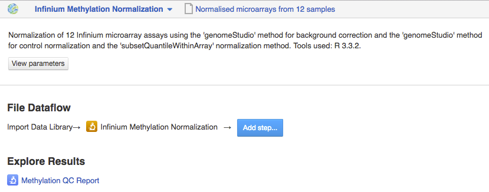

For methylation microarrays, normalisation can be performed with either "subsetQuantileWithinArray"
or "quantile" method, and in addition, "genomeStudio" background correction may be applied.

Further, the quality of normalised microarrays can be checked using the **Microarray QC Report**
application to detect and remove potential outliers. Normalised microarrays that are of good quality
may then be used in **Differential methylation analysis**.

The application is based on the minfi_ Bioconductor package.

.. _minfi: https://academic.oup.com/bioinformatics/article/30/10/1363/267584/Minfi-a-flexible-and-comprehensive-Bioconductor

Methylation array QC
++++++++++++++++++++

Quality control check of microarray data is a crucial step in microarray analysis pipeline,
as it allows us to detect and exclude low-quality assays from the further analysis.

A single array with both red and green channels is used to estimate methylation for each
individual sample. Then, for each CpG locus, both methylated and unmethylated signal
intensities are measured.

Currently, there are two primary methods used to estimate DNA methylation level:
*Beta-value* and *M-value*. The Beta-value is the ratio of the methylated probe intensity against the
overall intensity (sum of the methylated and the unmethylated probe intensities) plus a constant (Du P. et al.,
2010):

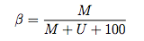

The M-value is the log2 ratio of the intensities of the methylated probe versus the unmethylated probe
(Du P. et al., 2010):

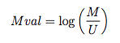

**Action**: to assess quality of methylation microarray assays.

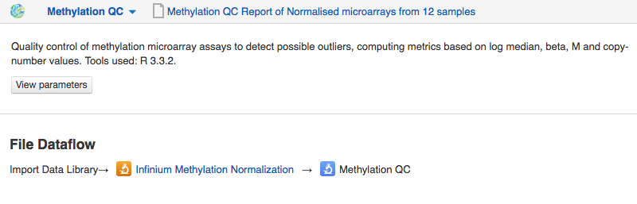

The Methylation array QC application allows the user to export files containing methylation and
unmethylation values, as well as the Beta-values, the M-values and Log median intensity values.

Additionally, you can download and explore "Copy number values" file with
the sum of the methylated and unmethylated signals.

Methylation array QC application provides various types of **quality control plots**.
Let's explore QC-report for the Infinium 450K microarrays:

**1) Log median intensity plot**

The scatterplot represents the log median of the signal intensities in both methylated and unmethylated channels
for each array. In general, samples of good quality cluster together,
while "bad" samples tend to separate, typically with lower median intensities.

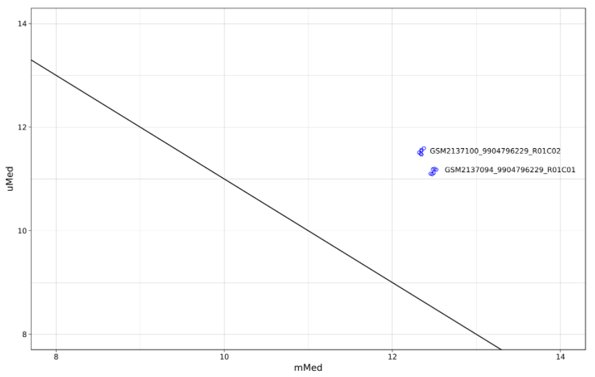

**2) Beta-values of the assays are represented by two plots:**

- *Beta density* plot represents the Beta-value densities of samples

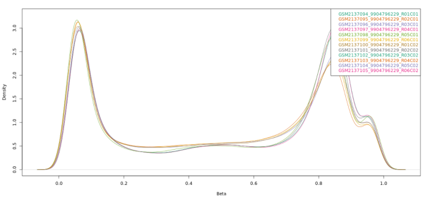

- *Beta density bean* plot also shows methylation the Beta-values.

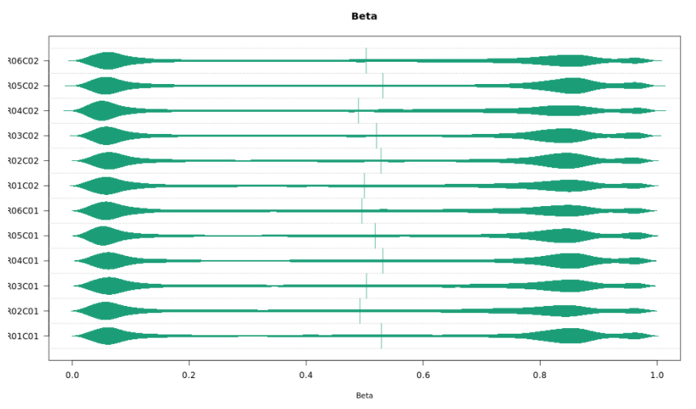

**3) Control probes plots:**

The Infinium 450K arrays have several internal control probes helping to track
the quality on different stages of assay preparation (based on Illumina's `Infinium® HD Assay Methylation Protocol Guide`_):

.. _Infinium® HD Assay Methylation Protocol Guide: https://support.illumina.com/downloads/infinium_hd_methylation_assay_protocol_guide_(15019519_b).html

**Sample-independent controls**

Several sample-independent controls allow the monitoring different steps of
the of microarray assay preparation and include:

- *Staining control strip*, which estimate the efficiency of the staining step
  for both the red and green channels. They are independent of the hybridization
  and extension steps.

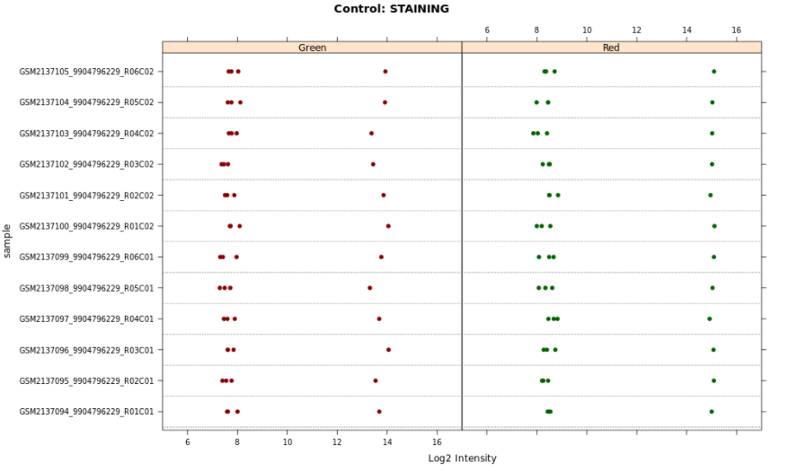

- *Extension control strip*, which tests efficiency of single-base extension
  of the probes that incorporates labeled nucleotides. Both red (A and T,
  labeled with dinitrophenyl) and green (C and G labeled with biotin) channels
  are considered.

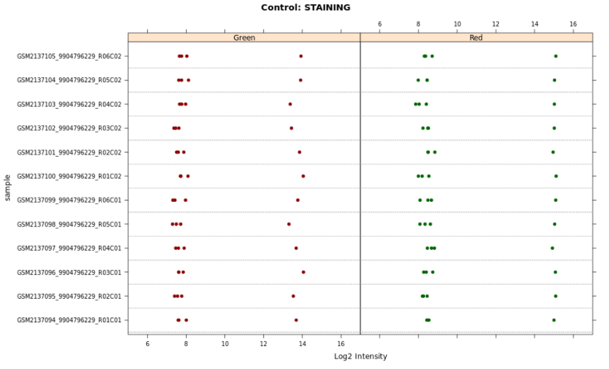

- *Hybridization control strip*, which estimates entire performance of the
  microarray assay.

This kind of controls uses synthetic targets that are complementary to the array probe sequence.
Extension of the target provides signal.
The higher concentration of the target is used, the higher signal intensity will be registered.

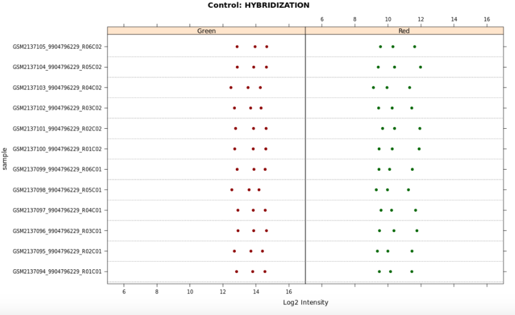

- *Target removal control strip*, which tests whether all targets are removed
  after extension step. During extension reaction the sequence on the array is
  used as template to extend the control oligos. The probe sequences, however,
  are not extendable. The signal is expected to be low in comparison to the
  signal of hybridization control.

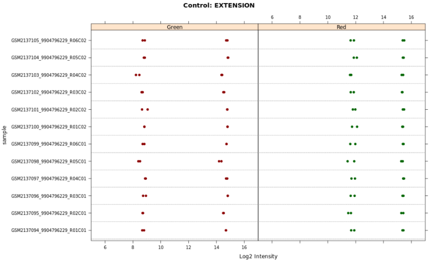

**Sample-dependent controls**

A number of sample-dependent controls are provided to assess quality across samples.

- Bisulfite-conversion controls

To estimate methylation of DNA, the 450k assay probe preparation involves
bisulfite conversion of DNA when all unmethylated cytosines are converted
to uracils, while methylated cytosines are remains as they are.

*Bisulphite conversion I control strip*

This control uses Infinium I assay chemistry. There are two types of probes in this control:
bisulphite-converted and bisulphite-unconverted ones.
If the bisulphite conversion was successful, the converted
probes matches the converted DNA, and are extended. If the
sample has some unconverted DNA, the unconverted probes get extended.

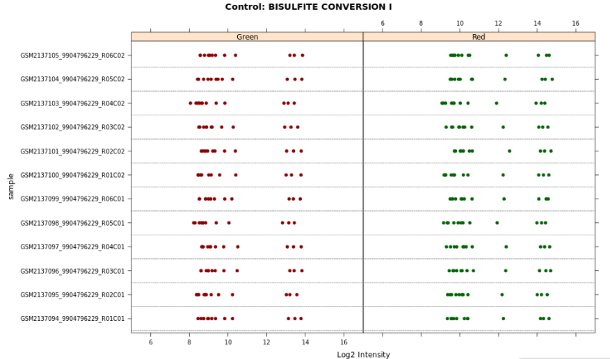

*Bisulphite conversion II control strip*

This control uses the Infinium I chemistry technology. If the bisulphite conversion
went well, the adenin base is added, generating signal in the red channel.
If there is some unconverted DNA, the guanine base is incorporated, resulting to
signal in the green channel.

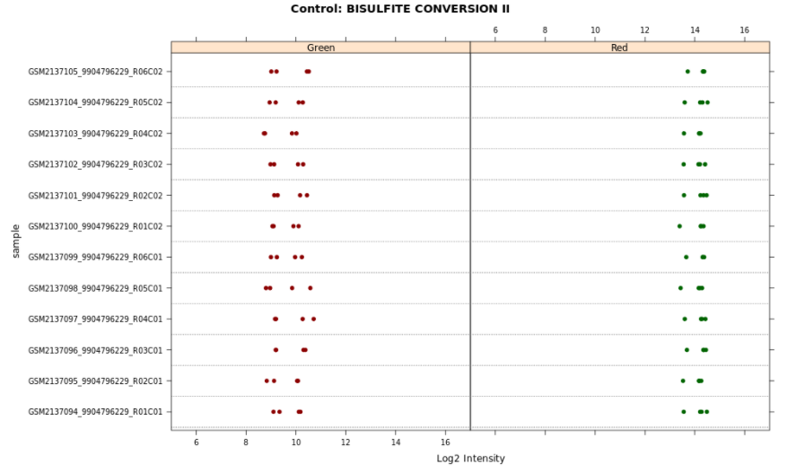

- Specificity controls, which monitor potential non-specific primer extension.

*Specificity I control strip* is used to assess allele-specific extention for the Infinium I chemistry assays.

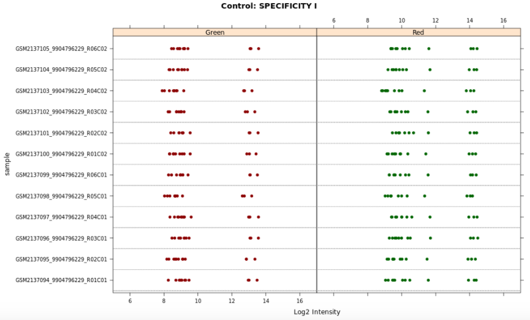

*Specificity II control strip* allows to estimate specificity of extension for Infinium II assay
and test whether there is any nonspecific methylation signal detected over unmethylated background.

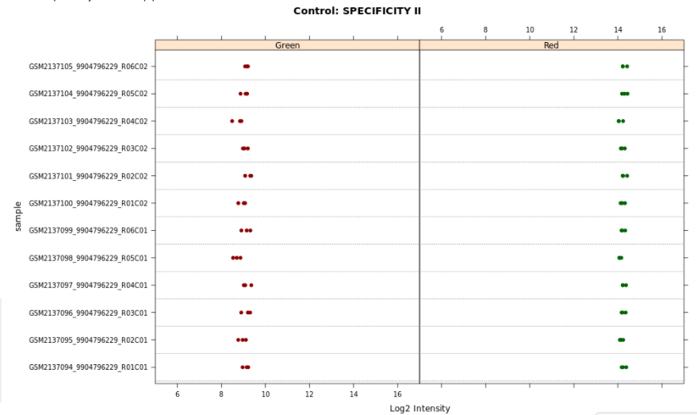

All the QC-plots shown on the application page may be downloaded in PDF format (see *Minfi PDF Report*).

Finally, based on the QC-results you can exclude particular samples as outliers,
remove them, and re-normalize the rest of the assays together. To do so, click *Sample list* and
select those samples that pass QC-check, then click **Remove outliers and re-normalise button**.

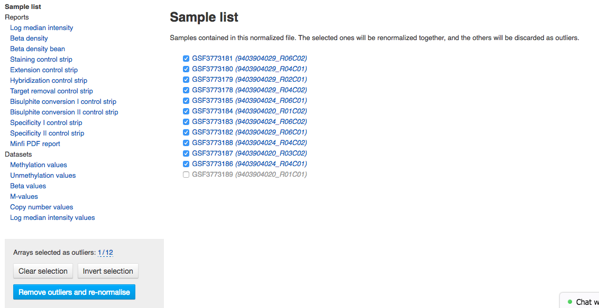

Then, if you are happy with quality of re-normalized arrays, you can proceed to the following
step - **Differential Methylation Analysis**.

The "Methylation array QC" application is based on the minfi_ and the shinyMethyl_ Bioconductor packages.

.. _minfi: https://academic.oup.com/bioinformatics/article/30/10/1363/267584/Minfi-a-flexible-and-comprehensive-Bioconductor
.. _shinyMethyl: https://f1000research.com/articles/3-175/v2

.. Differential methylation analysis (coming soon)
.. ^^^^^^^^^^^^^^^^^^^^^^^^^^^^^^^^^^^^^^^^^^^^^^^
.. Expression navigator for methylation arrays (coming soon)
.. ^^^^^^^^^^^^^^^^^^^^^^^^^^^^^^^^^^^^^^^^^^^^^^^^^^^^^^^^^
