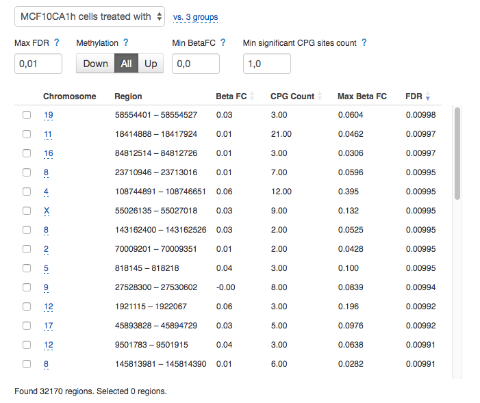

Methylation arrays
~~~~~~~~~~~~~~~~~~

DNA methylation arrays are a widely-used tool to assess genome-wide DNA methylation.

Microarrays normalisation
+++++++++++++++++++++++++

**Action**: to perform normalisation of methylation microarray assays.

.. image:: images/microarray-normalization.png

For methylation microarrays, normalisation can be performed with either "subsetQuantileWithinArray"
or "quantile" method, and in addition, "genomeStudio" background correction may be applied.

Further, the quality of normalised microarrays can be checked using the **Microarray QC Report**
application to detect and remove potential outliers. Normalised microarrays that are of good quality
may then be used in **Differential methylation analysis** and **Differential regions methylation analysis**.

The application is based on the minfi_ Bioconductor package.

.. _minfi: https://academic.oup.com/bioinformatics/article/30/10/1363/267584/Minfi-a-flexible-and-comprehensive-Bioconductor

Methylation array QC
++++++++++++++++++++

Quality assessment of microarray data is a crucial step in microarray analysis pipeline,
as it allows us to detect and exclude low-quality assays from the further analysis.

A single array with both red and green channels is used to estimate methylation for each
individual sample. Then, for each CpG locus, both methylated and unmethylated signal
intensities are measured.

Currently, there are two main methods used to estimate DNA methylation level:
*Beta-value* and *M-value*. The Beta-value is the ratio of the methylated probe intensity against the
overall intensity (sum of the methylated and the unmethylated probe intensities) plus a constant (Du P. et al.,
2010). Therefore, Beta-value can reflect roughly the percentage of methylated sites.

.. image:: images/qc-betaval.png

The M-value is the log2 ratio of the intensities of the methylated probe versus the unmethylated probe
(Du P. et al., 2010):

.. image:: images/qc-mval.png

**Action**: to assess quality of methylation microarray assays.

.. image:: images/methylation-qc-page.png

The Methylation array QC application allows the user to export files containing methylation and
unmethylation values, as well as the Beta-values, the M-values and Log median intensity values.

Additionally, you can download and explore "Copy number values" file with
the sum of the methylated and unmethylated signals.

Methylation array QC application provides various types of **quality control plots**.
Let's explore QC-report for the Infinium 450K microarrays:

**1) Log median intensity plot**

The scatterplot represents the log median of the signal intensities in both methylated and unmethylated channels
for each array. In general, samples of good quality cluster together,
while "bad" samples tend to separate, typically with lower median intensities.

.. image:: images/log-median-intensities.png

**2) Beta-values of the assays are represented by two plots:**

- *Beta density* plot represents the Beta-value densities of samples

- *Beta density bean* plot also shows methylation the Beta-values.

.. image:: images/qc-beta-density-bean.png

**3) Control probes plots:**

The Infinium 450K arrays have several internal control probes helping to track
the quality on different stages of assay preparation (based on Illumina's `Infinium® HD Assay Methylation Protocol Guide`_):

.. _Infinium® HD Assay Methylation Protocol Guide: https://support.illumina.com/downloads/infinium_hd_methylation_assay_protocol_guide_(15019519_b).html

**Sample-independent controls**

Several sample-independent controls allow the monitoring different steps of
the of microarray assay preparation and include:

- *Staining control strip*, which estimate the efficiency of the staining step
  for both the red and green channels. They are independent of the hybridization
  and extension steps.

.. image:: images/qc-staining.png

- *Extension control strip*, which tests efficiency of single-base extension
  of the probes that incorporates labeled nucleotides. Both red (A and T,
  labeled with dinitrophenyl) and green (C and G labeled with biotin) channels
  are considered.

.. image:: images/qc-extension.png

- *Hybridization control strip*, which estimates entire performance of the
  microarray assay.

This kind of controls uses synthetic targets that are complementary to the array probe sequence.
Extension of the target provides signal.
The higher concentration of the target is used, the higher signal intensity will be registered.

.. image:: images/qc-hybridisation.png

- *Target removal control strip*, which tests whether all targets are removed
  after extension step. During extension reaction the sequence on the array is
  used as template to extend the control oligos. The probe sequences, however,
  are not extendable. The signal is expected to be low in comparison to the
  signal of hybridization control.

**Sample-dependent controls**

A number of sample-dependent controls are provided to assess quality across samples.

- Bisulfite-conversion controls

To estimate methylation of DNA, the 450k assay probe preparation involves
bisulfite conversion of DNA when all unmethylated cytosines are converted
to uracils, while methylated cytosines are remains as they are.

*Bisulphite conversion I control strip*

This control uses Infinium I assay chemistry. There are two types of probes in this control:
bisulphite-converted and bisulphite-unconverted ones.
If the bisulphite conversion was successful, the converted
probes matches the converted DNA, and are extended. If the
sample has some unconverted DNA, the unconverted probes get extended.

.. image:: images/qc-bis-conversion-I.png

*Bisulphite conversion II control strip*

This control uses the Infinium I chemistry technology. If the bisulphite conversion
went well, the adenin base is added, generating signal in the red channel.
If there is some unconverted DNA, the guanine base is incorporated, resulting to
signal in the green channel.

- Specificity controls, which monitor potential non-specific primer extension.

*Specificity I control strip* is used to assess allele-specific extention for the Infinium I chemistry assays.

.. image:: images/qc-specificity-I.png

*Specificity II control strip* allows to estimate specificity of extension for Infinium II assay
and test whether there is any nonspecific methylation signal detected over unmethylated background.

.. image:: images/qc-specificity-II.png

All the QC-plots shown on the application page may be downloaded in PDF format (see *Minfi PDF Report*).

Finally, based on the QC-results you can exclude particular samples as outliers,
remove them, and re-normalize the rest of the assays together. To do so, click *Sample list* and
select those samples that pass QC-check, then click **Remove outliers and re-normalise button**.

Then, if you are happy with quality of re-normalized arrays, you can proceed to the following
step - **Differential Methylation Analysis**.

The "Methylation array QC" application is based on the minfi_ and the shinyMethyl_ Bioconductor packages.

.. _minfi: https://academic.oup.com/bioinformatics/article/30/10/1363/267584/Minfi-a-flexible-and-comprehensive-Bioconductor
.. _shinyMethyl: https://f1000research.com/articles/3-175/v2

Test Differential Methylation
+++++++++++++++++++++++++++++

.. Maybe rename the app as "Test differential methylation in CpG sites" or "Analysis of DMRs"?

**Action:** to detect differential methylation in single CpG sites
('a differentially methylated positions (DMP)') accross
groups of microarray assays from the normalized data. Currently, 450k and EPIC Illumina's Methylation arrays are supported.

The input data for this app is Infinium Methylation Normalization file obtained with
the "Infinium Methylation Normalization” application, and generates
Differential Expression Statistics file that you can further explore
with the Methylation Navigator for Sites. Differential methylation analysis application
supports custom Methylation Array Annotation that you can upload with Import app.

.. image:: images/test-diff-meth.png

The application has the following options:

1. **Group samples by** option allows you to group assays automatically,
i.e. when the application helps you to group your samples according to experimental
factor indicated in metainfo for the assays such as disease, tissue or treatment, etc.
(default: None)

2. **Control group** option allows to consider one of the created groups as a control one. In this  case
the app performs differential methylation analysis for each CpG site in the group against the control one.
(default: No control group)

.. image:: images/test-diff-meth-options.png

The application is based on the minfi_, limma_, and DMRcate_ packages.

Test Differential Regions Methylation
+++++++++++++++++++++++++++++++++++++

**Action:** to determine and analyse contiguous regions which are differentially
methylated across groups of assays from the normalized data. Currently, 450k and EPIC Illumina's
Methylation arrays are supported.

As an input the app takes "Infinium Methylation Normalization" file with normalised microarray assays and returns
Differential Expression Statistics file that you can further explore
with the Methylation Navigator.
Differential methylation analysis application supports custom methylation chip annotations
that you can upload with Import app.

.. image:: images/diff-regions-meth.png

The application has the following options:

1. **Group samples by** option allows to automatically group assays based on according to experimental
factor indicated in metainfo for the assays such as disease, tissue or treatment, etc.
(default: None)

2. **Control group** option allows to consider one of the created groups as a control one. In this  case
the app performs differential methylation analysis for each region in the group against the control one.
(default: No control group)

.. image:: images/diff-regions-meth-options.png

The Test Differential Regions Methylation application is based on the minfi_, limma_, and DMRcate_ packages.

.. _minfi: https://academic.oup.com/bioinformatics/article/30/10/1363/267584/Minfi-a-flexible-and-comprehensive-Bioconductor
.. _limma: https://www.bioconductor.org/packages/3.3/bioc/html/limma.html
.. _DMRcate: https://bioconductor.org/packages/release/bioc/html/DMRcate.html

Methylation Navigator for Sites
+++++++++++++++++++++++++++++++

**Action**: to view and filter the results of analysis of differential methylation positions (DMPs).

.. image::

The Methylation Navigator page contains four sections:

#. **Groups Information** section summarise the information on the created groups of samples to be tested

#. **Top Differentially Methylated Sites** table

The table lists all the detected sites or regions that are differentially methylated in the selected group
compared to either the average of the other groups or a control group (if it is set).

.. NEED TO FIX A REFERENCE NOTE ON THE APP PAGE [?]: we can also compare EACH individual
.. group to a set CONTROL one!

For each DMP (differentially methylated position) or DMR (differentially methylated region),
its Delta Beta, Average Beta, P-value, and FDR are shown.

Click probe ID to get more information about the probe:

.. More detailed description

.. image:: images/MN-sites-annotation.png

You can filter  by maximum acceptable false discovery rate (FDR),
up or down regulation, minimum log fold change (LogFC), and minimum log counts per million (LogCPM).

You can reduce the list of DMPs by filtering the data in the table based on the following criteria:

- *Max FDR* (maximum acceptable false discovery rate) — only shows sites with FDR below the set threshold;
- *Methylation All/ Down/ Up* — to show all sites or just those that are hypo- or hiper- methylated;
- *Min Delta Beta* — only shows sites with absolute value of Delta Beta of at least this threshold;
- *Min Average Beta* — only shows sites with average Beta value of at least this threshold.

Sort the list of probes by clicking the arrows next to the name of the statistical metrics in the table headers.

.. image:: images/MN-sites-sort.png

#. **A boxplot of methylation levels**

Each color corresponds to an individual probe you selected; each circle represents an assay belonging to
the tested group. Each boxplot represents the distribution of a methylation in a given group.
The y-axis shows Beta values, while the x-axis shows probe IDs.

.. image::

#. The bottom-right section contains **a search box** that allows you to explore the results for a particular
probe. Start typing a probe ID and select the probe of interest in the appeared drop-down
list of possible variants.

.. image:: images/MN-sites-search.png

You can further export either the complete table of differential methylation analysis for all the groups
or the list of values for the specific comparison in TSV format. See **Export Data (for all comparisons, as .tsv)**
and **Download filtered data for current comparison as .tsv** options, respectively.

Methylation Navigator for regions
+++++++++++++++++++++++++++++++++

**Action**: to view and filter the results of analysis of differential methylation positions (DMPs).

The Methylation Navigator page contains the following sections:

#. **Groups Information** section summarise the information on the created groups of samples to be tested

.. image:: images/MN-regions-group-info.png

#. **Top Differentially Methylated Regions** table

You can further reduce the list of identified DMRs and exclude those regions that do not meet set
filtering criteria. The following filters can be applied:

- *Max FDR* (maximum acceptable Stouffer-transformed false discovery rate) — only shows regions with Stouffer-transformed FDR values below the set threshold;
- *Methylation* (Down/All/Up) — shows all regions or only hypo- or hypomethylated ones;
- *Min BetaFC* (minimum fold changes (FC) represented in percent methylation change (beta) in DNA methylation levels between considered groups) — only shows regions having BetaFC below the threshold;
- *Min significant CPG sites count* — <?>.

.. image:: images/MN-regions-filters.png

You can also sort the list of identified DMRs by clicking the arrows next to the name of
the statistical metrics in the table.

.. image:: images/MN-regions-sort.png

.. I cannot see **A boxplot of methylation levels** and search here? Is it what supposed to be?

Finally, you can export not only the complete table of top differential methylated regions
for all the groups (**Export Data (for all comparisons, as .tsv)**) but also the list of
regions with associated statistics for the one comparison in TSV format
(**Download filtered data for current comparison as .tsv**).

