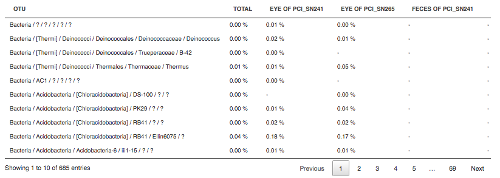
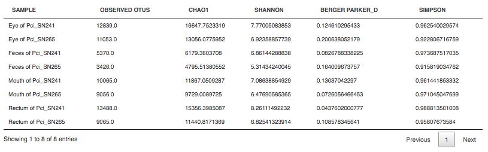

Microbiome data analysis
~~~~~~~~~~~~~~~~~~~~~~~~

Microbiome analysis with QIIME
++++++++++++++++++++++++++++++

.. TODO Update this part when the app will be updated

**Action**: to identify microbial species and their abundances in microbiome
samples. The application accepts microbial sequencing reads and outputs
Clinical or Research reports with abundance plots and microbiological diversity
metrics.

The microbiome analysis can use either Greengenes_ (for bacteria) or UNITE_
(for fungi) reference databases to estimate the taxonomic composition of the
microbial communities.

.. _Greengenes: http://greengenes.lbl.gov/cgi-bin/nph-index.cgi
.. _UNITE: http://www2.dpes.gu.se/project/unite/UNITE_intro.html

Let's review the application options:

1. **OTU  picking** option. To pick OTUs (Operational Taxomonic Units), the
   application provides two protocols (default: open-reference):

.. TODO Add pros and cons of the protocols
.. TODO Add forum post on pros and cons between the protocols and link on it

- *closed-reference*: reads are clustered against a reference sequence
  collection and any reads which do not hit a sequence in the reference
  sequence collection are excluded from downstream analyses.

- *open-reference*: reads are clustered against a reference sequence collection
  and any reads which do not hit the reference sequence collection are
  subsequently clustered de novo (i.e. against one another without any external
  reference).

2. **Algorithm** used for clustering. In case open-reference protocol, the
   application suggests you use *uclust* (by default) or *sortmera_sumclust*
   algorithms. If you prefer closed-reference protocol, choose between *blast*
   (by default), *uclust_ref* and *sortmera* algorithms.
3. The **Quality filter for pre-clustering step** option will remove any low
   quality or ambiguous reads before clustering. (default: 0)
4. The **Join paired-end reads (for paired reads only)** option will join
   paired-end reads before the clustering. (default: unchecked)

The next two options are available only for open-reference protocol:

5. **Taxonomy assignment** will be performed using the *blust*, *rdp*,
   *rtax*, *mothur*, *uclust* or *sortmerna* algorithm. In case of closed-reference
   method, taxonomy assignment will always be performed by uclust algorithm.
   (default: blust)
6. The **Percent of reads to cluster de novo** option is applied for reads that
   will not hit the reference database and will be cluster de novo. (default:
   0,001)

Output reports include the following metrics:

– *counts for every taxonomic unit* (how many reads match to a given group) in
form of interactive plot:

.. image:: images/microbime_analysis_counts.png

And table:

– *alpha diversity* (within each sample, how rich the sample is e.g. number of
taxa identified):

– *beta diversity* (difference between a pair of samples)(heterogeneity of
samples):

.. image:: images/microbiome_analysis_beta_diversity.png

The application is based on the open-source tool QIIME_.

.. _QIIME: http://qiime.org/home_static/dataFiles.html
