RNA-seq data analysis
~~~~~~~~~~~~~~~~~~~~~

.. TODO: Add info about RNA-seq technology

Mapping (also called alignment) refers to the process of aligning sequencing
reads to a reference sequence, whether the reference is a complete genome,
transcriptome, or de novo assembly.

.. note:: **What is the difference between genome, exome and transcriptome**?

          *Genome* includes both coding (genes) and noncoding DNA in a given cell
          type.

          *Exome* is a  part of genome formed by exons, i.e it includes all
          DNA that is transcribed into mRNA.

          *Transcriptome* is a collection of all mRNAs present in a given cell
          type. In comparison to the genome, the transcriptome is dynamic in
          time (within the same cell type) in response to both internal and
          external stimuli. Thus, the transcriptome derived from any one cell
          type will not represent the entire exome, i.e. all cells my have
          essentially the same genome/exome, but not all genes are expressed in
          a specific cell type.

There are at least two types of mapping strategies — spliced mapping and
unspliced mapping. In case of RNA-seq data, reads are derived from mature mRNA,
so there is typically no introns in the sequence. For example, if the read spans
two exons, the reference genome might have one exon followed by an intron.

.. note:: **What is the difference between exons and introns?**

          Exons and introns are both parts of genes. However, exons code for
          proteins, whereas introns do not. In RNA splicing, introns are
          removed and exons are jointed to produce mature messenger RNA (mRNA)
          which is further used to synthesize proteins.

In this case, if you will use Unspliced mapper, the reference genome would find
a matching sequence in only one of the exons, while the rest of the read would
not match the intron in the reference, so the read cannot be properly aligned.
When analysing RNA-seq data using unspliced aligner, the reads may be mapped to
potentially novel exons, however reads spanning splice junctions are likely to
remain unmapped.

In contrast, Spliced mappers would know not to try to align RNA-seq reads to
introns, and would somehow identify possible downstream exons and try to align
to those instead ignoring introns altogether. Taking this into account, we
recommend you use Spliced mapping applications to analyse RNA-seq data.

On Genestack, you will find two spliced aligners - "Spliced mapping with
Tophat2" and "Spliced mapping to transcriptome with STAR".

.. TODO: Add a forum post on the differences between the two spliced mappers and paste a link on it here.

Spliced mapping with Tophat2
++++++++++++++++++++++++++++

**Action**: to map raw reads with transcriptomic data like RNA-seq to a
reference genome, taking or not taking into account splice junctions.

.. note:: **What is a splice junction?**

          Splice junctions are exon-intron boundaries, at which RNA splicing
          takes place. For example, to cut an intron (between two exons) you
          need to splice in two places so that two exons might be jointed.

Details on various settings:

1. **Strand-specificity protocol**. If you are using strand-specific RNA-seq
   data, this option will let you choose between the "dUTP" and "ligation"
   method. If you are not sure whether your RNA-seq data is strand-specific
   or not, you can try using Subsample Reads application to make a small
   subsample, map it with Spliced Mapping with Tophat2 and check the coverage
   in Genome Browser for genes on both strands. (default: None)
2. **Rule for mapping over known annotations**. This option allows you to use
   annotated transcripts from the reference genome to distinguish between
   novel and known junctions ("Yes, and discover novel splice junctions").
   Also, you can restrict mappings only across known junctions ("Yes, without
   novel splice junctions discovery") or infer splice junctions without any
   reference annotation ("Do not use known annotations"). (default: "Yes, and
   discover novel splice junctions")
3. **Rule for filtering multiple mappings**. If you set "Unique mappings only",
   the application will report only unique hits for one mappable read. If you
   are interested in reads mapped to multiple positions in the genome, choose
   "Multiple mappings only". Select "None", if you would like to get both
   unique and multiple mappings. (default: None)
4. The **Number of best mappings to report** option lets you increase the number
   of reported mappings. This can be used together with "Rule for filtering
   mappings" to choose whether to keep reads mapping to uniquely or to
   multiple positions, e.g. report up to 5 possible mappings, and only for
   multi-hit reads. (default: 1)
5. The **Number of allowed mismatches** option lets you set the maximum number of
   allowed mismatches per read. (default: 2)
6. The **Disallow unique mappings of one mate** option allows you to discard pairs
   of reads where one mate maps uniquely and the other to multiple positions.
   (default: unchecked)
7. The **Disallow discordant mappings** will discard all mappings where the two
   mates map uniquely but with unexpected orientation, or where the distance
   between two mapped mates differs from and internally estimated fragment
   length, including mates mapping to different chromosomes. (default:
   unchecked)

The application is based on the Tophat2_ aligner and used in the `Testing
Differential Gene Expression tutorial`_.

.. _Tophat2: https://genomebiology.biomedcentral.com/articles/10.1186/gb-2013-14-4-r36
.. _Testing Differential Gene Expression tutorial: http://genestack-user-tutorials.readthedocs.io/tutorials/DGE_analysis/index.html

Spliced mapping to transcriptome with STAR
++++++++++++++++++++++++++++++++++++++++++

**Action**: to perform gapped read alignment of transcriptomic data to a
Reference Genome taking into account splice junctions.

In comparison to Tophat2, STAR works fast, at the same time being very accurate
and precise. Moreover, in contrast to all our other mappers, it maps reads onto
the reference transcriptome, not the genome. Another advantage of the
application is that it can be used to analyse both: short and long reads,
making it compatible with various sequencing platforms. What's more, this
Spliced Mapper supports two-pass alignment strategy when it runs the second
alignment pass to align reads across the found splice junctions, which improves
quantification of the novel splice junctions. Taking all these features into
account, the "Spliced Mapping to Transcriptome with STAR" application can be a
very good alternative to other RNA-seq aligners.

Now, let's look through the application parameters:

1. The **Enable two pass mapping mode** option is recommended for sensitive novel
   junction discovery. The idea is to collect the junctions founded in the
   first pass, and use them as "annotated" junctions for the 2nd pass mapping.
   (default: unchecked)
2. **Maximum number of multiple alignments allowed for a read: if exceeded,
   the read is considered unmapped**. This option allows you to set how many
   mappings you expect for one mappable read if it is mapped to multiple
   positions of the genome. (default: 10)
3. The **Minimum overhang for unannotated junctions** option prohibits alignments
   with very small splice overhangs for unannotated junctions (overhang is a
   piece of the read which is spliced apart). (default: 5)
4. The **Minimum overhang for annotated junctions** option does the same job as
   "Minimum overhang for unannotated junctions" but for annotated junctions.
   (default: 3)
5. The **Maximum number of mismatches per pair** parameter sets how many
   mismatches you allow per pair. (default: 10)
6. **Minimum intron length** is a minimum intron size for the spliced
   alignments. Read `the paper`_ in case you are not sure about the value.
   (default: 21)
7. **Maximum intron length** is a maximum intron size you consider for the
   spliced alignments. For example, set 1,000 and the application will take into
   account the introns of maximum 1,000 bp in size. Note, that the default 0
   here means the max intron size equal about 590,000 bp. If you are not sure
   about intron size value, `the paper`_ may help you to make a decision.
   (default: 0)
8. **Maximum genomic distance between mates** is a maximum gap between reads
   from a pair when mapped to the genome. If reads map to the genome farther
   apart the fragment is considered to be chimeric. (default: 0)

.. _the paper: https://www.ncbi.nlm.nih.gov/pubmed/10454621

The application is based on the STAR_ aligner.

.. _STAR: https://github.com/alexdobin/STAR

Gene quantification with RSEM
+++++++++++++++++++++++++++++

**Action**: to use STAR mapper to align reads against reference transcripts
and apply the `Expectation-Maximization algorithm`_ to estimate gene and
isoform expression levels from RNA-seq data.

.. _Expectation-Maximization algorithm: https://en.wikipedia.org/wiki/Expectation%E2%80%93maximization_algorithm

**Command line options**:

1. **The RNA-seq protocol used to generate the reads is strand specific**. If
   the reads are strand-specific, check this option. (default: unchecked)
2. **Estimated average fragment length (for single-end reads only)** option.
   It is important to know the fragment length distribution to accurately
   estimate expression levels for single-end data. Typical Illumina libraries
   produce fragment lengths ranging between 180–200 bp. For paired-end reads,
   the average fragment length can be directly estimated from the reads.
   (default: 190)
3. **Estimated standard deviation of fragment length (for single-end reads
   only)** option. If you do not know standard deviation of the fragment
   library, you can probably assume that the standard deviation is 10% of the
   average fragment length. For paired-end reads this value will be estimated
   from the input data. (default: 20)

When the task is complete, click **View report** in Explore section to get gene
and isoform level expression estimates.

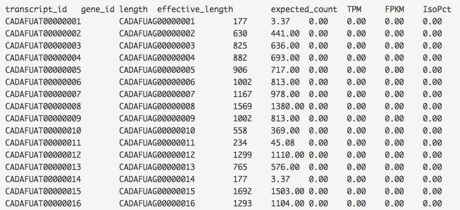

The output report represents a table with the following main columns:

- *transcript_id* - name of the transcript;
- *gene_id* — name of the gene which the transcript belongs to. If no gene
  information is provided, gene\_id and transcript\_id are the same;
- *length* — transcript's sequence length (poly(A) tail is not counted);
- *effective_length* — counts only the positions that can generate a valid
  fragment. If no poly(A) tail is added, effective length is equal to
  transcript length — mean fragment length + 1. If one transcript's effective
  length is less than 1, this transcript's both effective length and abundance
  estimates are set to 0;
- *expected_count* — the sum of the posterior probability of each read comes
  from this transcript over all reads;
- *TPM* — transcripts per million normalized by total transcript count in
  addition to average transcript length;
- *FPKM* — fragments per kilobase of exon per million fragments mapped;
- *IsoPct* — the percentage of the transcript's abundance over its parent
  gene's abundance. If the parent gene has only one isoform or the gene
  information is not provided, this field will be set to 100.

The application is based on the `RSEM`_ program and the `STAR`_ mapper.

.. _RSEM: http://deweylab.github.io/RSEM/
.. _STAR: https://github.com/alexdobin/STAR

Quantify raw coverage in genes
++++++++++++++++++++++++++++++

**Action**: to compute gene counts from mapped reads. The application takes as
input a mapped reads file, and uses a reference genome to produce a mapped
reads counts file, indicating how many reads overlap each gene specified in the
genome's annotation.

Let's go through the application parameters:

1. **Feature type** option. Depending on your tasks, you should specify the
   feature type for which overlaps choosing from "exon", "CDS" (coding DNA
   sequence), "3’UTR" (the 3’ untranslated region) or "5’UTR" (the 5’untranslated region).
   For example, you may consider each exon as a feature
   in order to check for alternative splicing. By default, the "gene-id" will
   be used as a feature identifier. (default: exon)
2. The **Rule for overlaps** option dictates how mapped reads that overlap genomic
   features will be treated. There are three overlap resolution modes: union,
   strict-intersection, and non-empty intersection. (default: union)

   The first one - "union" - is the most recommended. It combines all cases
   when the read (or read pair) at least partly overlaps the feature. The
   "strict-intersection" mode is about strict intersection between the
   feature and the read overlapping this feature. But if you are interested in
   counting reads that are fully or partly intersected with the feature, you
   should use the last mode. It is important that the read will be counted for
   feature if it overlaps precisely only one feature. If the read overlaps
   with more than one feature, it will not be counted.

.. image:: images/overlap_resolution_modes.png
   :scale: 80 %
   :align: center

3. **Strand-specific reads**. The application takes into account the direction
   of the read and the reference, so that a read from the wrong direction,
   even if it is mapped to the right place, will not be counted. This option
   can be useful if your data is strand-specific and you are interested in
   counting of reads overlapping with feature regarding to whether these reads
   are mapped to the same or the opposite strand as the feature. Choose "Yes",
   if the reads were mapped to the same strand as the feature and "Reverse" —
   if the reads were mapped on the opposite strand as the feature. Specify
   "No", if you do not consider strand-specificity. (default: Yes)

This application is based on the HTSeq_ tool and used in `Differential Gene
Expression Analysis pipeline`_. After calculating read abundance on the gene
level, you will be able to run **Test Differential Gene Expression** application.

.. _HTSeq: http://www-huber.embl.de/HTSeq/doc/overview.html
.. _Differential Gene Expression Analysis pipeline: https://platform.genestack.org/endpoint/application/run/genestack/dataflowrunner?a=GSF3778423&action=viewFile

Isoform quantification with Salmon
++++++++++++++++++++++++++++++++++

Specific genes can produce a range of different transcripts encoding various
isoforms, i.e. proteins of varying lengths containing different segments of
the basic gene sequence. Such isoforms can be generated, for example, in the
process of alternative splicing.

**Action**: to quantify abundances of transcripts from RNA-seq data. The
application requires a set of reference transcripts and uses the concept of
quasi-mapping to provide accurate expression estimates very quickly.

The application is based on the Salmon_ tool.

.. _Salmon: https://combine-lab.github.io/salmon/

Isoform quantification with Kallisto
++++++++++++++++++++++++++++++++++++

Specific genes can produce a range of different transcripts encoding various
isoforms, i.e. proteins of varying lengths containing different segments of the
basic gene sequence. Such isoforms can be generated, for example, in the
process of alternative splicing.

**Action**: to quantify abundances of genes and isoforms from RNA-seq data
without the need for alignment. It uses the `Expectation-Maximization algorithm`_
on "pseudoalignments" to find a set of potential transcripts a read could have
originated from. Note, that the application accepts reference transcriptome
(cDNA) not a genome (DNA).

.. _Expectation-Maximization algorithm: https://en.wikipedia.org/wiki/Expectation%E2%80%93maximization_algorithm

Let's inspect the application options:

1. The **Strand-specificity protocol** parameter is used to specify how to process
   the pseudoalignments. If "None", the application does not take into account
   strand specificity. To run the application in strand specific mode, change
   this value to "Forward" if you are interested only in fragments where the
   first read in the pair is pseudomapped to the forward strand of a transcript.
   If a fragment is pseudomapped to multiple transcripts, only the transcripts
   that are consistent with the first read are kept. The "Reverse" is the same
   as "Forward" but the first read will be pseudomapped to the reverse strand
   of the transcript. (default: None)
2. The **Enable sequence based bias correction** option will correct the
   transcript abundances according to the model of sequences specific bias.
   (default: checked)
3. The **Estimated average fragment length (for single-end reads only)** option
   must be specified in case of single-end reads. Typical Illumina libraries
   produce fragment lengths ranging from 180–200 bp. For paired-end reads, the
   average fragment length can be directly estimated from the reads. (default:
   190)
4. **Estimated standard deviation of fragment length (for single-end reads
   only)** option. If you do not know the standard deviation of the fragment
   library, you can probably assume that the standard deviation is 10% of the
   average fragment length. For paired-end reads, this value will be estimated
   from the input data. (default: 20)

Use the **View report** application in the Explore section to review the
Kallisto output report.

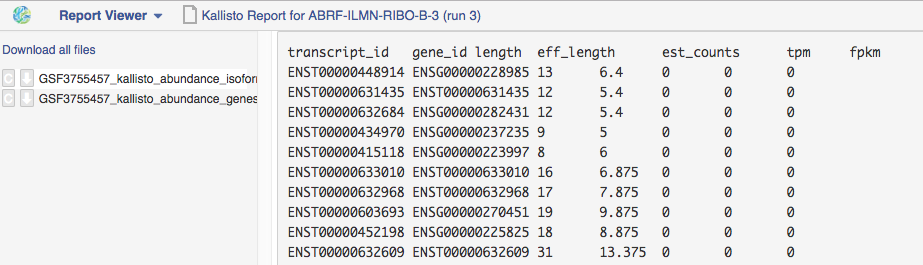

It contains a table with the following main columns:

- *target_id* — feature name, e.g. for transcript, gene;
- *length* — feature length;
- *eff_length* — effective feature length, i.e. a scaling of feature length by
  the fragment length distribution;
- *est_counts* — estimated feature counts;
- *tpm* — transcripts per million normalized by total transcript count in
  addition to average transcript length.

The application is based on the Kallisto_ tool.

.. _Kallisto: https://pachterlab.github.io/kallisto/

Quantify FPKM coverage in isoforms
++++++++++++++++++++++++++++++++++

Specific genes can produce a range of different transcripts encoding various
isoforms, i.e. proteins of varying lengths containing different segments of the
basic gene sequence. Such isoforms can be generated, for example, in the
process of alternative splicing.

**Action**: to quantify reads abundance at the isoform level. It accepts mapped
reads (corresponding to isoform alignment) and reference genome as inputs. The
output is a file containing isoform counts. Several such files corresponding to
samples with different biological conditions and isoforms can be further used
in **Test Differential Isoforms Expression** application.

Before running the application, you can choose the following parameters:

1. The **Strand-specificity protocol** is used for generating your reads. If "None",
   the application will consider your data as none-strand-specific, but this
   value can be changed to "dUTP" or "RNA-ligation". (default: None)
2. The **No correction by effective length** option is used if you would like to
   not apply effective length normalization to transcript FPKM (fragments per
   kilobases of exons for per million mapped reads). (default: unchecked)

The application always makes an initial estimation procedure to more
accurately weight reads mapping to multiple places in the genome.

This application is based on the **cuffquant** (a part of the Cufflinks_ tool) and
used in `Differential Isoform Expression Analysis`_ public data flow.

.. _Cufflinks: http://cole-trapnell-lab.github.io/cufflinks/
.. _Differential Isoform Expression Analysis: https://platform.genestack.org/endpoint/application/run/genestack/dataflowrunner?a=GSF3778459&action=viewFile

Test differential gene expression
+++++++++++++++++++++++++++++++++

**Action**: to perform differential gene expression analysis between groups of
samples. The application accepts Mapped Read Counts (from the "Quantify Raw
Coverage in Genes" application) and generates Differential Expression
Statistics file which you can view with the Expression Navigator application.

Options:

1. The "**Group samples by**" option allows you to apply autogrouping, i.e. when the
   application helps you to group your samples according to experimental factor
   indicated in metainfo for the samples (e.g. disease, tissue, sex, cell type,
   cell line, treatment, etc.). (default: None)
2. **Method for differential expression**. The application supports two
   methods — "DESeq2" and "edgeR" statistical R packages — to perform
   normalization across libraries, fit negative binomial distribution and
   likelihood ratio test (LRT) using generalized linear model (GLM). (default:
   DESeq2)

With edgeR, one of the following types of dispersion estimate is used, in
order of priority and depending on the availability of biological replicates:
Tagwise, Trended, or Common. Also, edgeR is much faster than DESeq2 for
fitting GLM model, but it takes slightly longer to estimate the dispersion. It
is important that edgeR gives moderated fold changes for the extremely lowly
Differentially Expressed (DE) genes which DESeq2 discards, showing that the
likelihood of a gene being significantly differentially expressed is related
to how strongly it is expressed. So, choose one of the packages according to
your desires and run the analysis.

For each group, a GLM LRT is carried out to find DE genes in this group
compared to the average of the other groups. In the case of 2 groups, this
reduces to the standard analysis of finding genes that are differentially
expressed between 2 groups. Thus, for N groups, the application produces N
tables of Top DE genes. Each table shows the corresponding Log2(Fold Change),
Log2(Counts per Million), p-value, and False Discovery Rate for each gene.
Look at all result tables and plots in Expression Navigator application.

- **log-fold change**: the fold-change in expression of a gene between two
  groups A and B is the average expression of the gene in group A divided by
  the average expression of the gene in group B. The log-fold change is
  obtained by taking the logarithm of the fold change in base 2.

- **log-counts per million**: dividing each read count by the total read counts in
  the sample, and multiplying by 10^6 gives counts per million (CPM).
  log-counts per million are obtained by taking the logarithm of this value in
  base 2.

- **p-value**. The application also computes a p-value for each gene. A low
  p-value (typically, < 0.005) is viewed as evidence that the null hypothesis
  can be rejected (i.e. the gene is differentially expressed). However, due to
  the fact that we perform multiple testing, the value that should be looked at
  to safely assess significance is the false discovery rate.

- **False discovery rate**. The FDR is a corrected version of the p-value,
  which accounts for `multiple testing correction`_. Typically, an FDR < 0.05
  is good evidence that the gene is differentially expressed. You can read
  more about it `here`_.

.. _multiple testing correction: https://en.wikipedia.org/wiki/Multiple_comparisons_problem#Correction
.. _here: http://www.cbil.upenn.edu/PaGE/fdr.html

This application is based on `DESeq2`_ and `edgeR`_ R packages.

.. _DESeq2: http://www.bioconductor.org/packages/release/bioc/html/DESeq2.html
.. _edgeR: http://www.bioconductor.org/packages/2.13/bioc/html/edgeR.html

Test differential isoform expression
++++++++++++++++++++++++++++++++++++

**Action**: to perform differential isoform expression analysis between groups
of samples. The application accepts FPKM Read Counts (from Quantify FPKM
Coverage in Isoforms application) and generates Differential Expression
Statistics file which you can view in Expression Navigator application.

The application has the following options:

1. The "**Group samples by**" option allows you to apply autogrouping, i.e. when the
   application helps you to group your samples according to experimental
   factor indicated in metainfo for the samples (e.g. disease, tissue, sex,
   cell type, cell line, treatment, etc.). (default: None)
2. **Apply fragment bias correction** option - if checked, the application
   will run the bias detection and correction algorithm which can
   significantly improve accuracy of transcript abundance estimates. (default:
   checked)
3. The **Apply multiple reads correction** option is useful if you would like to
   apply the multiple reads correction. (default: checked)

The application finds isoforms that are differentially expressed (DE) between
several groups of samples and produces tables of Top DE transcripts. Each
table shows the corresponding Log2(Fold Change), Log2(Counts per Million),
p-value, and False Discovery Rate for each isoform. Use the Expression
Navigator to visualize the results.

- **log-fold change**: the fold-change in expression of a gene between two
  groups A and B is the average expression of the gene in group A divided by
  the average expression of the gene in group B. The log-fold change is
  obtained by taking the logarithm of the fold-change in base 2.

- **log-counts per million**: dividing each read count by the total read counts in
  the sample, and multiplying by 10^6 gives counts per million (CPM).
  log-counts per million are obtained by taking the logarithm of this value in
  base 2.

- **p-value**. The application also computes a p-value for each isoform. A low
  p-value (typically, < 0.005) is viewed as evidence that the null hypothesis
  can be rejected (i.e. the isoform is differentially expressed). However, due to
  the fact that we perform multiple testing, the value that should be looked at
  to safely assess significance is the false discovery rate.

- **False discovery rate**. The FDR is a corrected version of the p-value,
  which accounts for `multiple testing correction`_. Typically, an FDR <
  0.05 is good evidence that the isoform is differentially expressed. You can
  read more about it `here`_.

.. _multiple testing correction: https://en.wikipedia.org/wiki/Multiple_comparisons_problem#Correction
.. _here: http://www.cbil.upenn.edu/PaGE/fdr.html

This application is based on the **cuffdiff** which is a part of the Cufflinks_
tool.

.. _Cufflinks: http://cole-trapnell-lab.github.io/cufflinks/

Expression navigator
++++++++++++++++++++

**Action**: to view and filter the results of differential gene and isoform
expression analyses.

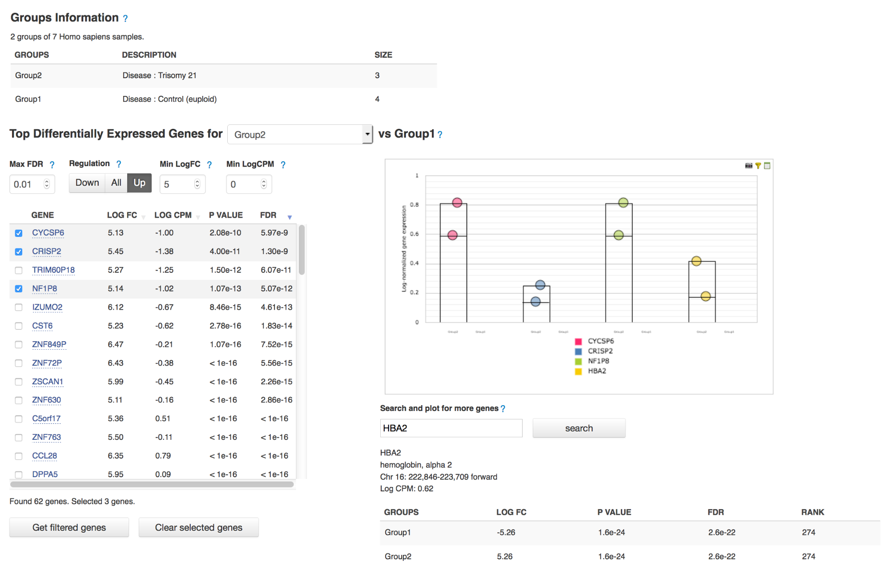

The Expression Navigator page contains four sections:

1. **Groups Information** section. It is a summary of the groups available for
   comparison. Size refers to the number of samples used to generate each
   group.

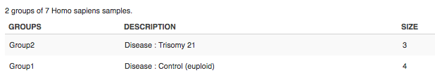

2. The **Top Differentially Expressed Genes** section allows you to choose which groups
   to compare and how to filter and sort identified differentially expressed
   (DE) genes.

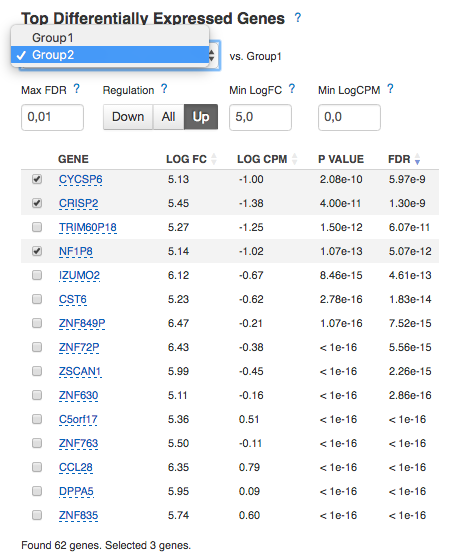

You can filter DE genes by maximum acceptable false discovery rate (FDR), up or
down regulation, minimum log fold change (LogFC), and minimum log counts per
million (LogCPM).

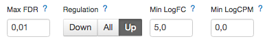

Let’s look through these statistics:

- **log-fold change**: the fold-change in expression of a gene between two
  groups A and B is the average expression of the gene in group A divided by
  the average expression of the gene in group B.
  The log-fold change is obtained by taking the logarithm of the fold change in
  base 2.
  Log transformed values contains the same information as fold change but
  makes it more clear for interpretation because of symmetric values.
  Genes with positive log FC are considered to be up-regulated in the selected
  group, ones with negative log FC are down-regulated.

- **log-counts per million**: dividing each read count by the total read counts in
  the sample, and multiplying by 10^6 gives counts per million (CPM).
  Log-counts per million are obtained by taking the logarithm of this value in
  base 2.

- **p-value**. The application also computes a p-value for each gene. A low
  p-value (typically, < 0.005) is viewed as evidence that the null hypothesis
  can be rejected (i.e. the gene is differentially expressed). However, due to
  the fact that we perform multiple testing, the value that should be
  looked at to safely assess significance is the false discovery rate.

- **False discovery rate**. The FDR is a corrected version of the p-value,
  which accounts for `multiple testing correction`_. Typically, an FDR < 0.05 is
  good evidence that the gene is differentially expressed. You can read more
  about it `here`_.

.. _multiple testing correction: https://en.wikipedia.org/wiki/Multiple_comparisons_problem#Correction
.. _here: http://www.cbil.upenn.edu/PaGE/fdr.html

Moreover, you can sort the DE genes by these statistics by clicking the
arrows next to the name of the metrics in the table headers.

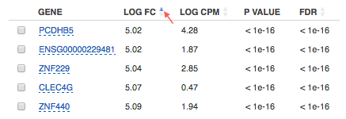

The buttons at the bottom of the section allow you to update the list based on
your filtering criteria or clear your selection.

3. The top-right section contains **a boxplot of expression levels**. Each
   colour corresponds to a gene. Each boxplot corresponds to the distribution
   of a gene's expression levels in a group, and coloured circles represent the
   expression value of a specific gene in a specific sample.

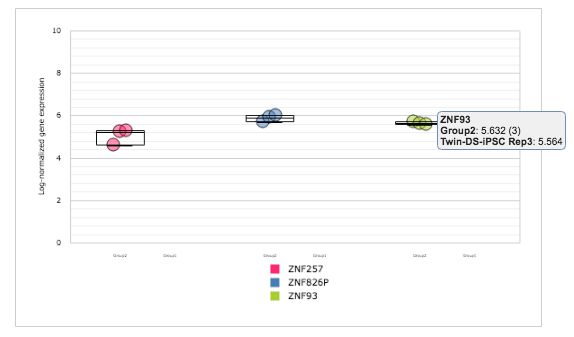

4. The bottom-right section contains **a search box** that allows you to look for
   specific genes of interest. You can look up genes by gene symbol, with
   autocomplete. You can search for any gene (not only those that are visible
   with the current filters).

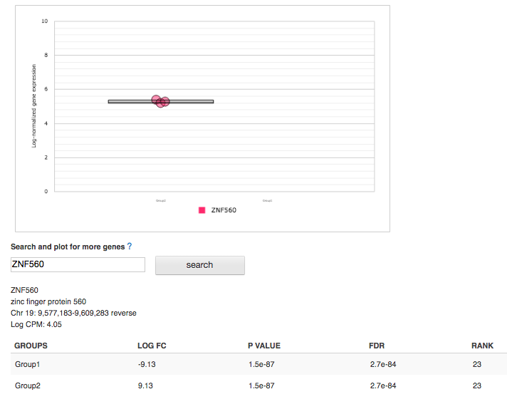

You can read more about this application in the corresponding `tutorials`_.

.. _tutorials: http://genestack-user-tutorials.readthedocs.io/index.html

.. TODO: add GO Enrichment Analysis application
.. TODO: add Differential Similarity Search application

Single-cell RNA-seq analysis
++++++++++++++++++++++++++++

**Action**: to identify heterogeneously-expressed (HE) genes across cells,
while accounting for technical noise. The application analyses single-cell
RNA-seq data and accepts several Mapped Read Counts as inputs. The output
report can be opened in Single-cell RNA-seq Visualiser.

The application supports two algorithms for heterogeneity analysis. The first uses
spike-in data (artificially introduced RNAs of known abundance) to calibrate a
noise model. The second method is a non-parametric algorithm based on
smoothing splines and does not require the presence of spike-in data.

To identify highly variable genes you can try different options:

1. The **Use spike-ins to calibrate noise** option determines whether or not
   spike-in data should be taken into account. If you select only one folder
   before running the application, you will use spike-free algorithm and this
   option will be switched off by default. But if you select two folders, one
   for biological and the other for spike-in data, you can use the Brennecke
   algorithm which requires this option.
2. The **Exclude samples with low coverage** option allows you to exclude or
   include for analysis samples with low read counts. (default: checked)
3. **Significance level for the p-value (-10log₁₀(p))**. If you set it equal
   to 1, the application will select the genes for which the p-value is smaller
   than 0.1. (default: 1)

The next three options will be available if spike-ins are included in the
experiment and "Use spike-ins to calibrate noise" option is switched:

4. The **Expected biological CV** is the minimum threshold chosen for quantifying
   the level of biological variability (CV — coefficient of variation)
   expected in the null hypothesis of the model. (default: 0.5)
5. The **Noise fit - proportion of genes with high CV² to remove** option allows
   you to exclude spike-in genes with high CV² to fit the noise model.
   (default: 0)
6. The **Noise fit - proportion of genes with low mean expression to remove**
   option enables you to exclude a fraction of spike-in genes with low mean
   expression to fit the noise model, because extreme outliers tend to skew
   the fit. (default: 0.85)

To look at the HE analysis results, open the created Single-cell RNA-seq
Analysis page in  Single-cell RNA-seq Visualiser.

This application is based on such R packages as `DESeq`_, `statmod`_, `ape`_,
`flashClust`_ and `RSJONIO`_.

.. _DESeq: http://bioconductor.org/packages/release/bioc/html/DESeq.html
.. _statmod: https://cran.r-project.org/web/packages/statmod/index.html
.. _ape: https://cran.r-project.org/web/packages/ape/index.html
.. _flashClust: https://cran.r-project.org/web/packages/flashClust/index.html
.. _RSJONIO: https://cran.r-project.org/web/packages/RJSONIO/RJSONIO.pdf

Read more about `single-cell RNA-seq analysis`_ on Genestack.

.. _single-cell RNA-seq analysis: https://genestack.com/blog/2016/02/22/visualisation-clustering-methods-single-cell-rna-seq-data/

Single-cell RNA-seq visualiser
++++++++++++++++++++++++++++++

**Action**: to explore cell-to-cell variability in gene expression in even
seemingly homogeneous cell populations based on scRNA-seq datasets.

The application shows basic statistics such as the number of identified highly
variable genes across the analysed samples.

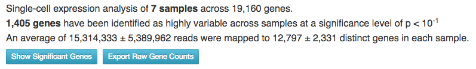

It also provides several quality control (QC) plots allowing to check the
quality of raw sequencing data, estimate and fit technical noise for the
Brennecke algorithm, and detect genes with significantly high variability
in expression.

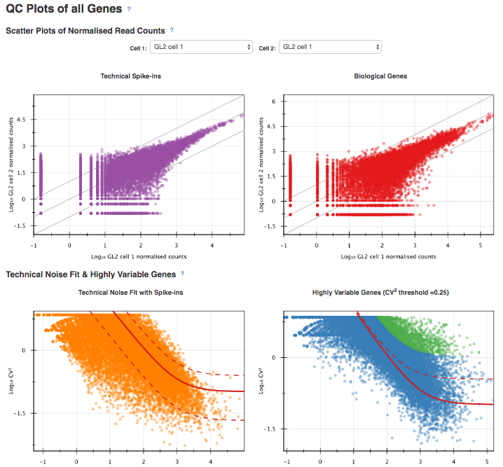

QC plots are adopted from the original `paper by Brennecke et al`_. In all the
plots described below, gene expression levels are normalized using the DESeq
normalization procedure.

.. _paper by Brennecke et al: http://www.nature.com/nmeth/journal/v10/n11/full/nmeth.2645.html

The first plot describing the quality of raw data is the Scatter Plot of
Normalised Read Counts, which shows the cell-to-cell correlation of normalized
gene expression levels. Each dot represents a gene, its x-coordinate is the
normalized gene count in the first cell, and its y-coordinate is the
normalized gene count in the second cell. If spike-ins were used during the
analysis, separate plots will be rendered for spike-in genes and for sample
genes.

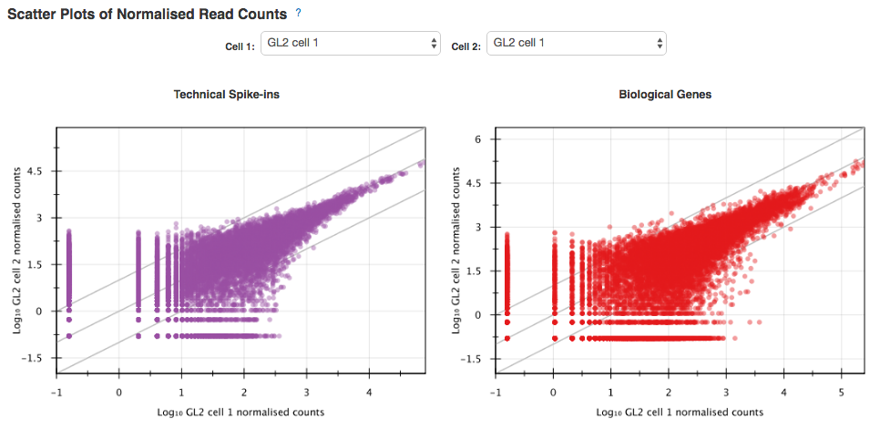

The Technical Noise Fit and Highly Variable Genes plots provide a visual
summary of the gene expression noise profile in your dataset across all cells.

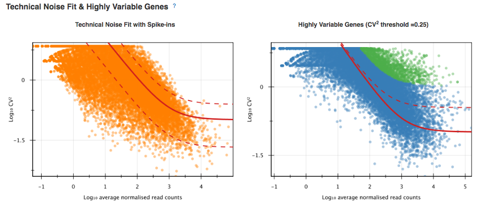

They graph the squared coefficient of variation (CV²) against the average
normalized read counts across samples.  The Gene Expression Variability QC plot
allows you to visualize the genes whose expression significantly varies across
cells. A gene is considered as highly variable if its coefficient of biological
variation is significantly higher than 50% (CV² > 0.25)  and the biological
part of its coefficient of variation is significantly higher than a
user-defined threshold (its default value is 50%, and can be modified in the
Single-cell Analyser). The coefficient of variation is defined as the standard
deviation divided by the mean. It is thus a standardized measure of variance.

If spike-ins were used to calibrate technical noise, then the separate
Technical Noise Fit plot is displayed. On this plot, each dot corresponds to a
“technical gene” (spike-in gene).It plots the mean normalized count across all
samples on the x-coordinate and the squared coefficient of variation (CV²) of
the normalized counts across all samples on the y-coordinate. The coefficient
of variation is defined as the standard deviation divided by the mean. It is
thus a standardized measure of variance. The plot also represents the fitted
noise model as a solid red line (with 95% confidence intervals as dotted red
lines). It allows you to check whether the noise model fits the data reasonably
well. If it is not the case, you should change the noise fitting parameters in
the Single-cell Analysis application.

Expression of the highly variable genes across all cell samples is represented
by an interactive clustered heatmap.

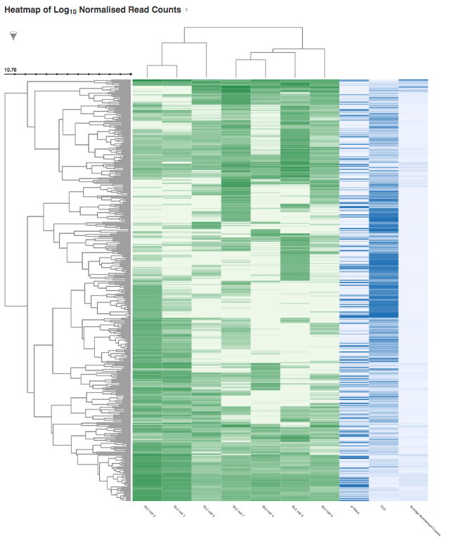

The interactive heatmap depicts the log normalised read count of each
significant highly variable gene (rows) in each cell sample (columns).
Hierarchical clustering of molecular profiles from cell samples is based on the
similarity in gene expression of highly expressed genes and allows
identification of  molecularly distinct cell populations. The heatmap is
clustered both by columns and by rows, to identify clusters of samples with
similar gene expression profiles, and clusters of potentially co-expressed
genes. The bi-clustered heatmap is provided by an open source interactive
Javascript library InCHlib_ (Interactive Cluster Heatmap library).

.. _InCHlib: http://www.openscreen.cz/software/inchlib/home/

Finally, several plots in the Samples Visualisation section can be used to
detect cell subpopulations and identify novel cell populations based on gene
expression heterogeneity in the single-cell transcriptomes.

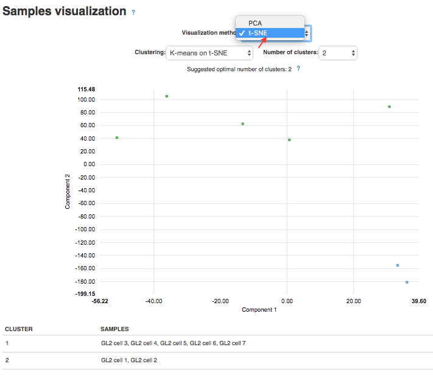

The Samples Visualisation section provides interactive plots used to cluster
cell samples based on expression of highly variable genes. Currently, two
alternative methods are supported for visualisation and clustering of samples:
the first one is based on the t-distributed Stochastic Neighbour Embedding
(t-SNE) algorithm and the second one uses Principal Component Analysis (PCA).

For automatic cluster identification, the k-means clustering algorithm can be
used in combination with either  t-SNE or PCA. K-means clustering requires you
to supply a number of clusters to look for ("k"). You can either enter it
manually using the dropdown menu or use the suggested value estimated using
the "elbow" method (choosing a value of k such that increasing the number of
clusters does not significantly reduce the average "spread" within each
cluster).

The Interactive Principal Component Analysis (PCA) scatter plot is rendered
using the NVD3_ Javascript library. The PCA features and k-means algorithm
results are computed using R's built-in functions prcomp_ and knn_. The
t-SNE transformation is computed using the Rtsne_ package.

.. _NVD3: http://nvd3.org/
.. _prcomp: https://stat.ethz.ch/R-manual/R-patched/library/stats/html/prcomp.html
.. _knn: https://stat.ethz.ch/R-manual/R-devel/library/class/html/knn.html
.. _Rtsne: https://cran.r-project.org/web/packages/Rtsne/index.html

Read `our blog post`_ about the application and single-cell RNA-seq analysis.

.. _our blog post: https://genestack.com/blog/2016/02/22/visualisation-clustering-methods-single-cell-rna-seq-data/`_
