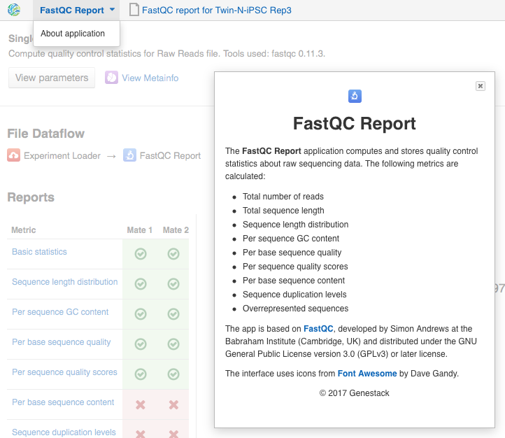

.. _pipelines-and-applications-label:

Pipelines and applications
==========================

.. TODO: Split the file. It's too big!
.. TODO Add links on our youtube videos

Applications available on Genestack are grouped into four categories:
Preprocess, Analyse, Explore and Manage.

**Preprocess** applications cover tasks such as data prefiltering, subsampling
or normalisation, which typically need to be performed before getting into the
"heavy-lifting" part of data analysis.

**Analyse** applications include key analysis steps like sequence alignment,
variant calling, expression quantification, etc.

**Explore** contains all interactive graphical interface applications
allowing users to view the results of their
computations. Applications for visualizing QC reports, the Genome Browser,
applications for exploring  genomic variants, and many more.

**Manage** contains applications used to manage your data: applications dealing
with data flows, file provenance, export, metadata editing and so on.

An extended version of each application's description can be found in the
"About application" text for that application.

To view this text for a specific application, click on the application's name at the
top-left corner of the page, and in the dropdown menu select "About application".

.. include:: pipelines_include/rawQC-preprocessing.rst
.. include:: pipelines_include/mappedQC-preprocessing_include.rst
.. include:: pipelines_include/variants_preprocessing_include.rst
.. include:: pipelines_include/rnaseq_include.rst
.. include:: pipelines_include/wgs-and-wes_include.rst
.. include:: pipelines_include/bisseq_include.rst
.. include:: pipelines_include/microbiome_include.rst
.. include:: pipelines_include/additional_apps_include.rst
.. include:: pipelines_include/ref-genomes_include.rst
.. include:: pipelines_include/expression_arrays_include.rst
.. include:: pipelines_include/methyl_arrays_include.rst
