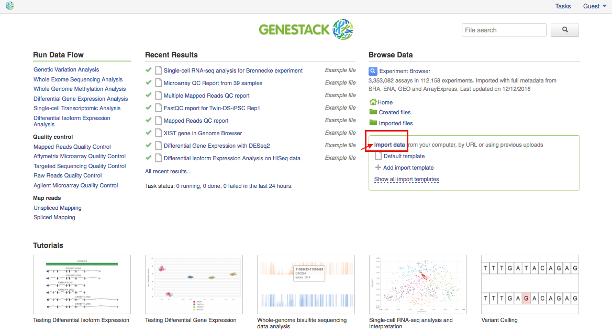

Genestack Platform
==================

Registering
-----------

If you don’t have an account already, please register first:

Go to `platform.genestack.org`_, click on “Sign Up”, fill in the form and
wait for a confirmation email.

If you’re just taking Genestack out for a spin, you can also use our platform
as a guest (by clicking on “continue as guest” button). Remember, as a guest
you can only create up to 200 files and your results will disappear after 24h
of inactivity.

Welcome Page Map
----------------

After you login, you’ll see your **Welcome Page**. Let’s cover the basics.

|welcome_page|

The very top of the page is static and you can always refer to it. Clicking
on the Genestack logo in the top left corner of any platform page will take
you back to the Welcome Page. This option is customizable: you can instead
have it link to the File manager.

Clicking on your username (your email address) in the top right corner of the
page will give you access to your profile, allow you to manage your
applications, groups, and users or logout of the platform.

You can watch a video on managing users on Genestack here:

.. youtube:: https://www.youtube.com/watch?v=asMhUjD_i68

**Tasks** links to the **Task Manager**, which will be described later in the
guide. 

In the bottom right corner of the page you can see the **chat window**. Please
message us whenever you have any questions or want to make any suggestions.

Wherever you are on the platform, you can also access a **shortcuts menu**.
It’s an easy way to reach most commonly used apps and folders. Genestack
Import, Manage apps, Manage groups, Experiment Browser as well as the folders
for Created and Imported files can all be found here. To access the shortcuts
menu simply move your mouse cursor to the left hand side of any page.

|shortcuts_menu|

Let’s go back to the Welcome Page. Here you can find the following sections:

1. **Run Data Flow** includes a collection of **most commonly used data
   flows** we have prepared for our users.
2. **Recent Results** shows you the files you have recently created
   (including their initialization or completion status).
3. **Browse data** section allows you to browse through public, private and
   shared data with **Experiment Browser** which allows you to search through
   the wealth of your data using complex queries.
   In the Browse Data section, you’ll also find a link to the File Manager
   (home), as well as often used folders: Uploaded files, Imported files,
   Created files and Exports.
4. **Import data** section allows you to import your data using either a
   customized or a default template.
5. **Tutorials** explain the most common analysis types in greater detail.

Your Profile
------------

Importing Data
--------------

Supported file types
********************

Genestack allows its users to upload various files to the cloud and keep them
organized transforming them into the following data types:

- **Microarray Assay** - Raw microarray data obtained from a microarray 
  experiment (you can import Affymetrix, Agilent or GenePix microarrays);
- **Sequencing Assay** - Raw sequencing data associated with a specific NGS
  experiment;
- **Microarray Annotation** - Annotation file containing information about
  association of microarray probes to biological entities like genes,
  transcripts and proteins;
- **Continuous Genomic Data** - Contains information on continuous genome
  statistics, e.g. GC% content;
- **Discrete Genomic Data** - Information on discrete regions of the genome
  with an exact start and end position;
- **Mapped Reads** - Reads aligned to a specific reference genome;
- **Ontology Files** - OWL, OBO or CSV files used to annotate metainfo;
- **Reference Genome** - Reference genome sequence for a specific organism
  with annotation;
- **Variation Files** - Genetic Variations files, storing gene sequence
  variations.

When you upload microarrays or sequencing assays onto the platform, they will
be automatically imported as an experiment.

- **Experiment** - An experiment is a special type of folder that can only
  contain assays. When you import files that are detected as raw sequencing or
  microarray assays, Genestack creates an experiment and adds the assays to it.
  Additional information on the experiment can be added as attachments in any
  file format.

**NOTE: What's the difference between experiments and folders?**
Forum3_

Moreover, when you perform any analysis on Genestack, you can create other data
types, which are not yet supported in import. Here is the list of them:

- **Auxiliary File** - Contains index for the Reference Genome;
- **Affymetrix/Agilent/GenePix Microarrays Normalisation** - File with
  normalized Affymetrix/Agilent/GenePix microarrays inside;
- **Chimerism analysis file** - contains interpretive report with determined
  percentage of donor and recipient cells within the patient's blood;
- **Differential Expression Statistics** - RNA expression statistics for
  individual genes contained in a sequence such as Fold Changes, p values,
  FDR, etc;
- **Dose Response Analyser File** - Interactive report describing the change
  in effect on an organism caused by differing dose levels;
- **FastQC Report** - Report file containing calculated quality control
  metrics for sequencing data;
- **FPKM Counts** - A file containing isoform expression levels calculated for
  each gene in sample;
- **Genome Annotations** - A technical file used for matching GO terms and
  gene symbols to gene coordinates;
- **Mapped Read Counts** - The number of mappings to each bit of reference
  sequence. Produced from Mapped Reads files;
- **Mapped Reads QC Report** - The output report file with calculated quality
  metrics for mapped reads;
- **Microarray QC File** - The file reporting quality metrics for microarrays
  and detected apparent outlier arrays;
- **Microbiome Analysis File** - Reports the abundance of microbial species
  presented in a sample;
- **Raw Reads** - Raw sequencing data that does not need to be associated with
  an experiment (as opposed to a sequencing assay);
- **Single-cell RNA-seq Analysis File** - Contains identified
  heterogeneously-expressed genes across cells;
- **Targeted Sequencing QC Report** - Displays enrichment statistics
  calculated based on the exome of the specified reference genome, on the
  specific target annotation file from the capture strategy, or on both - on
  exome and target file.

Biodata Import
**************

There are several ways you can access the **Import** application:

- clicking the “Import” button in the File Manager

|FM_import|

- using “Import data” link on the Welcome Page

|WP_import|

- clicking “Upload“ button when you choose sources in the dataflow you'd like
  to run

|DF_import|

- using an import template. We’ll describe what import template is and how to
  use it later in the guide

|IT_import|

When importing, there are 2 ways to upload data into the platform:

- **Use data from your computer** - select or drag-and-drop files.

|import_start|

- **Upload from URLs (FTP or HTTP/HTTPS)** - specify URLs for separate files or
  directories.

|URL_import|

You can select which import template to use in two ways: from the welcome
page, or during the 3rd stage of the import process by right-clicking on the
import template name. You can add new import templates using the **Import
Template Editor** app, which can be found by clicking “Add import template”
from the Welcome Page or from the manage submenu when you right click on an
import template.

|import_templates|

**NOTE: What is an import template?**

Import templates allow you to select what metainfo attributes of your
imported files will be tightly controlled (so you don’t lose any information
in the process). Import templates allow you to set default fields for file
metadata based on file type (e.g. Experiments, Discrete Genomic Data, Genetic
Variations, etc.). Of course if you’re only importing mapped reads, you don’t
need to specify metainfo attributes for other data types.

Genestack will attempt to fill these fields automatically, but you can always
edit the contents manually during the import process.

By using metainfo templates you can make sure that all of your files will be
adequately and consistently described so you will not lose any valuable
information.

|default_import_template|

*Example:*

For instance, let’s say you wish to create an import template where you want
to control the metainfo attributes of sequencing assays (e.g. you always need
to know the tissue and sex of your samples). In order to do this, click on
“Add import template”, then look for the table related to Sequencing Assays
and for the fields “tissue” and “sex”, change the required fields to ‘Yes’.
As you can see, the system controls what type of information can you put into
your metainfo fields. In this case, for tissue the system will map your
entries to the Uberon Anatomical Entities dictionary and the metainfo type
must be text. You can edit existing templates by right-clicking on a template
and selecting the **Import Template Editor** app from the 'Manage' sub-menu.

If you wanted to add other metainfo fields that are not included in the table
already, you can do this at the bottom of the table where there are blank
spaces. For each entry, you must specify whether or not this field is
required and what is it’s metainfo type (e.g. text, yes/no, integer).

|metainfo_type_editor|

Also, you should specify whether↵or not you wish to map the metainfo field to
a specific dictionary. You can import your own private dictionary as OWL, OBO
or CSV file or use the pre-loaded public ones, for example:

- The non-hierarchical controlled vocabularies (to cover e.g. Sex, Method,
  Platform fields), which are simply lists of terms;
- The `NCBI Taxonomy`_ is a standard hierarchical nomenclature and
  classification scheme for Organisms;
- The `Cellosaurus vocabulary`_ used for Cell Line field annotation - is an
  example of controlled vocabulary which describes all cell lines used in
  biomedical research;
- A bunch of ontologies - `ChEBI Ontology`_, `Cell Ontology`_ (to annotate
  Compound and Cell type fields, respectively), `Uberon Ontology`_ (covering
  anatomical structures in animals) and other ontologies.

If you are using a file kind that is not yet listed, you can add a new one by
clicking on the “Add File Kind” button at the bottom of the page and
specifying the required metainfo attributes. Keep in mind that file kinds are
defined in Genestack - you won’t be able to create a template entry for a
file kind that is not used on the platform.

When you’re done, click on the blue “Import data using this template” button.
This will take you to the file import page. You can drag and drop or select
files from your computer, import data from URL or use previous uploads.

After your data is uploaded, the platform automatically recognizes file
formats and transforms them into biological data types e.g. raw reads, mapped
reads, reference genomes and so on. If files are unrecognized, you can
manually allocate them to a specific data type using the drag & drop menu
located at the top of the page.

[Import page].|image6|

Once you are done, click on the “Edit metainfo” button at the top of the
page. You will be taken to an Excel-like spreadsheet where you can edit
the file metainfo and add new attributes. Importantly, during this step
the import has already completed - you will notice a message at the top
of the page listing the name of the folder where the imported files are
located (names “Imported on <date> <time>) and suggesting to share the
data. If you want to change the import template at this time, click on
the name of the current template to the left of “Add attribute” and
select “Change template”. You will then be able to select the desired
template from the pop-up file browser window. You can also choose to
apply a naming scheme. This will allow you to order attributes in a
drag-and-drop-interface  to create a naming format of your choice. The
file name will be updated dynamically if any of the metadata fields used
in the scheme are modified.

 

[edit import metadata]\ |image7|

Once you have completed the metainfo editing step, you may see a “Use
files in data flow” button at the bottom of the page by “Import files”.
This depends on the file type you have imported. Alternatively, click on
the Genestack logo in upper left corner to go back to the Welcome
Page. Later you can find your files in the “Imported files” folder which
can be accessed from the Welcome Page and from the File Manager.

Importing from spreadsheet 
~~~~~~~~~~~~~~~~~~~~~~~~~~

Attachments 
~~~~~~~~~~~

When you import an experiment into Genestack , you can choose to attach
various files to it. For example you could include a PDF file with the
experiment plant, an R script that you used to process your data, etc.
When you open your newly-imported experiment, all of the attachments
will accompany it. They will be safely stored on Genestack, so later you
can download them from the platform, in case they get lost on your
computer.

How to upload an attachment?

The attachment are uploaded together with the experiment data. In the
“Upload” section of the Import app, choose the attachments from your
computer along with your experiment data. In the “Import” section, the
platform will recognize the raw data and the fact that you have uploaded
unrecognisable files. All the unrecognised uploads will be stored as
attachments to your experiment. You can also add and remove attachments
later from inside the file browser. When you open an experiment there is
an attachments button by the experiment name.

<file import attachments> |image8|

Browsing Data 
-------------

Efficient data search and browsing are at the core of Genestack. The
platform provides  rapid access to private, shared, and public data
analyses; facilitates search for  studies and samples across your
private, public, and shared data; and accepts queries using synonyms,
ontology expansions, and chemical similarity.

File Manager is where you can easily access all of your private, public
and shared data. Read more about FM in the Platform Map section (link).

Here are other apps that help users better analyse their data and find
links between various results.

To be useful, data needs to be set in a context, i.e. to be associated
with metainfo (data describing other data).

For your experiments to make sense, especially later on in time when you
might not remember exactly what you did in a particular experiment, it
is crucial to represent both data and metadata in a consistent manner.

You can impose consistency by importing your data using import
templates. Read more about import templates here (link). When you wish
to view the existing metainfo, or add more metainfo, you should use the
Metainfo Editor app. The Metainfo Editor allows you to view and edit
multiple files simultaneously in a spreadsheet-like environment. Keep in
mind you won’t be able to edit metainfo for experiments you don’t own.

Similarly to import templates, the app uses specific standards and
structured vocabularies to annotate your data, for example:

-  First of all, the non-hierarchical controlled vocabularies (e.g. Sex,
   Method, Platform fields), which are simply lists of terms;.
-  The `NCBI Taxonomy`_ is
   a standard hierarchical nomenclature and classification scheme for
   Organisms;.
-  The `Cellosaurus vocabulary`_  we
   used for Cell Line field - is an example of controlled vocabulary
   which describes all cell lines used in biomedical research;.
-  We also applied a bunch of ontologies - `ChEBI Ontology`_,
   `Cell Ontology`_  - to annotate e.g. Compound and Cell type fields.

File Manager
~~~~~~~~~~~~

Clicking on the home icon will take you to the File Manager – a central
place on the platform, as it contains all of your files (you probably
got that already).

[screenshot “File Manager”]|image9|

The panel (tree view) on the left side is our file system navigator.
Here you can see many different folders. Let’s look at them in greater
detail:

Created files contains everything you have created on Genestack
Platform. Created a new import template? You’ll find it there. Processed
some of your files? You’ll find the results there. Created a new data
flow and want to share it? It will be in the Created files folder.

The files are organized by date, with oldest ones on top (however, you
can change this order to show the most recent ones - just click on the
header of the “Last Update” column). If you created a couple of files at
once using a data flow they will be located in one folder (called “Files
for XYZ data flow run <date>). In these folders you will find the very
result of your analysis (e.g. Genetic Variations file containing found
mutations), results of all intermediate analysis steps (e. g.
preprocessed reads, mapped reads etc. created by the apps participating
in your pipeline as you remember each contributing app creates a file),
as well as all original files (“Original Files for XYZ, a sub-folder in the “Dependencies” folder).

Imported files contains everything you have ever imported, organized by
date: all files imported at the same time (during one import action)
will be located in the same folder (until you move them around etc). 

Raw uploads contains all the files you’ve uploaded into Genestack -
fastq and bam files, pdf documents, excel tables etc.

NOTE: What’s the difference between raw uploads and imported files?

When you have just started importing your files (in various formats like
FASTQ, BAM etc), they all go to the specific storage area (“Raw uploads”
folder). During import Genestack will recognize these uploaded files and
allocate them to appropriate biological types (you can also do it
manually), e.g. sequencing assays, mapped reads etc. These meaningful
biological objects is what you work with on our platform and these are
located in the “Imported files” folder.

Exports folder contains export files with download links. For example,
sets of exported microarrays. (+[link to the export section)

Below these four grouped folders, you will see two more: Shared with me
and Public Data.

Shared with me contains all files that other users have shared with
you or that you shared with other users. Our platform has collaboration
at its heart, but in order to keep things simple at this point, we’ll
talk about sharing at the very end of this guide (+ link to the guide
part about it).

Public Data contains all of the goodies we have preloaded the platform
with to make life a bit simpler for our users. This folder contains:

[screenshot “Public Data folder content”]|image10|

#. Codon tables: currently 18 different tables such as yeast
   mitochondrial, vertebrate mitochondrial, blepharisma macronuclear
   etc.
#. Dictionaries: used for metainfo editing and curation, e.g. sex,
   sequencing platform, NCBI taxonomy. Read more about dictionaries here
   (link)
#. Example results: so you can play around with our platform and see
   what types of visualizations are available
#. External databases: sets of sequences with associated annotation;
   e.g. greengenes for 16S rRNA
#. Genome annotations: for a range of different organisms and platforms
    (for WES Analysis)
#. Microarray annotations: annotation lists to be used as the
   translation table to link probes and common public domain sequences
#. Public analyses: all files created during re-analysis of previously
   published data sets
#. Reference genomes: various reference genomes for the most commonly
   analysed organisms
#. Public data flows: all data flows available to our users, including
   tutorial data flows and the ones found on the Welcome page
#. Public experiments: this is a feature we’re particularly proud of. We
   have preloaded the platform with thousands and thousands of publicly
   available experiments, from public repositories such as GEO,
   ArrayExpress, SRA, and ENA. Currently we have about 100,000
   experiments in our database (and if that’s not impressive, then what
   is?). If you want to know more about a specific experiment use the
   Experiment Viewer app.
#. Tutorials: the folder contains files we use as examples during
   various tutorials. To read more on particular analysis types, go to https://genestack.com/tutorials/

Here are links to all the tutorials we have prepared so far:

-  `Getting Started With Genestack Platform`_
-  `Testing Differential Gene Expression`_
-  `Whole Genome Bisulfite Sequencing Analysis`_
-  `Whole Exome Sequencing Analysis`_
-  `Whole Genome Sequencing Analysis`_

To access the menu for a given file, you can either right or left click
on the respective entry in the file browser. The topmost entry is the
app that was used to generate this file, or the app that should be used
to view it. The next 4 entries are submenus for each of the 4 different
types of apps that can be used on the file. Further down are options for
viewing and re-using the pipeline used to generate the file. The final
section allows you to manage file locations and names. For folders,
left-clicking opens the folder, while right-clicking opens the menu. You
can open file menus whenever you see a file name in link colors when
using the platform. The Add to option allows you to copy files while the
Move to option removes the original.

 |image11|

Show all parent containers gives you the option to quickly find all
copies of a file that are available to you. The file accession is a
unique identifier which allows you to find a file even when the file
name has changed.

Above the file system navigator you can find the Import button. Clicking
it takes you to the Import app page, where you can upload your files,
import them into the platform and edit their metainfo. 

[screenshot “Import”]|image12|

Next to the Import button, you can see a New Folder button. Using it
you’ll be able to create a new folder wherever you want. Another option
- New folder with selection - appears when you have selected files and
want to put all of them in a separate folder.

[screenshot “Choose the file → New folder with selection”]|image13|

The Preprocess, Analyse, Explore and Manage menus at the top of the page
correspond to the four main actions you can undertake with your data.
These menus will become available when you select a file. 

[screenshot “Choose the file → available selections”]|image14|

These apps are “clever” –  when you choose a file, the system will
suggest  apps which can work with the specific file type (e.g.
sequencing assay). However, you still need to think about the nature of
the data. For instance, if you want to align a raw WGBS sequencing assay
Genestack will suggest several mappers, but only the Bisulfite
Sequencing Mapping app will be suitable in this case. To figure out what
apps are recommended to process WGBS, WES, RNA-seq or other sequencing
data, go to the “Bioinformatics apps” section of this guide. [link on
the section in the guide]

File search in the top right corner allows you to search for files using
their metadata (names, organism, method). To limit the search by file
type or whether or not the file is shared with you, click on the little
triangle inside the search box.

<screenshot “File search → click on the triangle”>|image15|

Below the search box is a button to access your briefcase. Your
Briefcase is a place where you can temporarily store files from various
folders. How do you add files to your briefcase? Hover over each
individual file and use the special “briefcase” button that appears or
select several files, right click on them and choose “Add to
briefcase...”. To delete an item from your briefcase hover over it and
click on the “x” button. To clear all items from the briefcase, select
“Clear all”.

<screenshot “Opened briefcase”>|image16|

If you select a file, three additional buttons will show up, allowing
you to share/delete the file or view metainfo (an “eye”-icon) for the
file.

<screenshot “Three additional buttons in FB”>|image17|

|image18|

Use the share button to share your
results with colleagues (the share button will not be available if you
are using a guest account) [link on the section in the guide]. Read more
about sharing on Genestack here (link)

<screenshot “Share menu”>|image19|

The delete button allows you to remove your files from the
system.

<screenshot “Delete menu”>|image20|

View metainfo gives you more information about the file: technical (file
type, its accession and owner, when the file was created and modified,
etc), biological (e.g. cell line, cell type, organism, etc.), and file
permissions.

<screenshot “View metainfo window”>|image21|

Experiment Browser 
~~~~~~~~~~~~~~~~~~

Experiment Browser is an app that can be used to find connections
between various results and various experiments. Let’s say you’re
performing a methylation profiling analysis of a particular zebrafish
mutant. Using Experiment Browser you can find all public experiments
analysing this zebrafish mutant, find methylation profiling experiments
done on this particular mutant type and start looking for connections
between the two to get the whole picture of your results. If your
colleagues have shared their research with you, you can also view their
results.

<Experiment Browser>|image22|

Use the search box at the top of the page to look for specific terms.
Use the menu on the left hand side to specify the characteristics of an
experiment you are looking for. These characteristics are generated
based on the metadata available for experiments. For instance: a public
experiment, using whole genome sequencing method, performed using
Illumina HiSeq 2500 on humans. Clicking on the name of any of the found
assays will take you to the Metainfo Editor app, where you can view all
the information on that experiment.

How to access the app?

You can access the Experiment Browser either from the Welcome Page or
the Shortcuts Menu.

Metadata Management 
-------------------

Metainfo Editor 
~~~~~~~~~~~~~~~

|Metainfo editor.png|

Using Metainfo Editor app, you can import metainfo from spreadsheet and
add specific attributes to your metadata. Moreover, you can decide that
for this particular experiment, you want to use a different template. To
do that, click on the name of the template in the top right corner of
the page and select “Change template”. You can also use the existing
template to import more files or share this template with your
colleagues.

How to access the app?

Select the assays of interest, right click on them and in “Manage”
section choose “Edit metainfo”.

Metainfo Templates 
~~~~~~~~~~~~~~~~~~

Dictionaries 
~~~~~~~~~~~~

NOTE: What is a dictionary?

Dictionaries are the special files including biological terms imported
from external ontologies or  controlled vocabularies created by
Genestack. These files are used for curation of public experiments and
for editing metainfo created or imported files.

Sharing Data 
~~~~~~~~~~~~

Organisations, groups, users 
~~~~~~~~~~~~~~~~~~~~~~~~~~~~

Sharing and permissions 
~~~~~~~~~~~~~~~~~~~~~~~

You can share everything you do on the platform: files, scripts,
results, data flows,  and import templates. Sharing on Genestack is
managed using groups. To create a new collaborative group, click on your
username (your email address) in the upper right corner of the page and
go to “Manage Groups”.

Learn more on how to Create and Manage Groups here: https://genestack.com/tutorial/managing-and-sharing-data/

To share a file with your group, select it, and click on the “Share”
button that appears in the top left corner of the page and follow the
instructions. You have the option of giving members the ability to edit
the files in addition to viewing them. This does not stop them from
using the shared files in data flows, but it does prevent them from
editing parameters in files that are not yet initialized as well as
metadata for both initialized and uninitialized files.

|managing-and-sharing-tutorial-tick-box-for-write-permissions-in-sharing-popup|

If a file is shared with a group, members
can find that file in searches and file provenance, however it will not
be present in the main group folder. This helps reduce clutter while
maintaining functionality for dependencies and intermediate files. If
you want the shared file to be present in the group folder you need to
use the “Link” button from the sharing popup. All files you share with
other people, along with all files shared with you, will be located in
the “Shared with me” folder.

[browsing right click] |image25|

Task Manager
------------

In the upper right corner you can see a link called Tasks. It will take
you to the Task Manager, an application which allows you to track the
progress of your computations.

<screenshot “Task Manager”>|image26|

All your tasks can be sorted and filtered by file name, accession,
status, owner, last updated and elapsed time columns. Also you can ‘view
logs’ for each computation: the error log and the output log. Error logs
tell you why your task has failed. Output logs contain information about
the exact details of what Genestack does with your files during the
computation process, what specific tools and parameters are used, and so
on.

If the computations finished successfully, error logs will be empty, but
the logs can provide you with some basic statistics about the output
data, e.g. mapping statistics from the Unspliced Mapping with Bowtie2
app.

<screenshot “Output log in TM”>|image27|

If you change your mind about a computation after it has started
 remember that you can kill tasks whenever you want by clicking the
“Cancel” button.

Statuses in Task Manager help you keep track of your tasks. Let’s look
what each status means:

-  Created: a request for the computation has been  created and the task
   will be started soon;
-  Starting: the computation process has  started to run;
-  Done:  the task has finished successfully ;
-  Failed: the computation has  failed. To find out  why , click on
   “View logs”;
-  Queued: the task is waiting for dependencies to complete
   initialization or for computing resources to become available;
-  Running: your task is in progress;
-  Queueing: to fill
-  Blocked by dependency failure: the computation cannot be completed
   because a dependency has encountered an error
-  Killed: the task has been canceled .

Your Profile 
------------

Clicking on your username (your email) in the top right corner provides
access to various applications used to manage your account and your
groups.

Profile |image28|

In this section you can change your name, password, the name of your
organisation and your vendor ID. 

Organizations are a way of enforcing group permissions. There are two
types of user in an organization - admins and non-admins. If you are in
the same organization as another user, you can add them to groups you
control and share files with them freely. If you are in different
organizations, administrators from both organizations first need to
approve adding them to the group.

Vendor IDs are used for app development. Apps you have created will be
marked with your vendor ID.

Moreover, here you can specify which page you would like to see after
login: Welcome Page or File Manager.

Manage Applications 
~~~~~~~~~~~~~~~~~~~

[manage applications 1]|image29|

Here you can view the list of all applications available on the platform
– both ones you have written as well as public ones (note that you won’t
be able to use all of these applications).

[manage applications 2]

|image30|

The Developer button will give you the option to choose which version of
an app you want to use. The ‘bundled’ and ‘minified’ options optimize
loading of CSS and JS used in the app. You can find more details on
bundling and
minifying here: https://msdn.microsoft.com/en-us/magazine/dn451436.aspx.
The Session and User drop-down menus allow you to chose the version of
the app you want to use for your current log-in session and for your
current user account respectively. Inherit is the default option and the
order of version choice inheritance is Global -> User -> Session. If you
change the version of an application use you also need to reload it.

Manage Groups
~~~~~~~~~~~~~

[manage groups] |image31|

In order to share data, we use groups. In the Manage Groups section you
can change the settings of your current collaboration groups or create
new ones and invite other users to join. You can also view and accept
all the invitations you have received from other users. Read more about
collaboration on Genestack
here: https://genestack.com/tutorial/managing-and-sharing-data/.

Manage Users 
~~~~~~~~~~~~

In this section, you can create new users or change password of your
users.

Log out

Use this button to log out of Genestack.
.. |metainfo_type_editor| image:: images/metainfo_type_editor.png
.. |default_import_template| image:: images/default_import_template.png
.. |welcome_page| image:: images/welcome_page.png
.. |shortcuts_menu| image:: images/shortcuts_menu.png
.. |import_templates| image:: images/import_templates.png
.. |import_start| image:: images/import_start.png
.. |FM_import| image:: images/FM_import.png

.. |DF_import| image:: images/DF_import.png
.. |IT_import| image:: images/IT_import.png
.. |URL_import| image:: images/URL_import.png
.. _platform.genestack.org: https://platform.genestack.org/endpoint/application/run/genestack/signin
.. _NCBI Taxonomy: https://www.google.com/url?q=http://www.ncbi.nlm.nih.gov/pmc/articles/PMC3245000
.. _ChEBI Ontology: https://www.ebi.ac.uk/chebi/
.. _Cell Ontology: https://bioportal.bioontology.org/ontologies/CL
.. _Cellosaurus vocabulary: http://web.expasy.org/cellosaurus/description.html
.. _Uberon Ontology: http://uberon.github.io/about.html
.. _Forum3: http://forum.genestack.org/t/the-difference-between-experiments-and-folders/37
.. _Getting Started With Genestack Platform: https://genestack.com/tutorial/getting-started-with-genestack-platform/
.. _Testing Differential Gene Expression: https://genestack.com/tutorial/testing-differential-gene-expression-on-genestack-platform/
.. _Whole Genome Bisulfite Sequencing Analysis: https://genestack.com/tutorial/whole-genome-bisulfite-sequencing-analysis/
.. _Whole Exome Sequencing Analysis: https://genestack.com/tutorial/whole-exome-sequencing-data-analysis-on-genestack-platform/
.. _Whole Genome Sequencing Analysis:  https://genestack.com/tutorial/wgs-analysis-on-genestack/
