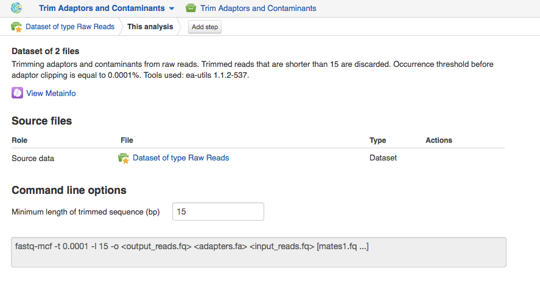

Building pipelines
------------------
Select the assays you wish to analyse and from the menu on top of
the page or from the dropdown menu, select the first application you wish to see
in your pipeline. Application on The Platform are divided in several categories
such as *Preprocess* to prepare the data for actual analysis, *Analyse* perform
various kinds of analysis, *Explore* to visualise QC check or analysis results
and *Manage* to operate with your files. For each individual file the system
suggests only applications that can be used to analyse your data, considering
its type and metadata.

.. image:: images/pipeline_building.png

This will take you to the application page where you can:

- learn more about the application;
- view and edit application parameters;
- explore your results;
- add further steps to the file data flow (the pipeline).

To proceed click on **Add step** button that will show you the list of all the
matching applications.

Continue adding steps until you have completed building your pipeline. When
you add each of the steps, you create new files which end up in the **Created files**
folder. However, these files are not yet ready to use — they need to be
initialized first.
