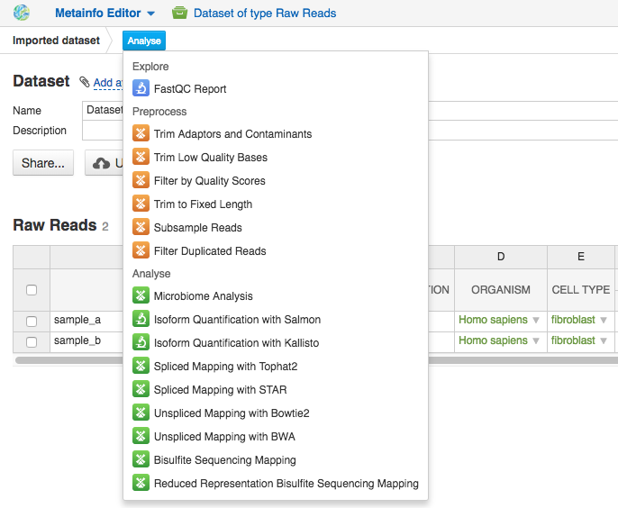

Building pipelines
------------------

Bioinformatic data analysis includes several steps, these steps vary depending on the type of
the data and your goals. For instance, WGS data analysis includes the following steps: check
the initial quality of raw reads, preprocessing of the data to improve the quality,
if it is needed, and alignment the reads onto a reference genome followed by identification
and annotation of genetic variants.

With Genestack you can either use one of the dataflows or build a pipeline
manually selecting customizable applications supported by the system.

Use Data browser to find a dataset you would like to analyse, click on it.
Then, on the Metainfo Editor page select the assays you wish to analyse and click
on the button marked **Use Dataset** to start creating your pipeline.

Applications on the platform are divided in several categories
such as *Preprocess* to prepare the data for actual analysis, *Analyse* perform
various kinds of analysis, *Explore* to visualise QC check or analysis results
and *Manage* to operate with your files. For each individual file the system
suggests only applications that can be used to analyse your data, considering
its type and metadata. Select the first application you wish to see in your pipeline.

This will take you to the application page where you can:

- learn more about the application;
- view and edit application parameters;
- explore your results;
- add further steps to the file data flow (the pipeline).

.. image:: images/cla_page.png

To proceed click on **Add step** button that will show you the list of all the
matching applications.

Continue adding steps until you have completed building your pipeline. When
you add each of the steps, you create new files which end up in the **Created files**
folder. However, these files are not yet ready to use — they need to be
initialized first.
