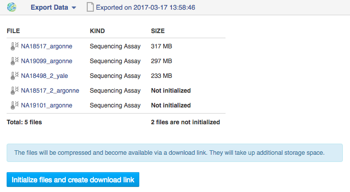

.. _data-export-label:

Data export
-----------

Genestack provides secure data storage and **Export Data** application
allows to safely download both assays and analysis results together with
attached metadata to a local machine.

Select those files you are going to export, right-click on them and choose
**Export Data** application. On the application page you will see the status of
your files, and if some of them are not initialized, you will be suggested to
initialize them prior to export.

If you change your mind, you can stop exporting process by click on **Cancel**
button.

.. image:: images/export2.png

The application creates an Export File that contains a special link to download
the selected assays, that is accessible until the corresponding Export File is
deleted. **Sharing the link** enables your collaborator to download data even if they
do not have a Genestack account. All the Export files are stored in the
“Exports” folder.

.. image:: images/export3.png
