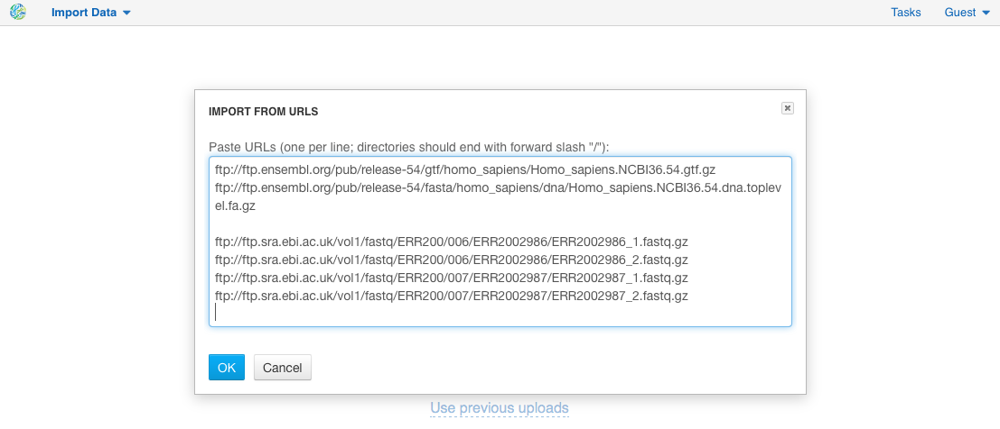
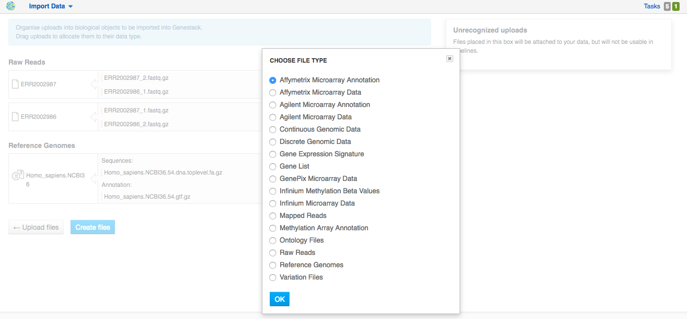
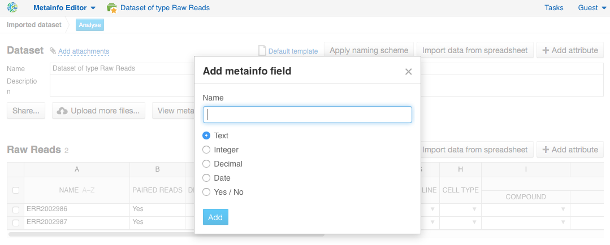
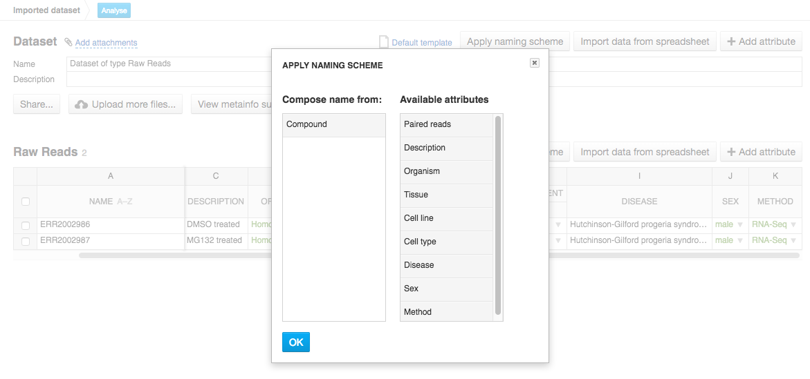
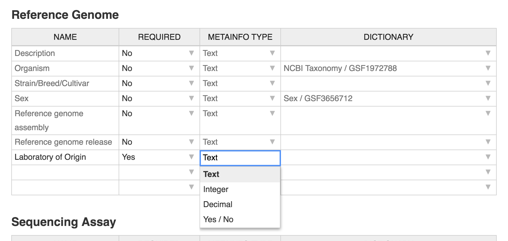
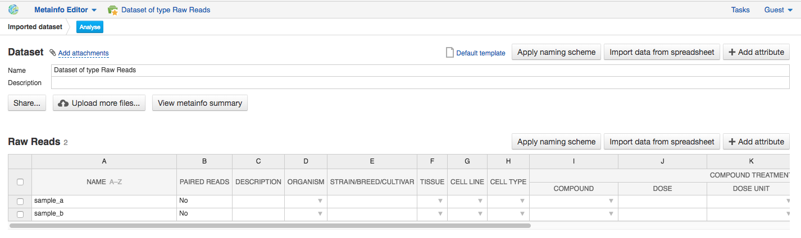
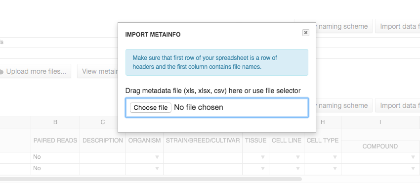

Importing data
--------------

Supported file types
~~~~~~~~~~~~~~~~~~~~

Here is a list of file types that can be imported into Genestack.
Note that gzippped (.gz) and zipped (.zip) files are also supported.

- **Microarray Data** — raw microarray data obtained from a microarray
  experiment (you can import Affymetrix (CEL), Agilent (TXT) or GenePix microarray data (GPR));
- **Infinium Microarray Data** — raw intensity data files for Illumina Infinium Microarrays (IDAT);
- **Infinium Methylation Beta Values** - methylation data matrices contained Beta-values
  (methylation ratios) for Illumina Infinium Microarrays (.tsv, .txt);

.. need to verify **Methylation Array Annotation**

- **Methylation Array Annotation** - methylation chip annotation containing information about
  association of microarray probes to known genes (.tsv);
- **Raw Reads** — raw sequencing data (FASTQ, SRA or FASTA+QUAL);
- **Microarray Annotation** — annotation file containing information about
  association of microarray probes to biological entities like genes,
  transcripts and proteins;
- **Continuous Genomic Data** — contains information on continuous genome
  statistics, e.g. GC% content (WIGGLE, WIG);
- **Discrete Genomic Data** — information on discrete regions of the genome
  with an exact start and end position (BED);
- **Mapped Reads** — reads aligned to a specific reference genome (BAM or CRAM);
- **Ontology Files** — OWL, OBO or CSV files used to annotate metainfo;
- **Reference Genome** — Reference genome sequence for a specific organism
  with annotation; (FASTA and GTF/GFF);
- **Variation Files** — Genetic Variations files, storing gene sequence
  variations (VCF);
- **Gene List** - the file includes the list of genes for a specific organism (.gpr, .txt, .tsv);
- **Gene Expression Signature** - the file includes the list of genes with expression pattern
  specific to an organism phenotype according to statistical significance (filtering based on p-value) (.gpr, .txt, .tsv).

When you upload microarrays or sequencing assays onto the platform, they will
be automatically imported as a dataset.

- **Dataset** — A dataset is a special type of folder that can only
  contain assays. When you import files that are detected as raw sequencing or
  microarray assays, Genestack creates a dataset and adds the assays to it.

- **Dataset attachments** additional documents in any file format (e.g. PDF, Word, text, etc.)
  can be uploaded as an attachment to a dataset. We will discuss the use of attachments below.

Moreover, when you perform any analysis on Genestack, you can create other data
types, which cannot be imported. They include:

- **Affymetrix/Agilent/GenePix Microarrays Normalisation** — File with
  normalized Affymetrix/Agilent/GenePix microarrays data;
- **Differential Expression Statistics** — expression statistics for
  change in expression of individual genes or other genomic features between groups of samples,
  such as fold-changes, p-values, FDR, etc.;
- **Genome Annotations** — A technical file used for matching GO terms and
  gene symbols to gene coordinates;
- **Mapped Read Counts** — The number of reads mapped to each feature of a reference
  sequence. Produced from Mapped Reads files.

Data import
~~~~~~~~~~~

There are several ways you can access the **Import** application:

- using the **Import data** link on the Welcome Page;

.. image:: images/WP_import.png

- clicking the **Import** button in the File Manager;

.. image:: images/FM_import.png

- using an **import template**. We will describe what import template is and how to
  use it later in the guide.

.. image:: images/IT_import.png

Import data includes three steps:

Step 1: Uploading files
+++++++++++++++++++++++

There are two ways to upload data into the platform:

1. **Use data from your computer** — select or drag-and-drop files.

.. image:: images/import_start.png

2. **Upload from URLs (FTP or HTTP/HTTPS)** — specify URLs for separate files or
   directories.

The **Use previous uploads** option allows you to avoid uploading the data a
second time.

Files are uploaded in multiple streams to increase upload speed. Uploading
from URLs is done in the background. This means that even while these files
are being uploaded, you can edit their metadata and use them in
pipelines.

.. image:: images/uploading_step.png

If during uploading you lose your Internet connection, you will be able to
resume unfinished uploads later.

.. image:: images/resumed_uploads.png
   :scale: 85 %

Click the **Create files** button to proceed.

Step 2: Format recognition
++++++++++++++++++++++++++

After your data is uploaded, Genestack automatically recognizes file formats
and transforms them into biological data types: raw reads, mapped reads,
reference genomes, etc. Format conversions will be handled internally by
Genestack. You will not have to worry about formats at all.

.. image:: images/file_recognition.png

If files are unrecognized or recognized incorrectly, you can manually allocate
them to a specific data type: drag the raw file and move it to the green
"Choose type" box at the top of the page.

.. image:: images/unrecognized_uploads.png

Choose the data type you find suitable:

Click the **Create files** button to proceed.

Step 3: Editing metainfo
++++++++++++++++++++++++

In this step, you can describe uploaded data using an Excel-like spreadsheet.
Importantly, during this step, the import has already completed - you will
notice a message at the top of the page with the name of the folder where
the imported files are located (named "Imported on <date> <time>"), and
offering to share the data:

.. image:: images/import_edit_metainfo.png

By default, you see all metainfo fields available for files, you can fill them
or create new custom columns. Click the **Add column** button, name new metainfo
field and choose its type (Text, Integer, etc.):

You can also choose to apply a naming scheme. This allows you to generate
file names automatically based on other metainfo attributes.

Metainfo fields can be associated with specific dictionaries and
ontologies. We pre-uploaded some public dictionaries such as the
`NCBI Taxonomy`_ (for the Organism field), Cellosaurus_ (for Cell Line),
ChEBI_ for chemical compounds, and the `Cell ontology`_.

.. _NCBI Taxonomy: https://www.ncbi.nlm.nih.gov/taxonomy
.. _Cellosaurus: http://web.expasy.org/cellosaurus/description.html
.. _ChEBI: https://www.ebi.ac.uk/chebi
.. _Cell ontology: http://www.obofoundry.org/ontology/cl.html

We also created our own controlled vocabularies to cover the Sex, Method and Platform fields.
You can find out more about ontologies in the :ref:`public-experiment-label` section.

Finally, you can also create your own custom dictionary by importing it into the
platform as OWL, OBO or CSV file and attach it to the import template.

.. note:: **What is an import template?**

          Import templates allow you to select what metainfo attributes of your imported
          files will be tightly controlled (so you don’t lose any information in the
          process). Import templates allow you to set default fields for file metadata
          based on file type (e.g. Experiments, Discrete Genomic Data, Genetic
          Variations, etc.). Of course, if you’re only importing mapped reads, you don’t
          need to specify metainfo attributes for other data types.

You can select which import template to use in two ways: from the Welcome
Page, or during the 3rd step of the import process by right-clicking on the
import template name ("Default template" is for the public one). You can add
new import templates using the **Import Template Editor** application, which can be
found by clicking "Add import template" from the Welcome Page or from the
"Manage" submenu when you right click on an import template.

.. image:: images/import_templates.png
   :scale: 45 %

Genestack will attempt to fill these fields automatically, but you can always
edit the contents manually during the import process. By using metainfo
templates you can make sure that all of your files will be adequately and
consistently described so you will not lose any valuable information. For
example, here is the list of metainfo attributes used by default to describe
Reference Genome data:

.. image:: images/default_import_template.png

Now let’s say you wish to create an import template where you want to control
the metainfo attributes of sequencing assays (e.g. you always need to know the
tissue and sex of your samples). In order to do this, click on "Add import
template", then look for the table related to Sequencing Assays and for the
fields "tissue" and "sex", change the required fields to ‘Yes’. As you can
see, the system controls what type of information can you put into your
metainfo fields. In this case, for tissue the system will map your entries to
the Uberon ontology and the metainfo type must be text. You can edit
existing templates by right-clicking on a template and selecting the **Import
Template Editor** application from the "Manage" submenu.

If you wanted to add other metainfo fields that are not included in the table
already, you can do this at the bottom of the table where there are blank
spaces. For each entry, you must specify whether or not this field is
required and what is its metainfo type (e.g. text, yes/no, integer).

If you are using a file kind that is not yet listed, you can add a new one by
clicking on the **Add File Kind** button at the bottom of the page and
specifying the required metainfo attributes. Keep in mind that file kinds are
defined in Genestack - you will not be able to create a template entry for a
file kind that is not used on the platform.

When you’re done, click on the blue "Import data using this template" button.
This will take you to the import page, where you can go through three import
stages described above.

Once you have completed the metainfo editing step, you may see a "Use files in
data flow" button at the bottom of the page by "Import files". This depends on
the file type you have imported. Later you can find your files in the "Imported
files" folder which can be accessed from the Dashboard and from the File
Manager.

Metadata import
~~~~~~~~~~~~~~~

Apart from editing metainformation manually, you can also import and validate the metainfo attached to the assays and
to the dataset on the platform.

Click **Import data from spreadsheet** button and select a local CSV or
Excel file containing metadata you would like to associate with the imported assays.

Note that names in the first column in the file with metadata should exactly match names of the data
samples on the platform, based on the first "Name" column. For example, in our case metainfo
for the second sample does not match to any assays and is highlighted in red.

.. image:: images/import_metainfo_table_red.png

Use the **Select file** option to manually allocate the imported metadata to an appropriate
file.

.. image:: images/import_metainfo-select-file.png

Columns that are mapped to a metainfo field from the dataset's
template (by default data are imported with "Default" template) are highlighted in green.

.. image:: images/import_metainfo_table-green.png

On this step for each column you can specify whether it should be imported or not, and if it
should be mapped to some metainfo key from the import template, by clicking on the column header.

Click **Import** when you finish editing the table. As a result, the table on the Metainfo Editor
page is filled in with metadata from the Excel-file.

For instance, in this case we added new column
"Age" and filled "Organism", "Sex", "Tissue" and "Platform" columns that came from the default template.

Attachments
~~~~~~~~~~~

While importing a dataset into Genestack (just to remind you, an
dataset is a special folder that is created when you import sequencing or
microarray assays) you can choose to attach various files to it. For
example, you could include a PDF file with the experiment plan, an R script
that you used to process your data, etc. When you open your newly-imported
datasets, all of the attachments will accompany it. They will be safely
stored on Genestack, so later you can download them from the platform, in case
they get lost on your computer.

**How to upload an attachment?**

Attachments should be uploaded together with the dataset. In the the Import application, choose
the attachments from your computer along with your dataset. The platform will
recognize the raw data, and all additional files that were unrecognised will
be added to the dataset as attachments.

.. image:: images/attachments.png

All the unrecognised uploads will be stored as attachments to your
dataset. You can also upload more attachments, or remove attachments at the last step of import — edit
metainfo.

.. image:: images/exp_attachments.png
