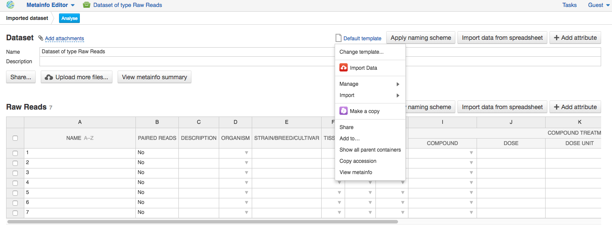
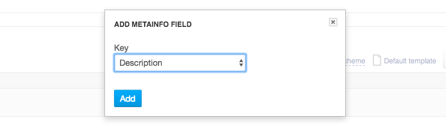
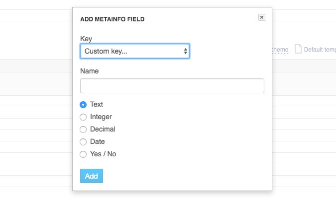

.. _public-experiment-label:

Public experiments, automated data curation and managing metadata
-----------------------------------------------------------------

Our platform provides you with a huge collection of freely accessible experiments that we
imported from various well-known repositories, such as GEO NCBI, ENA, SRA and Array Express.
All the public experiments and assays are accompanied by original metainformation
describing biological data. Generally, this information is not standardized that makes operations
with biological data, like browsing data and combining assays from several experiments or reproducing some
analysis, difficult or even impossible without human participation.
To harmonize raw metadata we apply **automated curation** where we map raw entries to
controlled terms that we store and maintain in special files called **Dictionaries**.
To prepare these Dictionaries we adopted terms from external ontologies or created them manually.
You can also use our standardized and unified terminology to describe your own data
or analysis results.

Our **Edit Metainfo** application enable you to prepare metadata manually. You can edit metadata on
the last step of data importing process (see Import section for more information) or
later from any place of the platform with context menu.

Regardless the way we access Edit Metainfo application on its page we can see that
our files are broken down into groups by file type and their metadata are shown in tables where
rows represents metainfo fields.

.. image:: images/metainfo-editor.png

By default a table is based on **Default Import Template** that, however, you
can easily replace with a custom one (learn more about templates in the section
Importing data). To do so click on the template's name, select **Change
template**, then in the appear pop-up window pick template of interest.

When you start typing in the corresponding cell, you will be suggested with
terms from our controlled dictionaries if possible. Although, you are free to
enter any values, we encourage you to use our standartized terminology, that
helps you to avoid typos and harmonise metadata.

.. image:: images/tissue-dict.png

Furthermore, you can add several terms to one metadata field for each file. To
do so enter the first term as usual, click the button **Add another** and
either add one of the existing fields or create your own one (i.e. custom key).

.. image:: images/add-attribute.png

If you create new metadata field, you also need to specify its type: for
example, for free-text values you should select "Text", and for numeric value
you should use "Integer" or "Decimal" one.

Click column name to **sort** metadata or **delete** the selected column if needed.

.. image:: images/sort.png

Besides filling metadata manually in the application, you can import it from
your local computer. Click the **Import data from spreadsheet** button and
select a CSV, XLS or XLSX file with metadata that you would like to attach.

.. image:: images/from-spreadsheet-1.png

However, make sure that names of samples in the imported file are the same as
the ones shown in the column "Name" in Metainfo Editor application. Otherwise,
all not matching information in the imported file will not be imported. It will
be marked in red, so you could easily fix it by clicking on "Select file" link.

.. image:: images/from-spreadsheet-2.png

During metadata import process you can also decide whether a column should be imported and
associate it with another metadata field by click on the name of the column.

.. image:: images/from-spreadsheet-3.png

When you complete describing your samples, you can use the metadata to name
them. Click **Apply naming scheme** button and select metainfo fields that you
want to use to create names.

.. image:: images/naming-scheme.png

Once you are happy with the metadata for your files, you can proceed to analyse
them by clicking the button **Use dataset**. You can use the suggested
visualize applications to explore your files, like "FastQC Report" to check the
quality of raw reads, use on of the existing public data flows or
build your own pipeline by adding applications step-by-step. Moreover, you
could share the files with your collaborators and add them to a folder of your
choice.

.. image:: images/run-df-from-me.png
