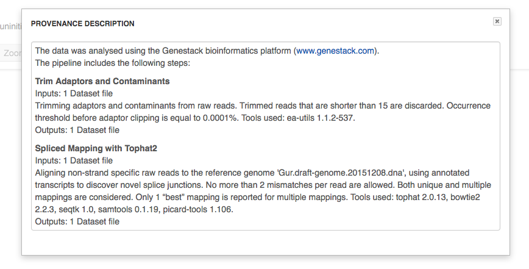
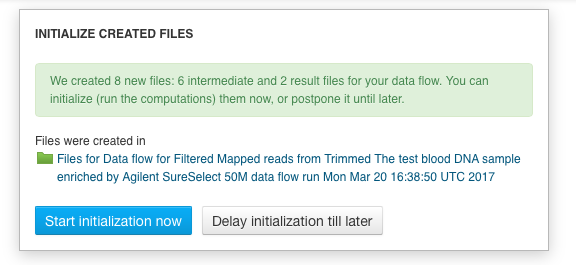

Reproducing your work
---------------------

Complete reproducibility is one of the core strengths of Genestack. For any
file in the system, you can view its provenance and then replay the same
exact analysis on other data files. Select assay which history you wish
to explore and open it with **File Provenance** application
located in the Manage section.

.. image:: images/file_provenance.png

Besides that, the File Provenance application allows you to view the text description of the
pipeline used to create a given file. Clicking the **View as text** button
allows you to see what parameters and what tool versions were used at each
analytical step. You can copy this text and use it in a publication or a report.

Clicking the **New folder with files** button will create a folder with all the
files used in this pipeline.

If you want to reuse the same pipeline on different data, you can
create the data flow identical to the pipeline used to create the original file,
by selecting the file of interest and choosing **Create new Data Flow** from the
available "Manage" applications.

.. image:: images/data-flow-editor-1.png

This will open **Data Flow Editor** application — one of applications in our system that are
used to work on data flows. Data Flow Editor application gives a visual
representation of the pipeline and allows you to choose your input files, for example
sequencing assays, and a reference genome. We would like to highlight here also that
a range of public reference genomes have already imported from Ensembl and readily
available on the platform. To add new inputs to the created data flow click choose sources.

 .. image:: images/data-flow-editor-2.png

At this stage, no files have been created nor initialized.

.. image:: images/data-flow-editor-3.png

When you click on "Run Data Flow" button, this will take you to the **Data Flow
Runner** application. Click **Run dataflow** button to create all the relevant
files in an uninitialized state.

.. image:: images/data-flow-runner-1.png

Separate file is created for each individual input file on every step of analysis.
You can find them in separate folder in the "Created files" folder.

.. image:: images/data-flow-runner-2.png

When the files are created, you will be suggested to either start initialization right away
or delay it till later.

Remember, that you can check and change parameters if needed only before computations started.
To do so, click application name in the corresponding node of the data flow.
However just as initialization process started, any changes of files are forbidden.

Finally, whether you decide to start the computation or not, you will be suggested with
a list of matching application to explore results or continue analysis.

.. image:: images/data-flow-runner-4.png
