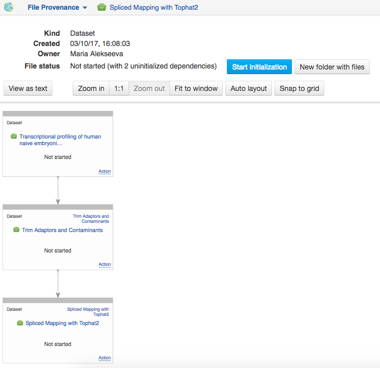
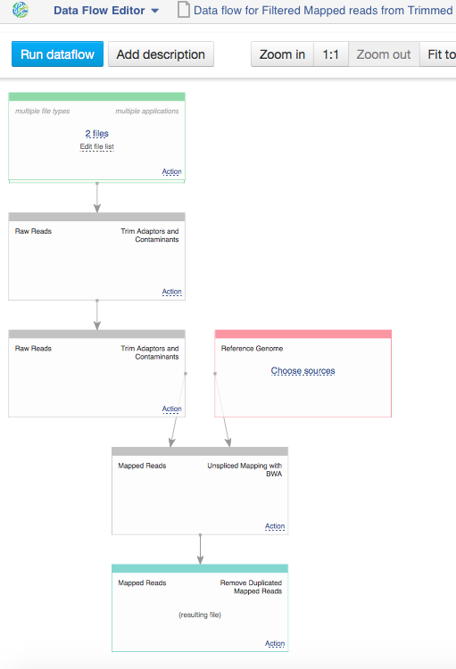
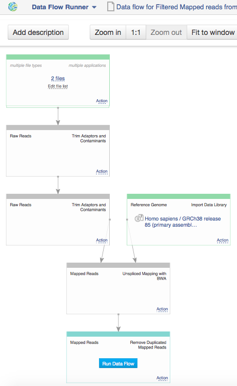
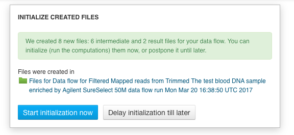
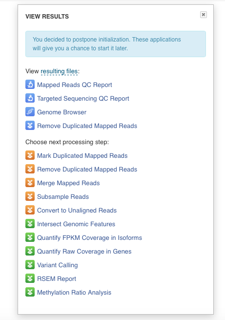

Reproducing your work
---------------------

For any datasets in the system, you can learn where the data came from and replay the same
exact analysis on other data.

- **File Provenance** application allows you to explore the history of data, to learn how a given
  dataset was generated. Click the **New folder with files** button makes a folder where all
  the files used in the pipeline are located.

View the text description of the pipeline including all the steps.
Click **View as text** button to see which applications, parameters and tools were used at each
step of the analysis.

.. image:: images/view_as_text.png
    :scale: 60 %
    :align: center

- If you want to reuse the same pipeline on different data, you can create the data flow
  identical to the pipeline used to create the original file, by selecting the file of interest
  and choosing **Create new Data Flow** from the available "Manage" applications. This will open
  **Data Flow Editor** application that gives a visual representation of the pipeline and allows
  you to choose your input files, such as raw reads and a reference genome. We would
  like to highlight here also that a range of public reference genomes have already imported from
  Ensembl and readily available on the platform. To add new inputs to the created data flow
  click choose sources. At this stage, no files have been created nor initialized.

Click **Run Dataflow** button to continue, it will take you to the **Data Flow
Runner** application.

- **Data Flow Runner** application allows you to run the pipeline.
  Click **Run dataflow** button to create all the relevant files in an uninitialized state.
  A separate file is created for each individual input file at every step of analysis.
  You can find them in a separate folder in the "Created files" folder.

When the files are created, you will be suggested to either start initialization right away
or delay it till later. You can check and change parameters if needed only before computations
started. To do so, click application name in the corresponding node of the data flow. However
just as initialization process started, any changes of files are forbidden.

Finally, whether you decide to start the computation or not, you will be suggested with
a list of matching applications to explore results or continue analysis.

