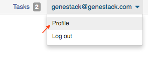
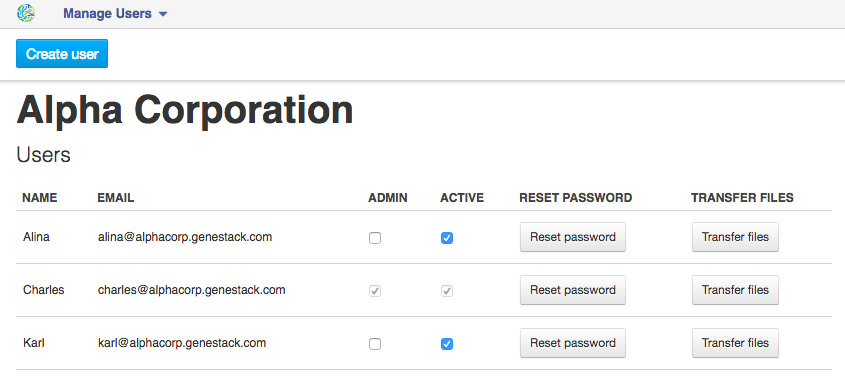
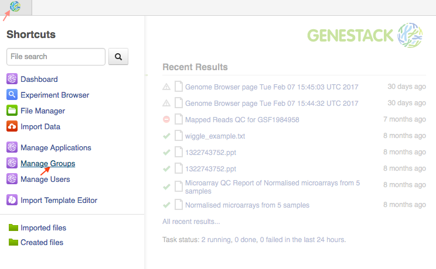
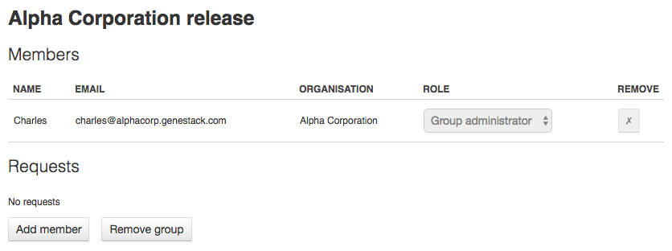
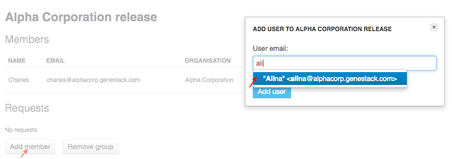
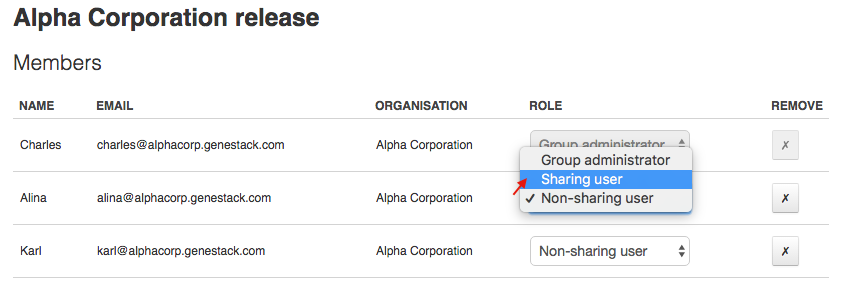
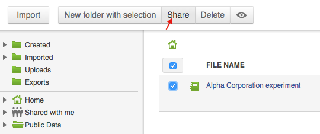
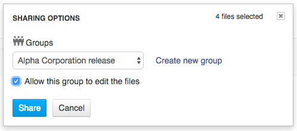
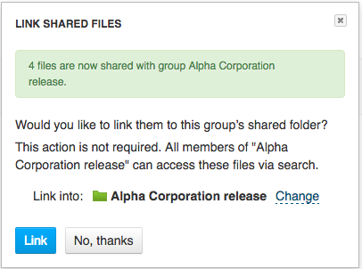
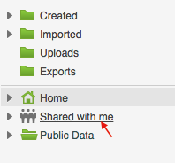

Sharing data and collaboration
------------------------------

Access control model
~~~~~~~~~~~~~~~~~~~~

There are three concepts around access control in Genestack: **users**, **groups**
and **organisations**. Each user belongs to a single organisation (typically
corresponding to the user's company or institution, or a specific team within
the institution). Organisations have two types of users: regular users and
administrators, who have the right to add new users, and deactivate existing
ones.

To check which organisation you belong to, you can go to the "Profile" page,
accessible via the menu which opens when you click on your email address at the
top-right corner of any page.

Managing users
~~~~~~~~~~~~~~

**If you are an administrator of your organisation**, the menu under your email
address will also have an additional item, "Manage Users", which takes you to
the organisation's user management page.

.. image:: images/profile_manage_users.png

From there, administrators can add or disable users, and reset passwords.

Sharing in Genestack is done through groups: every user can create any number
of groups, and add other users to them. Each file in the system can be shared
with any number of groups, who are granted different permissions (read-only,
read and write, etc.).

Managing groups
~~~~~~~~~~~~~~~

To manage your groups, click on your email address at the top-right corner of
any screen and select "Manage Groups".

From there, you can create groups using the "Create group" button, add or remove
people from groups, and change users' privileges within groups. By default, you
will be a group administrator of any group that is created by your user.

If you are an administrator of a group, you can click the "Add member" button
to add people to a group. From there you will be prompted for the e-mail of the
user you want to add. If they are in your organisation, you will be provided
with autocomplete.

.. note:: **Can I add users from other organisations?**

          You can also add users from other organisations to a group
          ("cross-organisation group"). However, in that case, every user invitation will
          need to be approved by an organisation administrator of both your organisation
          and the other user's organisation.

Once you have added a user from your organisation to the newly created group,
you will also be able to set up their permissions within the group. Within a
group, a user can be:

- **Non-sharing user** (can only view data shared with the group);
- **Sharing user** (can view data shared with the group, and share data);
- **Group administrator** (all of the above, and can add/remove users to the
  group and change users' privileges).

By default, newly added users will be granted the lowest permission level
(Non-sharing user). You can change that using the dropdown next to their name.

.. TODO I don't like the fact that we are linking to tutorials and videos from here

Learn more on how to Create and Manage Groups `in our tutorial`_.

.. _in our tutorial: https://genestack.com/tutorial/managing-and-sharing-data/

Sharing files with a group
~~~~~~~~~~~~~~~~~~~~~~~~~~

If you are a sharing user or an administrator of a group, you can share files
with that group. Any file created on Genestack can be shared.

To share a file, you can select it in the File Manager by ticking the checkbox
next to it, then clicking the "Share" button in the top bar. Alternatively you
can right-click on the file and select the "Share" option in the context menu.

From there, you will be taken to the file sharing dialog, which asks you to
select a group to share the file with. By default, files are shared with
read-only permissions (both for data and metadata). But you have the option of
giving members the ability to edit the files in addition to just viewing them.

Once you click the blue "Share" button, you will be prompted for your password,
and then asked whether you would like to link the file into the group's shared
folder.

If you link the file into that folder, it will be visible to the group's users
when they open that folder (which can make it easier for them to find it). If
you click "No", the file will not be linked into the group folder but the
group's users will still be able to find the file through the File Search box
(for instance, if you tell them the accession of the file), in File Provenance
and through the Experiment Browser.

Each group has an associated group folder which you can access from the File
Manager under "Shared with me" in the left-hand side panel.

All files you share with other people, along with all files shared with you,
will be located in that folder.
