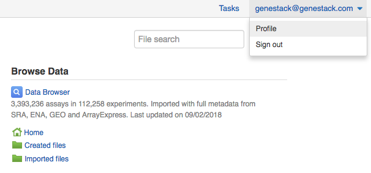
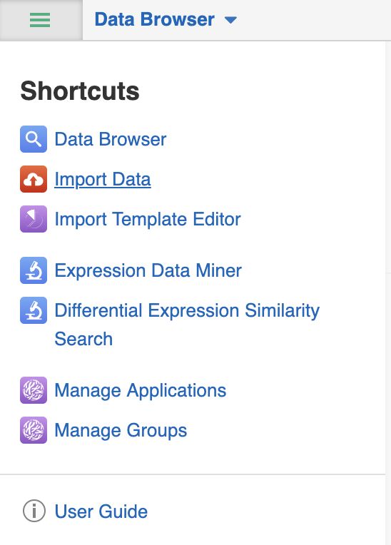
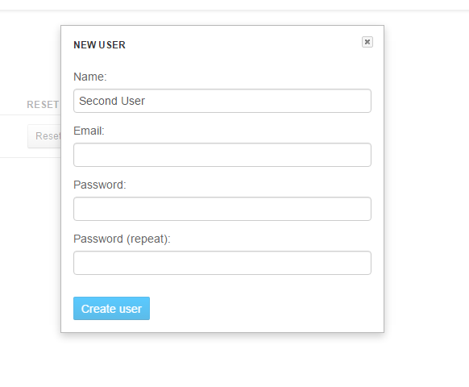

.. _using-genestack-label:

Using Genestack
===============

Creating an account
-------------------

If you have not done so already, you can create an account on Genestack.
Go to `platform.genestack.org`_, click on **Sign Up**, fill in the form and
wait for a confirmation email.

.. image:: images/sign-up-screen.png
   :align: center
   :scale: 80%

.. _platform.genestack.org: https://platform.genestack.org

If you are just taking Genestack out for a spin, you can also use our platform
as a guest (by clicking on **Continue as guest** button). However, remember that as a guest,
you can only create up to 200 files, and your results will disappear after 24h
of inactivity.

Dashboard
---------

After you log in, you will see the **Dashboard**.  Let’s cover the basics.

.. image:: images/welcome_page.png
   :align: center

The very top of the page is static and you can always refer to it. Clicking
on your username (your email address) in the top right corner of the page will
give you access to your **profile** and allows to log out of the platform.

In this section you can change your name, password, the name of your
organisation and your vendor ID. 

.. image:: images/profile.png
   :align: center

Organizations are a way of enforcing group permissions. There are two
types of user in an organization – administrators and non-administrators. If you are in
the same organization as another user, you can add them to groups you
control and share files with them freely. If you are in different
organizations, administrators from both organizations first need to
approve adding them to the group. You can learn more about data sharing,
permissions and groups in the :ref:`sharing-label` section.

Vendor IDs are used for application development. Applications you have created will be
marked with your vendor ID. Moreover, here you can specify which page you
would like to see after login: Dashboard or File Manager.

**Tasks** links to the Task Manager application, where you can monitor running and
previous computations.

In the bottom right corner of the page you can see the Chatra **chat window**.
You can chat with us at any time if you get stuck or if you find a bug.

Let’s go back to the Dashboard. Here you can find the following sections:

1. **Run Data Flow** includes a collection of *most commonly used data flows*
   we have prepared for our users.
2. **Recent Results** shows you the files you have recently created with 
   their initialization or completion status.
3. **Browse data** section allows you to browse through public, private and
   shared data with Experiment Browser application which allows you to search through
   the wealth of your data using complex queries.
   In the Browse Data section, you will also find a link to the File Manager
   (home), as well as often used folders: Uploaded files, Imported files,
   Created files and Exports.
4. **Import data** allows you to import your data using either a
   custom or the default import template. See the section "Import" for more information.
5. **Tutorials** explain the most common analysis types in greater detail.
6. **Search** across the metadata of all your files using the full-text file
   search text box.

Wherever you are on the platform, you can also access a **shortcuts menu** by
clicking on the Genestack logo in the top left corner of any platform page.
It is an easy way to reach most commonly used applications and folders. Dashboard,
Data Browser, File Manager, Import Data, Manage Applications, Manage Groups,
Manage Users, and Import Template Editor, as well as the folders
for created and imported files can all be found here.

To access the shortcuts
menu, simply click Genestack logo in the upper-left corner of any page.
Let's look deeper into each of these items.

Manage applications
~~~~~~~~~~~~~~~~~~~

.. image:: images/manage_app.png
   :align: center

Here you can view the list of all applications available on the platform
– both ones you have written as well as public ones.

The **Developer** button will give you the option to choose which version of
an application you want to use.

.. image:: images/developer_button.png
   :scale: 85 %
   :align: center

The **‘minified’** options optimizes loading of CSS and JS used in the application. You can find more details on
minifying in `blog post by Dino Esposito`_.

.. _blog post by Dino Esposito: https://msdn.microsoft.com/en-us/magazine/dn451436.aspx

The **Session** and **User** dropdown menus allow you to chose the version of
the application you want to use for your current log-in session and for your
current user account respectively. **Inherit** is the default option and the
order of version choice inheritance is Global → User → Session. If you
change the version of an application, you also need to **reload** it to run
the version of your choice.

Manage groups
~~~~~~~~~~~~~

.. image:: images/manage_groups.png
   :scale: 35 %
   :align: center

In order to share data, we use **groups**. In the Manage Groups section you
can change the settings of your current collaboration groups or create
new ones and invite other users to join. You can also view and accept
all the invitations you have received from other users.
Read more about collaboration on Genestack in the `Sharing Data and Collaboration`_ section.

Manage users
~~~~~~~~~~~~

In this section, you can change password of your users or create new users.
If you click on  **Manage Users** you will go to the user management screen. Every
user in Genestack Platform belongs to an **organisation**. When you signed
up to use Genestack via the sign up dialog, we created a new
organisation for you, and you have automatically become its first user
and its administrator. As an organisation administrator you can create
as many  new users for your organisation as you want. For instance, you
can create accounts for your colleagues. Being in one organisation means
you can share data without any restrictions. The user management screen
allows you to get an overview of all users in your organisation. You can
change a user’s password, make any user an administrator or lock a user
out of the system.

.. image:: images/first-user.png

You can also create new users. Let’s create a Second User by clicking the  **Create user** button.

You will need to set the user name,
email and password. Users added this way are immediately confirmed, and
can log in right away.

You can find more about managing users on Genestack from `this video`_.

.. image:: images/manage_users.png
   :scale: 70 %
   :align: center

.. _this video: https://www.youtube.com/watch?v=asMhUjD_i68&list=PLqGSwEO9VFw1e7Z996-gQWE4vgRZMyY3Z&index=1

.. include:: using-genestack-import_include.rst
.. include:: using-genestack-browse-data_include.rst
.. include:: using-genestack-managing-matadata_include.rst
.. include:: using-genestack-sharing_include.rst
.. include:: using-genestack-building-pipelines_include.rst
.. include:: using-genestack-run-DF_include.rst
.. include:: using-genestack-public-DF_include.rst
.. include:: using-genestack-initialization_include.rst
.. include:: using-genestack-task-manager_include.rst
.. include:: using-genestack-export_include.rst