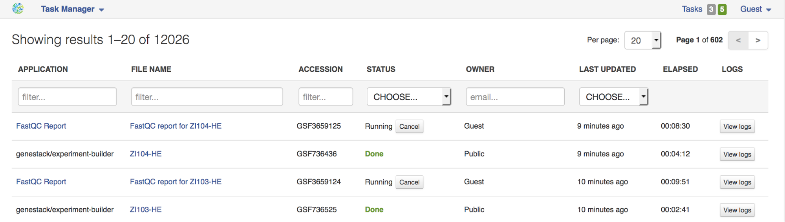
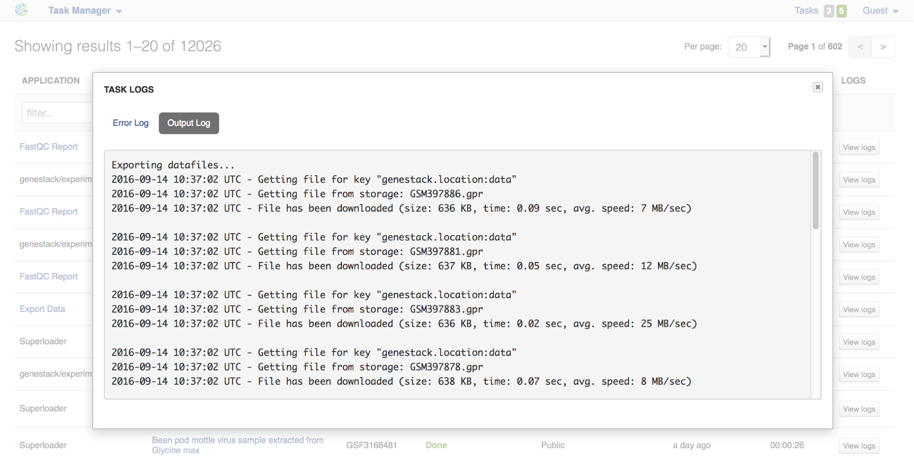

Task manager
------------

In the top-right corner of any page on Genestack, you can see a link called
Tasks. It will take you to the Task Manager, an application which allows you to
track the progress of your computations.

All your tasks can be sorted and filtered by file name, accession, status,
owner, last update and elapsed time. You can also view logs produced for each
computation (error and output log). Error logs tell you why your task has
failed. Output logs contain information about the exact details of what
Genestack does with your files during the computation process, what specific
tools and parameters are used, and so on.

If the computations finished successfully, error logs will be empty, but the
logs can provide you with some basic statistics about the output data.

If you change your mind about a computation after it has started, remember that
you can kill tasks whenever you want by clicking the **Cancel** button, next to
the task status.

Statuses in Task Manager help you keep track of your tasks. Let’s look what
each status means:

-  *Starting* — the computation process has started to run;
-  *Done* — the task has finished successfully;
-  *Failed* — the computation has failed. To find out why, click on "View logs";
-  *Queued* — the task is waiting for dependencies to complete initialization;
-  *Running* — your task is in progress;
-  *Blocked by dependency failure* — the computation cannot be completed
   because a task on which this one depends has failed;
-  *Killed* — the task has been canceled by the user.
