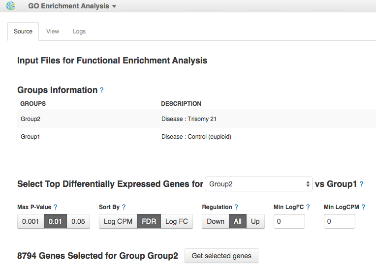
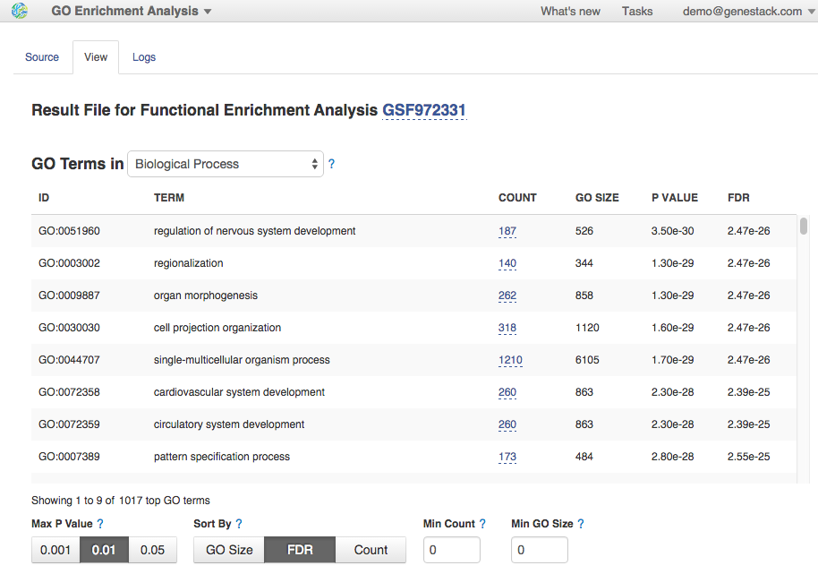
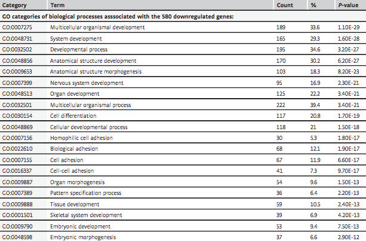
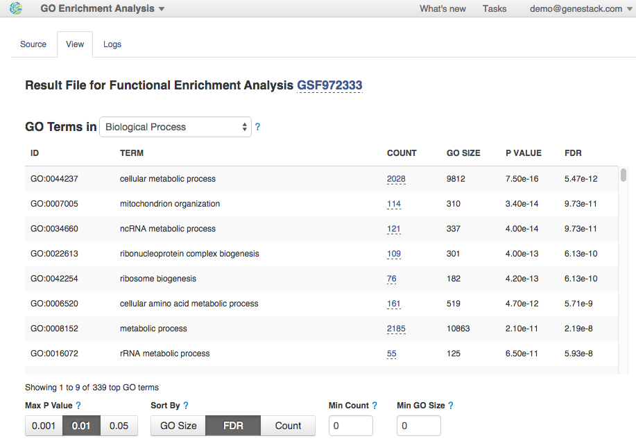
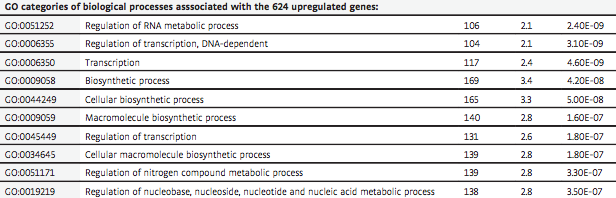

GO-based enrichment analysis
****************************

To further characterise the biological processes that might be affected
in trisomic samples, we performed `the downstream gene ontology (GO)
analysis`_ of the DGE genes. For this, we will use **GO Enrichment Analysis** app,
which performs the classic `Fisher's exact test`_ based on gene counts,
against GO annotations. Open the app on one of the completed Differential
Expression Statistics files:

.. raw:: html

    <iframe width="640" height="360" src="https://www.youtube.com/embed/-RalDy631wk" frameborder="0" allowfullscreen="1">&nbsp;</iframe>

.. _the downstream gene ontology (GO) analysis: http://geneontology.org/
.. _Fisher's exact test: https://en.wikipedia.org/wiki/Fisher%27s_exact_test

Changing the group and thresholds criteria in the **Filter Options**, you can set
what DE genes can be further used for enrichment analysis. Let's run GO Enrichment Analysis app
twice, analysing down- and up-regulated genes separately.

|DGE_GO_filters|

Analysing down-regulated genes we observed significant enrichment for genes
involved in multiple developmental processes specifically in organ development
and morphogenesis, embryonic development and morphogenesis and system
development. Also, we found genes associated with nervous system-related
terms and specifically with nervous system development, brain development,
neurogenesis, generation of neurons, neuron differentiation and axonogenesis.
Moreover, there are some terms linked to cellular adhesion (i.e. biological
adhesion, cell adhesion, cell-cell adhesion) and to the cadherin signalling
pathway. Here is the first 8 of 1017 GO terms related to the biological
processes:

|DGE_down_DGE_genes_GO_terms|

Additionally, you can also review molecular functions or cellular components
that could be affected in Twin-DS-iPSCs. Just change the "Top GO Terms" from
Biological Process category to the corresponding one.

By comparison, this is the table from the paper which listed the first 20
biological processes that might be affected due to trisomy 21:

|DGE_down_paper|

Our GO analysis of the genes up-regulated in trisomic samples revealed
enrichment for functions related to different metabolic and biological
processes, regulation of transcription and DNA-dependent transcription. Here
is the list of the first 8 of 339 biological process GO terms:

|DGE_up_regulated_genes_GO_terms|

Look at the GO terms associated with up-regulated genes and reported in the
paper:

|DGE_up_paper|

All these biological processes can be found in our results. The difference
is in GO counts. But we expected it, because the ontologies are not complete,
they are being expanded constantly during the association of gene products
from the collaborating databases. If you'd like to check it out, open
differential expression statistics files stored in folder `GO enrichment
analysis for Hibaoui et al (2013)`_.

This is the end of this tutorial. We hope you found it useful and that you are now ready to
make the most out of our platform.
If you have any questions and comments, feel free to email us at support@genestack.com or
visit our forum_. Also we invite you to follow us on Twitter `@genestack <https://twitter.com/genestack>`__.

.. _GO enrichment analysis for Hibaoui et al (2013): https://platform.genestack.org/endpoint/application/run/genestack/filebrowser?a=GSF967843&action=viewFile
.. _public experiments: https://platform.genestack.org/endpoint/application/run/genestack/filebrowser?a=GSF070886&action=viewFile
.. _tutorial data flow: https://platform.genestack.org/endpoint/application/run/genestack/dataflowrunner?a=GSF968015&action=createFromSources
.. _forum: http://forum.genestack.org/

