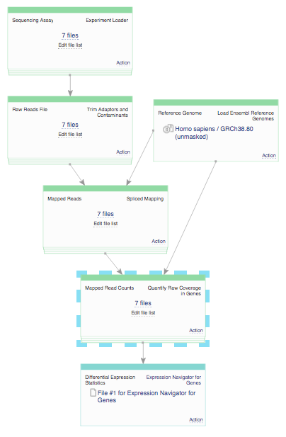
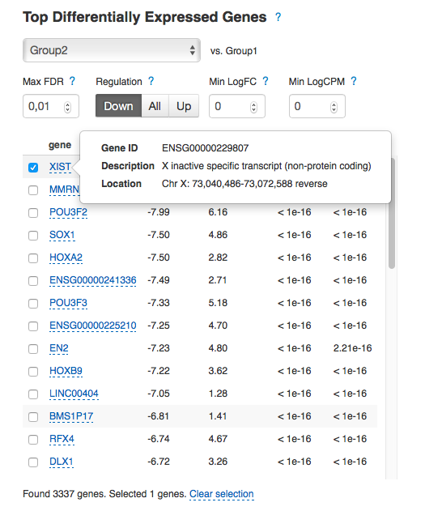
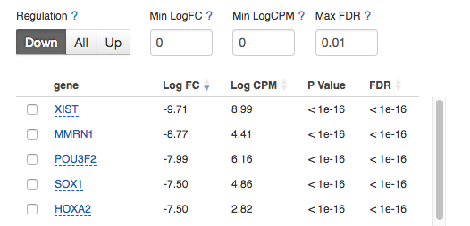
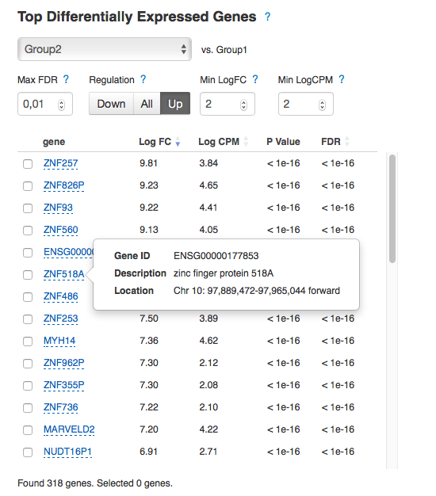
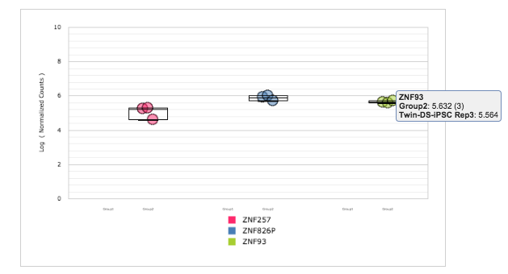

Calculate read coverage for genes
*********************************

After mapping, we can count reads mapped to annotated features (genes, exons,
etc) running Quantify Raw Coverage in Genes app:

|DGE_quantify_genes|

To run the app, click on "7 files" and then "Start initialization". For our
analysis we counted reads mapping within exons, grouping them by gene_id and
assigning reads to all exons they overlap with. We calculated read coverage
in all samples and collected resulting files in `Raw gene counts for Hibaoui
et al (2013) <Raw-reads-QC-folder>`__ folder.

.. _Raw-reads-QC-folder:
    https://platform.genestack.org/endpoint/application/run/genestack/filebrowser?a=GSF967836&action=viewFile

We prepared two Differential Expression Statistics files (considering the DE
genes reported by both packages) and stored them in `Differential gene
expression analysis for Hibaoui et al (2013) <Hibaoui-folder_>`__ folder.  As
an example, let's analyse DE genes reported by DESeq2 package. You can see the
table with top genes that are differentially expressed in one particular group
compared to the average of the other groups. The table shows the corresponding
Log FC (log fold change), Log CPM (log counts per million), p value, and FDR
(false discovery rate) for each gene. Genes with positive Log FC are considered
to be up-regulated in the selected group, ones with negative Log FC are
down-regulated. In the "Trisomy 21" group we identified 4426 low
expressed genes (NR2F1, XIST, NEFM, etc.) and 4368 highly over-expressed genes
(ZNF518A, MYH14, etc.).  By selecting the checkbox next to a gene, more
detailed information about that gene is displayed: its Ensembl identifier,
description and location:

.. _Hibaoui-folder:
    https://platform.genestack.org/endpoint/application/run/genestack/filebrowser?a=GSF967842&action=viewFile

.. here's another way of inserting an image (via substitution, see end of
.. document

|DGE_DGE_table|

There are several options to filter/sort the genes displayed on the Top DEG
Table. You can filter them by p-value, minimum Log FC, minimum CPM and
regulation type. By default, the genes are ranked by their FDR.

|Filters|

Let’s find genes that are most over-expressed in the “Trisomy 21” group, by
lowering the Max P-Value threshold and increasing the Min LogFC and Min LogCPM
thresholds. Change P-Value to 0.001, Regulation to “Up”, set both Min LogFC and
Min LogCPM equal to 2 and apply sorting by LogFC.  As consistent with paper
results, there is a number of zinc finger protein genes that are up-regulated
in Twin-DS-iPSCs:

|zinc_finger|

Interactive counts graph shows gene normalised counts across samples. This
allows you to observe how a gene’s expression level varies within and across
groups.  Select several genes to compare expression level distributions between
them:

|zinc_DGE_plot|

If you move cursor to the top right corner of the graph, 3 icons will appear:

#. **Filter** icon lets you filter the graph data by samples, groups, features,
   etc.

#. **Data** icon will display all the data contained in the graph, and allow you to
   save the table data locally.

#. **Camera** icon lets you save the displayed graph locally. Add labels to the
   graph and change its appearance by modifying the parameters on display when
   you right-click the graph area.

