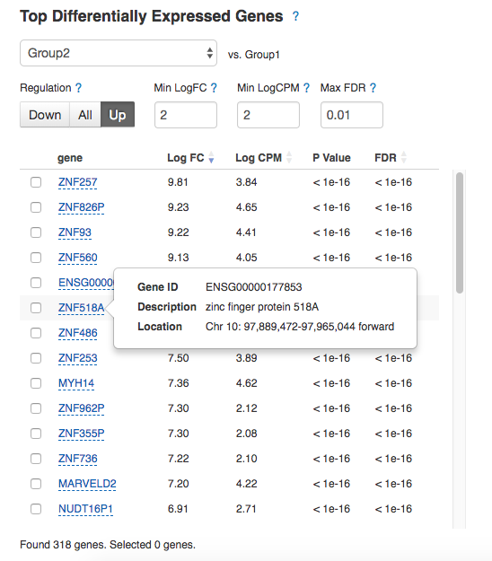
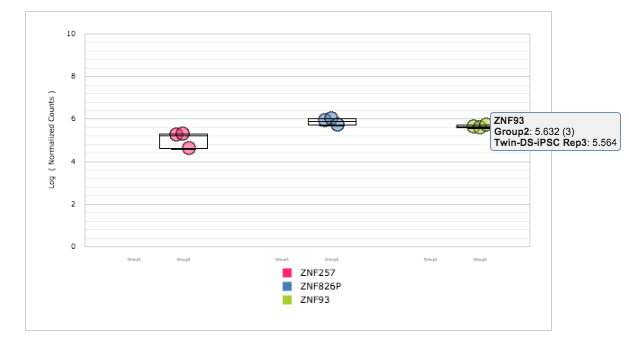

Differential gene expression analysis
*************************************

The final step is to identify genes whose patterns of expression differ
according to different experimental conditions. In this tutorial, we are
looking for variation in gene expression for trisomic samples compared to the
control ones.

Open Expression Navigator file, re-group samples and start the analysis:

.. raw:: html

    <iframe width="640" height="360" src="https://www.youtube.com/embed/yNvAI5WjBjU" frameborder="0" allowfullscreen="1">&nbsp;</iframe>

We prepared two Differential Expression Statistics files (considering the DE
genes reported by both packages) and stored them in `Differential gene
expression analysis for Hibaoui et al (2013)`_ folder. As an example, let's
analyse DE genes reported by DESeq2 package. You can see the table with top
genes that are differentially expressed in one particular group compared to
the average of the other groups. The table shows the corresponding Log FC
(log fold change), Log CPM (log counts per million), p-value, and FDR
(false discovery rate) for each gene. Genes with positive Log FC are considered
to be up-regulated in the selected group, ones with negative Log FC are
down-regulated. In the "Trisomy 21" group we identified 4426 low
expressed genes (NR2F1, XIST, NEFM, etc.) and 4368 highly over-expressed genes
(ZNF518A, MYH14, etc.).  By selecting the checkbox next to a gene, more
detailed information about that gene is displayed: its Ensembl identifier,
description and location.

.. _Differential gene expression analysis for Hibaoui et al (2013): https://platform.genestack.org/endpoint/application/run/genestack/filebrowser?a=GSF967842&action=viewFile

.. image:: images/DGE_DGE_table.png

There are several options to filter/sort the genes displayed on the "Top Differentially Expressed Genes"
table. You can filter them by minimum Log FC, minimum CPM and
regulation type. By default, the genes are ranked by their FDR.

.. image:: images/filters.png

Let’s find genes that are most over-expressed in the “Trisomy 21” group by
lowering the Max P-value threshold and increasing the Min LogFC and Min LogCPM
thresholds. Change Regulation to “Up”, set both Min LogFC and
Min LogCPM equal to '2' and apply sorting by LogFC. As consistent with paper
results, there is a number of zinc finger protein genes that are up-regulated
in Twin-DS-iPSCs:

Interactive counts graph shows gene normalised counts across samples. This
allows you to observe how a gene’s expression level varies within and across
groups. Select several genes to compare expression level distributions between
them:

If you move cursor to the top right corner of the graph, three icons will appear:

#. *Filter* icon lets you filter the graph data by samples, groups, features,
   etc.

#. *Data* icon will display all the data contained in the graph, and allow you to
   save the table data locally.

#. *Camera* icon lets you save the displayed graph locally. Add labels to the
   graph and change its appearance by modifying the parameters on display when
   you right-click the graph area.

This is the end of this tutorial. We hope you found it useful and that you are now ready to
make the most out of our platform.
If you have any questions and comments, feel free to email us at support@genestack.com.
Also we invite you to follow us on Twitter `@genestack <https://twitter.com/genestack>`__.