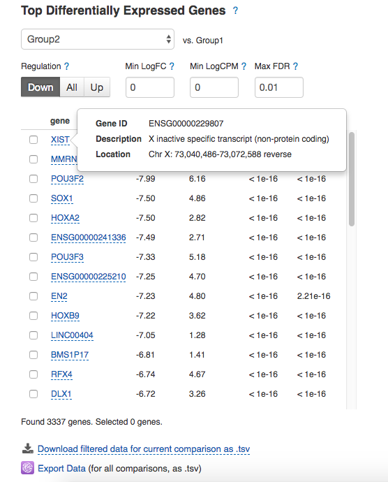
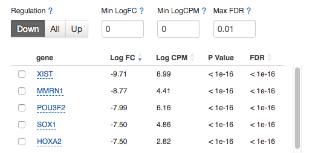
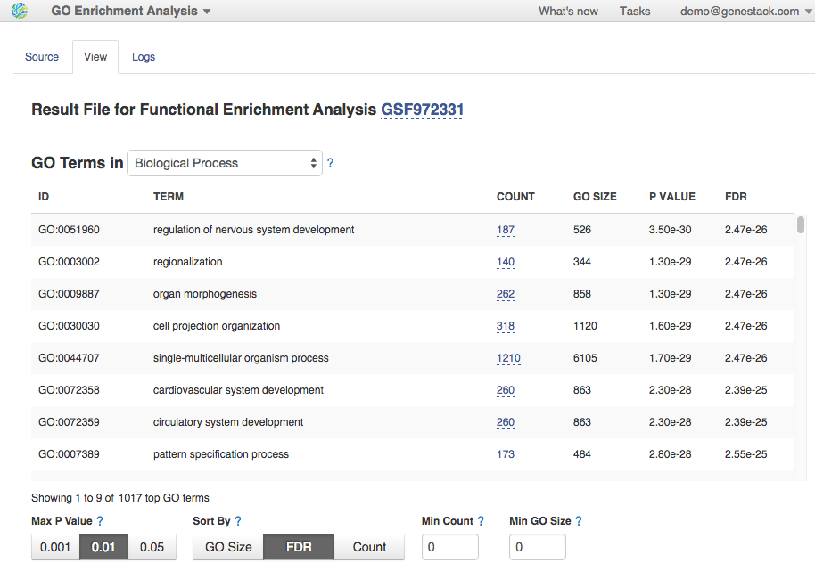
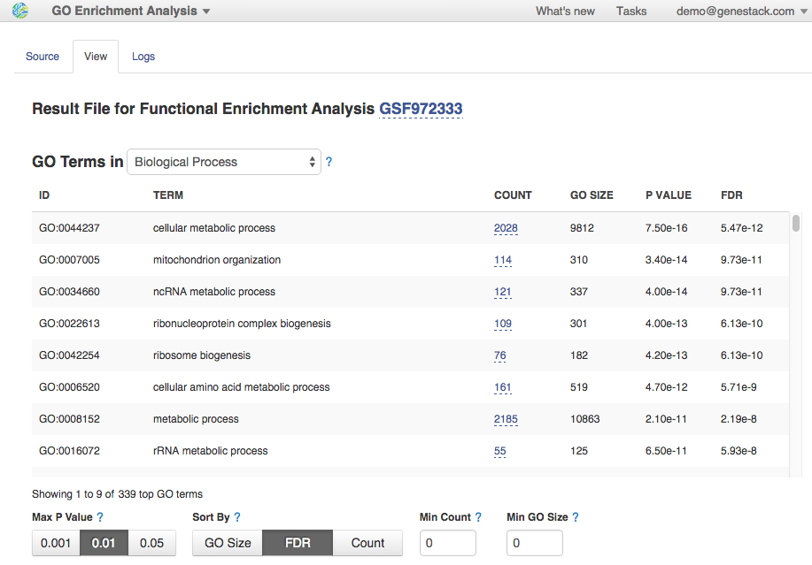
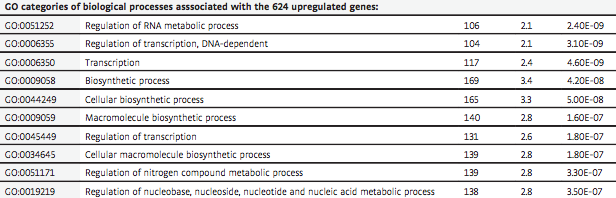

Differential gene expression analysis
*************************************

The final step is to identify genes whose patterns of expression differ
according to different experimental conditions. In this tutorial, we are
looking for variation in gene expression for trisomic samples compared to the
control ones.

.. here's one way of inserting an image
.. image:: images/DGE_DGE.png

Open Expression Navigator file, re-group samples and start the analysis:

.. youtube:: https://www.youtube.com/watch?v=yNvAI5WjBjU

We prepared two Differential Expression Statistics files (considering the DE
genes reported by both packages) and stored them in `Differential gene
expression analysis for Hibaoui et al (2013) <Hibaoui-folder_>`__ folder.  As
an example, let's analyse DE genes reported by DESeq2 package. You can see the
table with top genes that are differentially expressed in one particular group
compared to the average of the other groups. The table shows the corresponding
Log FC (log fold change), Log CPM (log counts per million), p value, and FDR
(false discovery rate) for each gene. Genes with positive Log FC are considered
to be up-regulated in the selected group, ones with negative Log FC are
down-regulated. In the "Trisomy 21" group we identified 4426 low
expressed genes (NR2F1, XIST, NEFM, etc.) and 4368 highly over-expressed genes
(ZNF518A, MYH14, etc.).  By selecting the checkbox next to a gene, more
detailed information about that gene is displayed: its Ensembl identifier,
description and location:

.. _Hibaoui-folder:
    https://platform.genestack.org/endpoint/application/run/genestack/filebrowser?a=GSF967842&action=viewFile

.. here's another way of inserting an image (via substitution, see end of
.. document

|DGE_DGE_table|

There are several options to filter/sort the genes displayed on the Top DEG
Table. You can filter them by p-value, minimum Log FC, minimum CPM and
regulation type. By default, the genes are ranked by their FDR.

|Filters|

Let’s find genes that are most over-expressed in the “Trisomy 21” group, by
lowering the Max P-Value threshold and increasing the Min LogFC and Min LogCPM
thresholds. Change P-Value to 0.001, Regulation to “Up”, set both Min LogFC and
Min LogCPM equal to 2 and apply sorting by LogFC.  As consistent with paper
results, there is a number of zinc finger protein genes that are up-regulated
in Twin-DS-iPSCs:

|zinc_finger|

Interactive counts graph shows gene normalised counts across samples. This
allows you to observe how a gene’s expression level varies within and across
groups.  Select several genes to compare expression level distributions between
them:

|zinc_DGE_plot|

If you move cursor to the top right corner of the graph, 3 icons will appear:

#. Filter icon lets you filter the graph data by samples, groups, features,
   etc.

#. Data icon will display all the data contained in the graph, and allow you to
   save the table data locally.

#. Camera icon lets you save the displayed graph locally. Add labels to the
   graph and change its appearance by modifying the parameters on display when
   you right-click the graph area.

.. |zinc_finger| image:: images/zinc_finger.png

.. |zinc_DGE_plot| image:: images/zinc_DGE_plot.png

GO-based enrichment analysis
****************************

To further characterise the biological processes that might be affected
in trisomic samples, we performed `the downstream gene ontology (GO)
analysis <http://geneontology.org/>`__ of the DGE genes. For this, we'll
use GO Enrichment Analysis app, which performs the classic `Fisher's
exact test <https://en.wikipedia.org/wiki/Fisher%27s_exact_test>`__
based on gene counts, against GO annotations.  Open the app on one of
the completed Differential Expression Statistics files:

Changing the group and thresholds criteria in the "Filter Options", you
can set what DE genes can be further used for enrichment analysis. Let's
run GO app twice, analysing down- and up-regulated genes separately.
|DGE_GO_filters| Analysing down-regulated genes we
observed significant enrichment for genes involved in multiple
developmental processes specifically in organ development and
morphogenesis, embryonic development and morphogenesis and system
development. Also, we found genes associated with nervous system-related
terms and specifically with nervous system development, brain
development, neurogenesis, generation of neurons, neuron differentiation
and axonogenesis. Moreover, there are some terms linked to cellular
adhesion (i.e. biological adhesion, cell adhesion, cell-cell adhesion)
and to the cadherin signalling pathway. Here is the first 8 of 1017 GO
terms related to the biological processes:
|DGE_down_DGE_genes_GO_terms| Additionally, you can also
review molecular functions or cellular components that could be affected
in Twin-DS-iPSCs. Just change the "Top GO Terms" from "Biological Process"
category to the corresponding one. By comparison, this is the table from
the paper which listed the first 20 biological processes that might be
affected due to trisomy 21: |DGE_down_paper| Our GO analysis of the
genes up-regulated in trisomic samples revealed enrichment for functions
related to different metabolic and biological processes, regulation of
transcription and DNA-dependent transcription. Here is the list of the
first 8 of 339 biological process GO terms:
|DGE_up_regulated_genes_GO_terms| Look at the GO terms associated
with up-regulated genes and reported in the paper: |DGE_up_paper| All
these biological processes can be found in our results. The difference
is in GO counts. But we expected it, because the ontologies are not
complete, they are being expanded constantly during the association of
gene products from the collaborating databases. If you'd like to check
it out, open differential expression statistics files stored in
folder  `GO enrichment analysis for Hibaoui et al
(2013) <https://platform.genestack.org/endpoint/application/run/genestack/filebrowser?a=GSF967843&action=viewFile>`__ .
This is all for the tutorial. Why don’t you try repeating these steps
with your own data or using our
`public ** ** experiments <https://platform.genestack.org/endpoint/application/run/genestack/filebrowser?a=GSF070886&action=viewFile>`__ ?
You can try it right now! Just open `the tutorial data
flow <https://platform.genestack.org/endpoint/application/run/genestack/dataflowrunner?a=GSF968015&action=createFromSources>`__ or
create your own one by adding new steps, changing sources and default
options. If you have any questions and comments, please submit them
below or email us at support@genestack.com .  Follow us on
Twitter:  `@genestack <https://twitter.com/genestack>`__.

.. |DGE_GO_filters| image:: images/DGE_GO_filters.png

.. |DGE_down_paper| image:: images/DGE_down_paper.png

