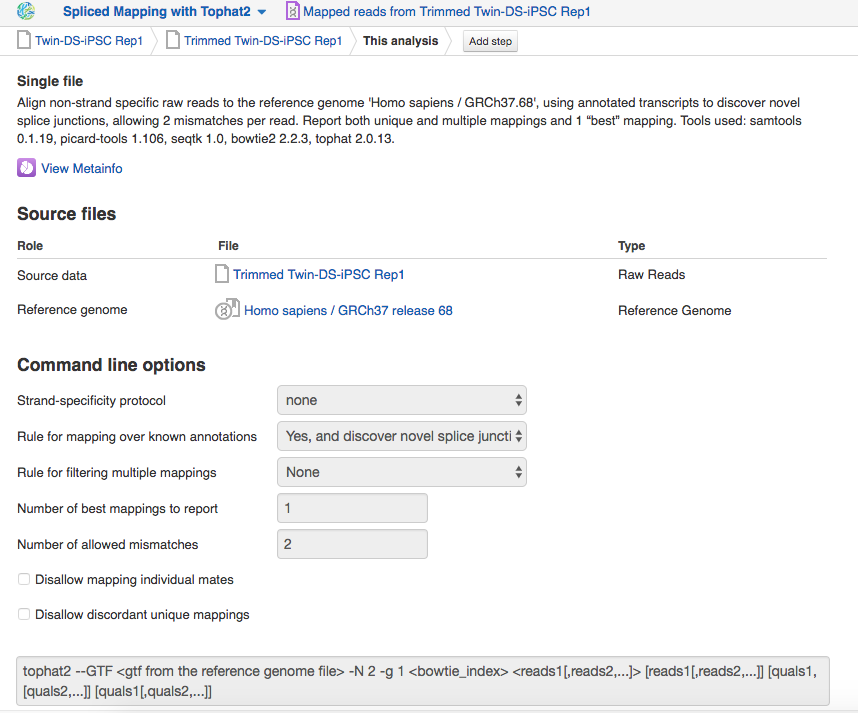

Mapping RNA-seq reads onto a reference genome
*********************************************

When all files were created, you can run the whole analysis here, choosing
Expression Navigator for genes. But first, let’s align RNA-Seq reads to the
reference genome across splice junctions and then explore mappings in
Genome Browser.

.. image:: images/DGE_spl_mapping.png

Find **Spliced Mapping** step, click on “7 files”. In “Explore” section choose
**Genome Browser** and start initialization there.

.. raw:: html

    <iframe width="640" height="360" src="https://www.youtube.com/embed/Uor6cVjjP_A" frameborder="0" allowfullscreen="1">&nbsp;</iframe>

We run Spliced Mapping app with default parameters. To change them go to the
app page and choose **Edit parameters** button. If you want to learn more about
the app and its options, click on the app name and then on **About application**.

Find completed Mapped Reads files in `Mapped reads files for Hibaoui
et al (2013)`_ folder. Let's open some of them in Genome Browser to analyse
`reads coverage on chromosome 21`_ on the region chr21:30007376-40007694 (10 Mb):

.. _Mapped reads files for Hibaoui et al (2013): https://platform.genestack.org/endpoint/application/run/genestack/filebrowser?a=GSF967837&action=viewFile
.. _reads coverage on chromosome 21: https://platform.genestack.org/endpoint/application/run/genestack/genomeBrowser?a=GSF968535&action=viewFile&expired

Here is a combined track for all trisomic and control samples:

As you see, the majority of chr21 genes are indeed more expressed in the
trisomic samples than in the euploid ones, which is consistent with the
overall up-regulation of chr21 genes in individuals with Down syndrome.

Quality control of mapped reads
*******************************

The optional step is to check how mapping went using **Mapped Reads QC Report**
app. You can "generate reports" for each mapping separately or just run
`Mapped Reads Quality Control`_ data flow for multiple
samples:

.. raw:: html

    <iframe width="640" height="360" src="https://www.youtube.com/embed/0C2x9Xm-ji8" frameborder="0" allowfullscreen="1">&nbsp;</iframe>

.. _Mapped Reads Quality Control: https://platform.genestack.org/endpoint/application/run/genestack/dataflowrunner?a=GSF968216&action=createFromSources

Output report includes mapping statistics such as:

#. **Mapped reads**: total reads which mapped to the reference genome;
#. **Unmapped reads**: total reads which failed to map to the reference
   genome;
#. **Mapped reads with mapped mate**: total paired reads where both mates 
   were mapped;
#. **Mapped reads with partially mapped mate**: total paired reads where only
   one mate was mapped;
#. **Mapped reads with “properly” mapped mate**: total paired reads where
   both mates were mapped with the expected orientation;
#. **Mapped reads with “improperly” mapped mate**: total paired reads where
   one of the mates was mapped with unexpected orientation.

The **Coverage by chromosome** plot shows the percentage of bases covered
(y-axis) by at least N (x-axis) reads.

For paired reads, you can look at insert size statistics, such as median and
mean insert sizes, median absolute deviation and standard deviation of insert
size. The **Insert size distribution** plot is generated:

We already prepared all QC reports for mapped reads and put them in `Mapped
reads QC reports for Hibaoui et al (2013)`_ folder. You can open all of them
in `Multiple QC Report`_ app to view mapping statistics interactively:

.. _Mapped reads QC reports for Hibaoui et al (2013): https://platform.genestack.org/endpoint/application/run/genestack/filebrowser?a=GSF967840&action=viewFile
.. _Multiple QC Report: https://platform.genestack.org/endpoint/application/run/genestack/multiple-qc-plotter?a=GSF968715&action=viewFile

Overall, more than 80 % of reads are mapped. It includes properly and
partially mate pairs. Less than 11 % of reads are unmapped among the samples.
Additionally, you can sort your samples by QC statistics or metainfo values.
Read more what the app does in our blog post about
`interactive sequencing quality control reports`_.

.. _interactive sequencing quality control reports: https://genestack.com/blog/2014/12/10/interactive-sequencing-quality-control-reports

