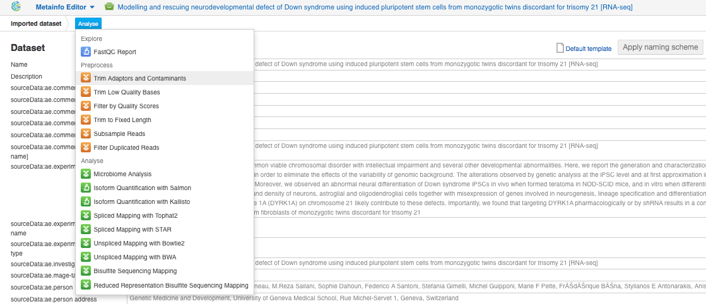

Quality control of raw reads
****************************

Raw sequencing reads can include PCR primers, adaptors, low quality bases,
duplicates and other contaminants coming from the experimental protocols.
That is why we recommend you to check the quality of your raw data looking at
such aspects as GC percentage, per base sequence quality scores, and other
quality stаtistics. The easiest way to do this is to run `the Raw Reads QC`_
data flow:

.. raw:: html

    <iframe width="640" height="360" src="https://www.youtube.com/embed/cWQa1EET9F4" frameborder="0" allowfullscreen="1">&nbsp;</iframe>

.. _the Raw Reads QC: https://platform.genestack.org/endpoint/application/run/genestack/dataflowrunner?a=GSF969011&action=createFromSources

After generating reports, you will be able to review various statistics and
plots for each sample.

.. _Twin-N-iPSC Rep3: https://platform.genestack.org/endpoint/application/run/genestack/fastqc-report?a=GSF968986&action=viewFile

**Per sequence GC content.** In a random library you expect a roughly normal
GC content distribution. An unusually shaped or shifted distribution could
indicate a contamination.

**Per base sequence quality** plot depicts the range of quality scores for
each position in the reads. A good sample will have qualities all above 28:

**Per sequence quality scores** plot shows the frequencies of quality scores
in a sample. If the reads are of good quality, the peak on the plot should be
shifted to the right as far as possible. In our case, the majority of
Illumina reads have a good quality - in the range from 35 to 40 (the best
score is 41):

**Per base sequence content** shows the four nucleotides’ proportions for
each position. In a random library you expect no nucleotide bias and the
lines should be almost parallel with each other:

There is a bias at the beginning of the reads, which is common for RNA-Seq
data. This occurs during RNA-Seq library preparation, when “random” primers
are annealed to the start of sequences. These primers are not truly random,
and it leads to a variation at the  beginning of the reads.

**Sequence duplication levels** plots represent the proportion of the library
made up of sequences with different duplication levels. Sequences with 1, 2,
3, 4, etc duplicates are grouped to give the overall duplication level.

Looking at these plots, you may notice 15 % of sequences are duplicated more than
10 times, 6 % of sequences are repeated more than 100 times, etc. The overall
rate of  duplication is about 40 %. Nevertheless, while analysing
transcriptome sequencing data, we should not remove these duplicates because
we do not know whether they represent PCR duplicates or high gene expression
of our samples.

We have run QC on all the data in the experiment and collected reports in `Raw
reads QC reports for Hibaoui et al (2013)`_ folder.

.. _Raw reads QC reports for Hibaoui et al (2013): https://platform.genestack.org/endpoint/application/run/genestack/filebrowser?a=GSF000383&action=viewFile

Preprocessing of raw reads
**************************

Once the quality of raw data has been checked, we can go back to the main
`Differential Gene Expression Analysis`_ data flow and choose sources:

.. _Differential Gene Expression Analysis: https://platform.genestack.org/endpoint/application/run/genestack/dataflowrunner?a=GSF968176&action=createFromSources

.. image:: images/DGE_data_flow_first_step.png

You can upload your samples directly into the data flow or select them from
the available datasets. Let's choose sources — 7 sequencing assays from the
experiment and a human reference genome, - and create resulting files in a
specific folder.

QC reports can not only provide you with the information on the data
quality but can also help you to decide how to preprocess the data in order
to improve its quality and get more reliable results in further analysis.
There are various Genestack applications that allow you to do preprocessing:

We will run **Trim Adaptors and Contaminants** app:

.. image:: images/DGE_trim_ad.png

All resulting files are collected in `Trimmed raw reads for Hibaoui et al
(2013)`_ folder.

.. _Trimmed raw reads for Hibaoui et al (2013): https://platform.genestack.org/endpoint/application/run/genestack/filebrowser?a=GSF967714&action=viewFile

