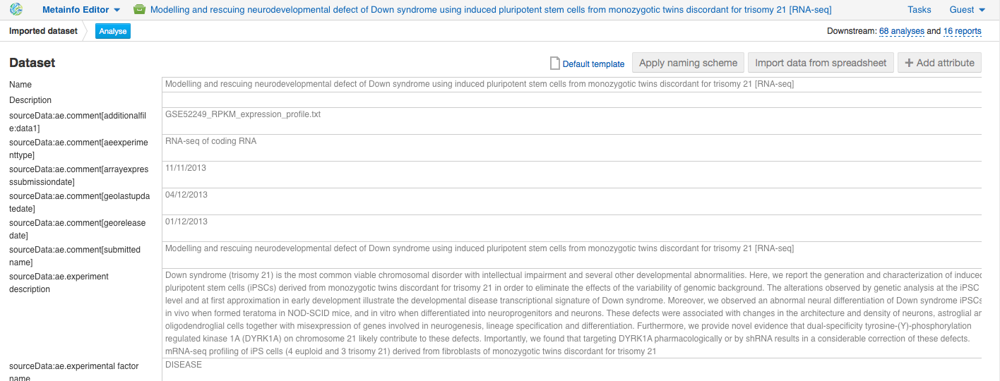

.. This post has videos accompanying it. You can watch them here: |Zrzut ekranu 2015-10-21 o 16.01.36| 
.. Or read full text and watch the videos separately: 
One of the most widespread applications of RNA-seq
technology is differential gene expression (DGE) analysis. By
understanding how gene expression levels change across different
experimental conditions, we can gain clues about gene function and learn
how genes work together to carry out biological processes. In this
tutorial we will use `Genestack applications <https://genestack.com/>`__ to identify differentially
expressed (DE) genes and further annotate them according to biological
process, molecular function and cellular component. The whole
analysis includes the following steps:

#. Setting up an RNA-seq experiment
#. Quality control of raw reads
#. Preprocessing of raw reads
#. Mapping RNA-seq reads onto a reference genome
#. Quality control of mapped reads
#. Calculate read coverage for genes
#. Differential gene expression analysis
#. GO-based enrichment analysis

Let’s deal with these steps one by one.

Setting up an RNA-seq experiment
********************************

The first step is to choose RNA-seq dataset. You can open  `File
Manager <https://platform.genestack.org/endpoint/application/run/genestack/filebrowser?a=private&action=viewFile>`__ and `upload
your own
data <https://platform.genestack.org/endpoint/application/run/genestack/uploader>`__ using
'Import' button: 

|DGE_file_manager_red_arrow| 

In the left-hand folder tree, you can see various  `public
data <https://platform.genestack.org/endpoint/application/run/genestack/filebrowser?a=public&action=viewFile>`__ that
is freely available to you: public experiments, data flows, reference
genomes, etc. After searching through all `public
experiments <https://platform.genestack.org/endpoint/application/run/genestack/filebrowser?a=GSF070886&action=viewFile>`__ available
on the platform you can select one and use it further in the analysis.
Let's go to the tutorials and choose ` Testing Differential Gene Expression on Genestack
Platform <https://platform.genestack.org/endpoint/application/run/genestack/filebrowser?a=GSF000811&action=viewFile>`__. The
RNA-Seq experiment we will use comes from `Hibaoui et al.
2013 <https://www.ncbi.nlm.nih.gov/geo/query/acc.cgi?acc=GSE52249>`__ and
is publicly available on Genestack. Open it in
`Experiment Viewer <https://platform.genestack.org/endpoint/application/run/genestack/experiment-viewer?a=GSF091068&action=viewFile>`__
to see more details: 

|DGE_metainfo| 

The authors investigated the transcriptional signature of  `Down syndrome (trisomy
21) <https://en.wikipedia.org/wiki/Down_syndrome>`__ during development,
and analysed mRNA of induced pluripotent stem cells (iPSCs) derived from
fetal fibroblasts of monozygotic twins discordant for trisomy 21: three
replicates from iPSCs carrying the trisomy, and four replicates from
normal iPSCs. They identified down-regulated genes expressed in trisomic
samples and involved in multiple developmental processes, specifically
in nervous system development. Genes up-regulated in Twin-DS-iPSCs are
mostly related to the regulation of transcription and
different metabolic processes. To reproduce these results, we'll
use  `Differential Gene Expression
Analysis <https://platform.genestack.org/endpoint/application/run/genestack/dataflowrunner?a=GSF968176&action=createFromSources>`__ data
flow. But before let's check the quality of raw reads to decide whether
we should improve it or not.

.. |DGE_file_manager_red_arrow| image:: images/DGE_file_manager_red_arrow.png

