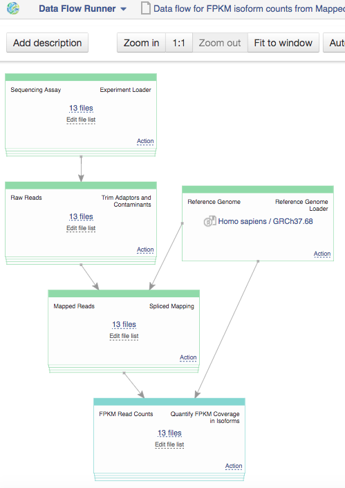

Testing Differential Isoform Expression on Genestack Platform
*************************************************************

Detecting differential isoform expression from RNA-seq data is one of
the common transcriptome analysis tasks. And the purpose of this
tutorial is to show you how to perform this analysis on
`Genestack <https://platform.genestack.org/>`__  platform.

|isoforms| You know that in the process of `alternative
splicing <http://en.wikipedia.org/wiki/Alternative_splicing>`__ (when
different combinations of exons can be spliced together) a single gene
can produce multiple mRNA and protein isoforms with different structures
and biological functions. These alternative isoforms can differentially
affect downstream pathways, cell growth, development and other
biological processes. Therefore, it’s very important to study
alternative splicing events and estimate isoforms abundance in RNA-Seq
datasets.

.. rubric:: **Setting up an RNA-Seq experiment**
   :name: setting-up-an-rna-seq-experiment

First of all, you need a nice example of differential isoform usage. For
this, you can upload your own RNA-Seq samples using  `Data
Importer <https://platform.genestack.org/endpoint/application/run/genestack/rawloader?_ga=1.253500042.203380008.1427286202>`__
or search through all public experiments we have on the platform and
choose a suitable one. Our analysis will be based on RNA-seq data coming
from `Trapnell et al.
2012 <http://www.ncbi.nlm.nih.gov/geo/query/acc.cgi?acc=GSE37703>`__ .
Here is some information about this
`experiment <https://platform.genestack.org/endpoint/application/run/genestack/filebrowser?a=GSF080230&action=viewFile>`__ opened
in Metainfo Viewer:

|Metainfo_viewer|

Shortly, the authors conducted differential isoform expression analysis.
They performed RNA interference (RNAi)-mediated knockdown of HOXA1 in
human lung fibroblasts, where HOXA1 was depleted using a pool of
HOXA1-targeting siRNAs. And they compared these HOXA1-depleted
fibroblasts against cells treated with a pool of scrambled siRNAs that
do not target a specific gene. Then, the authors isolated total RNA in
biological triplicate and sequenced RNA on Illumina HiSeq 2000 and
Illumina MiSeq platforms.

They identified differentially expressed transcripts and genes specific
to cell cycle progression and related to apoptosis induction. And
in this tutorial we’ll try to reproduce their results.

.. rubric:: **Building an Isoform-level Differential Expression Analysis
   pipeline**
   :name: building-an-isoform-level-differential-expression-analysis-pipeline

Below is a simple  dataflow to analyze one of our RNA-Seq samples.
Later we’ll show you how it’s easy to build the same pipeline for the
left 11 samples.

|Dataflow_up_1|

The dataflow consists of several steps:

#. Quality control and preprocessing of raw reads
#. Mapping RNA-seq reads onto reference genome
#. Quality control of mapped reads
#. Calculate FPKM coverage for each isoform
#. Differential isoform expression analysis

Let’s look at each step separately to get a better idea of what it
really means.

.. rubric:: **1. Quality control and preprocessing of raw reads**
   :name: quality-control-and-preprocessing-of-raw-reads

Before mapping raw reads and calculation of isoform abundance, you may
be interested in improving the reads quality. We offer you
various preprocess applications to do some quality control checks on
your raw sequence data.

Start with one sample and try to run, for example, Trim Low Quality
Bases app. You’ll see that each app suggests you to add next analytical
step or to use relevant viewers. Look, what quality statistics you can
view using Raw Reads QC Report app:

**Qualities per base ** plot shows the range of quality scores for each
position on the reads.

|Qualities per base| **GC content distribution** plot shows GC%
(x-axis) and read frequencies (y-axis). In a random library you can
expect a roughly normal distribution of GC content, as in our case. An
unusually shaped distribution could indicate a contaminated library or
some other kinds of biased subset.

**|GC content distribution|**

You can find more statistics in output Raw Reads QC Reports. We run QC
on all the data in the experiment and collected reports in folder `Raw
Reads QC reports for Trapnell et al.
(2012) <https://platform.genestack.org/endpoint/application/run/genestack/filebrowser?a=GSF123619&action=viewFile>`__.

.. rubric:: **2. Mapping RNA-seq reads onto reference genome**
   :name: mapping-rna-seq-reads-onto-reference-genome

On the next step, we’ll use Spliced Mapping app to map RNA-seq reads
onto the reference genome and discover transcript splice sites. By
default, the app will identify both known and novel alternative splicing
variants, will align reads with no more than 2 mismatches and report
both unique and multiple mappings. Change options and default values,
clicking on “Edit parameters” button. 

You can find all Mapped Reads files in folder `Mapped Reads files for
Trapnell et al.
(2012) <https://platform.genestack.org/endpoint/application/run/genestack/filebrowser?a=GSF123417&action=viewFile>`__.
If you open them in `Genome
Browser <https://platform.genestack.org/endpoint/application/run/genestack/genomeBrowser?a=GSF123458&action=viewFile>`__,
you can find out that HOXA1 gene is really non-transcribed for
HOXA1 * * knockdown data:

|GB_HOXA1|

.. rubric:: **3. Quality control of mapped reads**
   :name: quality-control-of-mapped-reads

This is an optional step. There are some apps developed for simple
quality control of your mapped reads. In this tutorial, let’s create QC
report for each Mapped Reads file using Mapped Reads QC Report app and
then open all reports in `Multiple QC plotter
app <https://platform.genestack.org/endpoint/application/run/genestack/multiple-qc-plotter?a=GSF966973&action=viewFile>`__:

|Mapped_QC_plotter|

All Mapped Reads QC reports are publicly available and stored in
folder  `Mapped Reads QC reports for Trapnell et al.
(2012) <https://platform.genestack.org/endpoint/application/run/genestack/filebrowser?a=GSF123419&action=viewFile>`__.

.. rubric:: **4. Calculate FPKM coverage for each isoform**
   :name: calculate-fpkm-coverage-for-each-isoform

We will run Quantify FPKM Coverage in Isoforms app to calculate isoform
abundance. The app takes Mapped Reads file and calculates FPKM
(Fragments Per Kilobase of exon per Million fragments mapped) values for
each transcript.

So, now we have pipeline for one sample. Is it possible to run dataflow
for multiple samples? Yes, it’s possible. Open FPKM isoform counts file
in `Data Flow
Editor <https://platform.genestack.org/endpoint/application/run/genestack/datafloweditor?a=GSF967066&action=viewFile>`__
app, for sequencing assay make “Add files” action, choosing the left 11
raw sequencing files and click on blue “Create files” button. Look, we
built 12 pipelines! The last thing is just to “start initialization” for
all of them.

|DF|

We calculate FPKM coverage in all samples and collected result files in
folder  `FPKM isoforms counts for Trapnell et al.
(2012) <https://platform.genestack.org/endpoint/application/run/genestack/filebrowser?a=GSF123418&action=viewFile>`__.

.. rubric:: **5. Differential isoform expression analysis**
   :name: differential-isoform-expression-analysis

The final step is to perform differential isoform expression
analysis between two groups of samples corresponding to different
conditions. In our case, it is anti-HOXA1 siRNA and scrambled control
fibroblasts.

In `File
Browser <https://platform.genestack.org/endpoint/application/run/genestack/filebrowser?a=GSF123418&action=viewFile>`__,
we choose these 6 Data files with FPKM isoforms counts (let’s consider
only MiSeq data) and click on Test Differential Isoform Expression in
Analyse section. To run the app we need to assign samples to groups. We
can do it manually or apply auto-grouping. Just click, for example on
“GEO transfection” header in the table and the app suggests you to
create two groups according to “HOXA1 knockdown” and “Scramble siRNA”
transfection conditions:

|Diff_iso|

So, we agree and do “Group samples automatically”. Below, you see some
correction parameters you can apply for analysis. We will use default
values. And finally let’s create our file and run the analysis clicking
on “start initialization” in “Other Actions”. We created two
Differential Expression Statistics files (for data from two sequencing
platforms – MiSeq and HiSeq) and put them in folder  `Differential
Isoform Expression Analysis for Trapnell et al.
(2012) <https://platform.genestack.org/endpoint/application/run/genestack/filebrowser?a=GSF123432&action=viewFile>`__.

When the analysis will be complete, look at the Top Differentially
Expressed Isoforms table. On HiSeq data, more than 800 differentially
expressed isoforms (460 up-regulated and 410 down-regulated) were
identified:

|HiSeq_DIEA|

For selected transcripts, you can see Count Graph with normalised FPKM
counts across samples. This allows you to observe how a gene’s
expression level varies within groups. Look, for example, at first two
down-regulated transcripts for HOXA1 knockdown group:

|graph|

Our results are consistent with paper results. We also found that the
loss of *HOXA1* results in significant expression level changes for
different transcripts encoded by genes which play important role in cell
development.

You can find all tutorial files in folder  `[Tutorial] Testing
Differential Isoform Expression on Genestack
Platform <https://platform.genestack.org/endpoint/application/run/genestack/filebrowser?a=GSF123346&action=viewFile>`__ and
look at all results we got for each analytical step.

We wish you good luck in building your own pipelines and hope to
get your feedback about
`Genestack <https://platform.genestack.org/>`__ apps and
features. Please submit any questions, bugs, comments through green
feedback button on the platform or email us
at  support@genestack.com. See you soon!

.. |isoforms| image:: images/isoforms.png
.. |Metainfo_viewer| image:: images/Metainfo_viewer.png

.. |Qualities per base| image:: images/Qualities-per-base.png

