Navigation in Genestack Genome Browser
**************************************

We constantly strive to improve Genestack’s Genome Browser, making it
more convenient and intuitive for our users. In the `previous
update </blog/2014/12/22/genome-browser-editing-multiple-tracks/>`__ we
presented ways to work with multiple tracks at once. Today we’ll
demonstrate our track navigation features, which allow you to save your
time when browsing genomic data.

As an example of genomic data, we’ll use `Vallot et al.
2013 <http://www.ncbi.nlm.nih.gov/geo/query/acc.cgi?acc=GSE39757>`__
experiment. Briefly, authors investigated X-chromosome inactivation
(XCI), which relies on long noncoding *XIST* transcript. They identified
unannotated expressed regions on the X chromosome – *XACT*
and \ *T113.3 *\ transcripts, and reported a slight increased *XACT*
expression for H9 hESCs not expressing *XIST* compared to H9 cells that
did express it.

We reproduced these results and prepared `the corresponding data
flow <https://platform.genestack.org/endpoint/application/run/genestack/datafloweditor?a=GSF966710&action=viewFile>`__,
which takes you from raw sequence to variant calls, if you’d like to
reproduce this analysis. To review the results, let’s open `this Genome
Browser
page <https://platform.genestack.org/endpoint/application/run/genestack/genomeBrowser?a=GSF966706&action=viewFile>`__ and start
our navigation tour in Genome Browser.

**Search**
~~~~~~~~~~

If you want to go to specific genomic positions or browse a specific
feature the most suitable way is via search. You can choose search type:
coordinates or feature name. Let’s find the XIST gene:

|new_search|

Looking at the coverage tracks for H9 XIST- and H9 XIST+ cells, you can
see that XIST gene is really non-transcribed in H9 XIST- cells.

|XIST_coverage|

**Overview track**
~~~~~~~~~~~~~~~~~~

To quickly reach specific region, use navigation by overview track. Move
cursor to the overview track, choose the region and click. From the
paper, we know that the exact place of the unannotated *XACT* region is
X:112983323-113235148 (~ 252 kb). So, we can jump there by choosing
these positions on the overview track:

|Overview_track|

**Pan and drag**
~~~~~~~~~~~~~~~~

Let’s imagine that a feature starts outside of the chosen interval or
you’d like to browse surrounding regions. To achieve this, you can set
pan percentage, choosing from a dropdown list, and click pan buttons.
Also, you can simply drag tracks. Try to find *T113.3* transcript
(113283559-113302505), panning right or dragging the track:

|new_dragging|

According to the paper, we expect to see a slight increase
in \ *XACT* coverage for XIST- cells. Let’s combine two coverage tracks
to find it:

|sticky|

**Zoom**
~~~~~~~~

To look at some features more closely or, vice versa, browse data around
a feature, you can apply zoom in (or out). There are several ways to
zoom:

**1. With buttons.** Choose zoom percentage or use default value and
click the corresponding button. *XACT* and *T113.3* transcripts are
located between two protein-coding genes AMOT and HTR2C. Let’s zoom out
*XACT* region to capture both genes.

|With_buttons|

**2. By double clicking on the track.** Instead of zooming by buttons
you can double click on the track. In this case, zoom percentage will be
the same as set in the dropdown list near zoom buttons. Look at HTR2C
more closely:

|HTR2C_gene|

**3. Via mouse selection.** If you want to zoom into specific region,
turn on “zoom by mouse selection” mode and select region of interest.
*XACT* region contains some variants for XIST- sample:

|variation_track|

Let’s zoom into the SNP to nucleotide level:

|new_nucleo|

**Sorting tracks**
~~~~~~~~~~~~~~~~~~

Move and sort your tracks in Genome Browser:

|new_sort|

To reproduce this analysis, use `this data
flow <https://platform.genestack.org/endpoint/application/run/genestack/datafloweditor?a=GSF966710&action=viewFile>`__:

|Data_flow|

We hope you enjoy these navigation features, and as always we welcome
your feedback. Please leave your thoughts and suggestions in the
comments below.

Follow us on Twitter: `@genestack <https://twitter.com/genestack>`__.

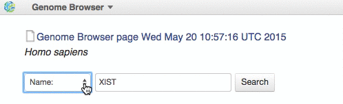
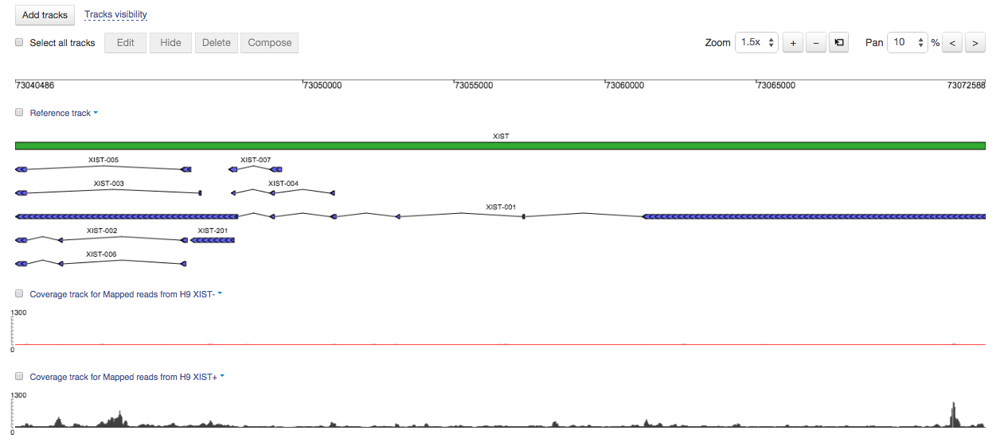
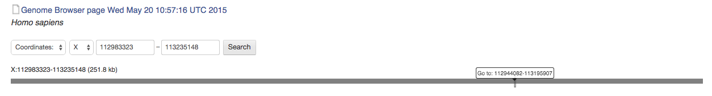
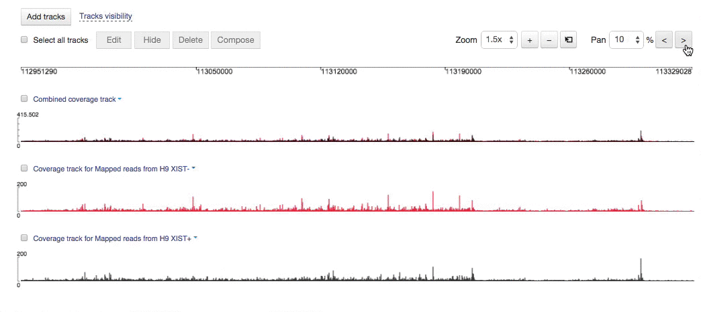
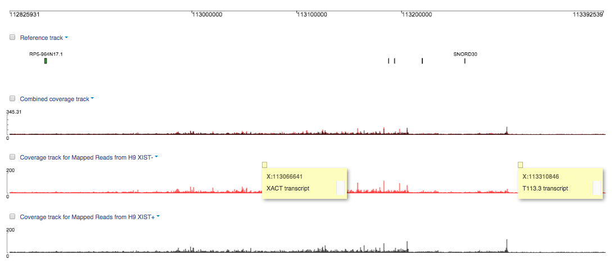
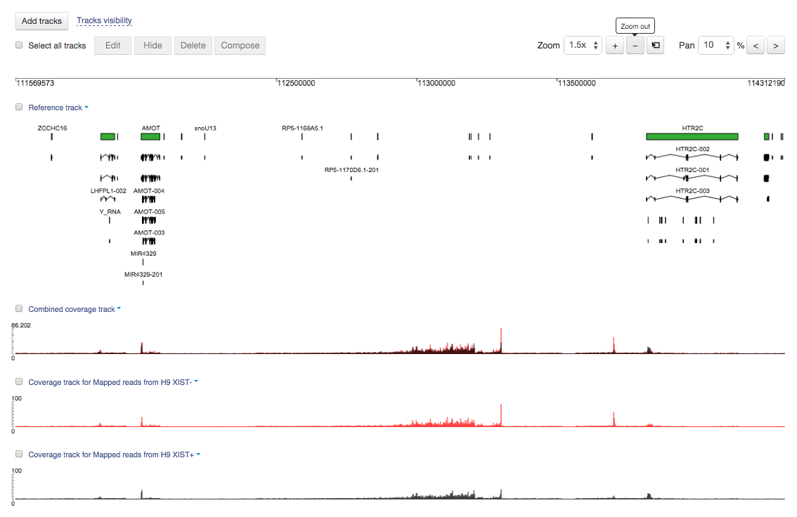
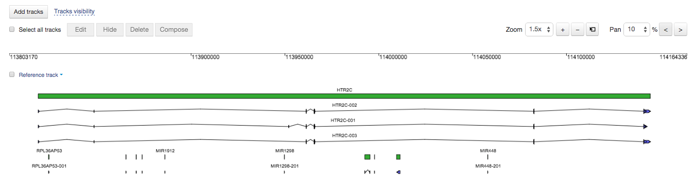
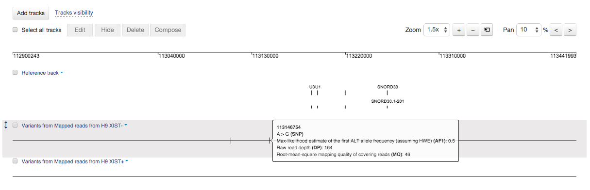
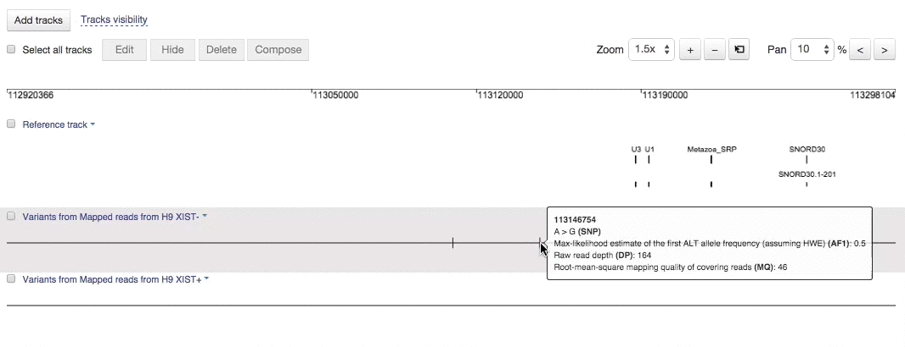
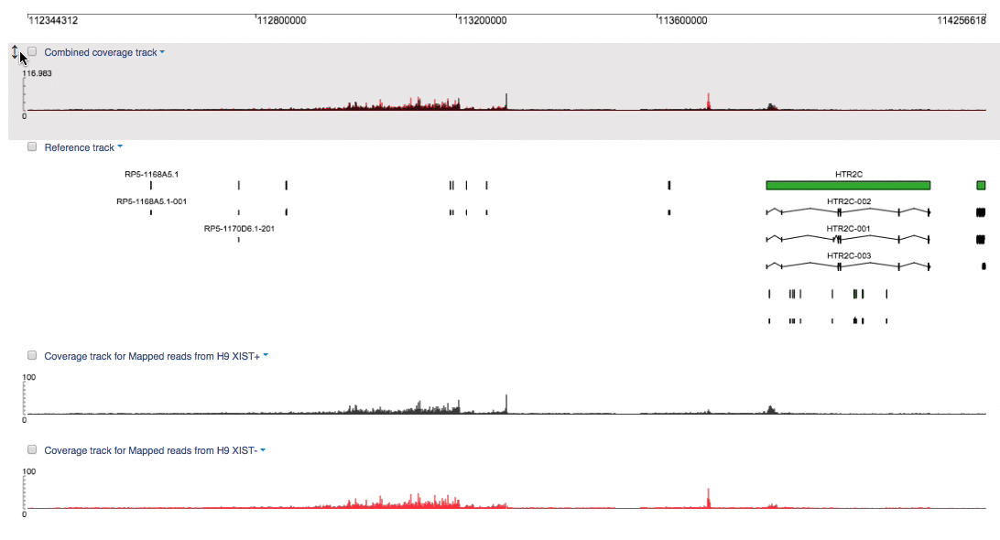
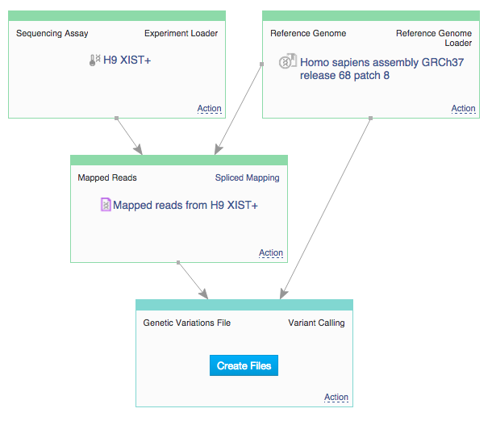
