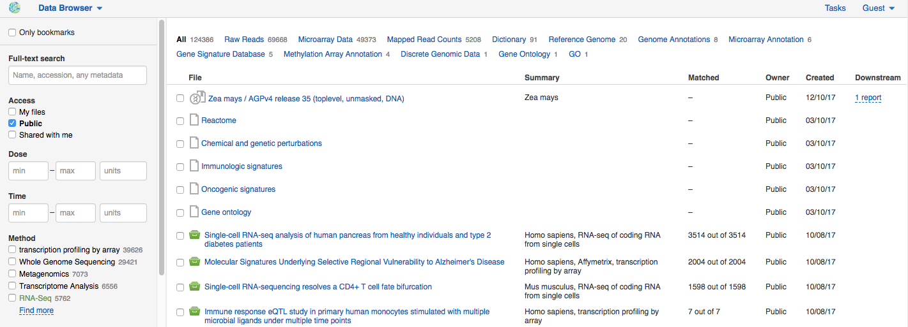

Browsing data
*************

.. .. raw:: html
    <iframe width="640" height="360" src="https://www.youtube.com/embed/JaEM73GpEXM" frameborder="0" allowfullscreen="1">&nbsp;</iframe>

From the Dashboard you can go to the **Data Browser** — the application that makes a search of
the relevant biological data fast and effective. Although at this point, you may have
no private files, you can access **public data** available on the platform.

Currently, we have a comprehensive collection of **publicly available datasets** imported from
GEO NCBI, ENA, SRA and ArrayExpress. We also provide other useful data that can
be used in bioinformatic analysis namely reference genomes or annotations.

One of the key features of Genestack is that **all files are format-free objects**:
raw reads, mapped sequence, statistics, genome annotations, genomic data, codon
tables, and so forth. All files have rich metadata, different for each file type.

Let us take a look at an example. Apply filter "Reference
genomes" to see pre-loaded reference genomes.
There is no single, standard, commonly accepted file
format for storing and exchanging genomic sequence and features:
the sequence can be stored in FASTA, EMBL or GenBank formats. Genomic
features (introns, exons, etc.) can, for example, be represented via GFF
or GTF files. Each of these formats themselves has flavours, versions,
occasionally suffering from incompatibilities and conflicts. In
Genestack you no longer have to worry or know about file formats.
A Reference Genome file contains packed sequence and genomic features.
When data, such as reference genomes, is imported into Genestack (and
several different formats can be imported) it is “packed” into a
Genestack file, meaning all reference genomes will behave identically,
regardless of any differences in the physical formats underneath. You
can browse reference genomes with our `Genome Browser`_
you can use them to map raw sequencing reads, to analyse variations, to
add and manage rich annotations such as Gene Ontology and you never have
to think about formats again.

Click a dataset name to view the associated metainformation with the **Edit Metainfo** app.
Some metadata fields are filled in by our curators, some are available
for you to edit with Edit Metainfo app, and some are computed when files are initialised.

Besides, you can explore metadata of any file wherever you are in the platform using **View metainfo** option in
the context menu. All files have rich metadata, different for each file type.

.. image:: images/metainfo-reference-genome.png
   :align: center
   :scale: 65 %

.. _Genome Browser: https://genestack.com/blog/2015/05/28/navigation-in-genestack-genome-browser/
