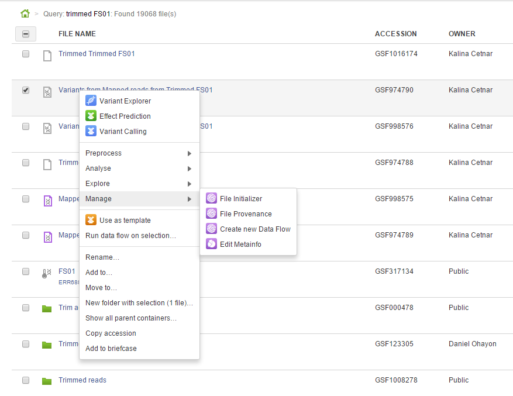
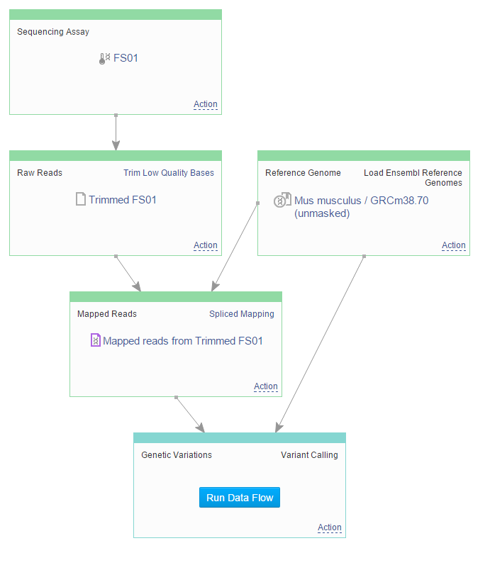
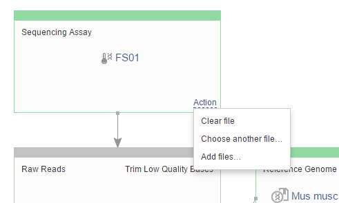
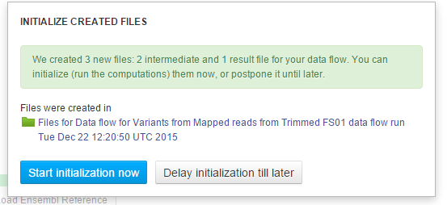
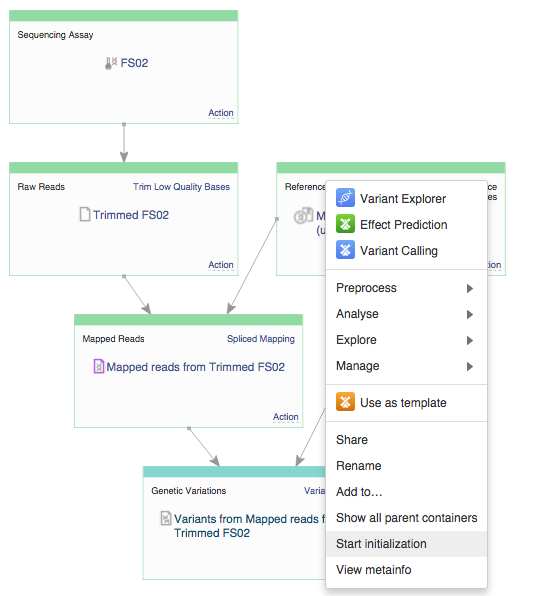

How to reproduce your work?
***************************

.. raw:: html

    <iframe width="640" height="360" src="https://www.youtube.com/embed/mjazNS0btd0" frameborder="0" allowfullscreen="1">&nbsp;</iframe>

Now, let’s talk about reproducibility. We will show you
how to take any data file in Genestack Platform, and repeat the analysis
steps that led up to it on different data.

Let’s go back to the genetic variations file you created called “Variant calling"
file. To find analysis results, you might go to the Recent Results on the Dashbord,
find a dataset in the Data Browser or go
to the "My datasets" folder in the File Manager. You can
also find it in the tutorial folder. Rather than viewing its provenance
like we did before, let’s see if we can reuse the provenance. To do
this, select the file, go to **Manage** and **Create new Data Flow**.

In the next screen you will see the data flow we have previously created.

The data flow editor has one
core goal: to help you create more files using this diagram. To do this,
you will need to make some decisions for boxes in the diagram via
the **Action** menu. If you want to select different files, go to **Choose another file**. If you want
to leave the original file simply do not
change anything.

In this example, we will use this
data flow to produce variant calls for another raw sequence data file,
FS02 reproducing the entire workflow including trimming low-quality
bases, spliced mapping and variant calling. All you need to do is choose
another input file and click on **Run dataflow** button at the top of the
page. You will be given a choice: you can initialize the entire data
flow now or delay initialization.

If you decide to delay the initialization till later, you will be brought
back to the Data Flow Runner page where you can initialize individual
files by clicking on the file name and later selecting **Start initialization**.

