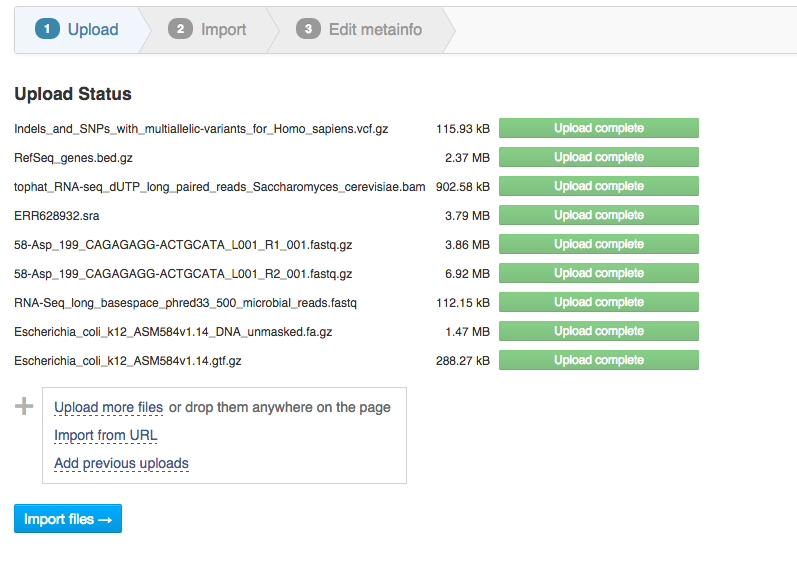
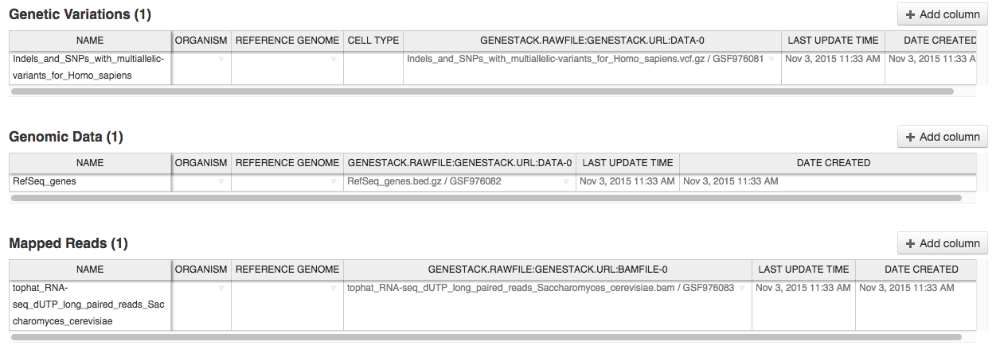
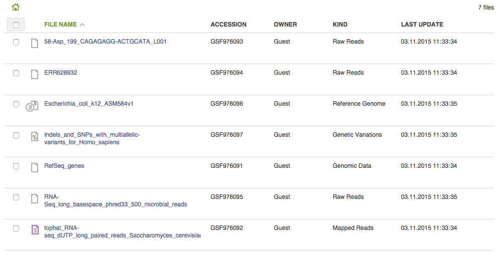

Importing data onto the Genestack Platform
******************************************

We’ve talked about the core concepts of Genestack and the geography of
the Platform. Now let's discuss importing data onto the platform. On the `Welcome Page`_ you
can find an “Import data ” option,  and an "Import" button can be found in the File Manager.

|import file manager|

Once you click it, this will take you to the `Import data`_ app
page. There are various options of importing your data. You can drag and
drop or select files from your computer, import data from URL or use
previous uploads.

|Zrzut ekranu 2015-11-03 o 11.32.40|

After data is uploaded and imported, the platform automatically recognizes file
formats and transforms them into biological data types e.g. raw reads,
mapped reads, reference genomes and so on. This means you won’t have to
worry about formats at all and this will most likely save you a lot of
time. If files are unrecognized, you can manually allocate them to a
specific data type using drag & drop located at the top of the page.

|Zrzut ekranu 2015-11-03 o 11.33.02|

On the next “Edit metainfo” step, you can describe uploaded data. Using an Excel-like spreadsheet you can
edit the file metainfo and add new attributes for example cell type or
age.

|Zrzut ekranu 2015-11-03 o 11.33.53|

Once this step is completed,
you can go to “Show files in File Manager” at the bottom of the page.
Take a look at a “kind” column- there are no file formats, just
biological data types.

|Zrzut ekranu 2015-11-03 o 11.34.14|

Additional option of importing your data is using import templates. On
the Welcome page you can find an `Add import template`_
option. Import templates allow you to specify required and optional
metainfo attributes for different file kinds. When you scroll down to
the bottom of the page, you'll see an `Add import template`_ button.

|import welcome pagea|

.. |import file manager| image:: images/import-file-manager1.png

.. |Zrzut ekranu 2015-11-03 o 11.33.02| image:: images/Zrzut-ekranu-2015-11-03-o-11.33.02.png

.. |import welcome pagea| image:: images/import-welcome-page1.png
.. _Welcome Page: https://platform.genestack.org/endpoint/application/run/genestack/welcome
.. _Import data: https://platform.genestack.org/endpoint/application/run/genestack/uploader?_ga=1.134006414.1862084483.1471274276
.. _Add import template: https://platform.genestack.org/endpoint/application/run/genestack/metainfotemplateeditorapp?action=openInBrowser
