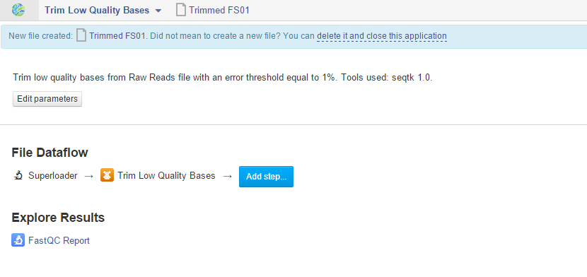
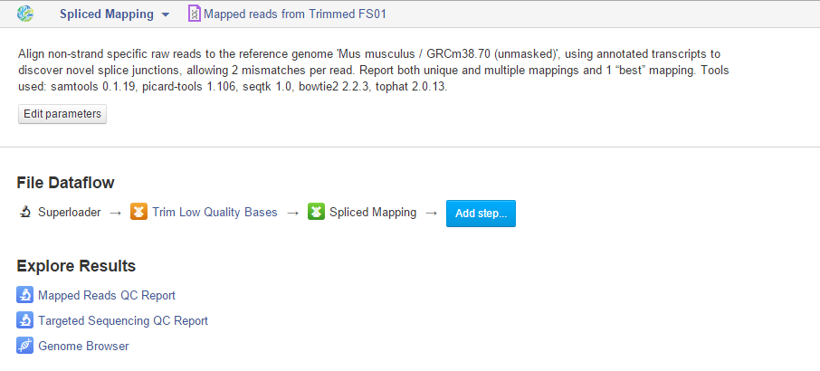
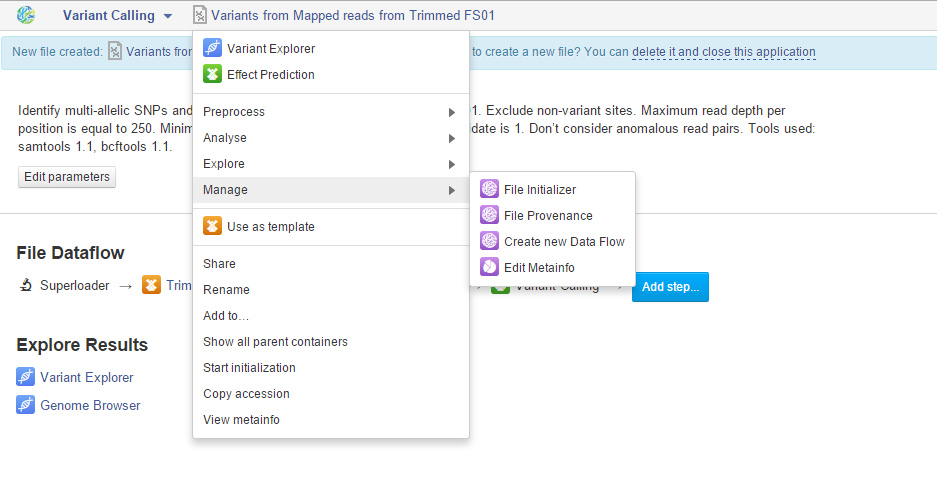
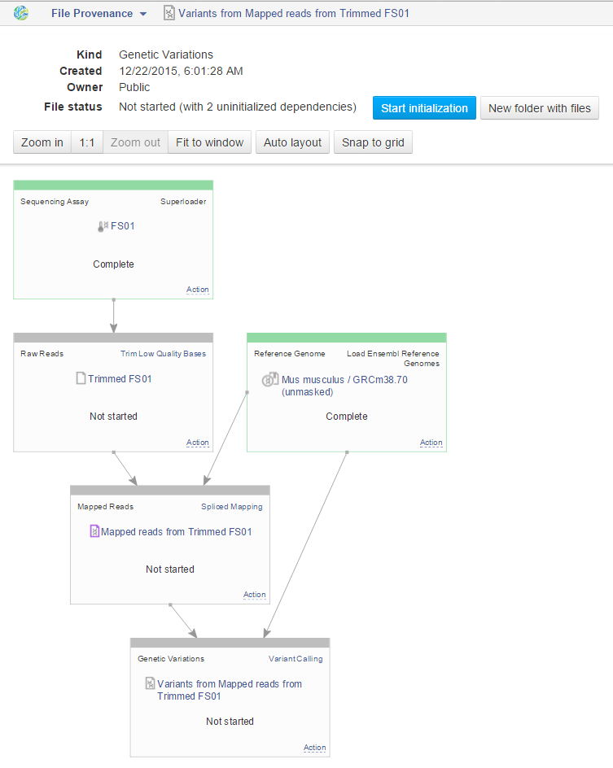
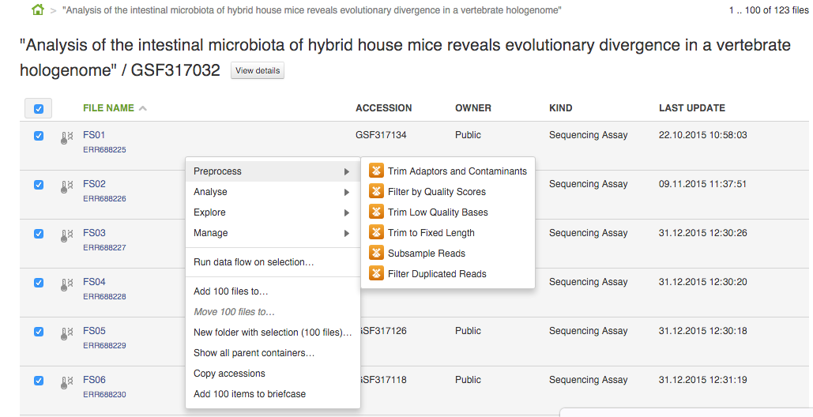
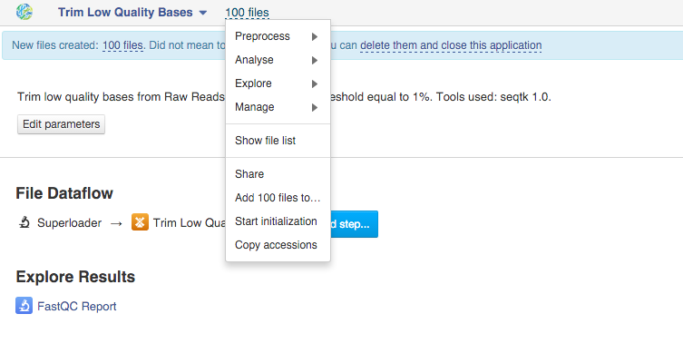
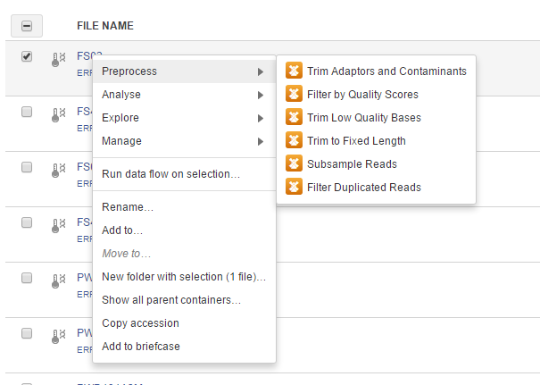
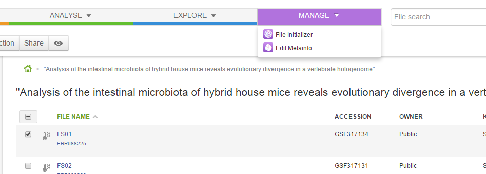
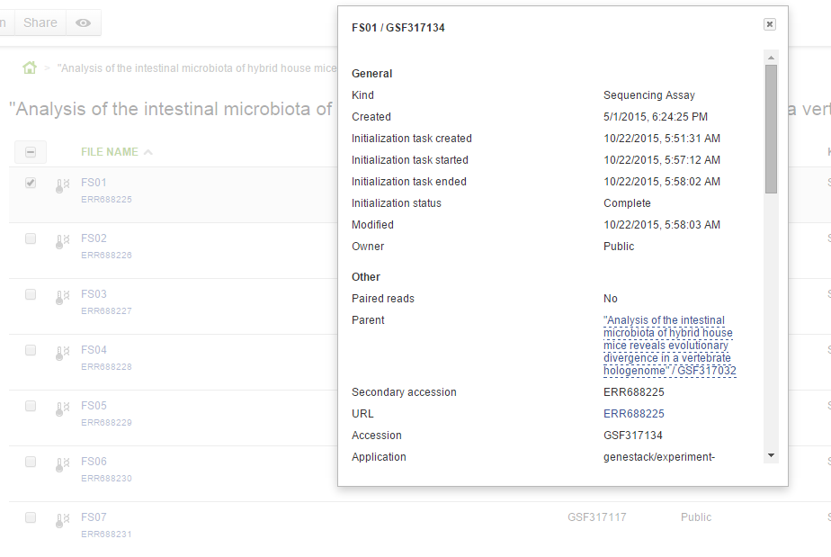

Initialising files and various file types
*****************************************

Now that you know how to import data onto the platform, we will walk you
through file initialisation. All files on Genestack are created by
various applications.  When an application creates a new file, it
specifies what should happen when it is initialised: a script, a
download, indexing, computation. In practice it means that uninitialised
files are cheap and quick to create, can be configured, used as inputs
to applications to create other files, and then, later, computed all at
once. Let’s look at an example. Go to the public experiment library and
choose `“Analysis of the intestinal microbiota of hybrid house mice
reveals evolutionary divergence in a vertebrate
hologenome”`_ experiment by Wang et al. Select one of the raw sequencing reads file
called "FS01", right click on it, and select “Preprocessing” and “Trim
Low Quality Bases” app. This created a file “Trimmed FS01” that is not
initialised yet.  What is special about our system, is that you  **do
not** **have to** start initialisation! In fact, you can use this file
as input to applications for creating other files.

|trim low quality bases app|

 Notice that you can edit the initialisation parameters of
the new file. You can change them because the file is not yet
initialised, i.e. the computation – in this case, trimming – has not yet
been started. After initialisation has completed, these parameters are
fixed and are there to inform you about how the file was created. They
can be used to identically reproduce your work. If you wanted to start
initialisation of this newly created file, click on the name of the file
and select "Start initialisation".

|trim low quality bases start initialization|

In this post we will show you how to use this file as
an input for a different application. The trimmed file can for example
be mapped to a reference genome. In order to do this you should click on
"add step" and select the Spliced Mapping application. Using the "edit
parameters" option you can check if the system suggested a correct
reference genome and if not, you can select the correct one (in this
case this should be a mouse genome). These actions created another file
called "Mapped reads for Trimmed FS01" that is waiting to be
initialised.

|spliced mapping mouse genome|

This again can be used as an
input for a different application. As a last step you could for
example create a genetic variations file by choosing the Variant Calling
app in the "add step" option. In order to see `the entire data
flow <https://platform.genestack.org/endpoint/application/run/genestack/datafloweditor?a=GSF1016183&action=viewFile>`__
we have just created, click on the name of the last created file, go to
“manage” and “File provenance”.

|file provenence|

It will show
you processes that have been completed, and ones that need to be
initialised. To initialise only one of the steps, click on a given cell,
then on “Actions” and later select “Start initialization". To initialise
all of the uninitialised dependencies, simply click on “Start
initialisation” blue button at the top.

|file provenance|

 You can track
the progress of your computations using the Task Manager that can be
found at the top of the page. All the files created in the above example
are located in the `tutorial
folder`_. To
read more about data flows `scroll down <#reproduce>`__. One additional
thing we should mention is that if you want to analyse more than one
file using the same app, it's very easy: just tick all the files you
want to analyse, right click on them and select the app you wish to use.

|running an app on multiple files|

 All the steps you need to take are
identical to if you would want to analyse just one file. In this example
we have created 100 files that we have to initialize to start the tasks.

|app page 100 files|

Now let's talk a bit about different types of files
that can be found on the platform.  As we demonstrated, all our files
have a built-in system type. Some of these file types are particularly
useful when it comes to organising your research and now we will discuss
them in more detail.

Files
~~~~~

There are many different file types in Genestack Platform. Every file is
created by an application and there’s a lot of metadata associated with
each file. For example, every file has one or more unique accessions, a
name and a description. Applications use file type and metadata to make
suggestions about what kinds of analyses a given file can be used in.
Almost anywhere you see file names and accessions, e.g., File Manager or
in other applications, you can click on them and a file context menu
will show up. For example, clicking on a file containing raw sequenced
reads displays a menu:

|dropdown menu raw sequencing reads|

You can
view and edit file metadata via the  **Edit Metainfo**, which appears
under the  **Manage** submenu.

|edit metainfo2|

You can open the
metainfo viewer on any file in the system by clicking on the eye icon.
Here it is on a sequencing assay:

|edit metainfo|

Folders
~~~~~~~

Folders in Genestack behave the same as folders in other systems. You
can put files in folders, and you can remove files from folders. There’s
one very useful difference, however, from most systems. Each file can be
added (or, as we sometimes say, “linked”) to multiple folders. No data
gets copied of course, the file simply appears in multiple locations.
This is very handy for organising your work. For example, you can
collect into one folder files from multiple experiments and work on them
as if they were all part of one experiment.

Experiments, Assays, and Assay Groups
~~~~~~~~~~~~~~~~~~~~~~~~~~~~~~~~~~~~~

An  **experiment** is a very special kind of folder. It contains only
assays, or files, which contain experimentally collected data. One can
think of experiments as packages for experimental data. They are a handy
container for data.  **Assays** are a general category of file types,
which store experimentally collected data.  **Assay groups** are a way
to collect assays with common metadata into experimental subgroups,
e.g., technical replicates, biological samples undergoing the same
treatment, and so forth.

.. _“Analysis of the intestinal microbiota of hybrid house mice reveals evolutionary divergence in a vertebrate hologenome”: https://platform.genestack.org/endpoint/application/run/genestack/filebrowser?a=GSF317032&action=viewFile&page=1
.. _tutorial folder: https://platform.genestack.org/endpoint/application/run/genestack/filebrowser?a=GSF1016175&action=viewFile&page=1