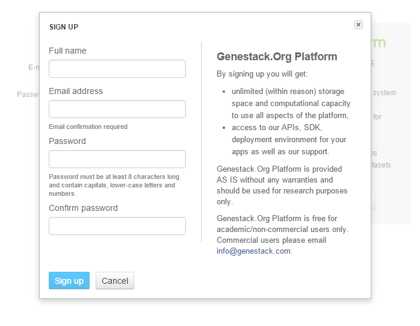
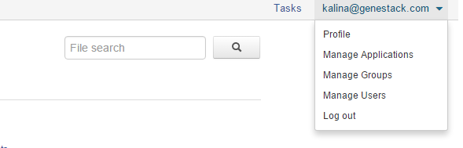
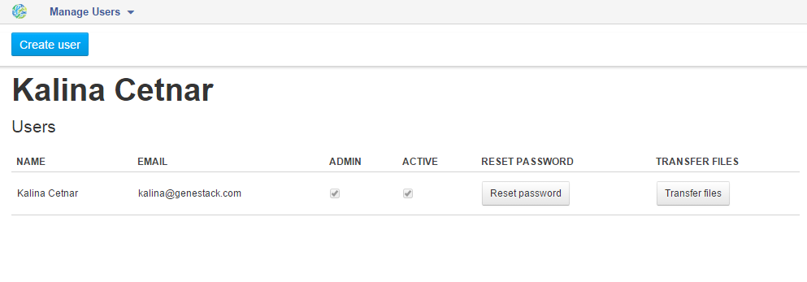
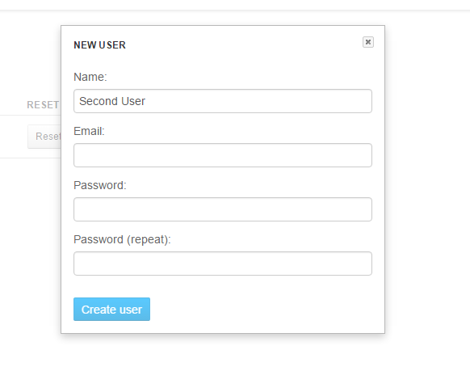

In this tutorial, we would like to introduce you to the core features of
Genestack Platform. You will learn how our system deals with files, how
it helps you organise and manage your data and how to share data with
your colleagues. You will see how easy it is to work on private and
public data simultaneously and seamlessly, and how to reproduce complex
analyses with data flows, a built-in mechanism for capturing and
replaying your research.

In this tutorial we will walk you through:

#. Creating an Account and Managing Users
#. Creating Users
#. Organising your research
#. Importing data into the Genestack Platform
#. Initializing files
#. Managing and Sharing Data
#. Reproducing the Analyses with Data Flows

Creating an account and managing users
**************************************

It is easy to register on Genestack_.  All you need to do is provide an email
and set up a password.

|sign up screen|

You will quickly receive a confirmation email with a link to click on and then
you will be able to log in. After you log in, the system will take you to the
`Welcome Page <wp-blog_>`_.

|genestack welcome page|

This is your main point of entry and the place
where you can manage and search data using the File Manager, view your
recent results and share the findings with your colleagues, set up and
launch analysis pipelines and visit the tutorials section. You can
always go back to the Welcome Page by clicking the **Genestack icon** in the
upper left corner.  You can always change the settings of your account
and instead of the Welcome Page choose the File Manager as the main
point of entry to the platform.

Creating users
**************

Now that you have set up your own account, let's talk about user
management. Try opening the menu in the top right hand corner of the
screen, where your email is displayed.

|user management|

If you click on  **Manage Users** you will go to the user management screen. Every
user in Genestack Platform belongs to an **organisation**. When you signed
up to use Genestack via the sign up dialog, we created a new
organisation for you, and you have automatically become its first user
and its administrator. As an organisation administrator you can create
as many  new users for your organisation as you want. For instance, you
can create accounts for your colleagues. Being in one organisation means
you can share data without any restrictions. The user management screen
allows you to get an overview of all users in your organisation. You can
change a user’s password, make any user an administrator or lock a user
out of the system.

|first user on the platform|

You can also create new
users.  Let’s create a Second User by clicking the  **Create user** button.

|second user creation|

You will need to set the user name,
email and password. Users added this way are immediately confirmed, and
can log in right away.

.. |genestack welcome page| image:: images/genestack-welcome-page.png

.. _Genestack: https://platform.genestack.org/endpoint/application/run/genestack/signin
.. _wp-blog: https://genestack.com/blog/2015/10/01/new-dashboard-style-start-screen-for-genestack/
