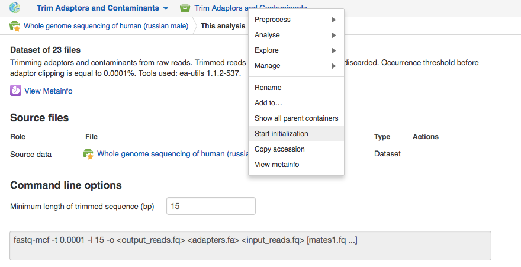
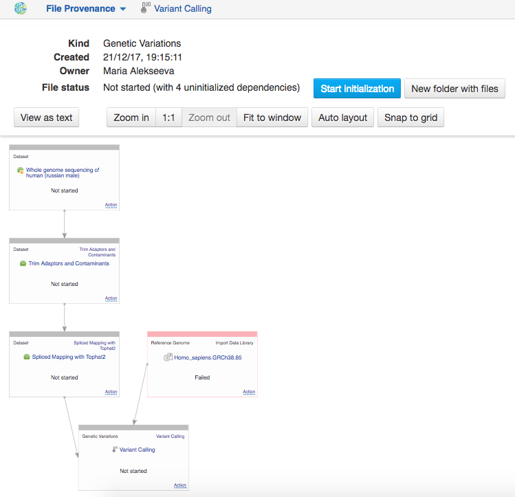

How to build and run a pipeline?
********************************

.. .. raw:: html
..
    <iframe width="640" height="360" src="https://www.youtube.com/embed/XLryiArc6Gc" frameborder="0" allowfullscreen="1">&nbsp;</iframe>

All files on Genestack are created by various applications. When an application creates a new file,
it specifies what should happen when it is initialised: a script, a
download, indexing, computation. In practice, it means that uninitialised
files are cheap and quick to create, can be configured, used as inputs
to applications to create other files, and then, later, computed all at
once. Let’s look at an example. Go to the public experiment library and
choose `"Whole genome sequencing of human (russian male)"`_ dataset.

Click **Analyse** button and, then, select **Trim Adaptors and Contaminants** in the list of the suggested applications.
If you want to analyse some of the files from a given dataset, you can select the files you
are interested in and **Make a subset** the entire dataset.

Regardless the input you would like to start with, at this step you do
not have to start initialisation right away. In fact, you can use the file created
by the app as an input to applications and continue building the pipeline.
Notice that you can **edit the parameters** of analysis on the app page.
You can change them because the file is not yet
initialised, i.e. the computation – in this case, trimming – has not yet
been started. After initialisation has completed, these parameters are
fixed. Thanks to these parameters are saved in the metainfo, they can be further
used to identically reproduce your work.

To start initialisation of a newly created file, click on the name of the file
and select **Start initialisation**.

To use this file as an input for a different application, for example to map the trimmed raw reads
to a reference genome, you should click on **Add step** and select the "Spliced Mapping with Tophat2"
application.

As a result, another dataset called
"Spliced Mapping with Tophat2 " is created and is waiting to be initialised.
On the application page you can check if the system suggested a correct
reference genome and if not, select the correct one.

This dataset, in turn, can be used as an input for a different application.
As the last step of the analysis you could, for example, identify genetic variants by adding
the "Variant Calling" app. In order to see the entire data flow
we have just created, click on the name of the last created file, go to
“Manage” and **File Provenance**.

It will show you processes that have been completed, and ones that need to be
initialised. To initialise only one of the steps, click on a given cell,
then on **Actions** and later select **Start initialization**. To initialise
all of the uninitialised dependencies, simply press **Start initialisation** at the top.

You can track the progress of your computations using **Task Manager** that can be
found at the top of the page.

.. One additional
.. thing we should mention is that if you want to analyse more than one
.. file using the same app, it is very easy: just tick all the files you
.. want to analyse, right click on them and select the app you wish to use.

.. .. image:: images/running-an-app-on-multiple-files.png

.. In this example
.. we have created 100 files that we have to initialize to start the tasks.

.. .. image:: images/app-page-100-files.png

.. All the files created in the above example are located in the `tutorial folder`_.

.. Now let's talk a bit about different types of files
.. that can be found on the platform. As we demonstrated, all our files
.. have a built-in system type. Some of these file types are particularly
.. useful when it comes to organising your research and now we will discuss
.. them in more detail.

.. Files
.. -----

.. There are many different file types in Genestack Platform. Every file is
.. created by an application and there is a lot of metadata associated with
.. each file. For example, every file has one or more unique accessions, a
.. name and a description. Applications use file type and metadata to make
.. suggestions about what kinds of analyses a given file can be used in.
.. Almost anywhere you see file names and accessions, e.g., File Manager or
.. in other applications, you can click on them and a file context menu
.. will show up. For example, clicking on a file containing raw sequenced
.. reads displays a menu:

.. .. image:: images/dropdown-menu.png

.. You can view and edit file metadata via the  **Edit Metainfo**, which appears
.. under the **Manage** submenu.

.. .. image:: images/edit-metainfo2.png

.. You can open the
.. metainfo viewer on any file in the system by clicking on the eye icon.
.. Here it is on a sequencing assay:

.. .. image:: images/edit-metainfo.png

.. Folders
.. -------

.. Folders in Genestack behave the same as folders in other systems. You
.. can put files in folders, and you can remove files from folders. There is
.. one very useful difference, however, from most systems. Each file can be
.. added (or, as we sometimes say, “linked”) to multiple folders. No data
.. gets copied, of course, the file simply appears in multiple locations.
.. This is very handy for organising your work. For example, you can
.. collect into one folder files from multiple experiments and work on them
.. as if they were all part of one experiment.

.. Datasets and raw reads
.. ----------------------

.. A **dataset** is a very special kind of folder. It contains only
.. raw reads or microarray data. One can think of datasets as packages for
.. experimentally collected data. They are a handy container for data. 
.. **Raw reads** are a general category of file types, which store raw sequencing data.

.. _"Whole genome sequencing of human (russian male)": https://platform.genestack.org/endpoint/application/run/genestack/metainfo-editor-app?a=GSF916135&action=viewFile
.. .. _the entire data flow:
.. _tutorial folder: https://platform.genestack.org/endpoint/application/run/genestack/filebrowser?a=GSF1016175&action=viewFile&page=1
