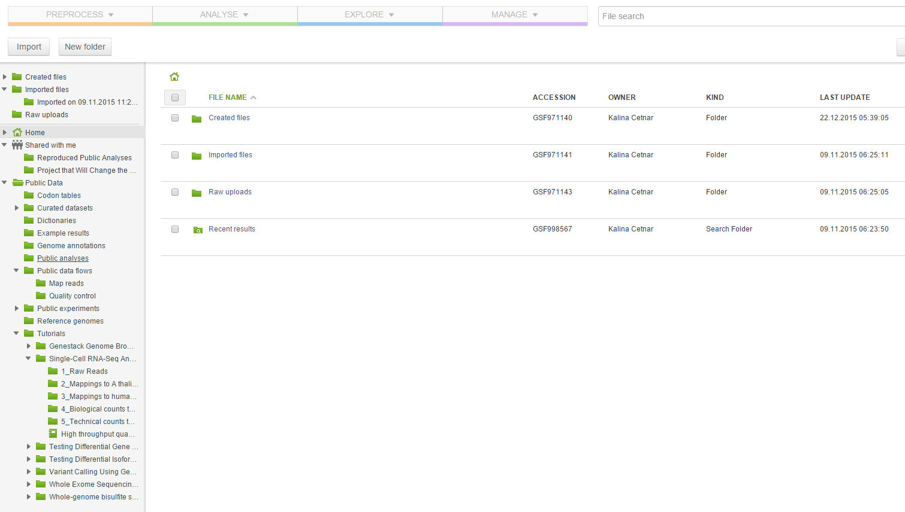
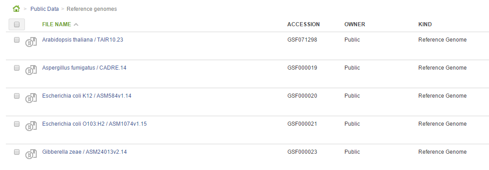
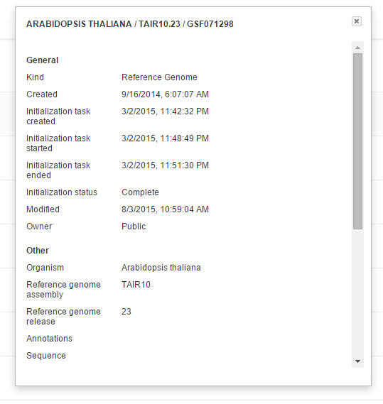

Organising your research
************************

So you have created a Genestack Platform account, logged on, and created
a bunch of users. Let’s now talk about data organisation on Genestack
platform. From the Welcome Page go to the File Manager and explore it a
little bit. Right now you do not have any private files, but you have
access to all `public data`_ available on the platform.

|file manager|

We have preloaded the platform with hunders of thousands of `publicly available experiments`_,
`curated datasets`_ and `reference genomes`_. In the public data folder you will also find
`Public Data Flows`_ that you can use in the future.

Format-Free Files
~~~~~~~~~~~~~~~~~

While you browse around all the folders, we’d like to point out a
key feature of Genestack Platform:  ***all files are format-free
objects***. Each Genestack file can be considered a container, packing
several physical files or even a database, with complex and rich
metadata. Let us take a look at an example. In the  `Reference
genomes folder`_ you will see several pre-loaded genomes:

|reference genomes|

Take a look at the  KIND column. These files are of the  *Reference Genome* type.
There is no single, standard, commonly accepted file
format for storing and exchanging genomic sequence and features:
sequence can be stored in FASTA, EMBL or GenBank formats. Genomic
features (introns, exons, etc.) can for example be represented via GFF
or GTF files. Each of these formats themselves have flavours, versions,
occasionally suffering from incompatibilities and conflicts. In
Genestack you no longer have to worry or know about file formats
(“low-level implementation details” as programmers call them).
A Reference Genome file contains packed sequence and genomic features.
When data, such as reference genomes, is imported onto Genestack (and
several different formats can be imported) it is  “packed” into a
Genestack file, meaning all reference genomes will behave identically,
regardless of any differences in the physical formats underneath. You
can browse reference genomes with our  `Genome
Browser`_
you can use them to map raw sequence reads, to analyse variations, to
add and manage rich annotations such as Gene Ontology and you never have
to think about formats again. Of course, not only reference genomes are
format-free. All files in Genestack Platform are format-free: raw reads,
mapped sequence, statistics, genome annotations, genomic data, codon
tables, and so forth.

|metainfo reference genome|

 We can take a look at
any file’s metadata by clicking the “eye” icon in the File Manager. All
files have rich metadata, different for each file type. Some metadata
fields are filled in by our curators, some are available for you to edit
via different applications in Genestack Platform, and some are computed
when files are initialised.

.. _public data: https://platform.genestack.org/endpoint/application/run/genestack/filebrowser?a=public&action=viewFile&page=1
.. _publicly available experiments: https://platform.genestack.org/endpoint/application/run/genestack/filebrowser?a=GSF070886&action=viewFile&page=1
.. _curated datasets: https://platform.genestack.org/endpoint/application/run/genestack/filebrowser?a=GSF000017&action=viewFile&page=1
.. _reference genomes: https://platform.genestack.org/endpoint/application/run/genestack/filebrowser?a=GSF000018&action=viewFile&page=1
.. _Public Data Flows: https://platform.genestack.org/endpoint/application/run/genestack/filebrowser?a=GSF966912&action=viewFile&page=1
.. _Reference genomes folder: https://platform.genestack.org/endpoint/application/run/genestack/filebrowser?a=GSF000018&action=viewFile
.. _Genome Browser: https://genestack.com/blog/2015/05/28/navigation-in-genestack-genome-browser/
