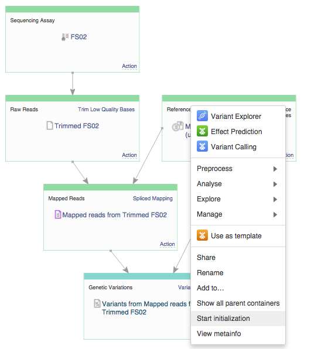

Reproducing your work with data flows
-------------------------------------

So, you learned how to work with files and folders, you even created a
simple analytical data flow to go from raw sequence to a list of
variants. Now, let’s talk about reproducibility. We will now show you
how to take any data file in Genestack Platform, and repeat the analysis
steps that led up to it on different data. Let’s go back to the genetic
variations file you created called “Variants from Mapped reads from
Trimmed FS01″. You might use the Welcome Page to find it in Resent
Results or go to the "Created files" folder in the File Manager. You can
also find it in the tutorial folder. Rather than viewing its provenance
like we did before, let’s see if we can reuse the provenance. To do
this, select the file, go to "Manage" and "Create new Data Flow".
|create new data flow| In the next screen you will see the data flow we
have previously created. |run data flow| The data flow editor has one
core goal: to help you create more files using this diagram. To do this
you will need to make some decisions for boxes in the diagram via
the Action menu. If you want to select different files, go to "Choose
another file". If you want to leave the original file simply don't
change anything. |choose another file| In this example, we will use this
data flow to produce variant calls for another raw sequence data file,
FS02 reproducing the entire workflow including trimming low quality
bases, spliced mapping and variant calling. All you need to do is choose
another input file and click on "Run dataflow" button at the top of the
page. You will be given a choice: you can initialize the entire data
flow now or delay initialization. |delay initialization until later| If
you decide to delay the initialization till later, you will be brought
back to the Data Flow Runner page where you can initialize individual
files by clicking on the file name and later selecting "Start
initialization". |Zrzut ekranu 2015-11-03 o 13.16.22| This is the end of
this tutorial. We hope you found it useful and that you are now ready to
make the most out of our platform. If you have any questions you can
post them on our `forum <http://forum.genestack.org/>`__ and we will
answer them as soon as we can. Alternatively, you can `e-mail
us <mailto:info@genestack.com>`__. Genestack team  

.. |create new data flow| image:: images/create-new-data-flow1.png
.. |run data flow| image:: images/run-data-flow.png
.. |choose another file| image:: images/choose-another-file.png
.. |delay initialization until later| image:: images/delay-initialization-until-later1.png

