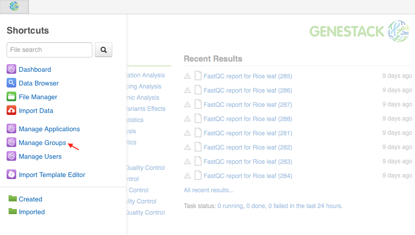
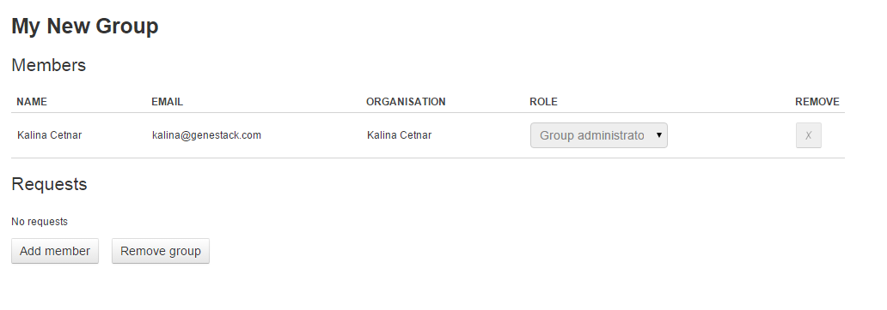
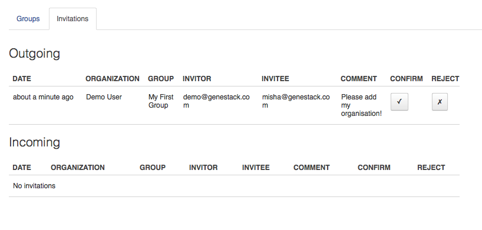
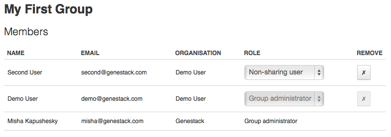

Managing and sharing data
*************************

.. raw:: html

    <iframe width="640" height="360" src="https://www.youtube.com/embed/ZtTTZyftZKM" frameborder="0" allowfullscreen="1">&nbsp;</iframe>

To share data we use **groups** – a shared project for two or more users.
To manage existing groups or create new one click on the Genestack logo in the upper
left corner and select **Manage groups** on the shortcuts menu.

On the nagae Groups page, if you have no groups click so far, click **Create group** button and create the first one.

.. image:: images/create-new-group.png
   :align: center

Right away we have a new group:

And we can **add a new member** to this newly created group:

.. image:: images/add-user-to-the-group1.png
   :align: center

Now your group looks like this:

No confirmation is needed – any user in your
organisation can create a group and add other users from your
organisation to it. You are the group administrator of any groups that
you create. As the group administrator, you can add or remove other users from
your group, or change their permissions, i.g. make them administrators, make them “sharing” or
“non-sharing” users. 

All groups appear as folders under "Shared with me"
in File Manager, and the moment you add a user to a group they will see
the group’s folder in their File Manager.

.. image:: images/shared-with-me.png
   :align: center

Group folders are the same as all other folders in the system: you can add and
remove files to group folders just like to any other regular folder.
There is an important point to note though: 
**adding a file to a group folder is not the same as sharing it with the group**.

To share one or more files with a group, you need to select them click **Share** using context menu.
Some applications (e.g. Data Browser, Metainfo Editor) have **Share** button as well. In the opening
window choose a group you want to share the selected files with.

.. image:: images/share.png
   :align: center

After that click **Share**, and specify whether you want to add the shared
data to the group folder or not with **Link** option.

.. image:: images/link-shared-files.png
   :align: center

If you choose to **link** the shared files, all group members will see the shared data
at the top level of the group folder. If you do not link the files, the files will be still
shared but members of the group will
not see them in the group folder, although they could access the data via search.
Moreover, you can always add shared files to group folders later.

Sharing with other organisations
--------------------------------

It is very easy to share data with users in the same organisation. You
simply create a group and share files; all group members see shared data
immediately.
What about sharing across organisations? Say, you work in a
hospital research group and have imported some valuable pathogenic
specimen sequence data into Genestack Platform and want to share it with
your colleagues in a pharma company who work on some novel drugs to kill
the pathogen. It is easy to set up a new cross-organisational group or
to turn an existing group into one. When you add new users, simply type
in the email address of the user from another organisation. Genestack
Platform will autocomplete only users in your organisation, not for
others. This is a security feature, which means that no one from any other
organisation can find out who is registered in Genestack Platform from
yours. After you enter the user’s email, you should create an invitation
and send it to another organisation:

.. image:: images/manage-groups-invite.png
   :align: center

Your organisation administrator will need to approve the invitation,
and then the other organisation’s administrator will have to
approve it, too. After confirmation of collaboration by organisation
administrators of both parties, the group becomes a cross-organisational
group and other users can be added easily. The inviting organisation’s
administrator will see on their group management screens the following:

Once they confirm the outgoing invitation, the
other organisation’s administrator will see the same in their **Incoming invitations**
section and will have to confirm it as well. After both
confirmations, the new group has members from both organisations:

Note that you can change the status of users from your
organisation, but not from other organisations. A cross-organisational
group can have multiple organisations participating in it. The addition
of each new participating organisation needs approvals of administrators
of all organisations in the group, as well as that of an administrator
from the organisation being invited. Once the approvals are in, sharing
is easy. So, you can easily collaborate across organisational
(enterprise) boundaries, and appropriate administrative controls are in
place.
