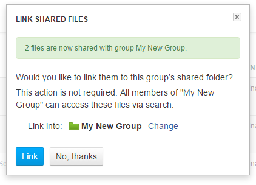

Managing and sharing data
*************************

.. raw:: html

    <iframe width="640" height="360" src="https://www.youtube.com/embed/ZtTTZyftZKM" frameborder="0" allowfullscreen="1">&nbsp;</iframe>

To share data, we use  **groups**. Managing groups is similar to
managing users. Click on your **e-mail address** in the upper right corner
and select "Manage groups" from the administration menu.

.. image:: images/manage-groups.png
   :align: center

Any user can create a group. You can think of a group as a shared
project for two or more users. Let’s share some data — the files we
created above. To do this, go to Manage Groups and create your first
group.

.. image:: images/create-new-group.png
   :align: center

Right away we have a new group:

.. image:: images/my-new-group-members.png
   :align: center

And we can add a new member to this newly created group:

.. image:: images/add-user-to-the-group1.png
   :align: center

Now your group looks like this:

.. image:: images/first_group.png
   :align: center

No confirmation is needed – any user in your
organisation can create a group and add other users from your
organisation to it. You are the group administrator of any groups that
you create. As group administrator, you can add/remove other users to
your group, make them administrators, or at least make them “sharing” or
“non-sharing” users. All groups appear as folders under "Shared with me"
in File Manager, and the moment you add a user to a group they will see
the group’s folder in their File Manager.

.. image:: images/shared-with-me.png
   :align: center

Group folders are the same as all other folders in the system: you can add and
remove files to group folders just like to any other regular folder.
There is an important point to note though: **adding a file to a group folder is not the same as sharing it with the group**. To share
one or more files with a group, you need to select them in File
Manager (sharing functionality is also available in other places in
Genestack Platform) and click **Share**. A window will open where you
will need to choose a group you want to share the selected
files with.

.. image:: images/share.png
   :align: center

After you select the group and click  **Share**,
you will need to confirm that you want to share these files by entering
your password (the system will remember this authorisation for the next
five minutes) and then you will have the option, which you do not have to
take, to also add them to the group folder:

If you choose to link the shared files, then all group members will see the
files you shared at the top level of the group folder. If you choose not
to link them into the group folder, do not worry – the files are still
shared. This means that users will see them in search results, they will
see them in file provenance data flows and will be able to open them in
applications. You can always add shared files to group folders later. If
you add a file to a group folder, e.g. by drag-and-dropping it in File
Manager, the platform will try to detect this and ask you if you want to
share it first.

Sharing with other organisations
--------------------------------

It is very easy to share data with users in the same organisation. You
simply create a group and share files; all group members see shared data
immediately.
What about sharing across organisations? Say, you work in a
hospital research group and have imported some valuable pathogenic
specimen sequence data into Genestack Platform and want to share it with
your colleagues in a pharma company who work on some novel drugs to kill
the pathogen. It is easy to set up a new cross-organisational group or
to turn an existing group into one. When you add new users, simply type
in the email address of the user from another organisation. Genestack
Platform will autocomplete only users in your organisation, not for
others. This is a security feature, it means that no one from any other
organisation can find out who is registered in Genestack Platform from
yours. After you enter the user’s email, you will see a new screen:

.. image:: images/manage-groups-invite.png
   :align: center

The new user is not added to your group right
away: you will now create an invitation and send it to another
organisation. Your organisation administrator will need to approve it
first, and then the other organisation’s administrator will have to
approve it, too. After confirmation of collaboration by organisation
administrators of both parties, the group becomes a cross-organisational
group and other users can be added easily. The inviting organisation’s
administrator will see on their group management screens the following:

.. image:: images/incoming-invitation.png
   :align: center

Once they confirm the outgoing invitation, the
other organisation’s administrator will see the same in their **Incoming invitations**
section and will have to confirm it as well. After both
confirmations, the new group has members from both organisations:

.. image:: images/cross-org-group.png
   :align: center

Note that you can change the status of users from your
organisation, but not from other organisations. A cross-organisational
group can have multiple organisations participating in it. The addition
of each new participating organisation needs approvals of administrators
of all organisations in the group, as well as that of an administrator
from the organisation being invited. Once the approvals are in, sharing
is easy. So, you can easily collaborate across organisational
(enterprise) boundaries, and appropriate administrative controls are in
place.
